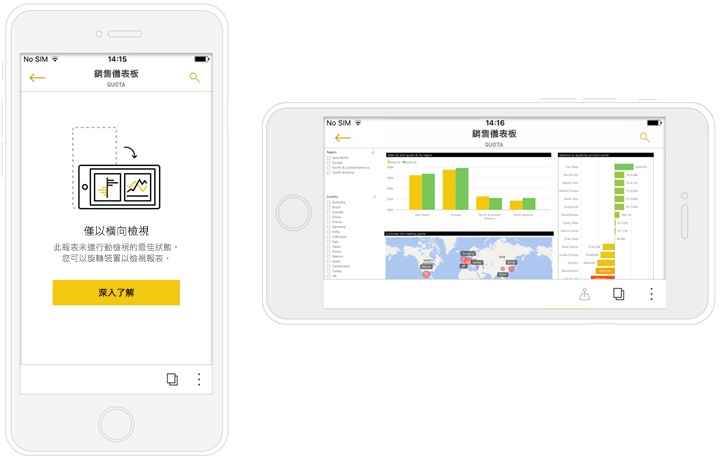
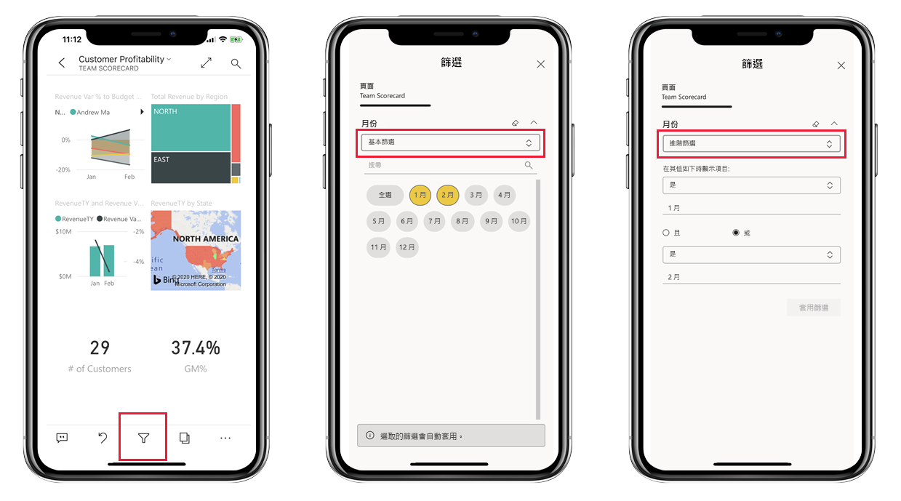
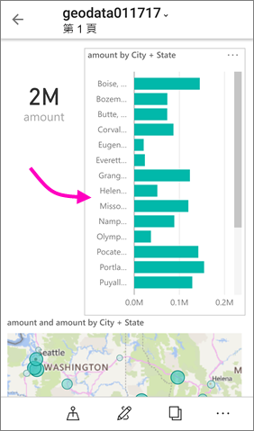
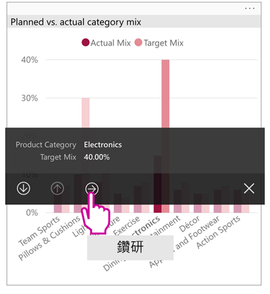
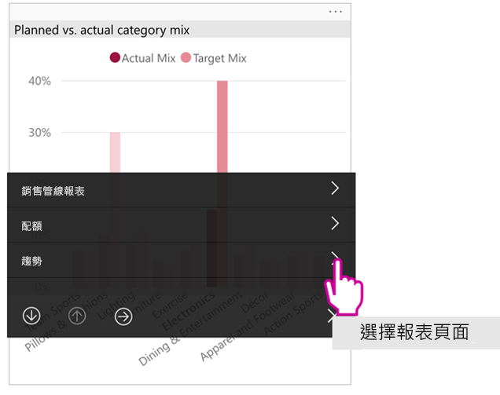

# 檢視為手機最佳化的 Power BI 報表

適用於︰

|  |  |
|:--- |:--- |
| iPhone |Android 手機 |

當您在手機上檢視 Power BI 報表時，Power BI 會檢查以查看報表是否已針對手機最佳化。 如果已最佳化，則 Power BI 會以直向檢視自動開啟最佳化的報表。

如果為手機最佳化的報表不存在，報表仍會開啟，但會使用非最佳化的橫向檢視。 即使在為手機最佳化的報表中，如果您將手機橫放，報表也會以非最佳化的檢視開啟，並顯示原始報表配置。 如果只有部分頁面經過最佳化，您會在直向檢視中看到訊息指出報表可以橫向呈現。

Power BI 報表的其他所有功能都仍可在為手機最佳化的報表中運作。 深入了解您可以在下列項目執行的作業︰

* [iPhone 上的報表](mobile-reports-in-the-mobile-apps.md)。 
* [Android 手機上的報表](mobile-reports-in-the-mobile-apps.md)。

## 在電話上篩選報表頁面
如果已為電話最佳化的報表定義篩選，則當您在電話上檢視報表時，就可以使用這些篩選。 在您手機上所開啟報表會篩選為網頁之報表中的已篩選值。 您會看到訊息指出頁面上有作用中的篩選器。 您可以在手機上變更篩選。

1. 點選篩選圖示  在頁面底部。

2. 使用基本或進階篩選，查看您感興趣的結果。
   
    

## 跨醒目提示視覺效果
在直向檢視中交叉醒目提示的視覺效果，其運作方式與 Power BI 服務中的視覺效果相同，且在手機的橫向檢視中也是如此：當您在一個視覺效果中選取資料時，它會反白顯示該頁面上其他視覺效果中的相關資料。

深入了解 [Power BI 中進行篩選和醒目提示](../../power-bi-reports-filters-and-highlighting.md)的相關事項。

## 選取視覺效果
在手機報表中，當您選取視覺效果時，手機報表會醒目提示該視覺效果並聚焦於其上，抵銷畫布筆勢。

選取視覺效果時，您便可執行在視覺效果中捲動等動作。 若要將視覺效果取消選取，只要觸碰視覺效果區域外的任何一處。

## 以焦點模式開啟視覺效果
手機報表也提供焦點模式：您可更深入了解單一視覺效果，且更輕鬆地進行探索。

* 在手機報表中，點選視覺效果右上角的省略符號 ( **...** ) > [展開為焦點模式]  。
  
    

您在焦點模式所執行的動作會沿用至報表畫布，反之亦然。 例如，如果您將視覺效果中的值醒目提示，然後返回整份報表，該報表就會篩選至您在視覺效果中醒目提示的值。

有鑑於螢幕大小限制，某些動作只有在焦點模式中才可進行︰

* **向下切入**視覺效果中顯示的資訊。 在下方深入了解如何在手機報表中[向下和向上切入](mobile-apps-view-phone-report.md#drill-down-in-a-visual)。
* **排序**視覺效果中的值。
* **還原**︰清除您已在視覺效果上執行的探索步驟，並還原至報表建立時設定的定義。
  
    若要清除視覺效果中的所有探索，請點選省略符號 ( **...** ) > [還原]  。
  
    
  
    報表層級可進行還原，進而清除所有視覺效果的探索；而視覺效果層級的還原，可清除選定視覺效果的探索。   

## 在視覺效果中向下切入
如果視覺效果中定義了階層層級，您就可以向下切入視覺效果中顯示的詳細資訊，然後返回。 您可以在 Power BI 服務或 Power BI Desktop 中[新增視覺效果的向下切入](../end-user-drill.md)。

有幾種類型的向下切入：

### 在值上向下切入
1. 長按 (點選並按住不放) 視覺效果中的資料點。
2. 系統會顯示工具提示，如果已定義階層，則工具提示頁尾會顯示切入的向下和向上箭號。
3. 點選向下箭號以向下切入

    
    
4. 點選向上箭號以向上切入。

### 切入至下一個層級
1. 在手機上報表中，點選右上角的省略符號 ( **...** ) > [展開為焦點模式]  。
   
    
   
    在本例中，橫條會顯示各州的值。
2. 點選左下角的  。
   
    
3. 點選 [顯示下一個層級]  或 [展開至下一個層級]  。
   
    
   
    現在，橫條會顯示城市的值。
   
    
4. 如果您點選左上角的箭號，會回到手機報表，但值仍是展開到較低層級的狀態。
   
    
5. 若要回到原本層級，請再次點選省略符號 ( **...** ) > [還原]  。
   
    

## 從值鑽研
鑽研會將某個報表頁面中的值與其他報表頁面連接。 當您從資料點鑽研至另一個報表頁面時，資料點值會用來篩選已鑽研的頁面，或者它會在所選取資料的內容中。
報表作者可以在建立報表時[定義鑽研](https://docs.microsoft.com/power-bi/desktop-drillthrough)。

1. 長按 (點選並按住不放) 視覺效果中的資料點。
2. 系統會顯示工具提示，如果已定義鑽研，則工具提示頁尾會顯示鑽研箭號。
3. 點選箭號以進行鑽研

    

4. 選擇要鑽研的報表頁面

    

5. 使用應用程式標頭的上一頁按鈕，返回您開始的頁面。

## 後續步驟
* [建立為 Power BI 手機應用程式最佳化的報表](../../desktop-create-phone-report.md)
* [在 Power BI 中建立儀表板的手機檢視](../../service-create-dashboard-mobile-phone-view.md)
* [建立適用於任何大小的回應式視覺效果](../../visuals/desktop-create-responsive-visuals.md)
* 有其他問題嗎？ [嘗試在 Power BI 社群提問](https://community.powerbi.com/)

