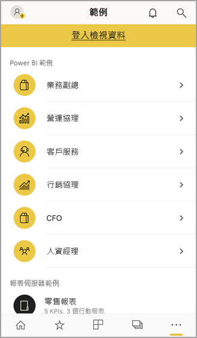

# 開始在 iOS 裝置上使用 Power BI 行動裝置應用程式
iPhone 和 iPad 的 iOS 版 Microsoft Power BI 應用程式會傳遞 Power BI、Power BI 報表伺服器和 Reporting Services 的行動 BI 體驗。 您可以利用即時的觸控式行動裝置存取功能，隨處檢視內部部署和雲端中的公司儀表板並與之互動。 探索儀表板中的資料，並使用電子郵件或文字訊息與同事共用。 透過 [Apple Watch](mobile-apple-watch.md)，隨時掌握最即時的資料。  

在 Power BI Desktop 中建立 Power BI 報表，並發行報表：

* [將它們發行至 Power BI 服務](../../service-get-started.md)，並建立儀表板。
* [將內部部署的報表發佈至 Power BI 報表伺服器](../../report-server/quickstart-create-powerbi-report.md)。

然後在 Power BI for iOS 行動裝置應用程式中，與您內部部署或雲端中的儀表板和報表互動。

了解 [Power BI 行動裝置應用程式的新功能](mobile-whats-new-in-the-mobile-apps.md)。

## 下載此應用程式
從 Apple App Store [下載 iOS 應用程式](https://go.microsoft.com/fwlink/?LinkId=522062 "下載 iOS 應用程式")至 iPhone 或 iPad。

您可以在任何執行 iOS 11 或更新版本的裝置上執行 Power BI for iOS 應用程式。 

## 註冊 Power BI 服務
如果您尚未註冊，請前往 [powerbi.com](https://powerbi.microsoft.com/get-started/)，然後在 [Power BI - 雲端共同作業與共用]  下選取 [免費試用]  。

## 開始使用 Power BI 應用程式
1. 在您的 iOS 裝置中，開啟 Power BI 應用程式。
2. 若要登入 Power BI，請點選 [Power BI]  索引標籤並填寫您的登入詳細資料。  
   若要登入 Reporting Services 行動報表和 KPI，請點選 [報表伺服器]  索引標籤並填寫您的登入詳細資料。
   
   
   
   當您在應用程式中時，只要點選畫面左上角的帳戶設定檔影像，即可在 Power BI 和報表伺服器之間切換。 

## 試用 Power BI 和 Reporting Services 範例
即使未註冊，您也可以檢視 Power BI 和 Reporting Services 範例並與其互動。

若要存取範例，請點選導覽列上的 [更多選項]  (...)，然後選擇 [範例]  。

幾個 Power BI 範例後面接著幾個報表伺服器範例。

   
   
   > [!NOTE]
   > 這些範例並未提供所有功能。 例如，您無法檢視構成儀表板的範例報表、您無法與他人共用範例，且您無法將這些範例設為我的最愛。 
   > 
   >

## 在 Power BI 行動裝置應用程式中尋找內容

請點選標頭中的放大鏡，開始搜尋您的 Power BI 內容。

## 檢視您最愛的儀表板和報表
點選導覽列上的 [我的最愛]  ()，檢視 [我的最愛] 頁面。 

閱讀更多以了解 [Power BI 行動裝置應用程式中的我的最愛](mobile-apps-favorites.md)。

## Power BI 行動裝置應用程式的企業支援
組織可以使用 Microsoft Intune 管理裝置和應用程式，包括 Power BI for Android 和 iOS 行動裝置應用程式。

Microsoft Intune 讓組織可以控制像是要求存取 PIN、控制應用程式處理資料的方式，甚至是加密待用應用程式的資料等項目。

> [!NOTE]
> 如果您在 iOS 裝置上使用 Power BI 行動裝置應用程式，而且您的組織已設定 Microsoft Intune MAM，則會關閉背景資料重新整理。 下次進入應用程式時，Power BI 會從網路上的 Power BI 服務重新整理資料。
> 

深入了解[使用 Microsoft Intune 設定 Power BI 行動裝置應用程式](../../service-admin-mobile-intune.md)。 

## 後續步驟

* [Power BI 是什麼？](../../fundamentals/power-bi-overview.md)
* 有問題嗎？ [嘗試在 Power BI 社群提問](https://community.powerbi.com/)

