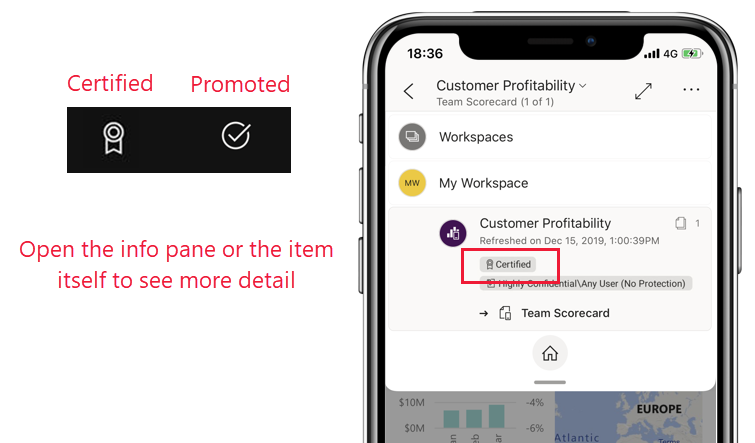
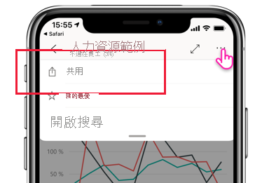
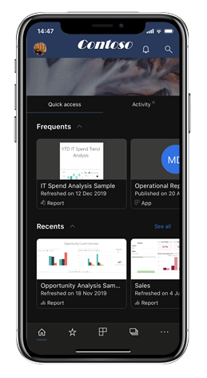
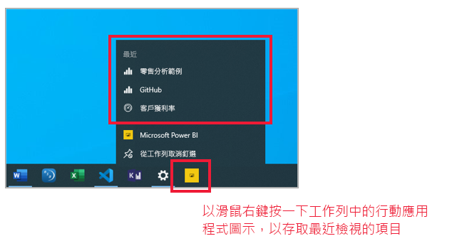
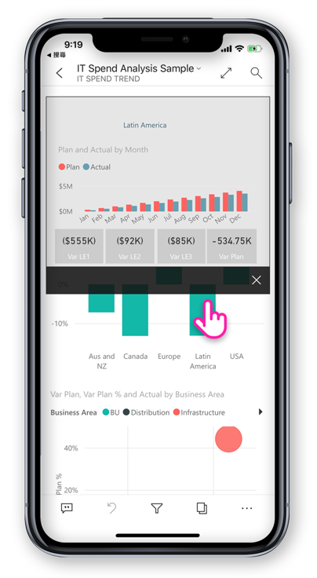
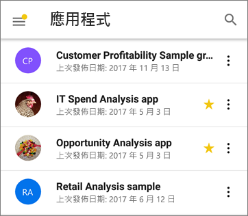
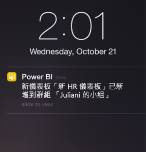

# Power BI 行動裝置應用程式的新功能
如需相關的「新功能」資訊，請參閱︰

* [行動裝置應用程式的 Power BI 小組部落格](https://powerbi.microsoft.com/blog/tag/mobile/)
* [Power BI Desktop 的新功能](../../fundamentals/desktop-latest-update.md)  
* [Power BI 服務的新功能](../../fundamentals/service-whats-new.md)

>[!NOTE]
>**使用 Windows 10 行動裝置版的手機** 的 Power BI 行動裝置應用程式支援，將於 2021 年 3 月 16 日終止。 [深入了解](/legal/powerbi/powerbi-mobile/power-bi-mobile-app-end-of-support-for-windows-phones)

## 2020 年 12 月
### 我們已在行動裝置應用程式中新增異常偵測
如果報表建立者已針對報表視覺效果設定異常偵測，您就能查看資料極端值 (也就是異常) 是否導致了資料中發生非預期的高峰或低谷。 [深入了解！](mobile-reports-in-the-mobile-apps.md#investigate-anomalies-in-time-series-data)

### 輕鬆尋找貴組織已背書的內容
Power BI 服務中[已升級或認證](../../collaborate-share/service-endorsement-overview.md)的內容，現在會在應用程式中以徽章標記。 報表建立者會將其內容升級以顯示其已準備好供您使用 (已升級)，或認證其內容以顯示貴組織已加以核准 (已認證)。

### Power BI 行動版新增了深色模式 (Android)
在適用於 Android 裝置的 Power BI 行動應用程式中試用新的深色模式。 在深色模式中，您將在深色背景中看到淺色文字，降低螢幕亮度，讓您能夠更輕鬆地查看內容。 您可以在應用程式外觀設定中切換主題。 [深入了解](mobile-apps-dark-mode.md)

### 使用全螢幕模式將檢視放至最大 (iPad)
我們已將新的按鈕新增至適用於 iPad 的行動應用程式，以便您移除應用程式的頁首與頁尾，讓您有最大的空間可用來檢視內容。 只需點選畫面右上角的全螢幕切換按鈕  便能在模式之間切換。

## 2020 年 11 月
### 使用全螢幕模式最大化檢視 (Android 平板電腦)
我們已將新的按鈕新增至 Android 平板電腦的行動裝置應用程式，以便您移除應用程式的頁首及頁尾，讓您有最大的空間用來檢視內容。 只需點選畫面右上角的全螢幕切換按鈕  便能在模式之間切換。

## 2020 年 10 月
### 現在已支援自動頁面重新整理 (Windows)

現在，已設定[自動頁面重新整理](../../create-reports/desktop-automatic-page-refresh.md)的報表頁面也會在適用於 Windows 裝置的 Power BI 應用程式中自動重新整理。 這並不表示只在一般的報表檢視中。 使用自動頁面重新整理時，您的[簡報與投影片](mobile-windows-10-app-presentation-mode.md#slideshows)也會即時更新，以確保您一律顯示最新的商務資料與見解。

### 支援凹口螢幕 (iOS)
我們新增了 iPhone 與 iPad 上凹口螢幕的支援，為您的報表與儀表板提供更多螢幕空間。 

## 2020 年 9 月
### 適用於 HoloLens 2 的 Power BI 應用程式 (預覽) 已在商店中推出！

適用於 HoloLens 2 的 Power BI 應用程式可為您提供完全的沉浸式體驗。 使用 HoloLens 2 的手勢系統，您可以從工具帶中取得最愛的報表與儀表板、調整大小，並將其放在您需要的空間中，甚至是瀏覽報表的頁面。 當您使用應用程式時，報表與儀表板會更新，因此，如果資料變更，您就會立即看到那些變更。 若要深入了解，請參閱我們的[文件](mobile-hololens2-app.md)與[部落格](https://powerbi.microsoft.com/blog/power-bi-app-for-mixed-reality-now-available-for-hololens-2/)！

## 2020 年 8 月
### 已改進瀏覽至內容的方式 (iOS 與 Android)
現在您可以使用 **新的導覽樹狀目錄** (可從報表、儀表板與應用程式標題的下拉式清單取得)，快速且輕鬆地瀏覽內容。 您一眼就可以看到內容的位置階層，而且可以輕鬆瀏覽內容階層、移至同層級內容，甚至快速地回到首頁。 若您要檢視的項目是應用程式的一部分，則樹狀結構會顯示應用程式的完整內容--區段、連結，以及所有報表與儀表板。 若您要檢視的項目是報表，您也會找到所有可見報表頁面的清單。 從一個頁面到另一個頁面從沒如此容易！ 趕緊去瞧一瞧！ 

### 使用您慣用的應用程式從 Power BI 共用 (iOS 與 Android)
現在您可以與連絡人共用 Power BI 內容的連結。 使用您在裝置上擁有的任何共同作業應用程式，例如 Microsoft Teams、郵件應用程式等等，利用標頭中的新增共用動作來傳送連結。此連結會擷取目前的檢視，所以您甚至可以共用已篩選的報表檢視。

### 在手機與平板電腦上，現在所有報表檢視都有捏合與縮放功能可供使用 (iOS 與 Android)   
我們已在所有報表檢視中啟用捏合與縮放，讓您無論在手機或平板電腦上，都能更輕鬆地放大及縮小報表內容。

### 在啟動時自動播放投影片 (Windows)
當 Power BI Windows 應用程式啟動時，您可以選擇要以投影片方式自動播放的報表。 這有助於建立類似 kiosk 的體驗，無須任何手動操作，即可在公用顯示中執行報表。 [深入了解！](mobile-windows-10-app-presentation-mode.md#auto-play-a-slideshow-on-startup)

## 2020 年 7 月
### 適用於 Windows 的 Power BI 行動裝置應用程式現在支援組織商標
現在，系統管理員為符合組織的商標主題，而對 Power BI 外觀與風格進行的任何變更，也會出現在 Power BI 行動應用程式中。 這類變更可能包括頂端導覽列的新色彩配置、組織的標誌與橫幅影像。  

### 透過遠端設定 (iOS 與 Android) 以停用單一登入
IT 系統管理員現在可從遠端停用 Power BI 行動應用程式的單一登入，增強多使用者裝置上的安全性與權限合規性。 [深入了解！](mobile-app-configuration.md#disable-single-sign-on-ios-and-android)

## 2020 年 6 月
### 在投影片中顯示您的書籤 (Windows)
現在，您可以在投影片中加入報表與個人書籤，其會自動成為簡報的一部分，以在資料中醒目提示特定見解。
[立即了解！](mobile-windows-10-app-presentation-mode.md#use-presentation-mode)

## 2020 年 5 月
### Power BI 行動版新增了深色模式 (iOS)
在適用於 iOS13 的 Power BI 行動應用程式中試用新的深色模式。 在深色模式中，您將在深色背景中看到淺色文字，降低螢幕亮度，讓您能夠更輕鬆地查看內容。 您可以在應用程式外觀設定中切換主題。 [深入了解](mobile-apps-dark-mode.md)

### 在簡報模式中套用書籤 (Windows)
現在，您可以在使用簡報模式展示報表時，將個人及報表書籤套用至報表頁面，以顯示資料的內容。 [立即了解！](mobile-windows-10-app-presentation-mode.md#use-presentation-mode)

## 2020 年 4 月

### 現已推出從工作區共用
我們新增了從工作區共用報表和儀表板的功能。 現在只要工作區擁有者允許，您就可以如同在 Power BI 服務中一樣，從 [我的工作區] 及其他工作區共用內容。 

### 儀表板現已支援全螢幕模式 (iOS 和 Android)
您現在可使用全螢幕模式來檢視儀表板，其提供用以檢視儀表板內容的更大空間。 

## 2020 年 3 月

### 使用捷徑與 Google 搜尋來啟動內容 (Android)
我們已將捷徑和 Google 搜尋與 Power BI 應用程式整合，以供可更輕鬆地尋找及啟動資料。 建立捷徑以便直接從裝置主畫面輕鬆存取最常用的報表和儀表板。 並使用 Google 搜尋來快速搜尋並開啟 Power BI 內容。 深入了解 [Android 應用程式捷徑](mobile-app-quick-access-shortcuts.md)和 [Google 搜尋](mobile-app-find-access-google-search.md)！

### 使用裝置保護以增強安全性 (預覽) (Android)
使用裝置內建保護功能來保護 Power BI 應用程式，並獲得所需的隱私權。 要求生物特徵辨識驗證 (指紋識別碼) 才能存取 Power BI 應用程式，可確保將資料保持隱私，只能由您自己看到。 [了解原生安全存取](mobile-native-secure-access.md)

### 現在可用 iPad 掃描
現在可直接從 iPad 掃描條碼來篩選報表，並使用 QR 代碼快速開啟報表。  

### 已更新篩選體驗
Power BI 應用程式中的篩選有新功能和新設計。 這項更新包含改善影響報表視覺效果的套用篩選可見度，以及鎖定 (甚至隱藏) 篩選的功能。 這些變更也提供與 Power BI 服務中篩選的較佳相容性。

## 2020 年 2 月

### 多重選取模式 (Android 與 iOS)

我們已新增在報表頁面上選取多個資料點的功能。 當多重選取開啟時，您點選的每個資料點都會加入至其他選取的資料點，並在頁面上的所有視覺效果中自動反白顯示合併的結果。 若要開啟多重選取模式，請移至[行動應用程式設定](./mobile-app-interaction-settings.md)頁面。

>[!NOTE]
>在下一個報表伺服器版本中，將於 Power BI 報表伺服器上支援多重選取模式。

### 現在，報表頁尾可在 iPhone 的行動應用程式中一律顯示

在您的 iPhone 上，就像在您的 Android 上一樣，現在您可以決定是否要讓報表頁尾固定在報表頁面底部，以便一律顯示並可供使用，不論您在頁面上執行的動作為何。 這可讓您輕鬆地使用報表頁尾提供的所有選項。 若要固定頁尾，請切換[行動應用程式設定](./mobile-app-interaction-settings.md)頁面上的 [固定的報表頁尾] 切換開關。

### 支援 PBIRS 報表 (預覽) (Windows)

您現在可以在 Power BI 應用程式中開啟 Power BI 報表伺服器 (PBIRS) 報表。

### 快速存取最近使用的項目 (Windows)

在 Windows 工作列中的 Power BI 應用程式圖示上按一下滑鼠右鍵，以取得所有最近檢視的項目清單。 按一下清單上的任何項目，即可快速再次檢視。

## 2020 年 1 月

### 共用在簡報模式中建立的註釋 (Windows)

您在簡報期間所建立註釋會成為簡報不可或缺的部分，以及討論的關鍵要素。 現在，當您在簡報模式中標註報表時，可以與同事共用報表頁面的快照。 [深入了解](./mobile-windows-10-app-presentation-mode.md#use-presentation-mode)

## 2019 年 12 月

### 停駐報表頁尾和重新整理按鈕 - 與報表互動的新體驗 (Android)

我們曾聽過 Android 使用者表示使用報表的體驗並不理想，因為很難使用報表頁尾，且某些裝置上的拖動以重新整理太過敏感。 因此，在此版本中，我們已變更這些行為：
* **停駐報表頁尾** - 現在，當您在手機上開啟報表時，您會發現報表頁尾停駐在報表頁面的底部，不論您在頁面上執行的動作為何，其一律會顯示且可供使用。 這可讓您輕鬆地使用報表頁尾提供的所有選項。
* **報表標頭上的重新整理按鈕** - 您也會在報表標頭中找到重新整理按鈕，讓您能夠在想要的時候輕鬆地重新整理報表。

偏好先前行為的使用者，可以使用行動裝置應用程式新擴充的[互動設定](./mobile-app-interaction-settings.md)來還原這些行為。

此外，IT 系統管理員可以使用其選擇的 MDM 工具搭配應用程式設定檔，代表其使用者[遠端覆寫新的預設設定](./mobile-app-configuration.md#interaction-settings-ios-and-android)。 如此一來，組織中的所有使用者都可以為應用程式設定相同為。

> [!NOTE]
> 重新整理按鈕和停駐報表頁尾的互動設定，目前不會影響報表伺服器報表。 這會在 1 月的報表伺服器版本中變更！

### 從行動裝置應用程式設定預設書籤
現在，您可以直接從 Power BI 行動裝置應用程式設定報表的預設書籤。 然後，在每次開啟報表時，就會自動套用其預設書籤。 [深入了解！](./mobile-reports-in-the-mobile-apps.md#bookmarks)

### 在 Android 平板電腦上依位置篩選
地區篩選可讓您根據目前的位置來篩選報表。 適用於 Android 平板電腦的 Power BI 應用程式現在也提供這項功能。 [深入了解！](./mobile-apps-geographic-filtering.md)

## 2019 年 11 月

### 根據預設，現在會開啟 Power BI 應用程式的新外觀
 
現在當您開啟應用程式時，新的外觀和導覽列會自動開啟以簡化您尋找和開啟內容的方式。 使用應用程式的[首頁](mobile-apps-home-page.md)作為起點，即可快速存取最重要的內容，以及讓您隨時掌握最新警示、通知及其他資訊的[活動摘要](mobile-apps-home-page.md#activity-feed)。

### 查看所有最新的 Power BI 活動
 
活動摘要可協助您追蹤 Power BI 內容的即時狀況。 只要移至應用程式的 [首頁] 並開啟 [活動] 索引標籤，即可檢視所有最新的通知、警示、註解、@mentions等等。 [深入了解](mobile-apps-home-page.md#activity-feed)。

### 在您的報表中使用書籤

Power BI 行動裝置應用程式現支援在 Power BI 中建立的書籤。 當開啟應用程式時，您可以利用報表作者建立的書籤，以及您自己建立的任何個人書籤。 [深入了解](mobile-reports-in-the-mobile-apps.md#bookmarks)。

## 2019 年 10 月

### 從遠端設定報表伺服器存取設定的 Android 支援

我們新增了 Android 支援，讓您可以從遠端設定 Power BI 行動應用程式的報表伺服器存取設定。 IT 系統管理員現在可以使用其組織的 MDM 工具，從遠端為 iOS 與 Android 裝置進行這些設定。 如需詳細資料，請參閱[從遠端設定 Power BI 行動裝置應用程式對報表伺服器的存取](../../report-server/configure-powerbi-mobile-apps-remote.md) (英文)。

### 跨報表鑽研

我們在這個月新增了對跨報表鑽研的支援。 您現在可以點選某個資料點，進行鑽研以存取其他報表和報表頁面。 當您鑽研至某個目標頁面時，該頁面中的內容即會根據鑽研設定篩選。

> [!NOTE]
> 只有在報表建立期間啟用跨報表鑽研時，該功能才可供使用。 [深入了解跨報表鑽研](../../create-reports/desktop-cross-report-drill-through.md)。

### 資料敏感度標籤

您現在可以看到內容擁有者對報表、儀表板、資料集和資料流程所設定，用來以分類其資料敏感度的敏感度標籤。 敏感度標籤會決定內容如何與其他使用者共用。 [深入了解 Power BI 中的資料敏感度標籤](../../admin/service-security-data-protection-overview.md)。

### 自訂應用程式導覽的支援 (Windows)

除了 iOS 和 Android 以外，現在已針對 Windows 裝置新增自訂應用程式導覽的支援 (請參閱 [9 月的「新增功能」項目](#september-2019))。

## 2019 年 9 月

### 支援自訂應用程式瀏覽 (iOS 及 Android)

我們增加了自訂應用程式瀏覽的支援。 現在，當您在 Power BI 行動版中開啟應用程式時，就能使用應用程式建立者所建置的自訂瀏覽體驗。 應用程式瀏覽可以依內容排列，也可以包含像是連結與可摺疊的區段等新項目。
請參閱更多[自訂瀏覽](https://powerbi.microsoft.com/blog/designing-custom-navigation-for-power-bi-apps-is-now-available/)的文章。

## 2019 年 8 月

### Power BI 行動版新外觀 (預覽) 的簡介 (iOS 和 Android)

我們已重新整理應用程式並引進新的體驗、新增可快速存取常用內容的首頁，以及讓您輕鬆瀏覽應用程式的新導覽窗格。 使用全新且重新整理的體驗，您現在可以更快速且更輕鬆地找到所需的內容。
由於新外觀處於預覽狀態，因此您必須開啟它才能使用。
閱讀更多 [Power BI 行動版新外觀](https://powerbi.microsoft.com/blog/introducing-power-bi-mobile-apps-new-look-preview/) \(英文\) 的內容。

### 保護 Azure Active Directory (AD) 應用程式 Proxy 的存取安全 (iOS 和 Android)

我們與 Azure Active Directory 團隊合作，將 Power BI 行動裝置應用程式與 Azure Active Directory (AAD) 應用程式 Proxy 整合在一起。 使用此設定，您就能從 Power BI 行動裝置應用程式，連線到企業範圍內部裝載的報表伺服器，省去設定複雜內部部署麻煩。 請參閱 [Power BI mobile and Azure AD Application Proxy integration](https://powerbi.microsoft.com/blog/access-on-prem-report-server-from-your-power-bi-mobile-app-with-azure-active-directory-application-proxy/) (Power BI 行動應用程式與 Azure AD 應用程式 Proxy 整合) 中的詳細資訊。 了解[如何設定 Azure AD 應用程式 Proxy 與 Power BI](/azure/active-directory/manage-apps/application-proxy-integrate-with-power-bi)。

## 2019 年 7 月

### 報表頁面工具提示

現在，在您的行動裝置應用程式中檢視報表時，支援報表頁面工具提示。 只要長按視覺效果，就會顯示與其相關聯的報表工具提示。  

 
> [!NOTE]
> 大於 640 像素和 320 檢視區的裝置支援報表工具提示。 較小型的裝置會使用預設工具提示。

## 2019 年 6 月

### Android 現可掃描條碼
現在您可以使用 Android (手機和平板電腦) 的 Power BI 應用程式掃描門市產品或貨架上的印出條碼，顯示按掃描值篩選的相關 Power BI 報表。 深入了解[使用條碼篩選資料](mobile-apps-scan-barcode-iphone.md)。

### 支援透過 ADFS 設定裝載在 PBI-RS 的 PBIX 報表 (iOS、 Android)

透過 ADFS 設定裝載在 PBI-RS 中的 Power BI 報表 (PBIX)，現在也可以從 Power BI 行動裝置應用程式存取。

## 2019 年 5 月

### Siri 快速鍵支援 (iOS)
使用者可以建立指向 Power BI 報表和儀表板的 Siri 快速鍵，並直接從 Siri 語音介面開啟它們。 [了解如何在 Power BI iOS 應用程式中使用 Siri 快速鍵](https://powerbi.microsoft.com/blog/introducing-siri-integration-with-power-bi-mobile-ios-app-preview/)。

### 裝置搜尋 (iOS)
將 Power BI 與 iOS 裝置搜尋整合 (Spotlight)。 在 iPhone 或 iPad 上搜尋內容現在也會包含 Power BI 項目。 當使用者使用裝置原生搜尋時，Power BI 報表、儀表板、應用程式、工作區和符合搜尋準則的人員，也都會在結果中列出。 [前往部落格文章以深入了解](https://powerbi.microsoft.com/blog/introducing-siri-integration-with-power-bi-mobile-ios-app-preview/)。

### 單一點選報表整合 - GA

單一點選現在已進入 GA 狀態，並將會成為新使用者的預設觸控互動。 使用者仍然可以在應用程式設定中關閉它及使用點兩下的功能。

### 增強式條件式存取保護 (iOS、Android)

我們已與 Azure AD [新的應用程式防護型條件式存取功能](/azure/active-directory/conditional-access/app-protection-based-conditional-access)相整合，透過在套用應用程式原則前限制對 Power BI 的存取，來增加安全性。

### 裝置保護 (iOS)

使用者可以使用裝置內建的保護功能，透過在存取 Power BI 時要求 Face ID、Touch ID 或密碼來保護 Power BI 的安全。 這項功能可由使用者透過應用程式設定控制，但也可以由系統管理員透過 Intune 和任何其他的 MDM 工具進行。 [深入了解](./mobile-native-secure-access.md)。

### 單一頁面報表投影片 (Windows)

針對投影片中單一頁面報表同時支援自動重新整理。 因此，若報表的基礎資料來源更新，我們會擷取內容並更新頁面中的資料。

## 2019 年 4 月

### 關鍵影響因素視覺效果 

您現在可以在行動裝置應用程式上使用關鍵影響因素視覺效果。 此視覺效果讓您只需要點幾下，便能針對資料執行關鍵驅動因素的分析。

### 將註解新增到報表內容 (Android 與 iOS)

現在您可以使用註解來進行共同作業，並在報表頁面和視覺效果上共用您的意見反應。 在[這個部落格](https://powerbi.microsoft.com/blog/announcing-report-commenting-for-power-bi-service-and-mobile/)中深入了解 Power BI 服務和行動版中的報表註解。 

### 使用全螢幕模式最大化檢視 (Android 和 iOS)

我們已新增新的按鈕，讓您可以透過移除報表首和報表尾，在您檢視報表時提供最大的空間，來決定何時要聚焦在您的資料上。

## 2019 年 3 月

### 支援 Power BI 應用程式 (iOS、Android) 中的外部來賓使用者

您可以直接從應用程式存取其他組織與您共用的 Power BI 內容 (也就是 B2B)。 在[這裡](https://powerbi.microsoft.com/blog/power-bi-mobile-apps-now-support-azure-ad-b2b-guest-users/)閱讀 Power BI 行動應用程式 B2B 的詳細資訊。

### 使用投影片增強 Windows 簡報模式 (Windows)

利用[投影片](https://powerbi.microsoft.com/blog/enhancing-presentation-mode-with-slideshow-in-windows-power-bi-app/)可讓您使用辦公室中的公用顯示器以全螢幕模式執行 Power BI 報表，在報表頁面間自動輪換。  

### 支援透過 ADFS 和 WAP 設定的 PBI-RS 報表 (僅限 iOS)

透過 ADFS 設定託管在 PBI-RS 中的 Power BI 報表 (PBIX) 現在可以從 Power BI iOS 應用程式進行存取。

### 啟用與報表視覺效果的單一點選互動

我們變更了報表的互動，讓您只需要在視覺效果、按鈕或交叉分析篩選器上點一下，便能直接和其資料互動。 使用者不再需要在視覺效果上點一下來選取它，然後再點一下才能與其互動。只需要點一下便可以同時執行這兩個動作。

> [!NOTE]
> 現有使用者需要在應用程式設定中開啟此行為。 如需詳細資訊，請參閱[如何設定單一點選報表互動](./mobile-app-interaction-settings.md)一文。

## 2019 年一月 - 二月
 
### Visio 視覺效果

在 Visio 視覺效果中啟用單一登入 (SSO)，以便當在應用程式中檢視具有 Visual 視覺效果的報告時不需要執行額外的登入步驟。 

### 即將在 Power BI 行動版 Windows 應用程式中新增儀表板註解

您可以將註解直接新增到儀表板和特定磚來討論您的資料，且所有檢視儀表板的人都可以看見您的註解。 

## 2018 年 12 月

### 橫向報表現在可使用篩選 

橫向報表 (除了手機報表以外) 現在可使用報表篩選窗格。

## 2018 年 11 月

### 新式視覺效果標題 

使用新「新式視覺效果標題」的報表不會再配置空間給標題，所以空白空間會變少，而您視覺效果能使用的空間會變多。

### 加強簡報模式 (Windows)

適用於 Surface Hub 與 Windows 10 裝置的加強簡報模式。  透過改良的簡報與共同作業工具，以及無邊框的大螢幕最佳化檢視來享受加強的 Surface Hub 會議室體驗，讓您可以專注在您的資料上。 簡報模式也提供一些工具 (例如筆跡工具)，來協助您有效地簡報並共同討論您的資料。 您可以在[這裡](https://powerbi.microsoft.com/blog/presentation-mode-in-power-bi-windows-app/)深入了解簡報模式。

### 平板電腦中的直向報表版面配置 (iOS 與 Android)

我們現在會使用手機報表配置 (若其存在) 在您的平板電腦上以直向模式方向顯示報表。 深入了解[如何在 Power BI Service 或 Desktop 中建立手機版面配置](/power-bi/desktop-create-phone-report/)。

### 支援報表查詢字串 

開啟包括查詢字串的報表連結現在將會在行動裝置應用程式中開啟，且會根據查詢字串中定義的條件預先填入。 深入了角[如何使用查詢字串建立報表 URL](/power-bi/service-url-filters/)。  

### 共用認證 (現在位於 Android 中)

從您的行動裝置應用程式登入 Power BI，從未如此簡單。 使用共用認證，我們透過使用裝置上的其他 Microsoft 365 應用程式認證，在 Power BI 服務中對您進行驗證以簡化登入流程。

### 應用程式內 URL (現在位於 Android 中) 

指向其他 Power BI 成品之報表中的連結，現在會直接在應用程式內部開啟。 這可讓您建置自訂瀏覽流程，例如，從報表連結至儀表板。

### 顯示資料並複製值

報表視覺效果動作功能表 (...) 現在提供選項以表格格式顯示底層資料。 在此表格中，您可以長按以從該表格選取並複製值 (假設沒有任何 Intune 原則限制複製)。

## 2018 年 10 月

### 編頁報表預覽 (所有裝置)

編頁報表目前可在 Power BI 服務上使用。 有權存取 Power BI 服務中編頁報表的使用者，也可以從其行動裝置應用程式存取這些報表。 

請參閱[有關在行動裝置中使用編頁報表的 Power BI 部落格文章](https://powerbi.microsoft.com/blog/power-bi-paginated-reports-also-available-in-power-bi-mobile-apps-preview/) \(英文\)。

### 共用認證 (iOS)

從您的行動裝置應用程式登入 Power BI，從未如此簡單。 使用共用認證，我們透過使用裝置上的其他 Microsoft 365 應用程式認證，在 Power BI 服務中對您進行驗證以簡化登入流程。

### 應用程式內的 URL (iOS) 

指向其他 Power BI 成品之報表中的連結，現在會直接在應用程式內部開啟。 這可讓您建置自訂瀏覽流程，例如，從報表連結至儀表板。

### 支援 iOS12 和 watchOS 5 

我們已更新適用於 iOS 的 Power BI 應用程式，可搭配行動裝置上的新 OS 順暢地運作並進行監看。

## 2018 年 9 月

### 瀏覽器中的手機報表編輯功能 (所有裝置)

現在您可以為已經在 Power BI 服務中發佈的報表建立手機報表配置，而非僅限 Power BI Desktop。 您可以在瀏覽器中於編輯模式下建立它。

### 儀表板註解 (iOS 和 Android) 

您可以將註解直接新增到儀表板和特定磚來討論您的資料，且所有檢視儀表板的人都可以看見您的註解。 您也可以透過 @mentioning 他們，將您組織中的其他人員拉進交談。 那些您 @mentioned 的人員會在其手機上收到附帶您訊息的推播通知。

目前可在 iOS 和 Android 裝置上使用。 Windows 支援即將推出。

請閱讀[關於儀表板註解的 Power BI 部落格文章](https://powerbi.microsoft.com/blog/announcing-dashboard-comments-in-power-bi/)。

### 單一登入 (Windows)

單一登入 (SSO) 是適用於 Windows 的 Power BI 行動版最迫切要求功能之一。 現在您不僅可以使用主要組織帳戶登入已加入網域的 Windows 行動裝置版裝置，還可以順暢地登入 Power BI 服務。 深入了解 [SSO 和 Windows 行動裝置應用程式](mobile-windows-10-app-single-sign-on-sso.md)。

## 前幾個月

### 2018 年 7 月

#### 僅限 iOS 與 Android

**共用篩選**

您現在可以接收具有共用篩選和交叉分析篩選器的報表。

**背景影像支援**

當您在行動裝置上以橫向模式檢視報表時，可以看見與 Power BI 在 Web 上看見的相同背景影像。

### 2018 年 6 月

#### 完整畫布報表

頂端和底部動作列現在會在載入您的報表不久後消失，讓您看到更多報表內容。

#### 增加的手機報表畫布大小

我們已增加手機報表畫布大小，以提供空間來放入比以前更多的視覺效果。

### 2018 年 5 月

#### 行動鑽研：所有行動裝置應用程式

您可以從選取的資料點鑽研至行動裝置應用程式中的其他報表頁面，前提是報表作者必須已定義該動作。 

#### 返回按鈕：所有行動裝置應用程式

現在，當您透過撥動來瀏覽報表、在動作列上選擇報表頁面，或是使用鑽研時，返回按鈕可以讓您回到先前所檢視的頁面。 

#### 儀表板佈景主題：所有行動裝置應用程式

當報表作者在 Power BI 服務中自訂儀表板佈景主題時，行動裝置應用程式中的儀表板外觀與風格也會隨之改變。 不過，您將不會看到背景影像。

#### iOS：從遠端設定 Power BI iOS 行動裝置應用程式對報表伺服器的存取

您的 IT 系統管理員現在可以使用 MDM 工具來設定 Power BI iOS 行動裝置應用程式對報表伺服器的存取權。 如需詳細資料，請參閱[從遠端設定 Power BI iOS 行動裝置應用程式對報表伺服器的存取權](../../report-server/configure-powerbi-mobile-apps-remote.md)。

#### Power BI for Mixed Reality 應用程式 (預覽)

Power BI for Mixed Reality 應用程式已經在 Microsoft 網上商店中推出。 您可以在沉浸於虛擬世界的同時，檢視您的儀表板和報表，或將這些項目放在您環境內容中的特定位置以進行檢視。 請觀看新的 [Power BI 應用於 HoloLens 的簡介](https://www.youtube.com/watch?v=J_X_nOFUBss) \(英文\) 影片以了解相關背景，或是閱讀有關新 [Power BI for Mixed Reality 應用程式](mobile-mixed-reality-app.md)的文章。

### 2018 年 4 月

#### 行動向下切入與向上切入

您現在可以向下切入和向上切入行動裝置上的報表視覺效果。 若要存取這項新功能，請點選並按住以在報表視覺效果中開啟 [工具提示] 功能表，然後點選 [切入] 按鈕深入探索您的資料。 深入了解 [drilling up and down in the mobile apps](https://powerbi.microsoft.com/blog/drill-down-up-in-power-bi-mobile-apps/) (向上和向下切入 Mobile Apps)。

#### 常設篩選

我們最近已更新報表篩選和交叉分析篩選器，因此它們會從網路上的 Power BI 自動儲存到 Power BI 行動應用程式。 現在，篩選條件和您在行動裝置應用程式中設定的交叉分析篩選器會自動儲存至網路上的 Power BI 中。

### 2018 年 3 月

#### Power BI for Mixed Reality 應用程式 (預覽)

在最近一次匯入資料到所在位置的行動中，我們建立了 Power BI for Mixed Reality 應用程式。 您可以在沉浸於虛擬世界的同時，檢視您的儀表板和報表，或將這些項目放在您環境內容中的特定位置以進行檢視。 深入了解新的 [Power BI for Mixed Reality 應用程式](mobile-mixed-reality-app.md)。

#### 與外部共用報表及儀表板

直接從應用程式與組織外的使用者共用儀表板及報表。 組織和社交帳戶都必須已啟用外部共用。 

#### 永續性篩選

當您在網頁上的 Power BI 中設定篩選器和交叉分析篩選器時，您的篩選選項也會儲存到行動裝置應用程式中，以便您從先前離開的地方繼續。

#### 在 iPad 上重新整理報表

Power BI 報表現在在 iPad 應用程式上有重新整理按鈕。

### 2018 年 2 月

#### 共用報表

現在您可以直接從行動裝置應用程式共用報表。 深入了解[從行動裝置應用程式共用儀表板和報表](mobile-share-dashboard-from-the-mobile-apps.md)

#### 改善的工具提示

當您點選並按住報表視覺效果以存取工具提示時，您現在可以拖曳手指橫過視覺效果，一路探索每個資料點的相關詳細資料。

### 2018 年 1 月

#### 我的最愛報表

將報表標記為我的最愛，即可讓它們顯示在 [我的最愛] 頁面上。 閱讀更多以了解 [Power BI 行動裝置應用程式中的我的最愛](mobile-apps-favorites.md)。

#### 檢視共用報表

現在當有人與您共用報表時，它會與儀表板一起在 [與我共用] 頁面上列出。

#### 改善的超連結支援

您現在可以點選 Power BI 視覺效果中的連結，以在行動裝置瀏覽器中開啟這些連結。

#### Intune 整合 (Android)

支援使用 Intune 行動裝置管理的條件式存取。

### 2017 年 12 月

#### 改進的安全性管理 

我們在 Android 裝置上新增了條件式存取 (CA) 與 Microsoft Intune 行動裝置管理 (MDM) 的支援，以加強保護您組織中的資料。 iOS 上已可使用。

#### 改善的權限管理

我們做了一些變更，讓您在管理資料集、儀表板與報表的使用者權限時能夠更加精確。

#### 自動安裝的應用程式

您完全不需要在 Power BI 中安裝某些應用程式。 在您組織中的 Power BI 應用程式建立者可以建立包含儀表板和報表集合的「應用程式」。 然後他們可以發行應用程式，並將它設定為自動安裝在 Power BI 服務和 Power BI 行動應用程式中。 當應用程式設定好為您安裝時，它會自動出現在您的 [應用程式] 功能表：

### 2017 年 11 月
#### iPhone X 最佳化

我們已最佳化 iPhone X 的應用程式版面配置，因此您可以在每部裝置上時髦地瀏覽資料。

### 2017年 10 月
#### Android 中手機報表的篩選

如果您在 Power BI Desktop 中建立了專為手機調整頁面的報表，而且該報表有篩選，您現在就可以在 Android 上手機報表中套用這些篩選。 閱讀更多 Android 上的 Power BI 報表篩選相關資訊。

#### 在報表中顯示資料

您現在可以在報表中將視覺效果切換成資料表檢視，以查看資料背後的數字。 若要存取這項功能，請從報表上的視覺效果的 ... 功能表點選 [顯示資料]，或展開之視覺效果的 [動作] 功能表上的新增圖示。

### 2017 年 9 月
#### iPhone 中手機報表的篩選
如果您在 Power BI Desktop 中建立了專為手機調整頁面的報表，而且該報表有篩選，您現在就可以在 iPhone 上手機報表中套用這些篩選。 閱讀更多[iPhone 上的 Power BI 報表篩選](https://powerbi.microsoft.com/blog/filters-coming-for-phone-reports-on-ios/)相關資訊。

### 2017 年 8 月
#### iOS Proxy 設定支援
您現在可以在 Power BI iOS 行動裝置應用程式中進行 Proxy 設定。 這表示 Power BI 現在能夠使用您行動裝置上的 VPN 連線，讓更多使用者和組織能隨時隨地安全地運用 Power BI 功能。

### 2017 年 7 月
閱讀 [2017 年 7 月的行動裝置應用程式功能摘要](https://powerbi.microsoft.com/blog/power-bi-service-and-mobile-july-feature-summary/#ios-preview)

#### iOS 裝置
**新的 iOS 問與答體驗 (預覽)** ：您現在除了能取得問題的解答之外，還能使用自然語言來取得相關深入解析。 即使您不太確定要尋找的項目，問與答也會主動顯示與您資料相關的見解。 新的行動裝置問與答體驗是與 Microsoft Research 小組共同作業研發而成，展現了我們產品的強大技術。 試用此教學課程，[詢問 iOS 行動裝置應用程式資料的相關問題](mobile-apps-ios-qna.md)。

### 回應式視覺效果
適用於手機報表與儀表板的 **回應式視覺效果**：您可以將儀表版或報表中的視覺效果設定為「回應式」，不管是什麼樣的螢幕大小，都能以動態方式變更，顯示最多的資料與深入解析。 閱讀[關於回應式視覺效果的部落格文章](https://powerbi.microsoft.com/blog/power-bi-desktop-july-feature-summary-2/#responsiveVisuals)。

### 2017 年 6 月
#### 所有裝置
**將應用程式設為我的最愛**：您原本已可將儀表板設為我的最愛。 最近，[Power BI 新增了應用程式](../../collaborate-share/service-create-distribute-apps.md)，而您現在也能將這些應用程式設為我的最愛。 

### 2017 年 5 月
#### 所有裝置
**新功能表：與我共用** - 移至行動裝置應用程式功能表的 [與我共用]，查看所有與您共用的內容。

**新功能表：應用程式** - 應用程式是您組織建置的儀表板和報表集合，可提供關鍵計量，以進行更快速且更輕鬆的資料驅動決策。

深入了解 [Power BI 內容的組織方式](mobile-apps-quickstart-view-dashboard-report.md)。

#### iOS 及 Android 裝置
**Power BI 報表伺服器預覽**：建立並發行內部部署 Power BI 報表。 然後[在您的 iOS 或 Android 行動裝置上檢視這些報表並與其互動](mobile-app-ssrs-kpis-mobile-on-premises-reports.md)。 

### 2017 年 4 月
請閱讀 [2017 年 4 月的行動裝置應用程式功能摘要](https://powerbi.microsoft.com/blog/power-bi-mobile-apps-feature-summary-march-april-2017/)

#### 所有裝置
**手機報表的背景色彩** - 當您在 Power BI Desktop 中定義報表的背景色彩時，手機報表會有相同的背景色彩。 進一步了解[最佳化手機報表頁面](../../create-reports/desktop-create-phone-report.md)。

**開發適合行動裝置的 Power BI 視覺效果** - 如需在行動裝置上建立好看又好用 Power BI 視覺效果的提示，請參閱此 [開發人員指南](https://github.com/PowerBi-Projects/PowerBI-visuals/blob/master/Tutorial/MobileGuideline.md) (英文)。

#### iOS 裝置
**與資料對話︰語音發問** - 現在您可以用說的而非鍵入來 [透過問與答詢問資料的相關問題](mobile-apps-ios-qna.md)。 

### 2017 年 3 月
請閱讀 [2017 年 3 月的行動裝置應用程式功能摘要](https://powerbi.microsoft.com/blog/power-bi-mobile-apps-feature-summary-march-2017/)。

#### 所有裝置
**交叉分析篩選器的互動**

我們改進了時間交叉分析篩選器的觸控互動。

#### iOS 裝置
**透過問與答詢問資料的相關問題，並提供意見反應**：請嘗試透過問與答詢問資料的相關問題，然後給我們笑臉或苦臉，讓我們知道表現如何。

**使用 3D 觸控執行常用動作** - 在 iPhone 6s 或更新版本的主畫面上按壓 Power BI 應用程式圖示，可存取通知、搜尋及最近使用的儀表板。

**支援由右至左的橫書語言** - Power BI 行動裝置應用程式現在支援由右至左的語言。 本文中所述的「由右至左的語言」是指希伯來文和阿拉伯文書寫系統，其書寫形式為從右到左，並且需要內容成形。 請參閱 [Power BI 行動裝置應用程式中支援的語言](mobile-apps-supported-languages.md)清單。

#### Android 裝置
**連線到多部 SSRS 伺服器** 

現在您最多可以同時有五部 SQL Server Reporting Services (SSRS) 伺服器的連線。

**要求存取儀表板** 

如果您掃描無權存取之儀表板的 QR 代碼，現在可以從行動裝置應用程式提交存取要求。

### 2017 年 2 月
#### 所有裝置
**捲動變得更容易** 

您現在不必觸控側邊的捲軸，只要觸控圖表本身，即可在報表的橫條圖和直條圖中捲動。

#### iOS 裝置
**透過問與答預覽詢問有關資料的問題** 

透過問與答，您可以用自己的用語詢問資料相關問題，而 Power BI 會提供答案。 問與答已在 Power BI 服務中，位於 [http://powerbi.com](https://powerbi.com ) 。 現在也[在 iPhone 或 iPad 上的行動裝置應用程式中提供](mobile-apps-ios-qna.md)。

**連線到多部 SSRS 伺服器** 

現在您最多可以同時有五部 SQL Server Reporting Services (SSRS) 伺服器的連線。

#### Android 平板電腦
**Power BI for Android 平板電腦行動裝置應用程式** 現已正式運作。 [開始在 Android 平板上使用 Power BI](mobile-android-app-get-started.md)。

#### iOS 及 Android 裝置
**儀表板磚的新功能表**：瀏覽到基礎報表、展開磚或管理警示，全都能直接在儀表板磚上的功能表執行。 

這個功能表對 iOS、橫向模式的 Android 手機及 Android 平板電腦而言是新的。 在 Windows 及縱向模式的 Android 手機則已經存在。

### 2017 年 1 月
閱讀 [January 2017 mobile apps blog feature summary](https://powerbi.microsoft.com/blog/power-bi-mobile-apps-feature-summary-january-2017) (2017 年 1 月 mobile apps 部落格功能摘要)。

#### 所有裝置
**在資料表和矩陣中載入超過 100 個資料列**：現在，如果您在儀表板或報表上有大型資料表或矩陣，我們會在磚內盡可能地顯示資料。 然後在焦點模式中，您可以向下捲動以載入其他資料列。

**手機報表 - 正式運作**：Power BI 手機報表目前已正式運作。 在 Power BI Desktop 中，您可以為行動裝置檢視器調整現有報表的縱向檢視。 深入了解[撰寫 Power BI Desktop 中的手機報表](../../create-reports/desktop-create-phone-report.md)和[手機上的報表體驗](mobile-apps-view-phone-report.md)。

#### iOS
**使用 Active Directory Federation Services (ADFS) Preview 的 SSRS 驗證**：您現在可以在行動裝置上使用組織帳戶，登入內部部署 SQL Server Reporting Services 伺服器。 深入了解[使用 OAuth 連線至 SSRS 伺服器](mobile-oauth-ssrs.md)。

#### Android
**使用 Active Directory Federation Services (ADFS) Preview 的 SSRS 驗證**：您現在可以在行動裝置上使用組織帳戶，登入內部部署 SQL Server Reporting Services 伺服器。 深入了解[使用 OAuth 連線至 SSRS 伺服器](mobile-oauth-ssrs.md)。

**全新和改善項目：加上註解並快速地共用見解**：共用和註解現在可以在 Android 裝置上正常地運作。 改善的功能表可讓您更輕鬆且更快速地加上註釋及分享深入資訊，而且您也可以共用加上註解的報表或直接從 Power BI 應用程式。

### 2016 年 12 月
閱讀 [December 2016 mobile apps blog feature summary](https://powerbi.microsoft.com/blog/power-bi-mobile-apps-feature-summary-december-2016) (2016 年 12 月行動裝置應用程式部落格功能摘要)。

#### 所有裝置
**離線背景重新整理**

為了確定您可以在離線時存取最新的資料，我們會在應用程式背景執行重新整理，讓您的商務資訊為最新版本，即使您有一段時間沒有加以存取也一樣。 若要確保某些儀表板一律為最新狀態，只要將它們標示為 [我的最愛]。 深入了解 [Power BI 行動裝置應用程式中的離線功能](mobile-apps-offline-data.md)。

#### iOS 裝置
**標註並共用**

現在您可以從 Power BI for iOS 行動裝置應用程式標註並共用磚、報表或視覺效果。 

* [在 iPhone 上](mobile-annotate-and-share-a-tile-from-the-mobile-apps.md)
* [在 iPad 上](mobile-annotate-and-share-a-tile-from-the-mobile-apps.md)

**要求存取儀表板**

如果您掃描無權存取之儀表板的 QR 代碼，現在可以從行動裝置應用程式提交存取要求。

**影像磚上的自訂 URL**

如果影像磚有儀表板擁有者所定義的自訂 URL，則當您點選磚時，會直接移至該 URL 而不需要在焦點模式下開啟磚。 

#### iPhone
**Apple Watch 改進**

您現在可以直接從 Watch 應用程式重新整理 Apple Watch 資料。 按壓 Apple Watch 儀表板索引頁面以重新整理資料。 (Power BI 行動裝置應用程式必須在 iPhone 上背景執行，才能成功)。

#### Android
**影像磚上的自訂 URL**

如果影像磚有儀表板擁有者所定義的自訂 URL，則當您點選磚時，會直接移至該 URL 而不需要在焦點模式下開啟磚。 此外，包含預先定義之自訂 URL 的儀表板磚，現在可以在應用程式內將讀者重新導向到報表。

### 2016 年 11 月
閱讀 [November 2016 Power BI mobile apps feature summary](https://powerbi.microsoft.com/blog/power-bi-mobile-apps-feature-summary-november-2016/) (2016 年 11 月的 Power BI 行動裝置應用程式功能摘要)。

#### Android 平板電腦
**適用於 Android 平板電腦的 Power BI 行動裝置應用程式** - 是的，這裡有預覽。

* [在您的 Android 平板電腦上體驗 Power BI](mobile-android-app-get-started.md)
* [在 Android 平板電腦上探索 Reporting Services 行動報表和 KPI](mobile-app-ssrs-kpis-mobile-on-premises-reports.md)

#### Android 裝置
**預覽：Intune 行動應用程式管理** - 對於 Microsoft Intune 行動應用程式管理員 (MAM) 的 Power BI 支援，現在針對 Android 裝置上的 Power BI Pro 使用者處於預覽狀態。 

**我的最愛**：在 Android 裝置上標記您最愛的儀表板，並在一個便利的位置集中查看您的所有 [最愛的 Power BI 儀表板和 Reporting Services 行動報表和 KPI](mobile-android-app-get-started.md#view-your-favorite-dashboards-and-reports)。 

#### iOS 裝置
**連結**：磚和視覺效果中的 URL 現在都可以點選，並在瀏覽器中開啟。

#### Windows 裝置
**地圖置中**：聚焦於您位置附近的資料

### 2016 年 9/10 月
閱讀 [October 2016 Power BI mobile apps feature summary](https://powerbi.microsoft.com/blog/power-bi-mobile-apps-feature-summary-october-2016/) (2016 年 10 月的 Power BI 行動裝置應用程式功能摘要)。

#### 所有裝置
**將登陸頁面設為我的最愛**：如果您已將任何儀表板標示為 [我的最愛]，則登陸頁面將會是您的 [我的最愛] 項目。 

**改進導覽**：主要導覽有了全新的面貌，而且群組導覽已移至群組目錄。 

**改進報表與儀表板效能**：改進在 Power BI 行動裝置應用程式中載入報表與儀表板的體驗

**改進警示通知**：因資料變化而產生之警示的通知，現已包含觸發該警示及觸發原因的詳細資訊。

#### iPhone 上的 iOS
**改進 Apple Watch 重新整理**：Apple Watch 行動裝置應用程式已針對 Watch OS3 多所改進

#### Android 手機
**已新增手動更新磚**：您現在可以手動重新整理儀表板磚。 DirectQuery 的磚會從資料集擷取最新的資料。

#### Windows 10 手機
**地理篩選**：您現在可以在 Windows 10 手機上，根據您目前的位置來篩選您的報表，只顯示所需要的資料。

**SandDance 視覺化**：現在已在 Surface Hub 上提供這個自訂視覺效果

### 2016 年 8 月
#### 所有手機
**我的最愛**：從所有 Power BI 行動裝置應用程式檢視您的最愛儀表板，以及從 iOS 與 Windows 10 裝置的 Power BI 行動裝置應用程式管理我的最愛清單。 閱讀更多以了解 [Power BI 行動裝置應用程式中的我的最愛](mobile-apps-favorites.md)。

**儀表板資料分類**：查看儀表板擁有者指派給儀表板的資料分類。 閱讀更多以了解如何[將儀表板分類](../../create-reports/service-data-classification.md)。

**資料驅動的警示**：在您的資料依照 KPI、量測計和卡片磚的預設方式變更時，收到警示通知。 深入了解：

* [Power BI for Android 手機應用程式上的警示](mobile-set-data-alerts-in-the-mobile-apps.md)。 
* [Power BI for iOS 手機應用程式上的警示](mobile-set-data-alerts-in-the-mobile-apps.md)。 
* [Power BI for Windows 10 裝置應用程式上的警示](mobile-set-data-alerts-in-the-mobile-apps.md)。

#### iPhone 和 iPad 上的 iOS
**iPad 上焦點模式中全螢幕的磚**：當您點選 iPad 上的磚時，磚現在會利用整個 iPad 螢幕大小，在焦點模式中以全螢幕開啟。

**手動重新整理磚**：在 iOS 的 Power BI 行動裝置應用程式中開啟儀表板，然後從螢幕頂端下拉，以手動重新整理磚。 

**Intune MAM 的支援**：新增 Microsoft Intune 行動應用程式管理 (MAM) 功能的支援。

深入了解 [Power BI 行動裝置應用程式上的 Microsoft Intune](../../admin/service-admin-mobile-intune.md)。

#### Windows 10 裝置
**全螢幕與簡報模式**：您可以在 Surface Hub 上以簡報模式顯示報表，以及在 Windows 10 裝置上以全螢幕模式顯示儀表板、報表和磚。

### 2016 年 7 月
#### 所有手機
在 Power BI 服務中，您可以直向模式[建立手機專用的儀表板檢視](../../create-reports/service-create-dashboard-mobile-phone-view.md)。 

#### Android 手機
**[我的最愛] 索引標籤**：從單一位置即可存取您所有的最愛儀表板。

**改進安全性管理**：為特定儀表板中顯示的商務資料選取風險分類。

**改進警告與橫幅**：我們改進了行動應用程式的警告與橫幅。

**報表頁面的 QR 代碼**：服務中產生的 QR 代碼將會連結至特定頁面，而不是整份報表。

**改進警示**：現在會根據您裝置的地區設定來設定資料驅動警示的格式。

#### iPhone 和 iPad 上的 iOS
**改進安全性管理**：為特定儀表板中顯示的商務資料選取風險分類。

**行動裝置深入資訊**：檢視群組直條圖磚上的摘要資料 (最大值、最小值和全部)。

**改進手動重新整理**：您現在可以手動重新整理儀表板磚。 針對以直接查詢為基礎的磚，此動作會從資料模型擷取最新的資料。

**改進警告與橫幅**：我們改進了行動應用程式的警告與橫幅。

**報表頁面的 QR 代碼**：服務中產生的 QR 代碼將會連結至特定頁面，而不是整份報表。

**一般增強功能**：我們改進了行動應用程式中磚的錯誤訊息。

#### Windows 10 裝置
**改進安全性管理**：為特定儀表板中顯示的商務資料選取風險分類。

**改進警告與橫幅**：我們改進了行動應用程式的警告與橫幅。

### 2016 年 6 月
如需詳細資料，請參閱[六月 Power BI 行動裝置應用程式部落格文章](https://powerbi.microsoft.com/blog/power-bi-mobile-apps-update-june-2016/)。

#### QR 代碼現在可以擴增實境方式顯示 (iOS)
現在當您掃描 Power BI 服務所產生的 QR 代碼時，磚會以擴增實境的方式呈現。 

深入了解[連接真實世界中的資料](mobile-apps-data-in-real-world-context.md)。

#### 使用條碼篩選資料 (iPhone)
現在您可以掃描印在門市產品或貨架上的條碼，顯示按掃描值篩選的相關 Power BI 報表。 

深入了解[使用條碼篩選資料](mobile-apps-scan-barcode-iphone.md)。

#### SQL Server 2016 Reporting Services 行動報表
您現在可以從 Reporting Services KPI 或行動報表，鑽研到其他行動報表或任何自訂 URL。

#### 通知中心
Power BI 行動裝置應用程式中的通知中心，會顯示新資料、或與您共用的儀表板，或所屬群組的變更。

### 2016 年 5 月
#### iOS 裝置和 Android 手機
* **報表** 現在也可使用 **QR 代碼**。 用 Power BI 應用程式掃描代碼，不必瀏覽或搜尋，即可直接前往相關報表。
* 針對 SQL Server 2016 Reporting Services **改善的資料管理**：已縮短及減少在裝置上的載入時間與資料取用。
* **以 SQL Server 2016 為主題的行動報表**：在裝置上看到行動報表的主題。
* **地區篩選**：按您目前的位置篩選報表。

### 2016 年 4 月
請參閱[四月 Power BI 行動應用程式部落格](https://powerbi.microsoft.com/blog/power-bi-mobile-apps-update-april-2016/)的詳細資訊。

#### 所有應用程式
* 在報表交叉分析篩選器中選取多個選項。

#### Android 行動裝置應用程式
* **SQL Server 2016 [Reporting Services 行動報表](mobile-app-ssrs-kpis-mobile-on-premises-reports.md)** 現可用於 Android 手機。
* **報表庫**：直接在報表庫中開啟報表。
* SQL Server 2016 Reporting Services 行動報表支援 **NTLM 驗證**。

#### 適用於 Windows 10 裝置的 Power BI 應用程式
* **簡報模式** 從 Power BI 應用程式將 Power BI 儀表板和報表以簡報模式顯示。
* **SQL Server 2016 [Reporting Services 行動報表](mobile-app-windows-10-ssrs-kpis-mobile-reports.md)** 現可用於 Windows 10 裝置。
* 當您將滑鼠暫留在儀表板磚上時，會看到 **資料工具提示**。

### 2016 年 3 月
請參閱 [2016 年 3 月的 Power BI 行動裝置應用程式部落格](https://powerbi.microsoft.com/blog/power-bi-mobile-apps-update-march-2016/)。

#### iPhone 行動應用程式
**Apple Watch** 在您的 [Apple Watch](mobile-apple-watch.md) 上檢視 Power BI 磚和 KPI。

**iOS 9.0 和更新版本**：為了保障 Power BI 的最佳體驗和新功能，目前僅支援執行 iOS 9.0 及更新版本的裝置。

**全域搜尋**：加入了新的 [最近檢視] 清單與全域搜尋，以便您快速找到需要的資料。

**報表庫**：直接在報表庫中開啟報表。

**離線時的新資料**：新的背景重新整理會在您上線時自動更新快取的資料，所以 [即使離線時](mobile-apps-offline-data.md)也會有最新的資料。 

**Bing 和 R 磚**：在焦點模式中開啟 Bing 和 R 磚。​

#### Android 行動裝置應用程式
**SQL Server 2016 行動報表及 KPI** [檢視 SQL Server 2016 行動報表及 KPI](mobile-app-ssrs-kpis-mobile-on-premises-reports.md)，然後在 SSRS 資料夾之間巡覽。

**檢視報表** 從儀表板上的磚開啟報表。

**離線時的新資料**：新的背景重新整理會在您上線時自動更新快取的資料，所以 [即使離線時](mobile-apps-offline-data.md)也會有最新的資料。 

#### 適用於 Windows 10 裝置的 Power BI 應用程式
**快速存取**：使用新的 [最近檢視] 清單與全域搜尋快速存取您的儀表板、報表與群組，以便找到您需要的資料。

**Bing 和 R 磚**：在焦點模式中開啟 Bing 和 R 磚。​

**開始畫面上更多的動態磚** [在開始畫面上將 KPI 和資料列卡釘選](mobile-pin-dashboard-start-screen-windows-10-phone-app.md)為動態磚，以便一眼即可看到所有的關鍵計量。

**捏合以縮放** 使用平板電腦的捏合以縮放，更詳細地檢查儀表板。

**通知** 在資料集、報表和儀表板有新資料更新時收到通知。

**報表庫**：直接在報表庫中開啟報表。

### 2016 年 2 月
#### Android
[在 Android 手機上以橫向模式](mobile-apps-view-dashboard.md#view-dashboards-on-your-android-phone)檢視儀表板。 

#### 適用於 Windows 10 裝置的 Power BI 應用程式
[在 Windows 10 手機上檢視報表](mobile-reports-in-the-mobile-apps.md)。

[在 Windows 10 行動儀表板上建立見解](mobile-tiles-in-the-mobile-apps.md)更快：直接從儀表板共用圖格的快照集或開啟報表。

### 2016 年 1 月
所有一月功能改進皆已涵蓋於 2015 年 12 月新發行的[適用於 Windows 10 手機的 Power BI 應用程式](mobile-windows-10-phone-app-get-started.md)。 現在則將在其他適用於行動裝置的 Power BI 應用程式中推出。 閱讀有關這些功能改進的部落格文章。

**即時資料支援** 儀表板會即時重新整理，因此您不需要手動加以重新整理。

**離線指標** 當您沒有訊號時，會在儀表板頂端看到離線指標。

**存取快取資料** 快取資料不會到期，所以您永遠可以在離線時存取快取資料。

**R 磚和 Web Widget** 在您行動裝置上的儀表板檢視這些新的磚類型。

**Bing 儀表板** 在 Power BI 服務中，您現在可以 [使用 Bing 搜尋結果建立儀表板](../../connect-data/service-connect-to-services.md)，並在您的行動裝置上加以檢視。

**將報表頁面釘選為儀表板上的磚**：您現在可以將整個報表頁面釘選到 Power BI 服務中的儀表板。您可以您 iPhone 或 Android 手機的 Power BI 應用程式中檢視報表頁面。

### 2015 年 12 月
Power BI 小組提供多個主要的新增與更新項目，強而有力地結束 2015 年。

#### iOS 中的 SQL Server 2016 Reporting Services 行動報表
現在您可以在 iOS 裝置上檢視 Power BI 應用程式中的 SQL Server 行動報表，無論是 iPad 或 iPhone 皆適用。 深入了解：

* [適用於 iOS 的 Power BI 應用程式上 SQL 16 SSRS](https://powerbi.microsoft.com/blog/sql-16-ssrs-on-power-bi-app-for-ios/
) 部落格文章
* 檢視[iPhone 與 iPad 應用程式中的 SQL Server 行動報表與 KPI](mobile-app-ssrs-kpis-mobile-on-premises-reports.md)文件

#### Windows 10 手機版的 Power BI 應用程式
適用於 Windows 10 手機的新 Power BI 應用程式針對觸控和行動產能最佳化。 探索儀表板與報表、邀請同事檢視資料，並透過電子郵件與小組共用深入解析，讓小組參與其中。 此外，您還可以將 [Power BI 儀表板釘選到 Windows 手機的開始畫面](mobile-pin-dashboard-start-screen-windows-10-phone-app.md)。

* 閱讀[適用於 Windows 10 手機之 Power BI 應用程式的部落格文章](https://powerbi.microsoft.com/blog/announcing-the-power-bi-app-for-windows-10-mobile/)。
* [開始使用適用於 Windows 10 手機的 Power BI 應用程式](mobile-windows-10-phone-app-get-started.md)。

#### 其他新增項目
如需詳細資訊，請閱讀 [Power BI 行動裝置應用程式 12 月的部落格文章](https://powerbi.microsoft.com/blog/power-bi-mobile-apps-update-2d00-december-2015/)。

* 在同事與您共用儀表板時收到通知。 (iOS)
* 檢視儀表板上釘選的所有報表頁面。 (iOS 與 Android)
* [掃描 QR 代碼](https://powerbi.microsoft.com/blog/bridge-the-gap-between-your-physical-world-and-your-bi-using-qr-codes/)，並直接前往 Android 手機上相關的磚。

### 2015 年 11 月
閱讀 [2015 年 11 月的 Power BI 行動部落格文章](https://powerbi.microsoft.com/blog/power-bi-mobile-apps-update-2d00-november-2015/)。

#### 所有 Power BI 行動應用程式
* 全新的歡迎使用體驗。
* 改進的圖表資料容量。

#### iOS 和 Android 的行動應用程式
* 企業現在可以[使用 Microsoft Intune 設定適用於 iOS 和 Android 的 Power BI 行動裝置應用程式](../../admin/service-admin-mobile-intune.md)來管理裝置和應用程式。

#### iPhone 行動應用程式
* 直接從 iPhone [將圖片磚加入儀表板中](mobile-iphone-app-get-started.md)。
* [在 Power BI 服務中建立 QR 代碼](../../create-reports/service-create-qr-code-for-tile.md)，然後從 iPhone 加以掃描，以針對特定的磚開啟 Power BI 應用程式。

#### 適用於 Windows 裝置的 Power BI 應用程式
* [直接從磚連接至特定 URL](../../create-reports/service-dashboard-edit-tile.md#hyperlink)。

### 2015 年 10 月
閱讀[十月中 Power BI 行動部落格文章](https://powerbi.microsoft.com/blog/power-bi-mobile-mid-october-updates-are-here/)。

#### 所有 Power BI 行動應用程式
* 具有以百分比為基礎的 Y 軸之折線圖，現在會根據您的實際資料，計算視覺範圍。 圖形從在圖表中的最小資料點啟動，而不是預設值。
* 線條、直條和橫條圖現在可以有資料標籤。 
  
    

#### iPhone
* 掌握群組最新儀表板的最新資訊─每當小組成員將儀表板加入其中一個群組中時，在 iPhone 上接收通知。
  
    
* 您現在只要將電話轉邊，就能夠水平檢視儀表板。 深入了解 [iPhone 應用程式中的橫向模式](https://powerbi.microsoft.com/blog/enjoy-the-landscape-with-the-power-bi-iphone-app/)。
  
    

### 2015 年 9 月
Power BI 行動裝置應用程式改善 -- Android、iOS (iPhone 和 iPad) 及 Windows。 閱讀[九月中 Power BI 行動部落格文章](https://powerbi.microsoft.com/blog/power-bi-mobile-mid-september-updates-are-here/)。

#### Android
* 支援群組工作區：與同事在群組工作區中共同作業。 
* 支援未驗證使用者：針對使用者失敗或無法登入應用程式的少數案例，我們加入了快速而簡便的方式，方便連絡客戶支援並傳送意見反應。
* 改善使用者以角色型安全性存取儀表板的使用者經驗。          
* 改善圖表資料格式和所有儀表板圖格的對齊方式。 

#### iOS (iPhone 和 iPad)
* 全新且改善的導覽：新的抽屜式瀏覽將螢幕使用空間最大化，並改善使用應用程式時的瀏覽體驗。 
* 群組工作區：與同事在群組工作區中共同作業。 
* 驗證程序升級品質、效能和功能改進，增強應用程式驗證程序，包括 SSO (單一登入) 的支援。 
* 改善折線圖圖格的資料表示，以利壓縮 x 軸。
* 改善使用者的角色型安全性體驗。
* 矩陣圖圖格的觸控最佳化改進：現在可以輕鬆地捲動矩陣資料，以輕鬆且直覺的方式檢視所有資料。
* 改善圖表資料格式和儀表板圖格的對齊方式。 
* 移除 iOS 7 支援：為維持最高的 Power BI 安全性標準，我們不再支援安裝 iOS 7 的裝置。 需要 iOS 8 及更新版本。 
* 在應用程式中加入傳送意見反應與評分功能：已加入應用程式內功能，以傳送意見反應及提供評分，增加社群對我們藍圖的影響力，並輕鬆地直接從應用程式中提高問題層級。

#### Windows
* 改善地圖底圖在聚焦模式的轉譯，以最大化螢幕使用空間。
* 改善使用者以角色型安全性存取儀表板的使用者經驗。 
* 新功能可讓您來回瀏覽儀表板圖格，直接在聚焦模式中探索它們，不必返回儀表板來選取下一個圖格。
* 其他的穩定性和效能增強功能。
