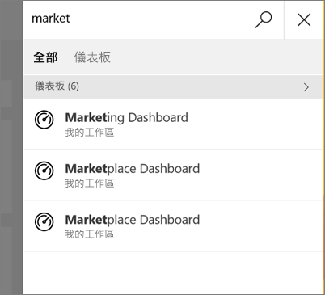
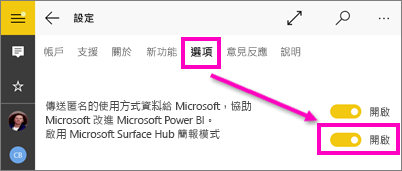

# 在 Surface Hub 和 Windows 10 上以簡報模式檢視報表 - Power BI
您可以在 Surface Hub 上以簡報模式顯示報表，以及在 Windows 10 裝置上以全螢幕模式顯示儀表板、報表和磚。 

簡報及全螢幕模式可以用來在會議中、在辦公室的專用投影機上顯示 Power BI，或甚至只是充分利用小螢幕上的空間。 

在 Power BI 行動裝置應用程式的全螢幕模式中，所有「組件區塊」，例如導覽和功能表列都會移除，只有報表中的頁面索引標籤和篩選窗格除外。

當您在 Surface Hub 以簡報模式上顯示報表時，可以用不同顏色的墨水在頁面上繪製，並在報表的頁面之間巡覽。

您也可以在網站上，[從 Power BI 服務以全螢幕模式顯示儀表板和報表](../end-user-focus.md)。

> [!NOTE]
> 簡報模式不同於[磚的焦點模式](mobile-tiles-in-the-mobile-apps.md)。
> 
> 

## 以全螢幕模式顯示儀表板、報表和磚
1. 在 Power BI 行動裝置應用程式中，在儀表板、報表或磚上點選**全螢幕**圖示進入全螢幕模式。
2. 在簡報模式中，您可以篩選報表，或搜尋其他儀表板和報表。
   
    展開 [篩選] 窗格，來設定或移除篩選。
   
    ![[篩選] 窗格](./media/mobile-windows-10-app-presentation-mode/power-bi-windows-10-presentation-filter.png)
   
     點選搜尋圖示  以尋找其他儀表板。
   
    
3. 若要結束全螢幕模式，請點選工具列上有兩個向內箭號的圖示  或從頂端向下撥動，並點選兩個向內箭號 .

## 開啟 Surface Hub 的簡報模式
Surface Hub 中預設會開啟簡報模式，但如果它已關閉，您可以重新開啟它。

1. 點選設定圖示  ，位置在左側導覽列的底部。
2. 點選 [選項]，然後將 \[Enable Microsoft Surface Hub presentation mode] \(啟用 Microsoft Surface Hub 簡報模式) 滑到 [開啟]。
   
    

## 在 Surface Hub 上顯示和繪製報表
1. 在報表中，點選**全螢幕**圖示進入 Surface Hub 簡報模式。
   
    您可以看到螢幕兩邊有可摺疊的動作列。 
   
   * 若要開啟它，請往內撥動或點選控點。
   * 若要關閉它，請往外撥動或點選頂端的 X。
2. 在支援手寫筆的裝置上，您可以立即開始撰寫。 
3. 若要變更筆跡色彩，請點選左側或右側動作列中的畫筆。
   
    
4. 點選橡皮擦或復原箭頭，以移除部分或所有筆跡。
5. 點選圓形箭號，以重新整理報表內容。
6. 點選兩側的箭號以移至報表中的其他頁面。
   
    
7. 若要結束全螢幕模式，請從頂端往下撥動，並點選兩個向內的箭號 。

## 後續步驟
* [從 Power BI 服務以全螢幕模式顯示儀表板和報表](../end-user-focus.md)
* 有問題嗎？ [嘗試在 Power BI 社群提問](http://community.powerbi.com/)

