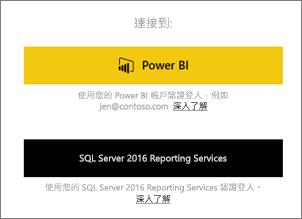
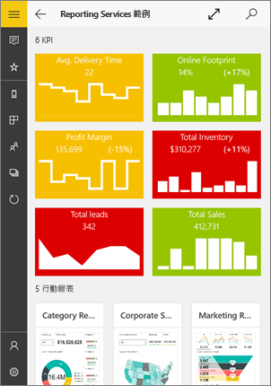
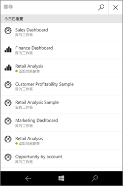
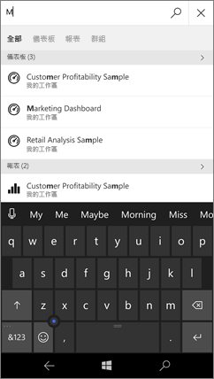
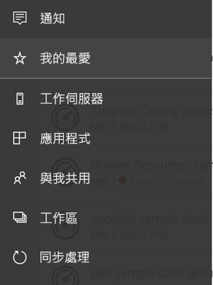
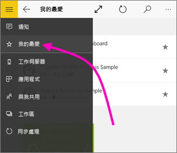
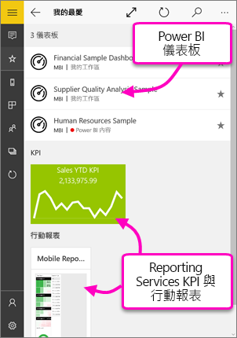

# 開始使用 Power BI for Windows 10 行動裝置應用程式
Power BI for Windows 10 行動裝置應用程式可將 Power BI 帶到您的平板電腦或手機。 您可以對商務資訊進行最新的觸控式行動存取。 在 [Windows 開始畫面](mobile-pin-dashboard-start-screen-windows-10-phone-app.md)上，隨處檢視公司儀表板並與其互動。

您可以使用自己的資料[在 Power BI 服務中建立儀表板和報表](../../fundamentals/service-get-started.md)。 

之後即可利用適用於 Windows 10 的 Power BI 行動裝置應用程式，與您的儀表板和報表互動、瀏覽資料並加以共用。

## 最重要的第一件事
* 從 Windows 市集[**取得適用於 Windows 10 的 Power BI 行動裝置應用程式**](https://go.microsoft.com/fwlink/?LinkID=526478)。
  
  您的裝置必須執行 Windows 10。 應用程式可以在具有至少 3 GB RAM 和 8 GB 內部儲存空間的裝置上執行。

  >[!NOTE]
  >**使用 Windows 10 行動裝置版手機**的 Power BI 行動裝置應用程式支援，將於 2021 年 3 月 16 日停止。 [深入了解](/legal/powerbi/powerbi-mobile/power-bi-mobile-app-end-of-support-for-windows-phones)
   
* 了解 [Power BI 行動裝置應用程式的新功能](mobile-whats-new-in-the-mobile-apps.md)。

## 在網路上註冊 Power BI 服務
如果您尚未註冊，請前往 [Power BI 服務](https://powerbi.com/)。 註冊您自己的帳戶以建立及儲存儀表板和報表，並將您的資料整合在一起。 然後，從您的 Windows 10 裝置登入 Power BI，便可隨處查看您自己的儀表板。

1. 在 Power BI 服務中，點選 [註冊](https://go.microsoft.com/fwlink/?LinkID=513879) 來建立 Power BI 帳戶。
2. 開始[建立您自己的儀表板和報表](../../fundamentals/service-get-started.md)。

## 開始使用 Power BI 應用程式
1. 在 Windows 10 裝置的開始畫面開啟 Power BI 應用程式。
   
   
2. 若要檢視您的 Power BI 儀表板和報表，請點選 [Power BI] 。 使用與您在網路上 Power BI 帳戶相同的認證登入。 
   
   若要檢視您的 Reporting Services 行動報表和 KPI，請點選 [SQL Server 2016 Reporting Services]。 使用您的 SQL Server Reporting Services 認證登入。
   
   
3. 點選 [開始探索]   檢視您自己的儀表板。

## 試用 Power BI 和 Reporting Services 範例
即使沒有登入，您也可以使用 Power BI 和 Reporting Services 範例。 在您下載應用程式後，便可以檢視範例或開始使用。 您可以視需要隨時回到儀表板首頁的範例。

### Power BI 範例
您可以檢視 Power BI 儀表板範例並與其互動。 但有幾件事做不到。 您無法開啟儀表板背後的報表、與其他人共用範例，或將它們設成 [我的最愛]。

1. 點選左上角的  全域導覽按鈕。
2. 點選**設定**圖示，點選您的名稱，再點選 [檢視範例]。
   
   
3. 挑選角色，並瀏覽該角色的範例儀表板。  
   
   

### Reporting Services 行動報表範例
1. 點選左上角的  全域導覽按鈕。
2. 點選**設定**圖示，以滑鼠右鍵按一下或點選並按住 [連線至伺服器]，然後點選 [檢視範例]。
   
   ![[設定] 畫面的螢幕擷取畫面，其中顯示設定圖示中用來連線到伺服器的指標。](media/mobile-windows-10-phone-app-get-started/power-bi-win10-connect-ssrs-samples.png)
3. 開啟 [Retail Reports]\(零售報表) 或 [Sales Reports]\(銷售報表) 資料夾，探索其 KPI 和行動報表。
   
   

## 搜尋儀表板、報表和應用程式
在一律位於應用程式頂端的搜尋方塊中鍵入，以快速尋找您的儀表板、報表與應用程式。

1. 點選右上角的搜尋圖示。
   
   
   
   Power BI 會顯示您最近使用的儀表板、報表和應用程式。
   
   
2. 當您開始輸入時，Power BI 會顯示所有相關的結果。
   
   

## 在 Power BI 行動裝置應用程式中尋找內容
儀表板和報表儲存在 Power BI 行動裝置應用程式中的不同位置，視其來源而定。 請閱讀[在行動裝置應用程式中尋找內容](mobile-apps-quickstart-view-dashboard-report.md)。 此外，您還可以一律搜尋您在 Power BI 行動裝置應用程式中的任何內容。 

## 檢視您最愛的儀表板、KPI 和報表
在行動裝置應用程式 [我的最愛] 頁面檢視您最愛的 Power BI 儀表板，以及 Reporting Services KPI 與行動報表。 當您在 Power BI 行動裝置應用程式中將儀表板設為「我的最愛」時，就可以從所有裝置加以存取，包括瀏覽器中的 Power BI 服務。 

* 點選 [我的最愛]。
  
   
  
   您的 Power BI [我的最愛] 及 Reporting Services 入口網站上的 [我的最愛] 皆在此頁面。
  
   

閱讀更多以了解 [Power BI 行動裝置應用程式中的我的最愛](mobile-apps-favorites.md)。

## 後續步驟
您還可以在適用於 Windows 10 裝置的 Power BI 應用程式中，運用 Power BI 中的儀表板和報表，以及 Reporting Services 入口網站中的 Reporting Services 行動報表和 KPI 來執行其他作業。

### Power BI 儀表板和報表
* 檢視[應用程式](../../collaborate-share/service-create-distribute-apps.md)。
* 檢視您的[儀表板](mobile-apps-view-dashboard.md)。
* [將 Power BI 磚和儀表板釘選](mobile-pin-dashboard-start-screen-windows-10-phone-app.md)為裝置的開始畫面動態磚。
* [共用磚](mobile-windows-10-phone-app-get-started.md)。
* 共用[儀表板](mobile-share-dashboard-from-the-mobile-apps.md)。

### Reporting Services 行動報表和 KPI
* 在 Power BI for Windows 10 行動裝置應用程式上[檢視 Reporting Services 行動報表和 KPI](mobile-app-windows-10-ssrs-kpis-mobile-reports.md)。
* [在 Reporting Services 入口網站上建立 KPI](/sql/reporting-services/working-with-kpis-in-reporting-services)。
* [使用 SQL Server 行動報表發行工具建立自己的行動報表](/sql/reporting-services/mobile-reports/create-mobile-reports-with-sql-server-mobile-report-publisher)，並將其發佈到 Reporting Services 入口網站。

## 後續步驟
* 從 Windows 市集[下載 Power BI 應用程式](https://go.microsoft.com/fwlink/?LinkID=526478)  
* [Power BI 是什麼？](../../fundamentals/power-bi-overview.md)
* 有問題嗎？ [嘗試在 Power BI 社群提問](https://community.powerbi.com/)