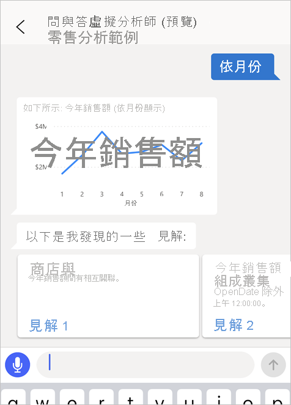

# 教學課程：使用 Power BI iOS 應用程式中的問與答虛擬分析師，詢問有關您資料的問題

如果您想要了解資料，最簡單的方法就是用自己的文字來詢問相關問題。 在此教學課程中，您可以使用 iPad、iPhone 和 iPod Touch 上的 Microsoft Power BI 行動裝置應用程式中的問與答虛擬分析師詢問問題，並查看有關範例資料的精選見解。 

適用於︰

|  |  |
|:--- |:--- |
| iPhone |iPad |

問與答虛擬分析師是便利的 BI 體驗，可存取 Power BI 服務 [(https://powerbi.com)](https://powerbi.com) 中最基本的問與答資料。 它提供了資料見解，而您可以輸入或使用您自己的問題。

在此教學課程中，您需要：

> [!div class="checklist"]
> * 安裝 iOS 版 Power BI 行動裝置應用程式
> * 下載 Power BI 範例儀表板和報表
> * 請查看行動裝置應用程式建議哪些精選見解

如果您尚未註冊 Power BI，請先進行[免費註冊](https://app.powerbi.com/signupredirect?pbi_source=web)再開始。

## 先決條件

### 安裝 iOS 版 Power BI 應用程式
從 Apple App Store [下載 iOS 應用程式](http://go.microsoft.com/fwlink/?LinkId=522062 "下載 iPhone 應用程式")至 iPad、iPhone 或 iPod Touch。

這些版本支援 iOS 版 Power BI 應用程式：
- iPad (iOS 10 或更新版本)。
- iPhone 5 與後續機種 (iOS 10 或更新版本)。 
- iPod Touch (iOS 10 或更新版本)。

### 下載商機分析範例
本教學課程的第一個步驟是下載 Power BI 服務中的商機分析範例。

1. 在瀏覽器 (app.powerbi.com) 中開啟 Power BI 服務，然後登入。

1. 選取全域導覽圖示以開啟左瀏覽窗格。

    

2. 在左瀏覽窗格中，選取 [工作區] > [我的工作區]。

    

3. 在左下角選取 [取得資料]。
   
    

3. 在 [取得資料] 頁面上，選取**範例**圖示。
   
   

4. 選取 [商機分析範例]。
 
    
 
8. 選取 [連接]。  
  
   
   
5. Power BI 會匯入範例，並將新的儀表板、報表及資料集新增到 [我的工作區]。
   
   

好的，您已準備好在 iOS 裝置上檢視範例。

## 試試精選深入解析
1. 在您的 iPhone 或 iPad 上，開啟 Power BI 應用程式並使用 Power BI 帳戶認證登入，這與您在瀏覽器中的 Power BI 服務中使用的認證相同。

1.  點選全域導覽按鈕  > [工作區] > [我的工作區]，並開啟 [商機分析範例] 儀表板。

2. 點選問與答虛擬分析師圖示  點選問與答圖示。

     

     Power BI 問與答虛擬分析師提供了一些開始使用的建議。

     
3. 點選 [精選深入解析]。

     問與答虛擬分析師建議了一些深入解析。
4. 向右捲動並點選 [深入解析 2]。

    

     問與答虛擬分析師會顯示深入解析 2。

    
5. 點選圖表以使用焦點模式開啟。

    
6. 點選左上角的箭號，可返回問與答虛擬分析師體驗。

## 清除資源

當您完成教學課程時，就可以刪除 [商機分析範例] 儀表板、報表和資料集。

1. 開啟 Power BI 服務 (app.powerbi.com) 並登入。

2. 在左瀏覽窗格中，選取 [工作區] > [我的工作區]。

3. 在 [儀表板] 索引標籤上，選取 [商機分析] 儀表板旁邊的垃圾桶**刪除**圖示。

    

4. 選擇 [報表] 索引標籤，並針對商機分析報表執行相同的動作。

5. 選擇 [資料集] 索引標籤，並對商機分析資料集執行相同的動作。

## 後續步驟

您已嘗試過 iOS 版 Power BI 行動裝置應用程式中的問與答虛擬助理。 深入了解 Power BI 服務的問與答。
> [!div class="nextstepaction"]
> [Power BI 服務中的問與答](../end-user-q-and-a.md)

