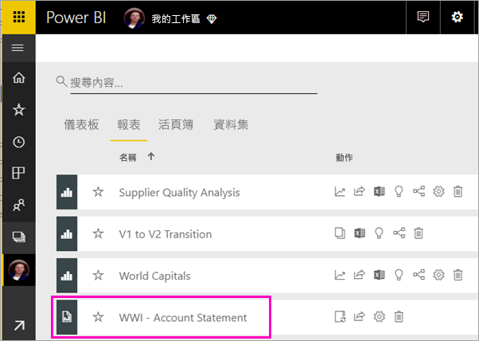
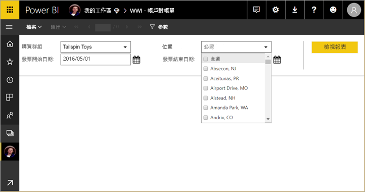
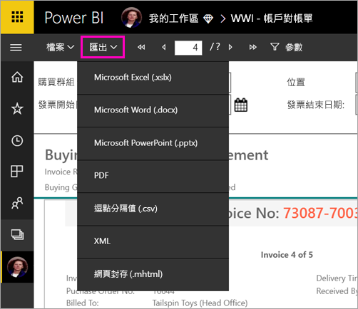

# 檢視 Power BI 服務中的編頁報表

在此文章中，您將了解如何對 Power BI 服務檢視編頁報表。 編頁報表是在報表產生器中建立並上傳至 Premium 容量中任何工作區的報表。 尋找工作區名稱旁邊的鑽石圖示  (在工作區名稱旁邊)。 

編頁報表都有自己的圖示 .

您也可以將編頁報表匯出為下列數種格式： 

- Microsoft Excel
- Microsoft Word
- Microsoft PowerPoint
- PDF
- 逗點分隔值
- XML
- 網頁封存 (.mhtml)

## 檢視編頁報表

1. 選取工作區中的編頁報表。

    

2. 如果報表含有參數 (就像這一個所做的)，您可能就不會第一次開啟此報表時看見它。 選取參數，然後選取 [檢視報表]  。 

     

    您也可以隨時變更參數。

1. 藉由選取頁面頂端的箭號，或在方塊中輸入頁碼，逐頁檢視報表。
    
   

4. 選取 [匯出]  ，以尋找要用以匯出編頁報表的格式。

    

## 後續步驟

[Power BI 服務中的編頁報表](end-user-paginated-report.md)
