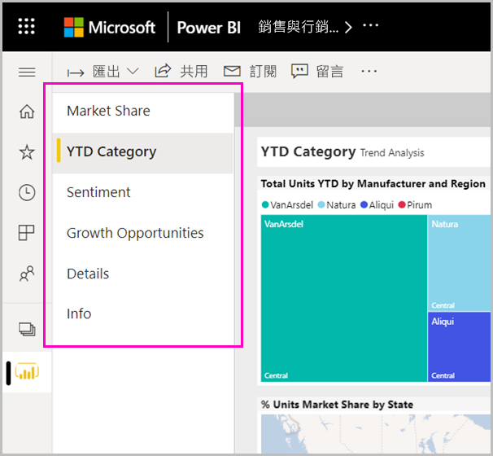
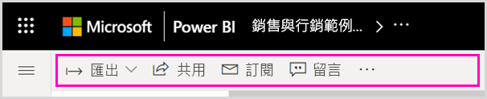
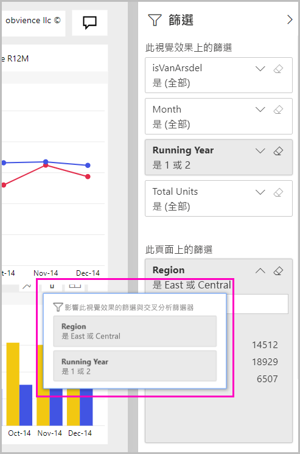
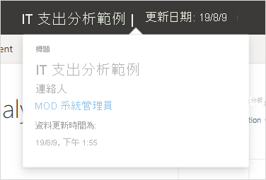

# Power BI 服務的「新外觀」

Power BI 服務 (app.powerbi.com) 有新的外觀，可讓您更輕鬆地檢視報表並與其互動。 新外觀更簡潔，而且建構在您熟悉的其他 Microsoft 產品基礎之上。 在 Power BI 服務中，我們藉由切換至較淺的色彩主題並更新圖示，讓報表內容成為主要焦點。 

要尋找 **Power BI Desktop** 中新外觀的相關資訊嗎？ 請參閱[使用 Power BI Desktop 中已更新的功能區](../create-reports/desktop-ribbon.md)。

以下概述新外觀中的變更項目。 如需詳細資料，請參閱編號章節：

在找特定的動作嗎？ 請參閱[「新外觀」：動作跑到哪裡了？](service-new-look-where-actions.md)

## 1.頁面的垂直清單 
在閱讀檢視中，報表頁面名稱會在垂直窗格的清單中。 它們很明顯、難以錯過，且類似於 Word 和 PowerPoint 中的導覽。 您可增加或減少報表區域的其餘部分：調整垂直窗格的大小，或選取雙箭號將其完全關閉。

若具有報表的編輯權限，則可進行設定，讓頁面名稱位於底部，就像在報表編輯檢視中一樣。 如需詳細資料，請參閱＜變更 Power BI 報表的設定＞一文中的[設定頁面窗格](../create-reports/power-bi-report-settings.md#set-the-pages-pane)。

## 2.簡化的動作列 

頂端的更新動作列提供了最相關命令，對於報表取用者來說非常重要。 您可更輕鬆地匯出、共用、在小組中聊天及訂閱。 

## 3.報表命令在哪裡？

我們不會從舊外觀中移除任何功能。 如需更多的進階命令，請選取 [其他選項 (...)]。 請參閱[「新外觀」：動作跑到哪裡了？](service-new-look-where-actions.md)，以取得詳細資料。

## 4.新的篩選體驗

您會看到依預設具有新外觀的報表其新 [篩選] 窗格。 當將滑鼠暫留在視覺效果的篩選圖示上方時，您會看到影響該視覺效果的所有篩選和交叉分析篩選器。

## 檢視報表詳細資料 

請直接在頂端橫幅中快速查看詳細資料，例如上次重新整理日期和連絡人資訊。  開啟功能表可檢視報表的其他詳細資料。 您甚至可以傳送電子郵件給報表擁有者。

## 報表編輯模式沒有變更 

我們將撰寫體驗保持為類似桌面的撰寫體驗。 新外觀變更僅適用於閱讀檢視。

## 儀表板的「新外觀」體驗 

儀表板也有簡化的動作列。 如同報表和應用程式，其可提供一致的體驗，但保留了功能上的差異。 以下是儀表板動作的逐步解說。
 

## 後續步驟

- [使用 Power BI Desktop 中已更新的功能區](../create-reports/desktop-ribbon.md)
- [加入工作區「新外觀」](../collaborate-share/service-workspaces-new-look.md)
- [取用者適用的 Power BI](end-user-consumer.md)
