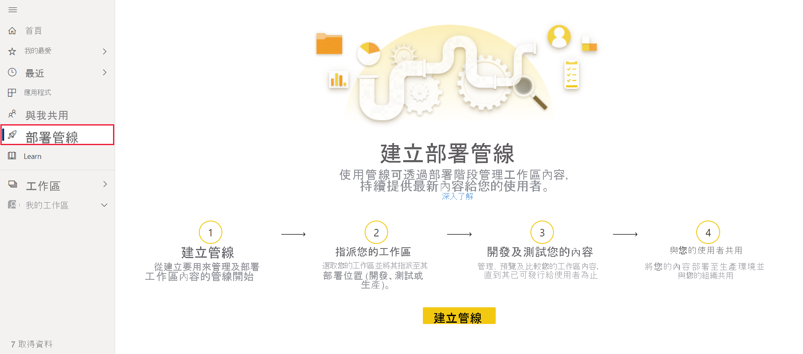
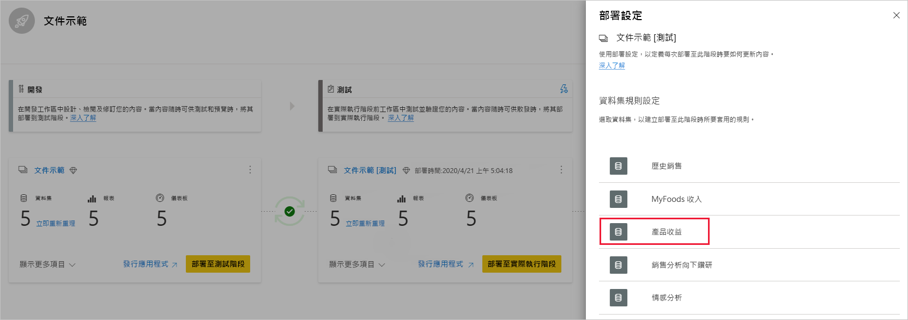

# 開始使用部署管線

此文章會逐步引導您完成使用部署管線所需的基本設定。

## 存取部署管線

如果您符合下列條件，就能夠存取部署管線功能：

* 您具有下列其中一個 Premium 授權：

    * 您是 Power BI [Pro 使用者](../admin/service-admin-purchasing-power-bi-pro.md)，而且所屬的組織具有 Premium 容量。

    * [Premium Per User (PPU)](../admin/service-premium-per-user-faq.md)。

* 您是[新工作區體驗](../collaborate-share/service-create-the-new-workspaces.md)的管理員。

>[!NOTE]
> 如果您先前已建立管線，或有與您共用的管線，則您也可以看到 [部署管線] 按鈕。

## 步驟 1 - 建立部署管線

您可以在 [部署管線] 索引標籤或工作區上建立管線。

建立管線之後，您可以將其與其他使用者共用，或將其刪除。 當您與其他人共用管線時，您的管線共用對象使用者將會獲得[管線的存取權](deployment-pipelines-process.md#user-with-pipeline-access)。 管線存取權可讓使用者檢視、共用、編輯及刪除管線。

### 在部署管線索引標籤上建立管線

若要從 [部署管線] 索引標籤建立管線，請執行下列動作：

1. 在 Power BI 服務中，從瀏覽窗格選取 [部署管線]，然後選取 [建立管線]。

2. 在 [建立部署管線] 對話方塊中，輸入管線的名稱與描述，然後選取 [建立]。

### 在工作區建立管線

如果您是[新工作區介面](../collaborate-share/service-create-the-new-workspaces.md)的管理員，則可在現有的工作區建立管線。

1. 在工作區選取 [建立管線]。

    > [!div class="mx-imgBorder"]
    > ![工作區中 [建立管線] 按鈕的螢幕擷取畫面。](media/deployment-pipelines-get-started/workspace-deploy.png)

2. 在 [建立部署管線] 對話方塊中，輸入管線的名稱與描述，然後選取 [建立]。

>[!NOTE]
>如果未將工作區指派至您組織的 Premium 容量，或指派至您的 PPU 容量，則您會收到[將工作區指派至容量](../admin/service-admin-premium-manage.md#assign-a-workspace-to-a-capacity)的通知。  

## 步驟 2 - 將工作區指派至部署管線

建立管線之後，您必須將您要管理的內容新增至管線。 透過將工作區指派給管線階段，即可將內容新增至管線。 您可以將工作區指派至任何階段。 

您可以將一個工作區指派至部署管線。 部署管線會建立工作區內容的複製品，以用於管線的不同階段。

請遵循這些步驟來在部署管線中指派工作區：

1. 在新建立的部署管線中，選取 [指派工作區]。

2. 在 [選擇工作區] 下拉式功能表中，選取您要指派至管線的工作區。

    >[!NOTE]
    >如果要在工作區建立管線，可以略過此階段，因為已選取工作區。

3. 選取您想要將工作區指派至其中的階段。

### 工作區指派限制

* 工作區必須是[新工作區體驗](../collaborate-share/service-create-the-new-workspaces.md)。

* 您必須是工作區的系統管理員。

* 工作區未指派至任何其他管線。

* 工作區必須位於  [Premium 容量](../admin/service-premium-what-is.md)上。

* 您無法將具有 [Power BI 範例](../create-reports/sample-datasets.md)的工作區指派至管線階段。

>[!NOTE]
>只有可搭配部署管線使用的工作區，才會顯示在您可從中選取的工作區清單中。

## 步驟 3 - 部署至空白階段

是來源工作區中的成員或系統管理員的任何 [Pro 使用者](../admin/service-admin-purchasing-power-bi-pro.md)，都可以將內容部署至空白階段 (不包含內容的階段)。 工作區必須位於容量中，部署才能完成。

將內容部署至空白階段時，項目之間的關聯性會予以保留。 例如，繫結至來源階段中資料集的報表，將會連同其資料集一起複製，且複製品在目標工作區中將會以同樣的方式繫結。

部署完成之後，請重新整理資料集。 如需詳細資訊，請參閱[將內容部署至空白階段](deployment-pipelines-process.md#deploying-content-to-an-empty-stage)。

### 部署所有內容

選取要從中部署的階段，然後選取 [部署] 按鈕。 部署程序會在目標階段中建立重複的工作區。 此工作區包含目前階段中現有的所有內容。

[![顯示部署管線中適用於 [開發] 與 [測試] 階段之部署按鈕的螢幕擷取畫面。](media/deployment-pipelines-get-started/deploy.png)](media/deployment-pipelines-get-started/deploy.png#lightbox)

### 選擇性部署

若只要部署特定項目，請選取 [顯示更多] 連結，然後選取您要部署的項目。 按一下 [部署] 按鈕時，只有已選取的項目會部署到下一個階段。

由於儀表板、報表與資料集是相關聯且具有相依性的，因此您可以使用選取相關項目按鈕來選取那些項目相依的所有項目。 例如，如果您想要將報表部署到下一個階段，按一下選取相關項目按鈕將會標示報表所連線的資料集，這樣就會同時部署兩者，且報表不會損毀。

[![顯示部署管線中選擇性部署選項的螢幕擷取畫面，其於選取 [顯示更多] 選項之後提供。](media/deployment-pipelines-get-started/selective-deploy.png)](media/deployment-pipelines-get-started/selective-deploy.png#lightbox)

>[!NOTE]
> * 如果報表或儀表板所相依的項目不存在於您要部署至的階段中，您就無法將其部署至下一個階段。
> * 如果您選擇部署報表或儀表板而不使用其資料集，您可能會遇到非預期的結果。 當目標階段中的資料集已變更，且不再與您要從中部署階段中的資料集相同時，就可能發生此情況。

### 回溯部署

您可以選擇部署至先前的階段，例如，您將現有工作區指派至生產階段，然後加以回朔部署，先至測試階段，然後再至開發階段。

只有當先前階段是空的時，才能部署到先前階段。 部署到先前階段時，您無法選取特定項目。 系統將會部署階段中的所有內容。

[![顯示 [部署至上一個階段] 按鈕的螢幕擷取畫面，其於 [測試] 或 [生產環境] 階段的功能表中提供。](media/deployment-pipelines-get-started/deploy-back.png)](media/deployment-pipelines-get-started/deploy-back.png#lightbox)

## 步驟 4 - 建立資料集規則

在使用部署管線時，不同階段可以有不同設定。 例如，每個階段都可以有不同的資料庫或不同的查詢參數。 開發階段可能會從資料庫查詢範例資料，而測試與生產階段則會查詢整個資料庫。

當您在管線階段之間部署內容時，設定資料集規則可讓您允許變更內容，同時保持某些設定的完整性。

資料集規則是在每個資料集的資料來源與參數上定義的。 其決定特定資料集的資料來源值或參數值。 例如，如果您希望生產階段中的資料集指向生產資料庫，您可以為其定義規則。 規則是在生產階段中 (於適當資料集下) 定義的。 定義規則之後，從測試階段部署到實際執行階段的內容將繼承資料集規則中所定義的值，而且只要該規則未變更且有效，就一律會套用。

>[!NOTE]
> 只有在來源與目標資料來源的類型相同時，資料集規則才有效。

### 建立資料集規則

1. 在您想要建立資料集規則的管線階段中，選取 [部署設定]。

    ![[部署設定] 按鈕的螢幕擷取畫面，其位於每個部署管線階段的右上角。](media/deployment-pipelines-get-started/deployment-settings.png)

2. 從 [部署設定] 窗格中，選取您想要為其建立規則的資料集。

    

3. 選取您要建立的規則類型，展開清單，然後選取 [新增規則]。

     [![顯示選取 [資料來源規則] 並按一下 [新增規則] 選項的螢幕擷取畫面。](media/deployment-pipelines-get-started/add-rule.png)](media/deployment-pipelines-get-started/add-rule.png#lightbox)

### 資料集規則類型

您可以建立兩種類型的規則：

* **資料來源規則** 資料來源規則清單取自來源管線階段的資料集。 從資料來源清單中，選取要取代的資料來源。 使用下列其中一種方法來選取值，以取代來源階段中的一個值：

    1. 從清單中選取。

    2. 選取 [其他]，然後手動新增新的資料來源。 您只能變更為相同類型的資料來源。

* **參數規則** 從參數清單中選取參數，隨即顯示目前的值。 將值編輯為您想要在每個部署之後生效的值。

### 資料集規則限制

* 您必須是資料集擁有者才能建立資料集規則。

* 您無法在開發階段建立資料集規則。

* 移除或刪除項目時，也會刪除其規則。 無法還原這些規則。

* 如果規則中定義的資料來源或參數已變更或從來源資料集移除，此規則將會是無效的，且部署將會失敗。

* 無法針對類型為 *Any* 或 *Binary* 的參數定義參數規則。 如需詳細資訊，請參閱[資料集更新參數限制](/rest/api/power-bi/datasets/updateparameters) \(英文\)。

* 只能針對下列資料來源定義資料來源規則：
    * Azure Analysis Services
    * Azure Synapse
    * SQL Server Analysis Services (SSAS)
    * Azure SQL Server
    * SQL Server
    * OData 摘要
    * Oracle
    * SapHana (僅支援匯入模式，不支援直接查詢模式)
    * SharePoint
    * Teradata

    針對其他資料來源，我們建議您[使用參數來設定您的資料來源](deployment-pipelines-best-practices.md#use-parameters-in-your-model)。

## 步驟 5 - 將內容從一個階段部署至另一個

在管線階段中有內容之後，您就可以將其部署至下一個階段。 當您已經在管線中執行某些動作之後，通常會將內容部署至另一個階段。 例如，對開發階段中的內容進行開發變更，或對測試階段中的內容進行測試。 在階段之間移動內容的一般工作流程是從測試至開發，然後從測試至生產。 您可以在[將內容部署到現有的工作區](deployment-pipelines-process.md#deploy-content-to-an-existing-workspace)一節中深入了解此程序。

若要將內容部署到部署管線中的下一個階段，請選取階段底部的 [部署] 按鈕。

當您檢閱 [測試] 與 [生產] 階段卡片時，您可以看到上次的部署時間。 這表示上次將內容部署至階段的時間。

部署時間非常適合用來得知階段上次更新的時間。 如果您想要追蹤測試與生產部署之間的時間，部署時間也很有用。

## 比較階段

當兩個連續階段有內容時，系統會根據內容項目中繼資料來比較內容。 此比較不包括比較各個階段之間的資料或重新整理時間。

 

為了讓您快速取得兩個連續階段之間差異的視覺化見解，兩者間會顯示比較圖示指標。 比較指標有兩種狀態：

* **綠色指標** - 兩個階段中每個內容項目的中繼資料都相同。

* **橘色指標** - 此指標會在符合這些條件的其中一個時顯示：
    * 每個階段中的某些內容項目已變更或更新 (具有不同中繼資料)。
    * 階段之間的項目數目有所差異。

當兩個連續階段不同時，橘色比較圖示的下方會出現 [比較] 連結。 按一下連結即可在 [比較] 檢視中開啟兩個階段中的項目清單。 [比較] 檢視可協助您追蹤每個管線階段中項目之間的變更或差異。 已變更的項目會得到下列其中一個標籤：

* **新增** - 來源階段中的新項目。 這是目標階段中不存在的項目。 部署之後，系統會將此項目複製到目標階段。

* **不同** - 存在於來源與目標階段中的項目，上次部署之後其中一個的版本已變更。 部署之後，不論已經變更的位置為何，來源階段中的項目皆會覆寫目標階段中的項目。

* **遺漏的位置** - 此標籤表示項目出現在目標階段中，但不在來源階段中。

    >[!NOTE]
    >部署不會影響「遺漏的位置」項目。

 [![顯示 [比較] 選項的螢幕擷取畫面，其可展開 [比較] 檢視並允許在部署管線階段之間比較項目。](media/deployment-pipelines-get-started/compare.png)](media/deployment-pipelines-get-started/compare.png#lightbox)

## 覆寫內容

當您對來源階段中的內容進行變更後再進行部署時，系統會覆寫您在目標階段中變更的內容。 按一下 [部署] 之後，您會收到一則警告，列出將會覆寫的項目數目。

您可以在[了解部署程序](deployment-pipelines-process.md)中，深入了解[會複製哪些項目到下一個階段](deployment-pipelines-process.md#deployed-items)，以及[不會複製哪些項目](deployment-pipelines-process.md#unsupported-items)。

## 後續步驟

>[!div class="nextstepaction"]
>[部署管線簡介](deployment-pipelines-overview.md)

>[!div class="nextstepaction"]
>[了解部署管線程序](deployment-pipelines-process.md)

>[!div class="nextstepaction"]
>[部署管線疑難排解](deployment-pipelines-troubleshooting.md)

>[!div class="nextstepaction"]
>[部署管線最佳做法](deployment-pipelines-best-practices.md)