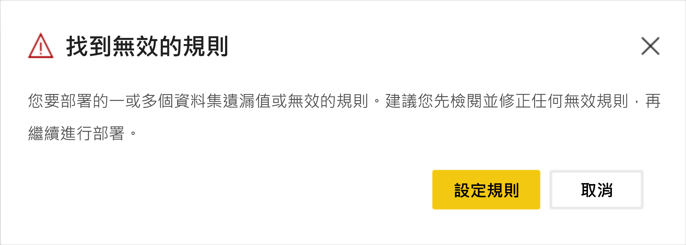

# 部署管線疑難排解

使用此文章來針對部署管線中的問題進行疑難排解。

## 一般

### 什麼是 Power BI 中的部署管線？

若要了解 Power BI 中的部署管線，請參閱[部署管線概觀](deployment-pipelines-overview.md)。

### 我要如何開始使用部署管線？

使用[開始使用指示](deployment-pipelines-get-started.md)開始使用部署管線。

### 為什麼我看不到 [部署管線] 按鈕？

如果不符合下列條件，則您無法看到 [部署管線] 按鈕。

* 您具有下列其中一個 Premium 授權：

    * 您是 Power BI [Pro 使用者](../admin/service-admin-purchasing-power-bi-pro.md)，而且所屬的組織具有 Premium 容量。

    * [Premium Per User (PPU)](../admin/service-premium-per-user-faq.md)。

* 您是[新工作區體驗](../collaborate-share/service-create-the-new-workspaces.md)的管理員。

### 為什麼無法在 [我的工作區] 中看到管線階段標籤？

部署管線會在指派給管線的工作區中顯示管線階段標籤。 「開發」和「測試」階段的標籤一律可見。 然而，如果您具有[管線的存取權](deployment-pipelines-process.md#user-with-pipeline-access)，或者身為[工作區管理員](deployment-pipelines-process.md#workspace-admin)，您只能看見「生產」標籤。

> [!div class="mx-imgBorder"]
> 

## 授權

### 需要哪些授權才能使用部署管線？

若要使用部署管線，您必須具有下列其中一個授權：

* [Pro 使用者](../admin/service-admin-purchasing-power-bi-pro.md)授權，並具備位於 [Premium 容量](../admin/service-premium-what-is.md)上的工作區。

* [Premium Per User (PPU)](../admin/service-premium-per-user-faq.md)。

如需詳細資訊，請參閱[存取部署管線](deployment-pipelines-get-started.md#accessing-deployment-pipelines)。

### 我可以將哪些類型的容量指派給管線中的工作區？

部署管線中的所有工作區都必須位於容量內，管線才能正常運作。 不過，您可以針對管線中的不同工作區使用不同的容量。 您也可以在相同管線中的不同工作區使用不同的容量類型。

若要進行開發及測試，您可以針對每個使用者將 A 或 EM 容量與 Pro Power BI 帳戶一起使用。 您也可以在開發與測試階段針對每個使用者使用 PPU。

針對生產環境工作區，您需要 P 容量。 如果您是透過內嵌應用程式發佈內容的 ISV，您也可以使用 A 或 EM 容量來進行生產。 PPU 也可用於實際執行工作區。

>[!NOTE]
>當您使用 PPU 建立工作區時，只有其他 PPU 使用者能夠存取該工作區並取用其內容。

## 技術

### 當我嘗試將工作區指派給管線時，為什麼看不到我的所有工作區？

若要將工作區指派給管線，必須符合下列條件：

* 工作區是[新的工作區體驗](../collaborate-share/service-create-the-new-workspaces.md)

* 您是工作區的管理員

* 工作區未指派至任何其他管線

* 工作區位於 [Premium 容量](../admin/service-premium-what-is.md)上

不符合這些條件的工作區不會顯示在您可以選取的工作區清單中。

### 如何將工作區指派給管線中的所有階段？

您可以為每個管線指派一個工作區。 將工作區指派給管線之後，您就可以將其部署到下一個管線階段。 第一次部署時，會使用來源階段中的項目複本來建立新的工作區。 系統會保留所複製項目的關聯性。 如需詳細資訊，請參閱如何[將工作區指派給部署管線](deployment-pipelines-get-started.md#step-2---assign-a-workspace-to-a-deployment-pipeline)。

### 為什麼我的第一次部署會失敗？

您的第一次部署可能因為許多原因而失敗。 下表列出其中一些原因。

|Error  |動作  |
|---------|---------|
|您沒有 [Premium 容量權限](deployment-pipelines-process.md#creating-a-premium-capacity-workspace)。     |如果您任職的組織具有 Premium 容量，請要求容量管理員將您的工作區新增至容量，或要求容量的指派權限。 工作區在容量中之後，請重新部署。  如果您任職的組織不具有 Premium 容量，請考慮購買 [Premium Per User (PPU)](../admin/service-premium-per-user-faq.md)。        |
|您沒有工作區權限。     |若要進行部署，您必須是工作區成員。 請要求您的工作區管理員授與您適當的權限。         |
|您的 Power BI 管理員已停用工作區的建立。     |請連絡您的 Power BI 管理員以尋求支援。         |
|您的工作區不是[新的工作區體驗](../collaborate-share/service-create-the-new-workspaces.md)。     |在新的工作區體驗中建立您的內容。 如果您的內容位於傳統工作區中，您可以將其[升級](../collaborate-share/service-upgrade-workspaces.md)為新的工作區體驗。         |
|您正在使用[選擇性部署](deployment-pipelines-get-started.md#selective-deployment)，而不是選取內容的資料集。     |請執行下列其中一項：   取消選取連結至資料集的內容。 未選取的內容 (例如報表或儀表板) 將不會複製到下一個階段。   選取連結至所選內容的資料集。 您的資料集將會複製到下一個階段。         |

### 在我嘗試部署時收到警告，指出我的工作區中有「不支援的成品」。 我要如何知道不支援哪些成品？

如需部署管線中不支援之項目與成品的完整清單，請參閱下列各節：

* [不支援的項目](deployment-pipelines-process.md#unsupported-items)

* [未複製的項目屬性](deployment-pipelines-process.md#item-properties-that-are-not-copied)

### 為什麼我的部署因為規則中斷而失敗？

如果您在設定資料集規則時遇到問題，請瀏覽[資料集規則](deployment-pipelines-get-started.md#step-4---create-dataset-rules)，並確定您遵循[資料集規則限制](deployment-pipelines-get-started.md#dataset-rule-limitations)。

如果您的部署先前已成功，且由於規則中斷而突然失敗，則可能是因為資料集正在重新發佈。 下列對來源資料集所做的變更會導致部署失敗：

**參數規則**

* 已移除的參數

* 已變更的參數名稱

**資料來源規則**

您的資料集規則遺漏值。 如果您的資料集已變更，可能就會發生這種情況。

當先前成功的部署因為連結中斷而失敗時，會顯示警告。 您可以選取 [設定規則]，瀏覽至 [部署設定] 窗格，其中會標示失敗的資料集。 當您選取資料集時，會標示中斷的規則。

若要成功部署，請修正或移除中斷的規則，然後重新部署。

### 如何變更管線階段中的資料來源？

您無法在 Power BI 服務中變更資料來源連線。

如果您想要變更測試階段或生產階段中的資料來源，您可以使用[資料集規則](deployment-pipelines-get-started.md#step-4---create-dataset-rules) 或 [API](/rest/api/power-bi/datasets/updateparametersingroup) \(英文\)。 資料集規則只會在下一次部署之後生效。

### 我已修正生產環境中的錯誤 (Bug)，但現在我無法選取 [部署至上一個階段] 按鈕。 為什麼該按鈕顯示為灰色？

您只能回溯部署到空的階段。 如果您在測試階段中有內容，就無法從生產環境進行回溯部署。

建立管線之後，請使用開發階段來開發您的內容，並使用測試階段來進行檢閱和測試。 您可以在這些階段修正錯誤 (Bug)，然後將已修正的環境部署至生產階段。

>[!NOTE]
>回溯部署僅支援[完整部署](deployment-pipelines-get-started.md#deploying-all-content)。 其不支援[選擇性部署](deployment-pipelines-get-started.md#selective-deployment)

### 為什麼我需要在設定資料集規則之後部署？

設定之後，就不會立即套用資料集規則。 若要套用資料集規則，您必須將資料集從來源階段部署到目標階段，其中包括已建立的資料集規則。 設定資料集規則，並在部署之前，會在具有所設定規則的資料集旁邊顯示 *不同* 的指標。 這表示您需要將該資料集從來源階段部署至目標階段。 一旦部署之後，如果未進行任何其他變更，則 *不同* 的指標將會消失，表示規則已成功套用。

### 部署管線支援多地理位置嗎？

支援多地理位置。 在不同地理位置的階段之間部署內容可能需要較長的時間。

## 權限

### 什麼是部署管線權限模型？

部署管線權限模型會在[權限](deployment-pipelines-process.md#permissions)一節中說明。

### 哪些人可以在階段之間部署內容？

內容可以部署到空的階段或包含內容的階段。 內容必須位於 [Premium 容量](../admin/service-premium-what-is.md)。

* **部署到空的階段**：身為來源工作區中成員或管理員的任何 [Pro](../admin/service-admin-purchasing-power-bi-pro.md) 或 [PPU](../admin/service-premium-per-user-faq.md) 使用者。

* **部署到具有內容的階段**：同時身為來源與目標部署階段中工作區之成員或管理員的任何 [Pro](../admin/service-admin-purchasing-power-bi-pro.md) 或 [PPU](../admin/service-premium-per-user-faq.md) 使用者。

* **覆寫資料集** - 即使資料集並未變更，部署也會覆寫包含在目標階段中的每個資料集。 使用者必須是部署中指定之所有目標階段資料集的擁有者。

### 我需要哪些權限來設定資料集規則？

若要在部署管線中設定資料集規則，您必須是資料集擁有者。

### 為什麼我看不到管線中的工作區？

管線與工作區權限會分開管理。 您可能具有管線權限，但不具有工作區權限。 如需詳細資訊，請檢閱[權限](deployment-pipelines-process.md#permissions)一節。

## 後續步驟

>[!div class="nextstepaction"]
>[部署管線簡介](deployment-pipelines-overview.md)

>[!div class="nextstepaction"]
>[開始使用部署管線](deployment-pipelines-get-started.md)

>[!div class="nextstepaction"]
>[了解部署管線程序](deployment-pipelines-process.md)

>[!div class="nextstepaction"]
>[部署管線最佳做法](deployment-pipelines-best-practices.md)