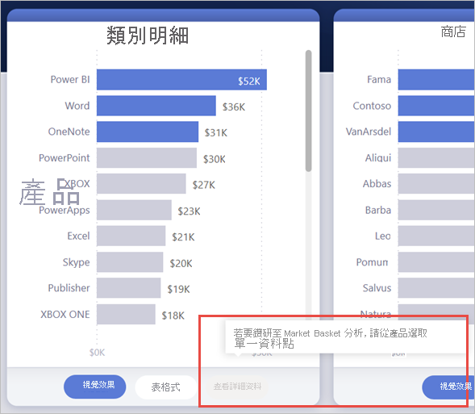
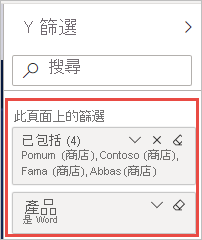
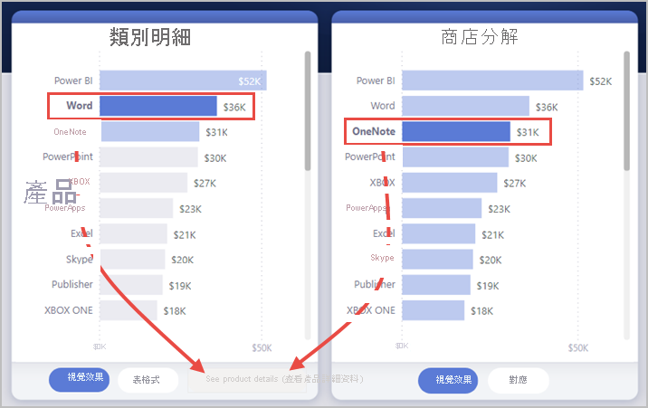
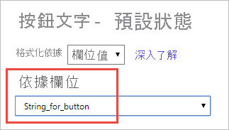
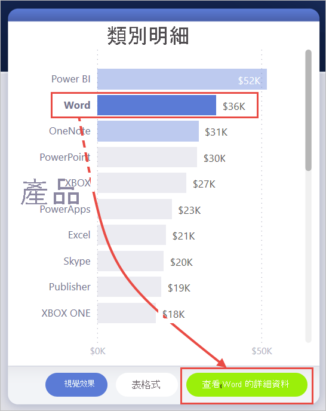
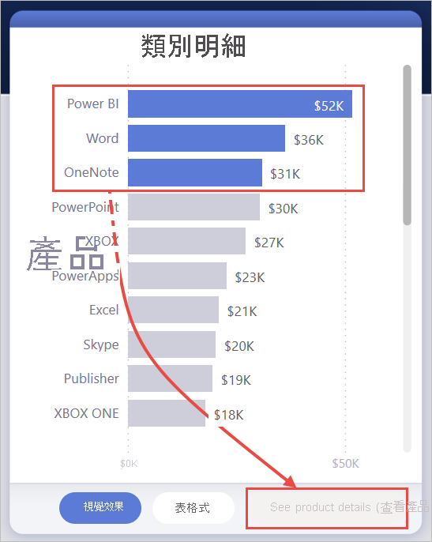

# <a name="create-a-drill-through-button-in-power-bi"></a>在 Power BI 中建立鑽研按鈕

您可以在 Power BI 中建立「鑽研」按鈕，這個按鈕會使用篩選到特定內容的詳細資料鑽研至頁面。

在報告中鑽研的一種方式，是在視覺效果中按一下滑鼠右鍵。 如果您想要讓鑽研動作更為明顯，可以改為建立鑽研按鈕。 按鈕可提高您報告中重要鑽研案例的發現性。 您可以有條件地決定按鈕的外觀和作用。 例如，如果符合特定條件，您可以在按鈕上顯示不同的文字。 繼續閱讀以取得詳細資料。 

在此範例中，在您選取圖表中的 [文字] 列後，即會啟用 [查看詳細資料] 按鈕。


在選取 [查看詳細資料] 按鈕時，您會鑽研至 [購物籃分析] 頁面。 正如同可在左側看見的視覺效果，鑽研頁面現在會為文字進行篩選。


## <a name="set-up-a-drill-through-button"></a>設定鑽研按鈕

若要設定鑽研按鈕，您需要先在報表中[設定有效的鑽研頁面](desktop-drillthrough.md)。 然後，您需要使用 [鑽研] 作為動作類型來建立按鈕，然後選取鑽研頁面作為 [目的地]。

因為鑽研按鈕有兩種狀態 (已啟用與已停用)，所以會看到兩個工具提示選項。


若將工具提示方塊保持空白，則 Power BI 會自動產生工具提示。 這些工具提示是以目的地和鑽研欄位為基礎。

以下是停用按鈕時自動產生工具提示的範例：

「若要鑽研到 [購物籃分析] [目的地頁面]，請從 [產品] [鑽研欄位] 選取單一資料點。」



以下是啟用按鈕時自動產生工具提示的範例：

「按一下以鑽研至 [購物籃分析] [目的地頁面]。」


但是，若想要提供自訂工具提示，您一律可以輸入靜態字串。 您也可以將[條件式格式設定套用至工具提示](#set-formatting-for-tooltips-conditionally)。

## <a name="pass-filter-context"></a>傳遞篩選內容

按鈕的運作方式與一般鑽研類似：您可以透過交叉篩選包含鑽研欄位的視覺效果，以傳遞其他欄位的篩選條件。 例如，使用 **Ctrl** + **按一下**及交叉篩選，您可以將 [店面] 上的多個篩選條件傳遞至鑽研頁面，因為選取項目會交叉篩選包含 [產品] (鑽研欄位) 的視覺效果：


選取鑽研按鈕之後，即會看到 [店面] 和 [產品] 上的篩選條件都傳遞到目的地頁面：



### <a name="ambiguous-filter-context"></a>不明確的篩選內容

由於鑽研按鈕不會繫結至單一視覺效果，因此若選取項目不明確，按鈕即會停用。

在此範例中，因為兩個視覺效果都包含 [產品] 上的單一選取項目，因此按鈕已停用。 因為判斷要將鑽研動作繫結至哪一個視覺效果的資料點時模稜兩可：



## <a name="customize-formatting-for-disabled-buttons"></a>自訂停用按鈕的格式設定
您可以自訂 [鑽研] 按鈕的 [已停用] 狀態格式設定選項。


:::image type="content" source="media/desktop-drill-through-buttons/drill-through-customize-disabled-button.png" alt-text="自訂停用的按鈕格式設定":::
 
這些格式設定選項包括：
- **按鈕文字控制項**：文字、色彩、填補、對齊、大小和字型系列

    :::image type="content" source="media/desktop-drill-through-buttons/drill-through-disabled-button-text.png" alt-text="格式化停用按鈕文字":::

- **按鈕填滿控制項**：色彩、透明度和「新的」填滿影像 (下一節將詳細說明)

    :::image type="content" source="media/desktop-drill-through-buttons/drill-through-disabled-button-fill.png" alt-text="停用按鈕填滿":::

- **圖示控制項**：圖形、填補、對齊、線條色彩、透明度和粗細

    :::image type="content" source="media/desktop-drill-through-buttons/drill-through-disabled-button-icon.png" alt-text="停用按鈕圖示":::

- **外框控制項**：色彩、透明度、粗細、圓角邊緣

     :::image type="content" source="media/desktop-drill-through-buttons/drill-through-disabled-button-outline.png" alt-text="停用按鈕外框":::

## <a name="set-formatting-for-button-text-conditionally"></a>有條件地設定按鈕文字的格式設定
您可以使用條件式格式設定，以根據所選欄位的值來變更按鈕文字。 若要這樣做，您需要建立會根據 DAX 函式 SELECTEDVALUE 輸出所需字串的量值。

以下是範例量值，若「沒有」選取單一產品值，則該量值會輸出「查看產品詳細資料」；否則，其會輸出「查看 [所選取產品] 的詳細資料」：

```dax
String_for_button = If(SELECTEDVALUE('Product'[Product], 0) == 0, "See product details", "See details for " & SELECTEDVALUE('Product'[Product]))
```

建立此量值後，您即可為按鈕文字選取 [條件式格式設定] 選項：

![選取 [條件式格式設定]](media/desktop-drill-through-buttons/power-bi-button-conditional-tooltip.png)

然後，您可以選取為按鈕文字建立的量值：



選取單一產品時，按鈕文字會顯示：

「查看文字的詳細資料」



若沒有選取任何產品，或選取超過一項產品，則會停用按鈕。 按鈕文字會顯示：

「查看產品詳細資料」



## <a name="set-formatting-for-tooltips-conditionally"></a>有條件地設定工具提示的格式設定

當您啟用或停用鑽研按鈕時，可以有條件地格式化鑽研按鈕的工具提示。 如果已使用條件式格式設定來動態設定鑽研目的地，可能會希望按鈕狀態的工具提示能夠根據使用者的選取項目提供更多資訊。 以下是一些範例：

- 您可以使用自訂量值，將停用狀態工具提示設定為以案例為基礎。 例如，如果您想要讓使用者選取單一產品「以及」單一商店之後，才能鑽研 [市場分析] 頁面，則可以使用下列邏輯來建立量值：

    如果使用者尚未選取單一產品或單一商店，則量值會傳回：「選取單一產品然後按 Ctrl + 按一下滑鼠，以同時選取單一商店」。

    如果使用者已選取單一產品但未選取單一商店，則量值會傳回：「Ctrl + 按一下滑鼠以同時選取單一存放區」。

- 同樣地，您可以將已啟用狀態工具提示設定為特定使用者的選取項目。 例如，如果您想要讓使用者知道鑽研頁面將會篩選出哪一個產品和商店，則可以建立一個量值，並且傳回：

    「按一下以鑽研至 [鑽研頁面名稱]，以查看 [產品名稱] 在 [商店名稱] 商店的銷售詳細資料」。


## <a name="set-the-drill-through-destination-conditionally"></a>有條件地設定鑽研目的地

您可以根據量值的輸出，使用條件式格式設定來設定鑽研目的地。

以下是您可能要讓按鈕鑽研目的地成為條件式的一些案例：

- 您只想要在**已符合多個條件的情況下**啟用鑽研至頁面。 否則會停用此按鈕。

    例如，您想要讓使用者選取單一產品「以及」單一商店之後，才能鑽研至 [市場] 詳細資料頁面。 否則會停用此按鈕。

    :::image type="content" source="media/desktop-drill-through-buttons/drill-through-select-product-store.png" alt-text="選取產品和商店":::
 
- 您想要讓按鈕根據使用者選取項目**支援多個鑽研目的地**。

    例如，假設您有多個目的地 (市場詳細資料和商店詳細資料) 可供使用者鑽研。 您可以讓他們選取可鑽研的特定目的地，然後才啟用該鑽研目的地的按鈕。

    :::image type="content" source="media/desktop-drill-through-buttons/drill-through-select-product-destination.png" alt-text="選取產品和目的地":::
 
- 您可能也會有**混合式案例**的有趣案例，同時支援多個鑽研目的地和想要停用按鈕的特定條件。 如需這三個選項的詳細資訊，請繼續閱讀。

### <a name="disable-the-button-until-multiple-conditions-are-met"></a>停用按鈕，直到符合多個條件為止

讓我們看一下第一個案例，您想要讓按鈕保持停用，直到符合其他條件為止。 除非已符合條件，否則必須建立輸出空字串 (“”) 的基本 DAX 量值。 當符合時，就會輸出鑽研目的地頁面的名稱。

以下是範例 DAX 量值，需要先選取 [商店]，使用者才能夠在 [產品] 上鑽研至 [商店] 詳細資料頁面：

```dax
Destination logic = If(SELECTEDVALUE(Store[Store], “”)==””, “”, “Store details”)
```

建立此量值後，請為按鈕選取 [目的地] 旁的 [條件式格式設定 (fx)] 按鈕：

:::image type="content" source="media/desktop-drill-through-buttons/drill-through-select-formula.png" alt-text="選取條件式格式設定按鈕":::
 
在最後一個步驟中，您要選取所建立的 DAX 量值做為目的地欄位值：

:::image type="content" source="media/desktop-drill-through-buttons/drill-through-based-formula.png" alt-text="以欄位為基礎的目的地"::: 

現在即使您已選取單一產品，仍會看到按鈕已停用，因為量值也會要求您選取單一商店：

:::image type="content" source="media/desktop-drill-through-buttons/drill-through-button-disabled.png" alt-text="已停用鑽研按鈕":::

### <a name="support-multiple-destinations"></a>支援多個目的地
 
針對您想要支援多個目的地的其他常見案例，一開始會先建立具有鑽研目的地名稱的單一資料行資料表：

:::image type="content" source="media/desktop-drill-through-buttons/drill-through-create-table.png" alt-text="建立資料表":::

Power BI 會使用完全相符的字串來設定鑽研目的地，因此請仔細檢查輸入的值是否與您的鑽研頁面名稱完全一致。

建立資料表之後，將其新增至頁面做為單一選取交叉分析篩選器：

:::image type="content" source="media/desktop-drill-through-buttons/drill-through-slicer.png" alt-text="鑽研交叉分析篩選器":::
 
如果您需要更多垂直空間，請將交叉分析篩選器轉換成下拉式清單。 移除交叉分析篩選器標頭，並新增旁邊有標題的文字方塊：

:::image type="content" source="media/desktop-drill-through-buttons/drill-through-drop-down-slicer.png" alt-text="無標頭的鑽研交叉分析篩選器":::
 
或者，將清單交叉分析篩選器從垂直變更為水平方向：

:::image type="content" source="media/desktop-drill-through-buttons/drill-through-horizontal-slicer.png" alt-text="水平交叉分析篩選器":::

針對鑽研動作的目的地輸入，請為按鈕選取 [目的地] 旁的 [條件式格式設定 (fx)] 按鈕：

:::image type="content" source="media/desktop-drill-through-buttons/drill-through-select-formula.png" alt-text="選取條件式格式設定按鈕":::
 
選取您建立的資料行名稱，在此情況下，[選取目的地]：

:::image type="content" source="media/desktop-drill-through-buttons/drill-through-select-destination.png" alt-text="選取目的地":::
 
現在，只有在您選取產品「以及」目的地時，才會啟用鑽研按鈕：

:::image type="content" source="media/desktop-drill-through-buttons/drill-through-select-product-destination.png" alt-text="選取產品和目的地":::
 
### <a name="hybrid-of-the-two-scenarios"></a>這兩種案例的混合

如果您對這兩個案例的混合感興趣，可以建立並參考 DAX 量值，為目的地選取項目新增其他邏輯。

以下是範例 DAX 量值，需要使用者先選取 [商店] 之後，才能夠在 [產品] 上鑽研至任何鑽研頁面：

```dax
Destination logic = If(SELECTEDVALUE(Store[Store], “”)==””, “”, SELECTEDVALUE(‘Table'[Select a destination]))
```

接著，您要選取所建立的 DAX 量值做為目的地欄位值。
在此範例中，使用者必須先選取 [產品]、[商店]，「以及」目的地頁面，才能啟用鑽研按鈕：

:::image type="content" source="media/desktop-drill-through-buttons/drill-through-product-store-destination.png" alt-text="選取產品、商店和目的地":::

## <a name="limitations"></a>限制

- 此按鈕不允許針對多個目的地使用單一按鈕。
- 此按鈕只支援相同報表內的鑽研；換句話說，其不支援跨報表鑽研。
- 按鈕的停用狀態格式設定會與報表佈景主題中色彩類別繫結。 深入了解[色彩類別](desktop-report-themes.md#setting-structural-colors)。
- 鑽研動作適用於所有內建視覺效果，且適用於從 AppSource 匯入的「部分」視覺效果。 但是，鑽研動作不保證適用於「所有」從 AppSource 匯入的視覺效果。

## <a name="next-steps"></a>後續步驟
如需類似功能或與按鈕互動的詳細資訊，請參閱下列文章：

* [建立按鈕](desktop-buttons.md)
* [在 Power BI 報表中使用鑽研](desktop-drillthrough.md)
* [在 Power BI 中使用書籤來共用深入解析並建立故事](desktop-bookmarks.md)

