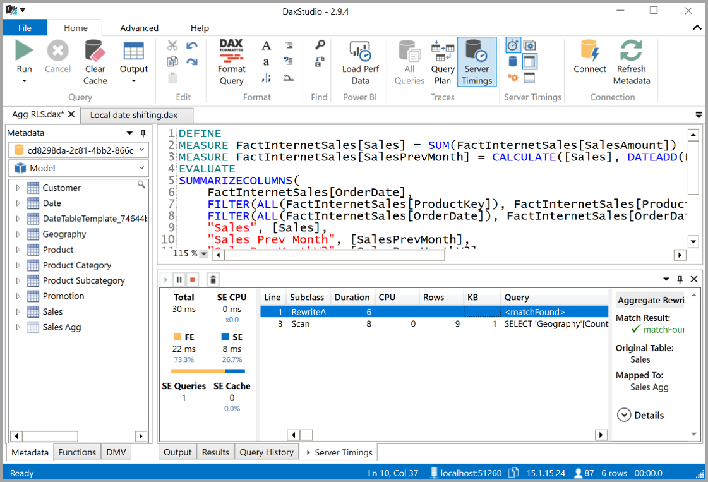

# <a name="using-external-tools-in-power-bi-desktop-preview"></a>在 Power BI Desktop 中使用外部工具 (預覽)

從 2020 年 7 月版本的 Power BI Desktop 開始，您可以使用外部工具為 Power BI Desktop 提供額外的功能與價值。 對外部工具的支援讓您能夠利用適用於 BI 專業人員的大量 Analysis Services 社群工具，例如 DAX 查詢/運算式最佳化和撰寫，以及應用程式生命週期管理 (ALM)。

Power BI Desktop 中的 [外部工具] 功能區包含已安裝在電腦上，並已向 Power BI Desktop 註冊之外部工具的按鈕。 從 Power BI Desktop 啟動的外部工具會自動連線至作為 Power BI Desktop 一部分運作的 Analysis Services 引擎，為使用者提供順暢的體驗。

![Power BI Desktop 中的 [外部工具] 功能區](media/desktop-external-tools/desktop-external-tools-01.png)

這些精選外部工具包含下列各項，以及其安裝位置的連結。 每個外部工具皆由各自的工具作者所支援：

* [Tabular Editor](https://tabulareditor.com/)
* [DAX Studio](https://daxstudio.org)
* [ALM Toolkit](http://alm-toolkit.com)


下列各節說明外部工具支援的作業、Power BI Desktop 中包含的精選工具清單，以及如何註冊其他工具的指示。

## <a name="supported-write-operations"></a>支援的寫入作業

外部工具可以連線至 Power BI Desktop 資料集 (Analysis Services 模型) 來編輯下列物件。 不支援編輯 Power BI Desktop 範本 (PBIT) 檔案。

* [量值](/analysis-services/tabular-models/measures-ssas-tabular) \(部分機器翻譯\)，適用於計算
* [計算群組](/analysis-services/tabular-models/calculation-groups) \(部分機器翻譯\)，適用於計算複雜模型中的重複使用性
* [檢視方塊](/analysis-services/tabular-models/perspectives-ssas-tabular) \(部分機器翻譯\)，可定義資料集中繼資料的焦點性企業網域特定檢視

可能可以使用外部工具管理中繼資料翻譯，但此預覽版本目前不支援此功能。 如果目前使用者的地區設定是已翻譯的地區設定，則使用目前版本的 Power BI Desktop 編輯欄位清單中的物件將無法正常運作。 

所有[表格式物件模型](/analysis-services/tom/introduction-to-the-tabular-object-model-tom-in-analysis-services-amo) \(部分機器翻譯\) 資料集中繼資料都可以針對唯讀目的進行存取，但是在 Power BI Desktop Analysis Services 執行個體中，尚不支援編輯未涵蓋在[表格式物件模型](/analysis-services/tom/introduction-to-the-tabular-object-model-tom-in-analysis-services-amo) \(部分機器翻譯\) 文章所述之清單中的物件。


## <a name="featured-external-tools"></a>精選外部工具

下列開放原始碼的社群工具可與 Power BI Desktop 搭配使用。 這些外部工具皆由各自的工具作者所支援。 每個工具的個別安裝程式都會在安裝時向 Power BI Desktop 註冊該工具：

* Tabular Editor
* DAX Studio
* ALM 工具組

讓我們依序看看每個工具。

### <a name="tabular-editor"></a>Tabular Editor

您可以從下列連結安裝 [Tabular Editor](https://tabulareditor.com/) \(英文\)：[Tabular Editor 網站](https://tabulareditor.com/) \(英文\)

Tabular Editor 可讓 BI 專業人員使用直覺且輕量的編輯器，輕鬆地建置、維護及管理表格式模型。 階層式檢視會顯示您表格式模型中的所有物件，其會依顯示資料夾來組織，且可支援複選屬性編輯與 DAX 語法醒目提示。


Tabular Editor 的原始程式碼可以在下列 GitHub 存放庫中找到：[GitHub 上的 Tabular Editor](https://github.com/otykier/TabularEditor) \(英文\)

Tabular Editor 的主要工具作者是 [Daniel Otykier](https://www.linkedin.com/in/daniel-otykier-2231876)。


### <a name="dax-studio"></a>DAX Studio

您可以從下列連結安裝 [DAX Studio](https://daxstudio.org) \(英文\)：[DAX Studio 網站](https://daxstudio.org) \(英文\)

DAX Studio 以作為適用於 DAX 撰寫、診斷、效能調整和分析的完整工具而聞名。 其功能包括物件瀏覽、整合式追蹤、具有詳細統計資料的查詢執行明細、DAX 語法醒目提示與格式設定。 下圖顯示 Dax Studio 畫面。 



DAX Studio 的原始程式碼可在下列 GitHub 存放庫中找到：[GitHub 上的 DAX Studio](https://github.com/DaxStudio/DaxStudio) \(英文\)

DAX Studio 的主要工具作者是 [Darren Gosbell](https://www.linkedin.com/in/darrengosbell)。

### <a name="alm-toolkit"></a>ALM 工具組

您可以從下列連結安裝 [ALM Toolkit](http://alm-toolkit.com) \(英文\)：[ALM Toolkit 網站](http://alm-toolkit.com) \(英文\)

ALM Toolkit 是適用於 Power BI 資料集的結構描述比較工具，用於應用程式生命週期管理 (ALM) 案例。 您可以使用 ALM Toolkit 來執行直覺的跨環境部署，並保留累加式重新整理歷程記錄資料。 利用 ALM Toolkit，您可以針對中繼資料檔案、分支與存放庫進行差異比對及合併。 您也可以在資料集之間重複使用一般定義。


ALM Toolkit 的原始程式碼可在下列 GitHub 存放庫中找到：[GitHub 上的 ALM Toolkit](https://github.com/microsoft/analysis-services) \(英文\)

ALM Toolkit 的主要工具作者是 [Christian Wade](https://www.linkedin.com/in/christianwade1)。


## <a name="how-to-register-external-tools"></a>如何註冊外部工具

若要向 Power BI Desktop 註冊其他外部工具，請建立包含下列內容的 JSON 檔案：

```json
{
    "name": "<tool name>",
    "description": "<tool description>",
    "path": "<tool executable path>",
    "arguments": "<optional command line arguments>",
    "iconData": "image/png;base64,<encoded png icon data>"
}
```

下列清單描述 JSON 檔案中的元素清單：
 
* **name:** 提供工具的名稱，這會在 Power BI Desktop 內的 [外部工具] 功能區中顯示為按鈕標題。
* **description：** (選擇性) 提供描述，這會在 Power BI Desktop 內的 [外部工具] 功能區按鈕上顯示為工具提示。
* **path：** 提供工具可執行檔的完整路徑。
* **arguments：** (選擇性) 提供應和工具可執行檔一起啟動的命令列引數字串。 您可以使用下列任何預留位置：
    * **%server%：** 針對匯入/DirectQuery 資料模型，以 Analysis Services 表格式本機執行個體的伺服器名稱與連接埠號碼取代。
    * **%database%：** 針對匯入/DirectQuery 資料模型，以 Analysis Services 表格式本機執行個體中裝載之模型的資料庫名稱取代。
* **iconData：** 提供影像資料，這會在 Power BI Desktop 內的 [外部工具] 功能區中呈現為按鈕圖示。 字串應該根據資料 URI 的語法來格式化，且不含 "data:" 前置詞。
 
將檔案命名為 `"<tool name>.pbitool.json"`，並將其放在下列資料夾中：

* `%commonprogramfiles%\Microsoft Shared\Power BI Desktop\External Tools`

針對 64 位元環境，請將檔案放在下列資料夾中：

* **Program Files (x86)\Common Files\Microsoft Shared\Power BI Desktop\External Tools**

啟動時，Power BI Desktop 將會載入該指定位置中副檔名為 **.pbitool.json** 的檔案。

## <a name="disabling-external-tools-using-the-registry"></a>使用登錄停用外部工具

您可使用 [群組原則] 或編輯登錄來停用外部工具，此動作與停用 [自訂視覺效果] 的程序類似。

* 登錄機碼：*Software\Policies\Microsoft\Power BI Desktop\\*

* 登錄值：*EnableExternalTools*

值為 1 (十進位) 則可使用 Power BI 中的外部工具 (此為預設值)。

值為 0 (十進位) 則無法使用 Power BI 中的外部工具。


## <a name="next-steps"></a>後續步驟

您可能也會對下列文章感興趣：

* [在 Power BI Desktop 報表中使用跨報表鑽研](desktop-cross-report-drill-through.md)
* [使用 Power BI Desktop 交叉分析篩選器](../visuals/power-bi-visualization-slicers.md)