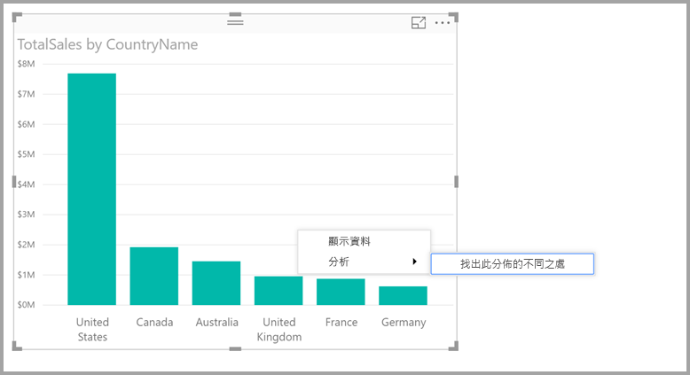

# 套用 Power BI Desktop 中的見解以找出分佈的不同之處 (預覽)

在視覺效果中，您經常會看到資料點，並想知道不同類別的分佈是否會相同。 使用 **Power BI Desktop** 中的**見解**，只要按幾下就能查明。

假設下列視覺效果依「國家/地區」  顯示「總銷售額」  。 如圖表所示，銷售額大部分來自美國，佔總銷售額的 57%，而來自其他國家/地區的比重則相對較少。 在此情況下，探索不同子母體擴展中是否會看到相同的分佈通常會很有趣。 例如，這在所有年份、所有銷售管道及所有產品類別是否都相同？  雖然您可以套用不同的篩選並以視覺方式比較結果，但這樣做可能相當耗時且容易出錯。 

您可以要求 **Power BI Desktop** 找出分佈的不同之處，並取得快速、自動化、具洞察力的資料分析。 只要以滑鼠右鍵按一下資料點，然後選取 [分析] > [找出此分佈的不同之處]  ，即會以易於使用的視窗形式將見解傳遞給您。

在此範例中，自動化分析會快速顯示「旅行車」  在美國和加拿大的銷售額比例較低，而來自其他國家/地區的比例則較高。   

> [!NOTE]
> 這項功能目前處於預覽狀態，並可能有所變更。 自 2017 年 9 月起的 **Power BI Desktop** 版本開始，深入解析功能即預設為啟用 (您不需要勾選 [預覽] 方塊即可啟用)。
> 
> 

## 使用深入解析
若要使用見解找出圖表中所顯示分佈的不同之處，只要以滑鼠右鍵按一下任何資料點 (或整個視覺效果)，然後選取 [分析] > [找出此分佈的不同之處]  。

**Power BI Desktop** 即會對這項資料執行機器學習演算法，並於視窗中填入視覺效果與描述，以說明哪些類別 (資料行) 及這些資料行的哪些值會導致最顯著不同的分佈。 這些見解會以直條圖形式提供，如下圖所示。 

套用了所選篩選的值會使用一般預設色彩顯示。 整體值 (如原始起始視覺效果所示) 會以灰色顯示以便比較。 最多可包含三個不同的篩選 (在此範例中為「旅行車」  、「登山車」  、「公路車」  )，按一下即可選擇不同的篩選 (或按住 ctrl 鍵再按一下滑鼠來選取多個)。

針對簡單加總量值 (例如此範例中的「總銷售額」  )，則會依據相對值 (而不是絕對值) 來進行比較。 因此，雖然「旅行車」的銷售額低於所有類別的總銷售額，但視覺效果預設會使用雙軸，允許比較不同國家/地區之間「旅行車」與所有自行車類別的銷售額比例。  開關視覺效果下方的切換按鈕可讓兩個值顯示在同一個軸上，以輕鬆比較絕對值 (如下圖所示)。    

描述性文字也會提供一些指示，根據符合篩選的記錄數目，指出可能附加至篩選值的重要性層級。 因此在此範例中，您可以看到雖然「旅行車」  的分佈可能明顯不同，但僅佔記錄的 16.6%。

頁面頂端有「喜歡」  和「不喜歡」  圖示，可讓您提供視覺效果和功能的意見反應。 這樣做會提供意見反應，但目前不會定型演算法來影響下次使用此功能時所傳回的結果。

值得注意的是，視覺效果頂端的 **+** 按鈕可讓您將選取的視覺效果新增至報表，就像您手動建立視覺效果一樣。 然後，您可以設定新增視覺效果的格式或進行調整，方法即如您在報表上對任何其他視覺效果的操作。 在 **Power BI Desktop** 中編輯報表時，您只能新增選取的深入解析視覺效果。

當報表在閱讀模式或編輯模式中時，您都可以使用深入解析，讓分析資料與建立可輕鬆新增至報表之視覺效果的作業更加多元。

## 所傳回結果的詳細資料
您可以將此演算法想成擷取模型中的所有其他資料行，並針對這些資料行的所有值，將其當做篩選套用至原始視覺效果，然後找出這些篩選值當中哪些會產生與原始視覺效果最「不同」  的結果。

您可能想知道「不同」  所代表的意思。 例如，假設美國與加拿大之間的整體銷售額分割如下：

|國家/地區  |銷售額 (百萬元美金)|
|---------|----------|
|美國      |15        |
|Canada   |5         |

針對「公路車」  產品類別，銷售額分割可能如下：

|國家/地區  |銷售額 (百萬元美金)|
|---------|----------|
|美國      |3        |
|Canada   |1         |

雖然上述每個表格的數字不同，但美國與加拿大之間的相對值則完全相同 (佔整體 75% 和 25%，後者表示「公路車」)。 因此，兩者並無不同。 針對這類簡單加總量值，演算法會尋找「相對」  值中的差異。  

相較之下，請考慮利潤等量值，這會以收益/成本來計算，並假設美國與加拿大的整體利潤如下

|國家/地區  |利潤 (%)|
|---------|----------|
|美國      |15        |
|Canada   |5         |

針對「公路車」  產品類別，銷售額分割可能如下：

|國家/地區  |利潤 (%)|
|---------|----------|
|美國      |3        |
|Canada   |1         |

根據這類量值的本質，這「會」  視為相當不同。 因此，針對非加總量值 (例如此利潤範例)，演算法會尋找絕對值中的差異。

因此，顯示的視覺效果是為了清楚顯示整體分佈 (如原始視覺效果所示) 與套用特定篩選的值之間發現的差異。  

因此，針對加總量值 (例如前一個範例中的「銷售額」  )，會使用直條圖和折線圖，其中使用雙軸和適當的縮放比例，以便輕鬆比較相對值。 直條圖顯示套用篩選的值，而折線圖顯示整體值 (直條圖座標軸在左側，折線圖座標軸在右側，如往常一樣)。 此線條是使用「階梯狀」  樣式顯示，其中包含虛線，並填入灰色。 在前一個範例中，如果直條圖座標軸最大值為 4，而折線圖座標軸最大值為 20，它可讓您輕鬆比較美國與加拿大之間已篩選和整體值的相對值。 

同樣地，針對非加總量值 (例如前一個範例中的「利潤」  )，會使用直條圖和折線圖，其中使用單軸表示可輕鬆比較絕對值。 再次重申，折線圖 (填滿灰色) 會顯示整體值。 是否比較實際或相對數字，決定兩個分佈的不同程度不只是計算值的差異。 範例︰

* 套用至整體母體擴展的較小比例時，會將母體擴展大小列入考量，因為差異較不具統計顯著性且較不相關。 例如，某個特定產品在不同國家/地區之間的銷售額分佈可能非常不同，如果有數千個產品則會視為不相關，因此該特定產品只會佔整體銷售額的很小比例。

* 這些類別的差異若原始值很高或非常接近零，則其加權會比其他類別高。 例如，如果某個國家/地區僅佔銷售額的 1%，但針對某個特定類型的產品則佔 6%，則相較於其比重從 50% 變更為 55% 的國家/地區，該國家/地區會更具統計顯著性，因此會視為更相關。 

* 採用各種不同的啟發學習法來選取最有意義的結果，例如考慮資料之間的其他關聯性。
     
查看不同的資料行及每個資料行的值之後，會選擇差異最大的一組值。 為了方便了解，這些值會接著依資料行分組輸出，值差異最大的資料行會先列出。 每個資料行最多會顯示三個值，但如果影響很大的值不到三個，或如果某些值比其他值更具影響力，則可能顯示較少的值。 

在可用時間內，不一定會查看模型中的所有資料行，因此不保證會顯示最具影響力的資料行和值。 不過，會採用各種不同的啟發學習法，以確保先檢查最可能的資料行。 例如，假設在查看所有資料行之後，判斷下列資料行/值對分佈的影響最大，則從最具影響力到最不具影響力：

    Subcategory = Touring Bikes
    Channel = Direct
    Subcategory = Mountain Bikes
    Subcategory = Road Bikes
    Subcategory = Kids Bikes
    Channel = Store

這些會依資料行順序輸出，如下所示：

    Subcategory: Touring Bikes, Mountain Bikes, Road Bikes (only three listed, with the text including “...amongst others” to indicate that more than three have a significant impact) 

    Channel = Direct (only Direct listed, if it’s level of impact was much greater than Store)

## 考量與限制
下列清單是目前「深入解析」  不支援的案例集合：

* TopN 篩選
* 量值篩選
* 非數字量值
* 使用「顯示值為」
* 篩選的量值 - 所篩選量值為已套用特定篩選的視覺效果層級計算 (例如「法國總銷售額」  )，並用於見解功能所建立的其中一些視覺效果

此外，深入解析目前不支援下列模型類型和資料來源：

* DirectQuery
* Live connect
* 內部部署的 Reporting Services
* 內嵌

## 後續步驟
如需 **Power BI Desktop** 的詳細資訊，以及如何開始使用，請參閱下列文章。

* [Power BI Desktop 是什麼？](../fundamentals/desktop-what-is-desktop.md)
* [Power BI Desktop 的查詢概觀](../transform-model/desktop-query-overview.md)
* [Power BI Desktop 中的資料來源](../connect-data/desktop-data-sources.md)
* [連接至 Power BI Desktop 中的資料](../connect-data/desktop-connect-to-data.md)
* [使用 Power BI Desktop 合併資料並使其成形](../connect-data/desktop-shape-and-combine-data.md)
* [Power BI Desktop 中的常見查詢工作](../transform-model/desktop-common-query-tasks.md)   
