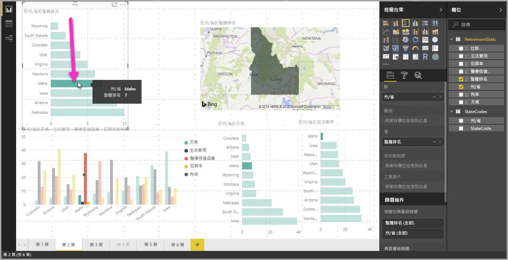
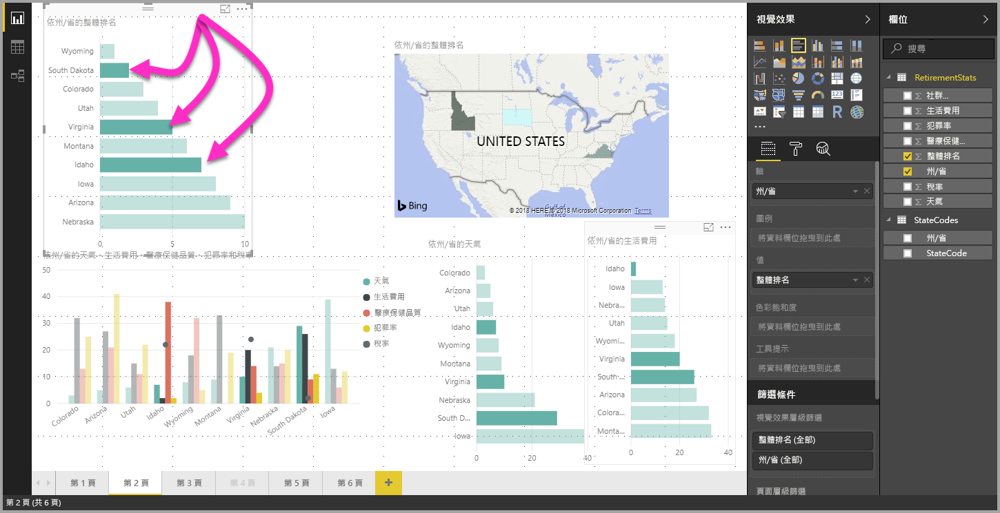

# 在 Power BI Desktop 中多重選取資料元素、資料點與視覺效果

您可以使用 Power BI Desktop，選取一個視覺效果中的多個資料元素、一個視覺效果中的多個資料點，或一份報表中的多個視覺效果。 下列各節將依序描述每項。

## 選取多個資料點

在 Power BI Desktop 中，只要按一下視覺效果中的資料點，就可以在指定視覺效果中將資料點醒目提示。 例如，如果您有重要的橫條圖或圖表元素，且您想要報告頁面上的其他視覺效果根據您的選取項目將資料醒目提示，您可以按一下某個視覺效果中的資料元素，並看到結果反映在頁面上的其他視覺效果中。 這是基本或單一選取醒目提示。 以下影像顯示基本醒目提示。 

使用多重選取時，您現在可以在 **Power BI Desktop** 報告頁面中選取超過一個的資料點，並跨頁面上的視覺效果將結果醒目提示。 這相當於 **and** 陳述式或功能，例如 "highlight results for Idaho **and** Virginia"。 若要多重選取視覺效果中的資料點，請使用 **CTRL+按一下** 來選取多個資料點。 下列影像顯示已選取 **多個資料點** (多重選取)。

這聽起來像是簡單的功能，但其開啟了在建立、共用報表及與之互動時的各種可能。 

## 使用矩形選取來選取多個元素 (預覽)

您可以使用矩形選取，來選取視覺效果中的多個資料元素或報表中的多個視覺效果，這通常也稱為「套索選取」。 

### 選取畫布上的多個視覺效果

透過在畫布上按一下並拖曳來建立矩形套索，以選取多個視覺效果與其他報表元素。 系統會選取完全落在套索內的所有視覺效果。 如果您按 *Ctrl* 或 *Shift* 鍵 (就像您按 Ctrl + 按一下個別視覺效果以進行多重選取)，進一步套索會將視覺效果選取項目新增至目前的多重選取。 

如果已經選取某個視覺效果並加以套索，則使用 *Ctrl* 或 *Shift* 會關閉該選取項目。 套索不會選取群組內的單一視覺效果，但可透過圍住整個群組來選取群組。

畫布不會隨著矩形套索選取項目自動捲動。 

### 選取一個視覺效果中的多個資料點

您可以使用相同的矩形套索步驟，在一個視覺效果中選取多個資料點。 按住 *Ctrl* 鍵時，在視覺效果中按一下並拖曳以選取多個資料點。 當您放開滑鼠按鍵時，即會選取與選取項目矩形重疊的所有點，而且也會保留任何先前的套索選取項目。 如果您在選取時使用 *Ctrl*，透過套索選取一個區域，以合併先前選取的點，則不會取消選取那些資料點 (已關閉)；使用套索的效果相同，並以 *Ctrl* 個別按一下每個點。 

當您在進行套索選取時使用 *Shift* 鍵，即會保留先前的選取項目，而已經選取的資料點會保持選取狀態。 因此，在執行套索選取時使用 *Shift*，只會將資料點新增至您的選取項目，而不會切換所選區域中的資料點。

您可以按一下繪圖區上的空白處，而不需按鍵盤按鍵，即可清除目前的選取項目。

如需此功能的詳細資訊，請參閱[有關此功能版本的部落格文章](https://powerbi.microsoft.com/blog/power-bi-desktop-august-2020-feature-summary/#_Data_point) \(英文\)。

在視覺效果內多重選取資料點有數個限制與考量：

* 折線圖、區域圖、散佈圖、樹狀圖及地圖均支援套索選取
* 您可以一次選取的資料點數目上限為 300 個
* 在 Power BI 服務中檢視報表時，只有當儲存並發佈報表時已啟用套索選取功能，才會啟用矩形選取

## 後續步驟

您可能也會對下列文章感興趣：

* [在 Power BI Desktop 報表中使用格線與貼齊格線](desktop-gridlines-snap-to-grid.md)
* [在 Power BI 報表中進行篩選和醒目提示的相關事項](power-bi-reports-filters-and-highlighting.md)

