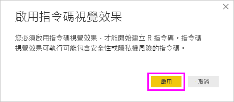
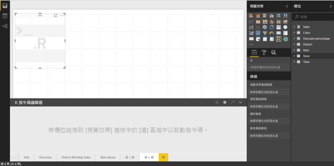
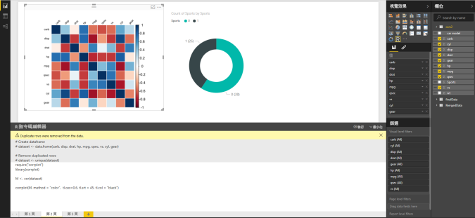
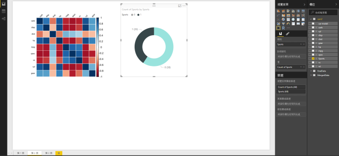
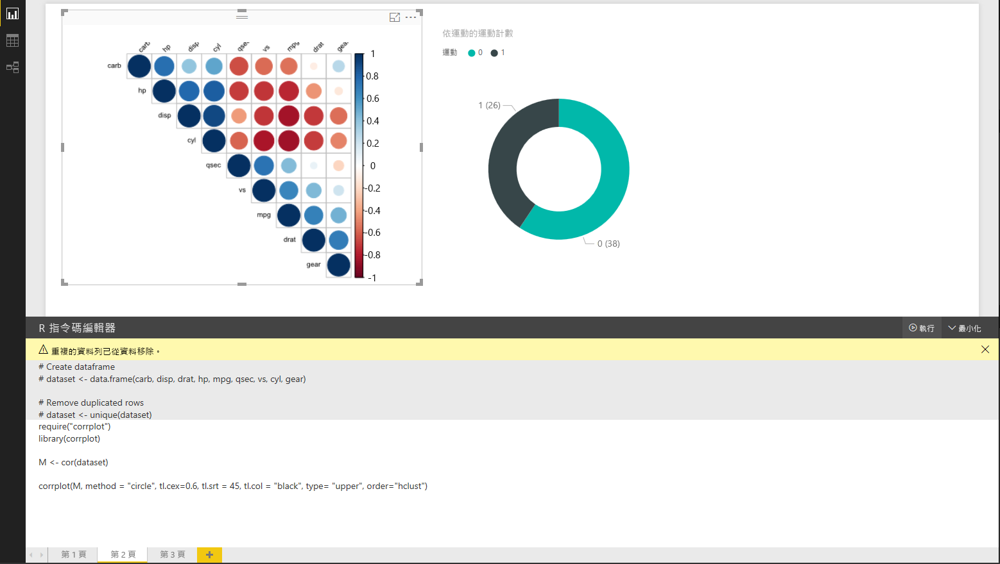

# <a name="create-power-bi-visuals-using-r"></a>使用 R 建立 Power BI 視覺效果
有了 Power BI Desktop，您可以使用 *R* 將資料視覺化。 [R](https://mran.revolutionanalytics.com/documents/what-is-r) 是用於統計資料計算和圖形的語言及環境。

## <a name="install-r"></a>安裝 R
根據預設，Power BI Desktop 不會包含、部署或安裝 R 引擎。 若要在 Power BI Desktop 中執行 R 指令碼，則必須在本機電腦上另外安裝 R。 您可以從許多位置免費下載並安裝 R，包括 [Revolution Open 下載頁面](https://mran.revolutionanalytics.com/download/)以及 [CRAN 存放庫](https://cran.r-project.org/bin/windows/base/)。 Power BI Desktop 目前版本的 R 指令碼支援安裝路徑中的 Unicode 字元和空格 (空白字元)。

## <a name="enable-r-visuals-in-power-bi-desktop"></a>在 Power BI Desktop 中啟用 R 視覺效果
安裝 R 之後，Power BI Desktop 會自動予以啟用。 若要確認 Power BI Desktop 已在正確的位置啟用 R，請遵循下列步驟： 

1. 從 Power BI Desktop 功能表中，選取 [檔案]   > [選項及設定]   > [選項]  。 

2. 在 [選項]  頁面左側的 [全域]  下，選取 [R 指令碼]  。 

3. 在 [R 指令碼選項]  下，確認已在 [偵測到的 R 主目錄]  中指定本機 R 安裝，且其正確反映您想要 Power BI Desktop 使用的本機 R 安裝。 在下圖中，R 的本機安裝路徑是 **C:\Program Files\R Open\R-3.5.3\\** 。
   
   ![[R 指令碼選項] 頁面](media/desktop-r-visuals/r-visuals-2.png)

確認 R 安裝之後，即可開始建立 R 視覺效果。

## <a name="create-r-visuals-in-power-bi-desktop"></a>在 Power BI Desktop 中建立 R 視覺效果
1. 在 [視覺效果]  窗格中選取 **R 視覺效果**圖示以新增 R 視覺效果。
   
   ![[視覺效果] 窗格中的 R 視覺效果圖示](media/desktop-r-visuals/r-visuals-3.png)

2. 在隨即顯示的 [啟用指令碼視覺效果]  視窗中，選取 [啟用]  。

   

   當您將 R 視覺效果新增至報表時，Power BI Desktop 會進行下列變更：
   
   - 報表畫布上會出現預留位置 R 視覺影像。
   
   - **R 指令碼編輯器**會隨即在中央窗格的底部顯示。
   
   

3. 在 [視覺效果]  窗格的 [值]  區段中，從 [欄位]  窗格拖曳想要在 R 指令碼中使用的欄位，就如同任何其他 Power BI Desktop 視覺效果一般。 或者，您也可以直接在 [欄位]  窗格中選取欄位。
    
    只有新增至 [值]  區段的欄位才可供 R 指令碼使用。 您在 [R 指令碼編輯器]  中使用 R 指令碼時，可以新增欄位，也可以從 [值]  區段移除不需要的欄位。 Power BI Desktop 會自動偵測已新增或移除哪些欄位。
   
   > [!NOTE]
   > R 視覺效果的預設彙總類型為「不摘要」  。
   > 
   > 
   
4. 現在您可以使用選取的資料來建立繪圖： 

    - 在選取欄位時，[R 指令碼編輯器]  會針對編輯器窗格上方灰色區段中的那些欄位，產生支援的 R 指令碼繫結程式碼。
    - 如果您移除欄位，則 [R 指令碼編輯器]  會自動移除該欄位的支援程式碼。
   
   在下圖所示的範例中，已選取三個欄位：hp、gear 以及 drat。 由於選取了這些欄位，R 指令碼編輯器會產生繫結程式碼，其摘要說明如下：
   
   * 建立稱為**資料集**的資料框架，該框架由使用者選取的不同欄位所組成。
   * 預設彙總為：[不摘要]  。
   * 類似於資料表視覺效果，欄位會進行分組，且重複的資料列只會出現一次。
   
   ![[R 指令碼編輯器] 的程式碼](media/desktop-r-visuals/r-visuals-5.png)
   
   > [!TIP]
   > 在某些情況下，您可能不想自動進行分組，或您希望所有的資料列都會顯示，包括重複項目在內。 在此情況下，請將索引欄位新增至資料集中，如此所有的資料列都將視為唯一，且不會進行分組。
   > 
   > 
   
   產生的資料框架名為**資料集**，且會根據所選資料行的各自名稱來加以存取。 例如，在 R 指令碼中新增 *dataset$gear* 即可存取 gear 欄位。 針對使用空格或特殊字元的欄位，使用單引號加以括住。

5. 由於資料框架會根據選取的欄位自動產生，因此您可以撰寫 R 指令碼，Power BI Desktop 會將其繪製到 R 預設裝置。 完成指令碼之後，請選取 [R 指令碼編輯器]  標題列右側的 [執行指令碼]  。
   
    選取 [執行指令碼]  後，Power BI Desktop 會識別繪製內容並將其呈現在畫布上。 因為此處理序會在本機的 R 安裝上執行，所以請確定已安裝必要的 R 套件。
   
   當下列任一種狀況發生時，Power BI Desktop 會重新繪製視覺效果：
   
   * 您從 [R 指令碼編輯器]  標題列選取 [執行指令碼]  。
   * 因資料重新整理、篩選或醒目提示而發生資料變更。

     下圖顯示相互關聯繪製程式碼的範例，其可繪製不同類型汽車屬性之間的相互關聯。

     

6. 若要取得更大的視覺效果檢視，您可以將 [R 指令碼編輯器]  最小化。 如同 Power BI Desktop 中的其他視覺效果，您可以在環狀圖視覺效果 (右側的圓形視覺效果) 中選取特定區段 (例如跑車)，藉此交叉篩選相互關聯繪製內容。

    

7. 修改 R 指令碼以自訂視覺效果，並透過將參數新增至繪製命令中，進而利用 R 的強大功能。

    原始的繪製命令如下：

    ```
    corrplot(M, method = "color",  tl.cex=0.6, tl.srt = 45, tl.col = "black")
    ```

    變更 R 指令碼，讓繪製命令如下所示：

    ```
    corrplot(M, method = "circle", tl.cex=0.6, tl.srt = 45, tl.col = "black", type= "upper", order="hclust")
    ```

    如此一來，R 視覺效果現在可繪製圓形、只會將上半部列入考量，以及重新排序叢集相互關聯屬性的矩陣。

    

    當執行會導致錯誤的 R 指令碼時，畫布上會顯示錯誤訊息，而不是 R 視覺效果繪製內容。 如需錯誤的詳細資訊，請從 R 視覺效果錯誤選取 [查看詳細資料]  。

    

## <a name="r-scripts-security"></a>R 指令碼安全性 
R 視覺效果是從 R 指令碼建立，其可能包含具有安全性或隱私權風險的程式碼。 初次嘗試檢視 R 視覺效果或與其互動時，使用者會看到安全性警告訊息。 請在信任作者與來源，或已檢閱並了解 R 指令碼之後，才啟用 R 視覺效果。


## <a name="known-limitations"></a>已知的限制
Power BI Desktop 中的 R 視覺效果有下列限制：

* 資料大小：R 視覺效果用於繪製的資料限制為 150,000 個資料列。 如果選取超過 150,000 個資料列，則只會使用前 150,000 個資料列，而且影像上會顯示訊息。

* 解析度：所有 R 視覺效果都會以 72 DPI 顯示。

* 繪圖裝置：僅支援繪圖至預設裝置。 

* 計算時間：如果 R 視覺效果計算時間超過五分鐘，則會造成逾時錯誤。

* 關聯性：如同其他 Power BI Desktop 視覺效果，如果選取來自不同資料表的資料欄位，而其之間沒有定義關聯性，即會發生錯誤。

* 重新整理：R 視覺效果會在資料更新、篩選及反白顯示時進行重新整理。 不過，影像本身不是互動式，因此不得為交叉篩選的來源。

* 醒目提示：如果您醒目提示其他視覺效果，則 R 視覺效果會回應，但您不能選取 R 視覺效果中的項目來交叉篩選其他項目。

* 顯示裝置：只有繪製到 R 預設顯示裝置的繪圖才會在畫布上正確顯示。 避免明確地使用不同的 R 顯示裝置。

* 資料行重新命名：R 視覺效果不支援重新命名輸入資料行。 在指令碼執行期間，資料行會以其原始名稱來參考。

* RRO 安裝：在此版本中，32 位元版本的 Power BI Desktop 不會自動識別 RRO 安裝；您必須在 [選項及設定]   > [選項]   > [R 指令碼]  中手動提供 R 安裝目錄的路徑。

## <a name="next-steps"></a>後續步驟
如需 Power BI 中的 R 詳細資訊，請參閱下列文章：

* [在 Power BI Desktop 中執行 R 指令碼](../connect-data/desktop-r-scripts.md)
* [在 Power BI 使用外部 R IDE](../connect-data/desktop-r-ide.md)
