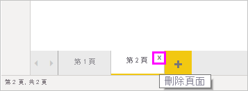
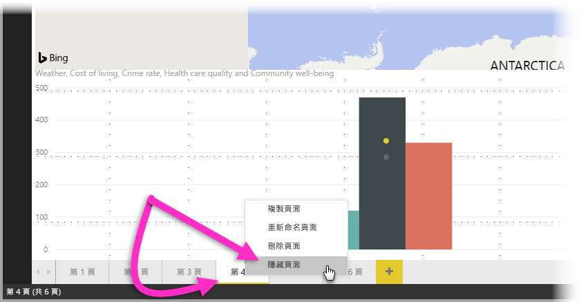
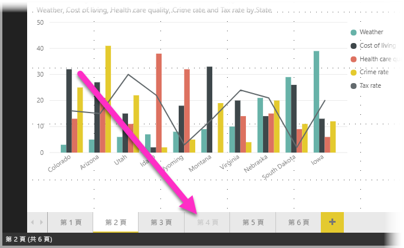

# 使用 Power BI Desktop 中的報表檢視

若您已在使用 Power BI，就會知道建立報表提供動態檢視方塊及資料的見解有多容易。 Power BI Desktop 提供更多進階的 Power BI 功能。 使用 Power BI Desktop，您可以建立進階查詢、混用來自多種來源的資料、建立資料表之間的關聯性等等。

Power BI Desktop 包含「報表檢視」  ，可讓您從中建立包含視覺效果的任意數目報表頁面。 Power BI Desktop 中的報表檢視提供與 *Power BI 服務* 中的報表編輯檢視類似的設計體驗。 您可以在四處移動、複製及貼上、合併其中的視覺效果等等。

之間唯一的差別是使用 Power BI Desktop 時，您可以處理您的查詢及建立資料模型，讓資料在報表中能夠提供最透徹的深入剖析資訊。 您可以將 Power BI Desktop 檔案儲存在任何位置，無論是本機磁碟機或雲端。

## 讓我們一起來看看！

當您第一次在 Power BI Desktop 中載入資料時，會看到具有空白畫布的報表檢視，其中含有可協助您將資料新增至報表的連結。

您只需要選取左導覽窗格中的圖示，就能在 [報表]  檢視、[資料]  檢視與 [關聯性]  檢視之間切換：

![[報表檢視] 圖示](media/desktop-report-view/pbi_reportviewinpbidesigner_changeview.png)

當您加入一些資料之後，可以在畫布中新增一些視覺效果的欄位。

![從 [欄位] 窗格拖曳來加入視覺效果](media/desktop-report-view/pbid_reportview_addvis.gif)

若要變更視覺效果的類型，您可以在畫布上加以選取，然後在 [視覺效果]  中選取新的類型。

> [!TIP]
> 請務必嘗試各種不同視覺效果類型。 您的視覺效果必須能夠清楚傳達資料中的資訊。

報表至少會提供一個空白頁面讓您開始。 頁面會出現在畫布左側的導覽窗格中。 您可以在頁面中加入各種視覺效果，但請注意不要過量。 在頁面上加入太多的視覺效果，反而會讓頁面看起來十分零亂而不利尋找到正確的資訊。 您可以新增頁面至報表。 只要按一下功能區上的 [新增頁面]  即可。

![[新增頁面] 圖示](media/desktop-report-view/pbidesignerreportviewnewpage.png)

若要刪除頁面，只要在 [報表] 檢視的底部，按一下頁面索引標籤上的 **X** 即可。

> [!NOTE]
> Power BI Desktop 的報表與視覺效果無法釘選到儀表板。 若要達到此目的，您必須發佈到您的 Power BI 網站。 如需詳細資訊，請參閱[從 Power BI Desktop 發佈資料集和報表](desktop-upload-desktop-files.md)

## 在報表之間複製並貼上

您可以輕鬆地複製某個 Power BI Desktop 報表中的視覺效果，並將其貼到另一個報表。 只要使用 Ctrl + C 鍵盤快速鍵來複製報表視覺效果即可。 在其他 Power BI Desktop 報表中，使用 Ctrl + V 將視覺效果貼入另一個報表。 您可以一次選擇一個視覺效果，或是選擇頁面上想要複製的所有視覺效果，然後貼到目的地 Power BI Desktop 報表中。

複製並貼上視覺效果的功能，很適合經常會建置及更新多個報表的人員使用。 在檔案之間進行複製時，原先在格式設定窗格中明確設定的設定及格式都會被帶過去，而仰賴某個佈景主題或預設設定的視覺效果元素則會更新以符合目的地報表的佈景主題。 因此，當您將某個視覺效果的格式和外觀調整成所需的模樣之後，便可以將該視覺效果複製到新的報表中，並保留您先前在格式設定上花費的所有心力。

如果模型中的欄位是不同的，您將會在視覺效果上看見錯誤，以及關於有哪些欄位不存在的警告。 該錯誤和您在刪除某個視覺效果正在使用的欄位時所見到的情況類似。

若要修正該錯誤，請將以來自您貼上視覺效果之報表中的模型，且想要使用的欄位，取代有問題的欄位。 如果您是使用自訂視覺效果，則也必須將該自訂視覺效果匯入至目的地報表。

## 隱藏報表頁面

當您建立報表時，您也可以隱藏報表的頁面。 如果您需要在報表中建立底層資料或視覺效果，但是不希望其他人可以看見這些頁面 (例如，當您建立的資料表或支援的視覺效果會用於其他報表頁面時)，這個方法會很有幫助。 還有其他各式各樣的原因，讓您想要建立報表頁面，但是要從發行的報表中隱藏這些報表頁面。

隱藏報表頁面很簡單。 只要以滑鼠右鍵按一下報表頁面索引標籤，並從顯示的功能表中選取 [隱藏]  。

隱藏報表頁面時，有幾個需要謹記在心的考量：

* 當您在 Power BI Desktop 中時，仍然可以看見隱藏的報表檢視，即使頁面的標題會變成灰色。在下圖中，第 4 頁已隱藏。

    

* 在 Power BI 服務中檢視報表時，您無法  看到隱藏的報表頁面。

* 隱藏報表頁面並非  安全性措施。 頁面仍然可由使用者存取，且其內容仍然可以透過鑽研和其他方法來存取。

* 當頁面隱藏時，在 [檢視] 模式中不會顯示檢視模式瀏覽箭號。
