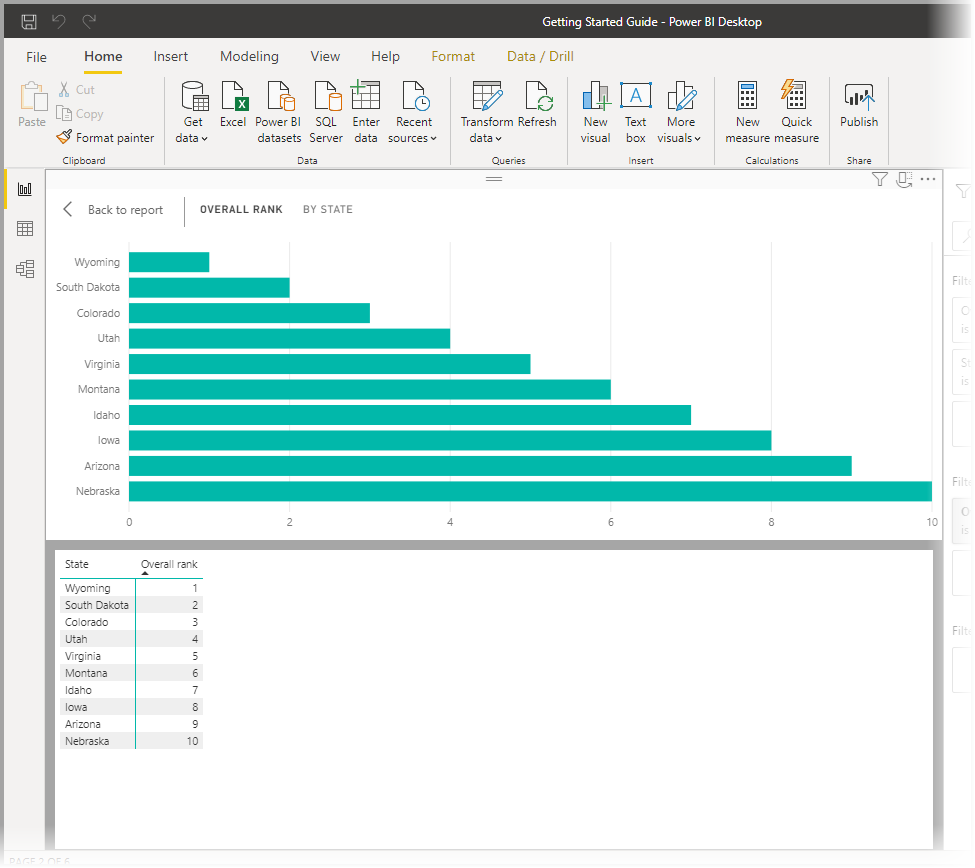
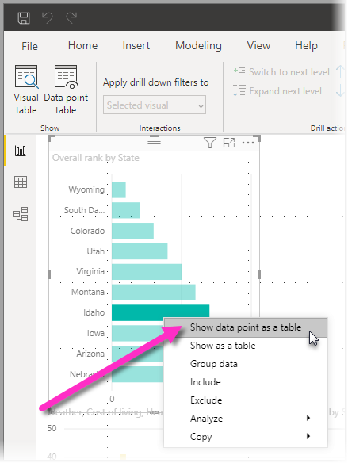

# 使用 Power BI Desktop 中的視覺效果資料表和資料點資料表
在 **Power BI Desktop** 中，您可以向下鑽研到視覺效果的詳細資料，並查看所選視覺效果基底資料的文字表示或個別資料記錄。 這些功能有時稱為「按一下」，或「鑽研」或「鑽研到詳細資料」。

您可使用 [視覺效果資料表] 將視覺效果中的資料視為資料表來檢視，或使用 [資料點資料表] 來檢視用來計算單一資料點的資料表。 

>[!IMPORTANT]
>[視覺效果資料表] 和 [資料點資料表] 僅支援下列視覺效果類型：
>  - 橫條圖
>  - 直條圖
>  - 環圈圖
>  - 區域分布圖
>  - 漏斗圖
>  - 地圖
>  - 圓形圖
>  - 樹狀圖

## 使用 Power BI Desktop 中的視覺效果資料表

[視覺效果資料表] 會顯示視覺效果的基礎資料。 [視覺效果資料表] 會在已選取視覺效果時，顯示在功能區 [顯示] 區段的 [資料/鑽研] 索引標籤中。

若要檢視資料，您也可以滑鼠右鍵按一下視覺效果，然後從顯示的功能表選取 [顯示資料]，或選取視覺效果右上角的 [更多選項] (...)，然後選取 [顯示為資料表]。

![按一下滑鼠右鍵的 [顯示資料]](media/desktop-see-data-see-records/visual-table-02.png)&nbsp;&nbsp;![更多選項的 [顯示資料]](media/desktop-see-data-see-records/visual-table-03.png)

> [!NOTE]
> 您的滑鼠必須在視覺效果的資料點暫留，才能使用右鍵功能表。

當選取 [視覺效果資料表] 或 [資料點資料表] 時，Power BI Desktop 畫布會同時顯示資料的視覺效果和文字表示。 在「水平檢視」中，視覺效果顯示在畫布的上半部，而資料顯示在下半部。 

您可以選取畫布右上角的圖示，以在水平檢視和「垂直檢視」之間切換。

若要回到報表，請選取畫布左上角的 [< 返回報表]。

## 使用 Power BI Desktop 中的資料點資料表

您也可以將焦點放在視覺效果中的一個資料記錄，然後鑽研到它背後的資料。 若要使用 [資料點資料表]，請選取視覺效果，然後選取功能區 [視覺效果工具] 區段中 [資料/鑽研] 索引標籤的 [資料點資料表]，然後選取視覺效果上的資料點或資料列。 

> [!NOTE]
> 如果功能區中的 [資料點資料表] 按鈕已停用且呈灰色，即表示所選取的視覺效果不支援 [資料點資料表]。

您也可以滑鼠右鍵按一下資料項目，並從顯示的功能表中選取 [資料點資料表]。

當選取資料項目的 [資料點資料表] 時，Power BI Desktop 畫布會顯示與所選項目建立關聯的所有資料。 

若要回到報表，請選取畫布左上角的 [< 返回報表]。

> [!NOTE]
>[資料點資料表] 有下列限制：
> - 您無法在 [資料點資料表] 檢視中變更資料並將其儲存回報表。
> - 當視覺效果使用導出量值時，即無法使用 [資料點資料表]。
> - 當連接到即時多維度模型 (MD) 時，即無法使用 [資料點資料表]。

## 後續步驟
**Power BI Desktop** 有各種報表格式和資料管理功能。 請查看下列資源以取得一些範例︰

* [在 Power BI Desktop 中使用群組和收納](desktop-grouping-and-binning.md)
* [在 Power BI Desktop 報表中使用格線、貼齊格線、堆疊順序、對齊及相等間距](desktop-gridlines-snap-to-grid.md)

