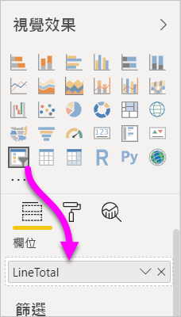
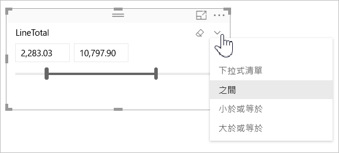

# 在 Power BI 中使用數值範圍的交叉分析篩選器

[!INCLUDE [applies-to](../includes/applies-to.md)] [!INCLUDE [yes-desktop](../includes/yes-desktop.md)] [!INCLUDE [yes-service](../includes/yes-service.md)]

透過數值範圍交叉分析篩選器，您可以將各式各樣的篩選器套用至資料模型中的任何數值資料行。 您有三種篩選數值資料的選項：在數字之間、小於或等於數字，或是大於或等於數字。 這項簡單技巧是篩選資料的有效方式。

## 影片

在這段影片中，Will 會逐步解說如何建立數值範圍交叉分析篩選器。

> [!NOTE]
> 這部影片使用舊版的 Power BI Desktop。

<iframe width="560" height="315" src="https://www.youtube.com/embed/zIZPA0UrJyA" frameborder="0" allowfullscreen></iframe> 

## 新增數值範圍交叉分析篩選器

您可以使用數值範圍交叉分析篩選器，其方式就跟您使用其他任何交叉分析篩選器時相同。 只需要建立報表的 [交叉分析篩選器]  視覺效果，然後選取一個數值作為 [欄位]  值即可。 在下圖中，我們選取了 [LineTotal]  欄位。

選取數值範圍交叉分析篩選器右上角的向下鍵，即會出現一個功能表。

針對數值範圍，您可以從下列三個選項中進行選取：

* **介於**
* **小於或等於**
* **大於或等於**

當您從功能表選取 [介於]  時，隨即會出現一個滑桿。 您可以使用滑桿來選取介於數字之間的數值。 有時候細微地移動交叉分析篩選器列會讓您難以瞄準特定的數字。 您也可以使用滑桿和選取其中一個方塊來鍵入您想要的值。 此選項在您希望於特定數字上進行交叉分析篩選時非常方便。

在下圖中，會針對範圍介於 2500.00 到 6000.00 之間的 [LineTotal]  值篩選報表頁面。

![數字範圍交叉分析篩選器與 [之間]](media/desktop-slicer-numeric-range/desktop-slicer-numeric-range-3-between-range.png)

當您選取 [小於或等於]  時，滑桿軸的左控點 (下限值) 會消失，而我們只能調整滑桿軸的上限。 在下圖中，我們將滑動軸的上限設定為 5928.19。

![數字範圍交叉分析篩選器與 [小於]](media/desktop-slicer-numeric-range/desktop-slicer-numeric-range-4-less-than.png)

最後，若您選取 [大於或等於]  ，右側 (上限值) 滑桿軸控點便會消失。 您接著可以調整下限值，如下圖所示。 現在，只有 [LineTotal]  大於或等於 4902.99 的項目會顯示在報表頁面上視覺效果中。

![數字範圍交叉分析篩選器與 [大於]](media/desktop-slicer-numeric-range/desktop-slicer-numeric-range-5-greater-than.png)

## 使用數值範圍交叉分析篩選器貼齊至整數

若基礎欄位的資料類型是 *整數*，則數值範圍交叉分析篩選器會貼齊整數。 此功能可讓您的交叉分析篩選器完全對齊整數。 [小數]  欄位則可以讓您輸入或選取數字的分數。 在文字方塊中與欄位上設定的格式設定相符，雖然您可以鍵入或選取更多精確的數字。

## 日期範圍交叉分析篩選器顯示的格式化

當您使用交叉分析篩選器顯示或設定日期範圍時，日期會以 *簡短日期* 格式顯示。 使用者的瀏覽器或作業系統地區設定會決定日期格式。 因此，無論資料類型設定是針對基礎資料還是模型，它都會是顯示格式。

例如，您可以針對基礎資料類型具備完整日期格式。 在此情況下，像是 *dddd, MMMM d, yyyy* 這種日期格式，便會將其他視覺效果或或環境中的日期格式化為日期格式「2001 年 3 月 14 日星期三」  。 但在日期範圍交叉分析篩選器中，交叉分析篩選器中顯示的日期會是 *03/14/2001*。

在交叉分析篩選器顯示 [簡短日期] 格式，可確保字串的長度會在交叉分析篩選器內保持一致且精簡。

## 限制與考量

數值範圍交叉分析篩選器適用下列限制與考量：

* 數值範圍交叉分析篩選器會篩選資料中的每個基礎資料列，而不是任何彙總值。 例如，假設您使用 [銷售額]  欄位。 交叉分析篩選器便會根據銷售額篩選每個交易，而非視覺效果每個資料點的銷售額總和。
* 目前無法搭配量值使用。
* 您可以在數值交叉分析篩選器中鍵入任何數字，即使該數字超過基礎資料行中的值範圍也一樣。 若您知道資料未來可能會發生變更，此選項可讓您設定篩選條件。
* 日期範圍交叉分析篩選器允許任何日期值，即使這些值不存在於基礎日期資料行中也一樣。
