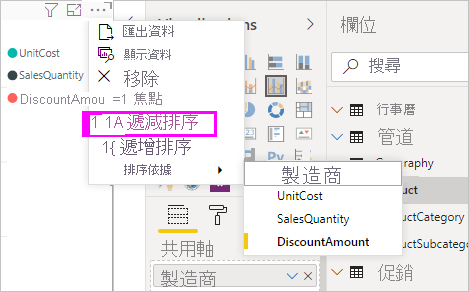
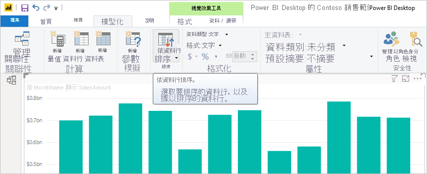

# Power BI Desktop 中的依資料行排序
在 Power BI Desktop 和 Power BI 服務中，您可以按不同資料欄位排序來變更視覺效果的外觀。 變更視覺效果的排序方式，即可反白顯示您想要傳達的資訊，並確定視覺效果反映出該趨勢 (或強調)。

無論您是使用數值資料 (例如銷售數據) 或文字資料 (如州/省名稱)，您都可以排序視覺效果，使其呈現所要的效果。 Power BI 提供更大的排序彈性以及快速功能表供您使用。 若要排序任何視覺效果，請依序選取其 [更多選項]  (...) 功能表和 [排序依據]  ，然後選取您要用來排序的欄位。

## 排序範例
讓我們使用階層較多的範例，並查看其在 Power BI Desktop 中的運作方式。

下列視覺效果會依製造商名稱顯示成本、數量和金額。 這是還沒進一步排序前的視覺效果：

視覺效果目前是依 [SalesQuantity]  資料行排序。 我們可以比對遞增列與圖例的色彩來判斷排序資料行，但還有一個更好的方法：[更多選項]  功能表，選取省略號 (...) 即可存取。

排序選項如下所示：

* 目前的排序欄位是 [SalesQuantity]  ，由前有黃色橫條的粗體 [SalesQuantity]  表示。 

* 目前的排序方向為遞增，如前有黃色橫條的粗體 [遞增排序]  所示。

我們會在接下來的兩節中探討排序欄位和排序方向。

## 選取要用來排序的資料行
您應已注意到 [更多選項]  功能表中 [SalesQuantity]  前的黃色橫條，這表示視覺效果依照 [SalesQuantity]  資料行排序。 按其他資料行排序也很容易：選取省略號 (...) 以顯示 [更多選項]  功能表，並依序選取 [排序依據]  和不同的資料行。

在下圖中，我們選取 [DiscountAmount]  作為排序資料行。 該資料行剛好是視覺效果的其中一條線，而非長條之一。 

請注意視覺效果的變化。 現在，這些值從 **DiscountAmount** 值最高的 Fabrikam Inc. 向下排序至最低值的 Northwind Traders。 

但是，如果我們要遞增排序，而不要遞減排序，那該怎麼做？ 下節示範這項操作有多麼容易。

## 選取排序次序
當仔細查看上個影像中的 [更多選項]  功能表時，我們會看到前有黃色橫條的粗體 [遞減排序]  。

選取 [遞減排序]  時，即表示視覺效果會按所選資料行，從最大值排到最小值。 想要更改嗎？ 沒問題，只要選取 [遞增排序]  ，所選資料行的排序次序就會變更為從最小值排到最大值。

這是變更 [DiscountAmount]  排序次序後的同一視覺效果。 請注意，Northwind Traders 現為列出的第一家製造商，而 Fabrikam Inc. 是最後一家，與之前的排序相反。

您可以使用視覺效果內的任何資料行排序：我們可輕鬆選取 [SalesQuantity]  作為排序依據的資料行，先顯示銷售量最高的製造商，但仍然保留視覺效果中套用至該製造商的其他資料行。 以下就來看看具有這些設定的視覺效果：

## 使用 [依資料行排序] 按鈕排序
還有另一個方法可排序您的資料，就是使用 [模型]  功能區中的 [依資料行排序]  按鈕。

這個排序方法會要求您先從 [欄位]  窗格選取排序資料行 (欄位)，然後選取 [模型]   > [依資料行排序]  排序視覺效果。 如不選取資料行，則 [依資料行排序]  按鈕無法使用。

讓我們看一個常見範例。 您有一年中每一個月的資料，而您想要根據時間順序排序這些資料。 下列步驟示範做法：

1. 請注意，當已選取視覺效果，但沒有在 [欄位]  窗格中選取任何資料行時，則 [依資料行排序]  按鈕無法使用 (灰色)。
   
   

2. 當我們選取要用來排序的資料行時，在 [欄位]  窗格中，[依資料行排序]  按鈕會變成使用中。
   
   
3. 接下來，選取視覺效果之後，我們可以選取 [MonthOfYear]  而非預設值 [MonthName]  ，視覺效果即會以我們想要的順序排序︰按每年月份排序。
   
   

<!---
This functionality is no longer active. Jan 2020

## Getting back to default column for sorting
You can sort by any column you'd like, but there may be times when you want the visual to return to its default sorting column. No problem. For a visual that has a sort column selected, open the **More options** menu and select that column again, and the visualization returns to its default sort column.

For example, here's our previous chart:

When we go back to the menu and select **SalesQuantity** again, the visual defaults to being ordered alphabetically by **Manufacturer**, as shown in the following image.

With so many options for sorting your visuals, creating just the chart or image you want is easy.
--->

## 後續步驟

您可能也會對下列文章感興趣：

* [在 Power BI Desktop 中使用跨報表鑽研](desktop-cross-report-drill-through.md)
* [Power BI 中的交叉分析篩選器](../visuals/power-bi-visualization-slicers.md)
