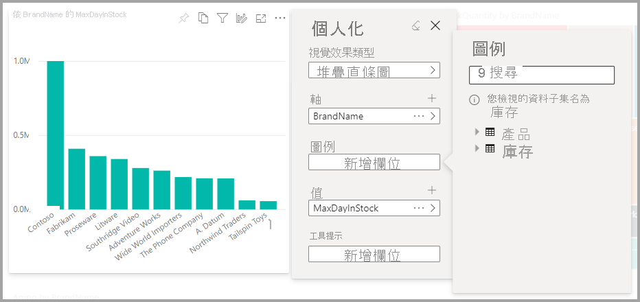
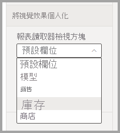

# 讓使用者個人化報表中的視覺效果

[!INCLUDE [applies-to](../includes/applies-to.md)] [!INCLUDE [yes-desktop](../includes/yes-desktop.md)] [!INCLUDE [yes-service](../includes/yes-service.md)]

當您與廣大的受眾共用報表時，某些使用者可能會想查看略有不同的特定視覺效果檢視。 這些使用者可能會想要切換軸上的內容、變更視覺效果類型，或將某些內容新增至工具提示中。 一個視覺效果不能滿足所有人的要求。 透過這個新功能，您可以讓商務使用者在報表閱讀檢視中探索及個人化視覺效果。 請者可以依自己想要的方式調整視覺效果，並將其儲存為書籤，以返回查看。 不需要有報表的編輯權限，也不用要求報表作者變更。

:::image type="content" source="media/power-bi-personalize-visuals/power-bi-personalize-visual.png" alt-text="個人化視覺效果":::
 
## 報表使用者可以變更的內容

此功能允許商務使用者透過臨機操作探索 Power BI 報表上的視覺效果，來獲取進一步見解。 若要了解如何以使用者身分使用此功能，請參閱[在報表中將視覺效果個人化](../consumer/end-user-personalize-visuals.md)。 此功能非常適合想讓報表讀者研究基本案例的報表建立者。 以下是報表讀者可以進行的修改：

- 變更視覺效果類型
- 切換量值或維度
- 新增或移除圖例
- 比較兩個或多個量值
- 變更彙總等等

這項功能不僅允許探索新功能。 其也包含可讓使用者擷取及共用其變更的方式：

- 擷取變更
- 共用變更
- 重設報表的所有變更
- 重設視覺效果的所有變更
- 清除最近的變更

## 使用檢視方塊獲得焦點更集中的檢視

使用個人化視覺效果，您可以用 **檢視方塊** 選擇模型子集，為您提供更能聚焦的檢視。 當您使用大型資料模型時，選擇子集可讓您專注於可管理的欄位子集，而不是用大型模型中的完整欄位集合讓報表讀者不知所措。 

使用檢視方塊時，請記住下列考量：

* 檢視方塊並非作為安全性機制使用，而是提供較佳使用者體驗的工具。 所有檢視方塊安全性，都是繼承自基礎模型。

* 表格式與多維度模型都支援檢視方塊。 然而，在多維度模型中，檢視方塊只能設定為和報表的基礎 Cube 一樣。

* 從模型中刪除檢視方塊之前，請務必檢查確認個人化視覺效果體驗未使用檢視方塊。 

若要使用檢視方塊，您必須為報表啟用個人化視覺效果。 您也必須建立至少一個檢視方塊，包括您希望使用者能與之互動的維度與量值，以獲得個人化視覺效果的體驗。

請使用 [Tabular Editor](https://tabulareditor.com/) 建立檢視方塊，您可以從下列位置下載：下載 Tabular Editor

在您安裝 **Tabular Editor** 之後，請在 **Power BI Desktop**  中開啟報表，並從功能區的 [外部工具] 索引標籤中啟動 **Tabular Editor**，如下圖所示。

![[外部工具] 功能區中的 Tabular Editor](media/power-bi-personalize-visuals/power-bi-personalize-perspective-02.png)

在 Tabular Editor 中，以滑鼠右鍵按一下 **Perspectives** 資料夾，以建立新的檢視方塊。

您可以按兩下文字，重新命名此檢視方塊。

接下來，在 Tabular Editor 中開啟 **Tables** 資料夾，以滑鼠右鍵按一下您想要在檢視方塊中顯示的欄位，將欄位新增至檢視方塊。

對每個要新增至檢視方塊的欄位，重複此流程。 您無法在某個檢視方塊中新增重複的欄位，所以任何已新增至檢視方塊的欄位都只能選擇新增為停用。

新增完所有想要的欄位之後，請務必在 Tabular Editor 與 Power BI Desktop 中都要儲存設定。

當您將新的檢視方塊儲存至模型，並儲存 Power BI Desktop 報表之後，請瀏覽至頁面的 [格式] 窗格，您會看到新的 **個人化視覺效果** 區段。

![[格式] 窗格中的個人化視覺效果區段](media/power-bi-personalize-visuals/power-bi-personalize-perspective-07.png)

將「報表讀者檢視方塊」的選取範圍一開始即設定為「預設欄位」。 選取下拉式箭號之後，就會看到您所建立的其他檢視方塊。

設定報表頁面的檢視方塊之後，該頁面的個人化視覺效果體驗即會篩選成選取的檢視方塊。 選取 [套用至所有頁面] 可讓您將檢視方塊設定套用至報表現有的所有頁面。

![選取 [套用至所有頁面]，以將檢視方塊套用至整份報表](media/power-bi-personalize-visuals/power-bi-personalize-perspective-09.png)

## 在報表中啟用個人化

您可以在 Power BI Desktop 或 Power BI 服務中啟用此功能。 您也可以在內嵌報表中加以啟用。

### 在 Power BI Desktop 中

若要在 Power BI Desktop 中啟用此功能，請前往 [檔案] > [選項及設定] > [選項] > [目前檔案] > [報表設定]。 確認已開啟 [個人化視覺效果]。

:::image type="content" source="media/power-bi-personalize-visuals/personalize-report-setting-desktop.png" alt-text="在報表中啟用個人化":::

### 在 Power BI 服務中

若要改在 Power BI 服務中啟用此功能，請前往您報表的 [設定]。

:::image type="content" source="media/power-bi-personalize-visuals/power-bi-report-service-settings-personalize-visual.png" alt-text="Power BI 服務中的報表設定":::

開啟 [個人化視覺效果] > [儲存]。

:::image type="content" source="media/power-bi-personalize-visuals/personalize-report-setting-service.png" alt-text="在服務中開啟個人化視覺效果":::

## 在頁面或視覺效果層級開啟或關閉此功能

當您為指定的報表啟用個人化視覺效果時，預設可將該報表中的所有視覺效果個人化。 若您不想將所有視覺效果個人化，則可針對每個頁面或每個視覺效果開啟或關閉設定。

### 每個頁面

選取頁面索引標籤 > 在 [視覺效果] 窗格中選取 [格式]。

:::image type="content" source="media/power-bi-personalize-visuals/personalize-page-level-setting.png" alt-text="針對頁面選取 [個人化視覺效果]。":::
 
滑動 [個人化視覺效果] >  [開啟] 或 [關閉]。

### 每個視覺效果

選取該視覺效果 > 選取 [視覺效果] 窗格中的 [格式] > 展開 [視覺效果標頭]。

:::image type="content" source="media/power-bi-personalize-visuals/power-bi-format-visual-header-personalize.png" alt-text="選取視覺效果標頭":::
 
滑動 [個人化視覺效果] >  [開啟] 或 [關閉]。

:::image type="content" source="media/power-bi-personalize-visuals/power-bi-format-visual-personalize-on-off.png" alt-text="個人化視覺效果":::

## 限制

此功能目前有一些要注意的限制。

- 此功能不支援發佈到 Web。
- 不會自動保存使用者的探索。 您需要將檢視儲存為個人書籤，才能擷取您的變更。
- 適用於 iOS 和 Android 平板電腦的 Power BI 行動裝置應用程式，以及 Power BI Windows 應用程式，都支援這項功能；手機的 Power BI 行動裝置應用程式不支援此功能。 但使用 Power BI 服務儲存在個人書籤中的任何視覺效果變更，都會呈現在所有 Power BI 行動裝置應用程式中。

## 後續步驟

[在報表中將視覺效果個人化](../consumer/end-user-personalize-visuals.md)。     

試試看新的視覺效果個人化體驗。 請在 [Power BI Ideas 網站](https://ideas.powerbi.com/forums/265200-power-bi)上，針對此功能及如何繼續改善此體驗，提供意見反應給我們。 

有其他問題嗎？ [試試 Power BI 社群](https://community.powerbi.com/)
