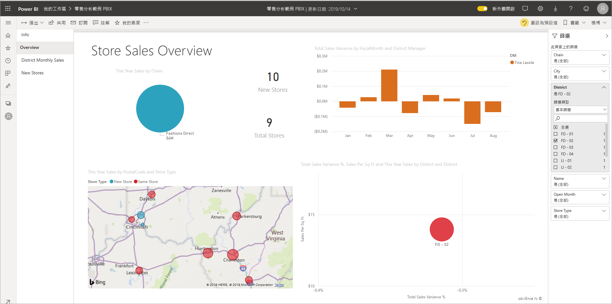
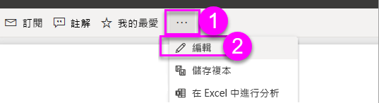
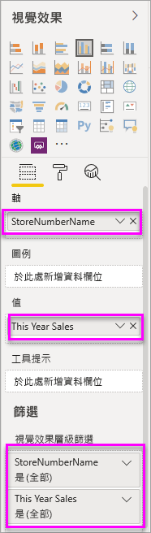

# 將篩選加入 Power BI 報表

本文說明如何在 Power BI 中將視覺效果篩選、頁面篩選或報表篩選新增至報表。 您必須能夠編輯報表以新增篩選。 本文中的範例位於 Power BI 服務，且在 Power BI Desktop 中的步驟幾乎相同。 正在尋找總覽嗎？ 先簽出 [Power BI 報表中的篩選和](power-bi-reports-filters-and-highlighting.md) 反白顯示。

Power BI 提供許多不同種類的篩選條件，從手動和自動到鑽研和傳遞。 閱讀[各種不同的篩選類型](power-bi-report-filter-types.md)。

加入篩選之後，您可以將 [Power BI 報表中的篩選器格式化](power-bi-report-filter.md) ，以查看並以您想要的方式採取動作。

## 編輯檢視或閱讀檢視中的篩選
您可以使用兩種不同的視圖來與報表互動：閱讀檢視和編輯檢視。 本文將說明如何在報表的 [編輯檢視]  中建立篩選。  如需 [閱讀檢視] 中篩選的資訊，請參閱[在報表的閱讀檢視中與篩選互動](../consumer/end-user-report-filter.md)。

因為篩選「可持續」  ，當您離開報表，Power BI 會保留篩選、交叉分析篩選器和您所做的其他資料檢視變更。 因此，當您返回報表時可以從先前離開的地方繼續。 如果您不想要讓篩選變更保持不變，請從頂端功能表列選取 [ **重設為預設值** ]。

:::image type="content" source="../consumer/media/end-user-report-filter/power-bi-reset-icon.png" alt-text="重設為預設圖示。":::

請記住，如果您是報表建立者，您與報表一起儲存的任何篩選都會變成所有報表讀取器的 *預設篩選狀態* 。 當他們選取 [ **重設為預設值**] 時，就會傳回它們。

## [篩選] 窗格中的篩選條件層級
無論您是使用 Power BI Desktop 或 Power BI 服務，[篩選] 窗格都會顯示在報表畫布的右側。 若未看見 [篩選] 窗格，請選取右上角的 ">" 圖示展開窗格。

您可以為報表設定三個不同層級的篩選：視覺效果層級、頁面層級和報表層級。 本文說明如何設定不同的層級。

## 將篩選新增到視覺效果
視覺效果有兩種不同的篩選準則。
您可以使用兩種不同的方式，將視覺效果層級篩選新增至視覺效果。 

* 視覺效果中的欄位會自動篩選該視覺效果。 
* 您可以使用報表設計師來識別不是視覺效果的欄位，並將該欄位直接新增至 **視覺效果層級的篩選** 值區。
 
順便一提，本文會使用零售分析範例，如果您想要進行安裝並跟著做。 安裝 [零售分析範例](sample-retail-analysis.md#get-the-content-pack-for-this-sample) 內容套件。

### 使用不在視覺效果中的欄位篩選

1. 在 [Power BI 服務中，選取 [**更多選項] ( ... )**  >  **編輯**]，以在編輯檢視中開啟報表。
   
   

2. 開啟 [視覺效果]、[篩選] 和 [欄位] 窗格（如果尚未開啟）。
   
   ![[視覺效果]、[篩選] 和 [欄位] 窗格](media/power-bi-report-add-filter/power-bi-display-panes.png)

3. 選取要啟用的視覺效果。 在此情況下，這是 [總覽] 頁面上的散佈圖。 視覺效果中的所有欄位都在 [視覺 **效果** ] 窗格中。 它們也會列在 [ **篩選** ] 窗格的 [篩選] 窗格中，位於 **此視覺效果** 標題的篩選下。
   
   
  
1. 從 [欄位] 窗格選取您要新增為新視覺效果層級篩選的欄位，並將它拖曳到 [視覺效果層級篩選]  區域。  在此範例中，我們會在 **此視覺效果的篩選** 下，拖曳 [**類別**] 以 **將資料欄位新增至這裡**。
     
    ![將欄位新增至 [篩選] 窗格](media/power-bi-report-add-filter/power-bi-search-add-visual-filter.png)

    注意 **類別** 未 *新增至* 視覺效果本身。
     
1. 選取 [ **兒童**]。 散佈圖經過篩選，但其他視覺效果保持不變。
     
    

    如果您使用此篩選來儲存報表，則報表讀者可以在 [閱讀檢視] 中，選取或清除值來與 **類別目錄** 篩選互動。
    
    如果您將「數值資料行」  拖曳至 [篩選] 窗格以建立視覺效果層級篩選，則該篩選會套用至「基礎資料列」  。 例如，在 [UnitCost]  欄位上新增篩選並將它設定為 **UnitCost** > 20，則不論視覺效果中所顯示資料點的總單位成本為何，都只會顯示單位成本大於 20 的產品資料列。

## 將篩選新增至整個頁面

您也可以新增頁面層級篩選條件，以篩選整個頁面。

1. 在 Power BI 服務中，開啟 [零售分析] 報表，然後移至 [區域每月銷售額]  頁面。 

2. 選取 [...]   > [編輯報表]  以在 [編輯] 檢視中開啟您的報表。
   
   ![[編輯報表] 按鈕](media/power-bi-report-add-filter/power-bi-edit-view.png)

2. 開啟 [視覺效果]、[篩選] 和 [欄位] 窗格（如果尚未開啟）。

3. 從 [欄位] 窗格選取您要新增為新頁面層級篩選的欄位，並將它拖曳至 [頁面層級篩選]  區域。  
4. 選取您想要篩選的值，然後設定 [基本]  或 [進階]  篩選控制項。
   
   系統會重新繪製頁面上的所有視覺效果，以反映變更。
   
    如果您將報表與篩選一起儲存，則報表讀者可以在 [閱讀檢視] 中透過選取或清除值的方式與篩選互動。

## 新增報表層級篩選條件來篩選整個報表

1. 選取 [編輯報表]  以在 [編輯檢視] 中開啟報表。
   
   ![[編輯報表] 按鈕](media/power-bi-report-add-filter/power-bi-edit-view.png)

2. 開啟 [視覺效果和篩選] 窗格和 [欄位] 窗格 (如果尚未開啟的話)。
3. 從 [欄位] 窗格選取您要新增為新報表層級篩選的欄位，並將它拖曳到 [報表層級篩選]  區域。  
4. 選取要篩選的值。

    使用中頁面上的視覺效果以及報表中所有頁面的視覺效果，都會依據新的篩選而變更。 如果您將報表與篩選一起儲存，則報表讀者可以在 [閱讀檢視] 中透過選取或清除值的方式與篩選互動。

1. 選取上一步箭頭以返回先前的報表分頁。

## 考量與疑難排解

- 如果您看不到 [欄位] 窗格，請確定您是在 [報表 [編輯檢視](service-interact-with-a-report-in-editing-view.md)] 中。
- 如果您對篩選進行了許多變更，而且想要返回預設設定，請從頂端功能表列選取 [ **重設為預設值** ]。 請記住：當您儲存報表時，當您儲存報表時，任何篩選準則都會 *變成* 預設的篩選設定，就像報表作者一樣。

## 下一步

[格式化 Power BI 報表中的篩選](power-bi-report-filter.md)

[報表 [篩選] 窗格概觀](../consumer/end-user-report-filter.md)

[在報表中進行篩選和醒目提示](power-bi-reports-filters-and-highlighting.md)

[Power BI 中各種不同的篩選類型](power-bi-report-filter-types.md)

有其他問題嗎？ [試試 Power BI 社群](https://community.powerbi.com/)
