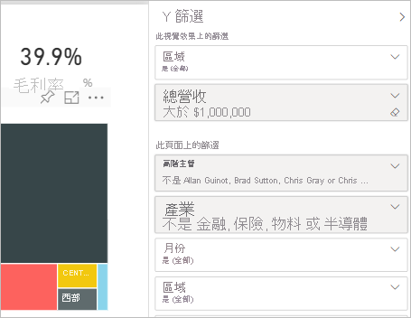
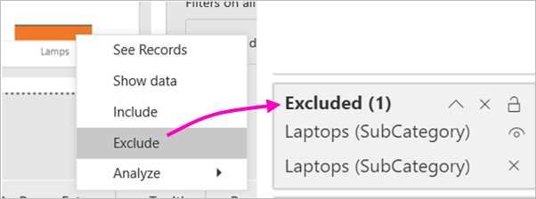
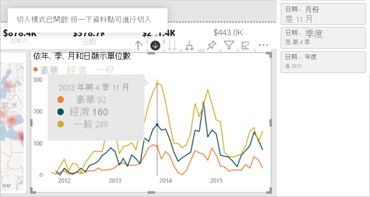
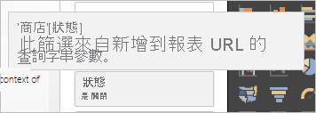
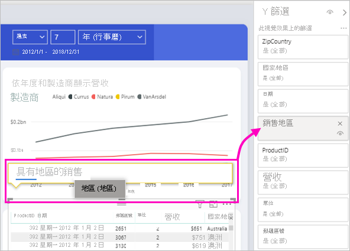

# Power BI 報表中的篩選類型

篩選並非全都以相同方式運作，因為不是以相同方式建立它們。 建立它們的方式會影響其在編輯模式下的 [篩選] 窗格中的行為。 在本文中，我們描述不同種類的篩選：建立它們的不同方式，以及適用它們的不同事物。 閱讀如何[將篩選條件新增至報表](power-bi-report-add-filter.md)。 

讓我們從兩個最常見的篩選器類型開始：自動和手動。

## 自動篩選 

自動篩選是當您建置視覺效果時，自動新增至篩選窗格視覺效果層級的篩選條件。 這些篩選條件是以構成視覺效果的欄位為基礎。 具有報表編輯許可權的使用者可以在窗格中編輯、清除、隱藏、鎖定、重新命名或排序此篩選準則。 他們無法刪除自動篩選，因為視覺效果會參考這些欄位。

## 手動篩選 

手動篩選是當您編輯報表時，在 [篩選] 窗格的任何區段中拖放的篩選。 如果您有報表的編輯許可權，您可以在窗格中編輯、刪除、清除、隱藏、鎖定、重新命名或排序此篩選準則。

瞭解如何 [將篩選準則加入至報表](power-bi-report-add-filter.md)。

## 其他進階篩選條件

接下來的篩選類型較不常用，但仍請務必了解它們，如果它們顯示在報表中的話。 此外，您可能會發現它們有助於為您的報表建立正確的篩選條件。

## 包含和排除篩選條件

當您針對視覺效果使用包含或排除功能時，包含和排除篩選條件會自動新增至篩選窗格。 如果您可以編輯報表，您可以在窗格中刪除、鎖定、隱藏或排序此篩選準則。 您無法編輯、清除或重新命名包含或排除篩選準則，因為它與視覺效果的包含和排除功能相關聯。

## 向下切入篩選條件

當您針對報表中的視覺效果使用向下切入功能時，向下切入篩選條件會自動新增至篩選窗格。 如果您可以編輯報表，您可以在窗格中編輯或清除篩選準則。 您無法刪除、隱藏、鎖定、重新命名或排序此篩選準則，因為它與視覺效果的向下切入功能相關聯。 若要移除向下切入篩選準則，請選取視覺效果的向上切入按鈕。

## 交叉切入篩選條件

當向下切入篩選準則透過交叉篩選或交叉醒目提示功能傳遞至報表頁面上的另一個視覺效果時，會自動將交叉切入篩選加入至窗格。 即使您可以編輯報表，您也無法刪除、清除、隱藏、鎖定、重新命名或排序此篩選準則，因為它與視覺效果的向下切入功能相關聯。 您也無法編輯此篩選準則，因為它是在另一個視覺效果中向下切入。 若要移除向下切入篩選準則，請選取傳遞篩選之視覺效果的向上切入按鈕。

## 深入剖析篩選

向下切入篩選準則會透過逐步解說功能，從一個頁面傳遞到另一個頁面。 它們會顯示在 [演練] 窗格中。 有兩種類型的深入剖析篩選準則。 第一個類型是叫用演練的型別。 如果您可以編輯報表，您可以編輯、刪除、清除、隱藏或鎖定這種類型的篩選。 第二種類型是根據來源頁面的頁面層級篩選，傳遞至目標的切入篩選準則。 您可以編輯、刪除或清除此暫時性的切入篩選準則類型。 您無法鎖定或隱藏終端使用者的此篩選。

深入瞭解如何 [建立切入篩選準則](desktop-drillthrough.md)。

## URL 篩選條件

藉由新增 URL 查詢參數，可將 URL 篩選加入窗格中。 如果您可以編輯報表，您可以在窗格中編輯、刪除或清除篩選準則。 您無法隱藏、鎖定、重新命名或排序此篩選準則，因為它與 URL 參數相關聯。 若要移除篩選條件，請從 URL 移除參數。 以下是具有參數的範例 URL：

app.powerbi.com/groups/me/apps/*app-id*/reports/*report-id*/ReportSection?filter=Stores~2FStatus%20eq%20'Off'

瞭解如何 [設定 URL 篩選](../collaborate-share/service-url-filters.md)。

## 傳遞篩選條件

傳遞篩選條件是透過問與答建立的視覺效果層級篩選條件。 如果您可以編輯報表，您可以在窗格中刪除、隱藏或排序這些篩選。 不過，您無法重新命名、編輯、清除或鎖定這些篩選。

## 比較篩選類型

下表比較作者可以利用不同類型的篩選條件做什麼。

| 篩選類型 | 編輯 | Clear | 刪除 | 隱藏 | 鎖定 | Sort | 重新命名 |
|----|----|----|----|----|----|----|----|
| 手動篩選 | Y | Y | Y | Y | Y | Y | Y |
| 自動篩選 | Y | Y | N | Y | Y | Y | Y |
| 包含/排除篩選條件 | N | N | Y | Y | Y | Y | N |
| 向下切入篩選條件 | Y | Y | N | N | N | N | N |
| 交叉切入篩選條件 | N | N | N | N | N | N | N |
|  (叫用切入篩選)  | Y | Y | Y | Y | Y | N | N |
|  (暫時性) 的深入剖析篩選 | Y | Y | Y | N | N | N | N |
| URL 篩選條件 - 暫時性 | Y | Y | Y | N | N | N | N |
| 傳遞篩選條件 | N | N | Y | Y | N | Y | N |

## 後續步驟

[將篩選條件新增至報表](power-bi-report-add-filter.md)

[報表 [篩選] 窗格概觀](../consumer/end-user-report-filter.md)

[在報表中進行篩選和醒目提示](power-bi-reports-filters-and-highlighting.md)

有其他問題嗎？ [試試 Power BI 社群](https://community.powerbi.com/)
