# <a name="format-filters-in-power-bi-reports"></a>Power BI 報表中的格式篩選

[!INCLUDE [applies-to](../includes/applies-to.md)] [!INCLUDE [yes-desktop](../includes/yes-desktop.md)] [!INCLUDE [yes-service](../includes/yes-service.md)]

您對報表篩選設計和功能有很大的控制權。 本文說明如何格式化 [篩選] 窗格，讓它看起來像是報表的其餘部分。 您可以鎖定甚至是隱藏篩選。

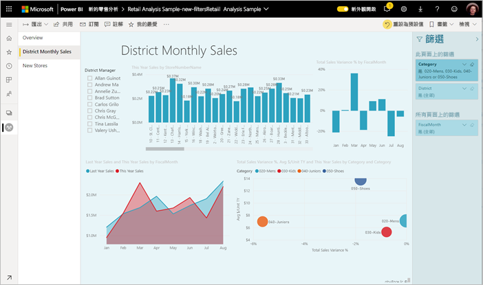

第一個步驟是 [將篩選新增至報表](power-bi-report-add-filter.md)。 然後，您可以使用報表設計師來格式化 [篩選] 窗格：

- 新增和移除要篩選的欄位。 
- 變更篩選狀態。
- 對 [篩選] 窗格進行格式設定和自訂，使它融入您的報表。
- 定義當取用者開啟報表時，[篩選] 窗格預設是開啟或折疊的。
- 隱藏整個 [篩選] 窗格，或不想要報表取用者看到的特定篩選條件。
- 控制可見度 ([篩選] 窗格的開啟和摺疊狀態) 或甚至將其加入書籤。
- 鎖定不想要取用者編輯的篩選條件。

閱讀報表時，使用者可將滑鼠暫留在任何視覺效果上，以查看影響該視覺效果的所有篩選或交叉分析篩選器唯讀清單。

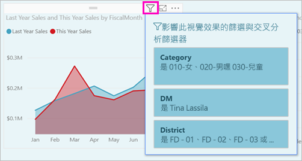

閱讀報表讀取器如何在報表閱讀模式中 [使用篩選](../consumer/end-user-report-filter.md) 的相關資訊。

## <a name="build-the-filters-pane"></a>建置 [篩選] 窗格

預設會根據您目前的報表設定來格式化 [篩選] 窗格。 在 [篩選] 窗格中，您會設定要包含哪些篩選，以及更新現有篩選。 當您發行報表時，[篩選] 窗格看起來會與您的報表取用者相同。 

1. 當您將視覺效果新增至報表畫布時，Power BI 會自動將篩選新增至視覺效果中每個欄位的 [篩選] 窗格。

2. 若要建立 [篩選] 窗格，請將感興趣的其他欄位拖曳到 [篩選] 窗格中，做為視覺效果、頁面或報表層級篩選。

## <a name="show-or-hide-the-filters-pane"></a>顯示或隱藏 [篩選] 窗格

### <a name="hide-the-filters-pane-in-reading-mode"></a>在閱讀模式中隱藏 [篩選] 窗格

如果您不想讓報表讀者看到 [篩選] 窗格，請選取 [**篩選**] 旁的 **眼睛** 圖示。

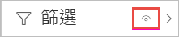 

### <a name="hide-the-filters-pane-while-editing"></a>編輯時隱藏 [篩選] 窗格

當您在編輯報表時，如果您未使用 [篩選] 窗格，而且螢幕上需要額外的空間，就可以隱藏 [篩選] 窗格。 

- 在 [ **視圖** ] 索引標籤上，[ **篩選** ] 按鈕可讓您顯示或隱藏 [篩選] 窗格。

![編輯時顯示或隱藏 [篩選] 窗格](media/power-bi-report-filter/power-bi-filter-hide.png)

此設定只會隱藏 Power BI Desktop 中的 [篩選] 窗格。 Power BI 服務中的編輯模式沒有對等專案。

## <a name="lock-or-hide-filters"></a>鎖定或隱藏篩選條件

您可以將個別篩選條件卡片鎖定或隱藏。 如果您將篩選條件鎖定，則您的報表取用者可以看到它，但不能變更。 如果您隱藏篩選條件，他們就完全不能看到它。 如果您需要隱藏排除 Null 或非預期值的資料清除篩選條件，則隱藏篩選條件卡片很有用。 

- 在 [篩選] 窗格中，選取或清除篩選卡片中的 **鎖定篩選** 或 **隱藏篩選** 圖示。

   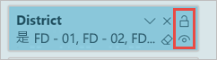

當在 [篩選] 窗格中開啟和關閉這些設定時，即會看到變更反映在報表中。 視覺效果的快顯篩選清單不會顯示所隱藏篩選條件。

您也可以將 [篩選] 窗格狀態設定為隨報表書籤改變。 窗格的開啟、關閉和可見度狀態都可以設定為書籤。
 
## <a name="format-the-filters-pane"></a>設定 [篩選] 窗格的格式

篩選體驗的一個重點是，您可設定 [篩選] 窗格的格式以符合報表外觀及操作。 您也可以針對報表中的每個頁面，將 [篩選] 窗格設定為不同的格式。 以下是您可以進行格式設定的元素： 

- 背景色彩
- 背景透明度
- 開啟或關閉框線
- 框線色彩
- 標題與標題字型、色彩及文字大小

視這些元素是否已套用 (設定為某個值) 或可取得 (已清除)，您也可以針對篩選條件卡片設定其格式： 

- 背景色彩
- 背景透明度
- 框線：開啟或關閉
- 框線色彩
- 字型、色彩及文字大小
- 輸入方塊色彩

### <a name="format-the-filters-pane-and-cards"></a>設定篩選窗格和卡片的格式

1. 在報表中，按一下報表本身或背景 (「桌布」)，然後在 [視覺效果] 窗格中，選取 [格式]。 
    您會看到報表頁面、桌布，以及篩選窗格和篩選卡片的格式設定選項。

1. 展開 [篩選窗格] 來設定背景、圖示和左框線的色彩，以搭配報表頁面。

    ![展開 [篩選] 窗格](media/power-bi-report-filter/power-bi-format-filter-pane.png)

1. 展開 [篩選卡片] 來設定 [可用] 與 [已套用] 色彩和框線。 如果您讓可用和已套用卡片使用不同的色彩，已套用哪些篩選條件就很清楚。 
  
    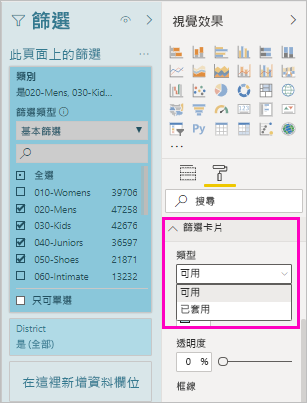

## <a name="theming-for-filters-pane"></a>[篩選] 窗格的佈景主題設定
您現在可以使用佈景主題檔案來修改 [篩選] 窗格的預設設定。 以下是可協助您開始的範例佈景主題程式碼片段：

 
```
"outspacePane": [{ 

"backgroundColor": {"solid": {"color": "#0000ff"}}, 

"foregroundColor": {"solid": {"color": "#00ff00"}}, 

"transparency": 50, 

"titleSize": 35, 

"headerSize": 8, 

"fontFamily": "Georgia", 

"border": true, 

"borderColor": {"solid": {"color": "#ff0000"}} 

}], 

"filterCard": [ 

{ 

"$id": "Applied", 

"transparency": 0, 

"backgroundColor": {"solid": {"color": "#ff0000"}}, 

"foregroundColor": {"solid": {"color": "#45f442"}}, 

"textSize": 30, 

"fontFamily": "Arial", 

"border": true, 

"borderColor": {"solid": {"color": "#ffffff"}}, 

"inputBoxColor": {"solid": {"color": "#C8C8C8"}} 

}, 

{ 

"$id": "Available", 

"transparency": 40, 

"backgroundColor": {"solid": {"color": "#00ff00"}}, 

"foregroundColor": {"solid": {"color": "#ffffff"}}, 

"textSize": 10, 

"fontFamily": "Times New Roman", 

"border": true, 

"borderColor": {"solid": {"color": "#123456"}}, 

"inputBoxColor": {"solid": {"color": "#777777"}} 

}] 
```

## <a name="sort-the-filters-pane"></a>排序 [篩選] 窗格

[篩選] 窗格中提供自訂排序功能。 建立報表時，您可拖放篩選，以任何順序來重新排列這些篩選。


篩選的預設排序次序是依字母順序。 若要啟動自訂排序模式，只要將任何篩選拖曳至新位置即可。 您只能重新排列其套用層級內的篩選準則。 例如，您可以在 [篩選] 窗格的視覺效果層級區段中，變更視覺效果層級篩選的順序。

## <a name="improved-filters-pane-accessibility"></a>改善篩選窗格協助工具

我們已改善 [篩選] 窗格的鍵盤瀏覽。 您可以按 Tab 鍵移至 [篩選] 窗格的每個部分，並使用鍵盤上的內容索引鍵或 Shift+F10 開啟操作功能表。

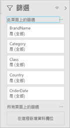

## <a name="rename-filters"></a>重新命名篩選
當您想要編輯 [篩選] 窗格時，您可以按兩下標題進行編輯。 如果您想要更新篩選卡片，重新命名對終端使用者會很有幫助。 請記住，重新命名篩選卡片「不會」重新命名該欄位在欄位清單中的顯示名稱。 只會變更篩選卡片中所使用的顯示名稱。

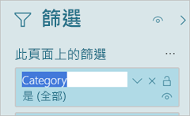

## <a name="filters-pane-search"></a>[篩選] 窗格搜尋

[篩選] 窗格搜尋功能可供依標題在篩選卡之間搜尋。 如果 [篩選] 窗格中有數個不同的篩選卡，且需要協助尋找感興趣的資訊，則這項功能會很有幫助。

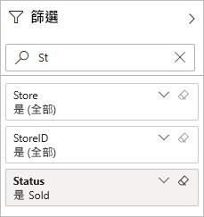

您也可以將搜尋方塊格式化，就像您可以將 [篩選] 窗格的其他項目格式化一樣。

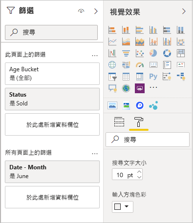

雖然此 [篩選] 窗格搜尋功能預設為開啟，但您也可以從 [選項] 對話方塊的 [報表] 設定中選取 [啟用搜尋篩選窗格] 來選擇將其開啟或關閉。

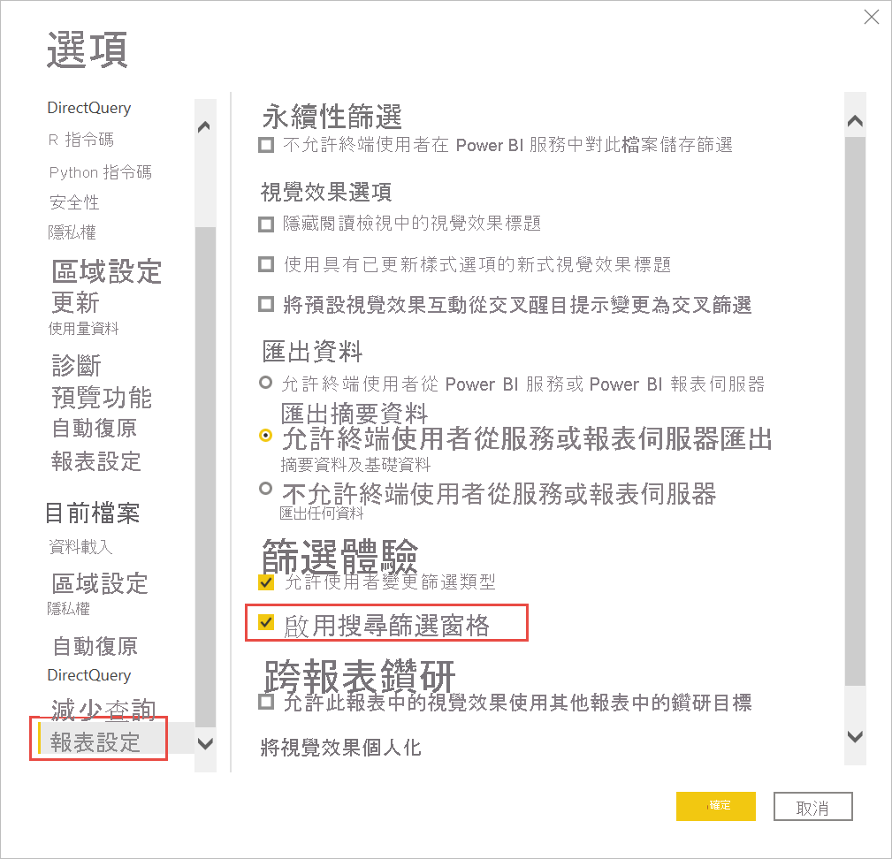

## <a name="restrict-changes-to-filter-type"></a>限制變更篩選類型

在 [報表設定] 的 [篩選體驗] 區段下有一個選項，可控制使用者是否可變更篩選類型。

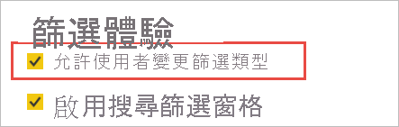

## <a name="allow-saving-filters"></a>允許儲存篩選

根據預設，報表讀者可儲存報表的篩選。 您可選擇不允許其儲存篩選。

- 同樣在 [選項] 對話方塊的 [報表設定] 中，於 [永續性篩選] 底下，選取 [不允許終端使用者儲存對此報表的篩選]。

    :::image type="content" source="media/power-bi-report-filter/power-bi-persistent-filters.png" alt-text="[不允許終端使用者儲存對此報表的篩選] 的螢幕擷取畫面。":::

## <a name="apply-filters-button"></a>[套用篩選] 按鈕

可新增單一 [套用] 按鈕至篩選窗格，以讓您和終端使用者一次套用所有篩選修改。 若要延遲套用篩選變更，此按鈕會很有用。 當準備好要將所有篩選變更套用至報表或視覺效果之後，只需要等候一次。

:::image type="content" source="media/power-bi-report-filter/apply-filter-button.png" alt-text="[套用篩選] 按鈕":::

### <a name="turn-on-the-apply-button"></a>開啟 [套用] 按鈕

您可在報表層級設定這項功能。 不過，此功能預設為關閉。

1. 請移至 [檔案] > [選項及設定] > [選項] > [Query reduction] \(查詢縮減\)。

1. 選取 [Add a single Apply button to the filter pane to apply changes at once] \(將一個 [套用] 按鈕新增到篩選窗格以一次套用變更\)。

    :::image type="content" source="media/power-bi-report-filter/apply-all-filters.png" alt-text="開啟 [套用篩選] 按鈕":::

### <a name="format-the-apply-button"></a>設定 [套用] 按鈕的格式

目前，您可控制按鈕其 [套用] 文字的部分格式設定。 在 [格式] 窗格的 [篩選窗格] 區段中，設定下列選項：

- [核取方塊及 [套用] 色彩] 可控制填滿色彩。 
- [字型和圖示色彩] 可控制文字色彩。
- [標頭文字大小] 可控制文字大小。
- [字型系列] 可控制字型。

    :::image type="content" source="media/power-bi-report-filter/format-apply-filter.gif" alt-text="設定 [套用篩選] 按鈕文字格式":::

## <a name="considerations-and-limitations"></a>考量與限制

發佈至 Web 不會顯示 [篩選] 窗格。 如果您打算將報表發行至 web，請考慮改為新增篩選器來進行篩選。

## <a name="next-steps"></a>後續步驟

- [如何使用報表篩選](../consumer/end-user-report-filter.md)
- [報表的篩選和醒目提示](power-bi-reports-filters-and-highlighting.md)
- [Power BI 中各種不同的篩選類型](power-bi-report-filter-types.md)

有其他問題嗎？ [試試 Power BI 社群](https://community.powerbi.com/)
