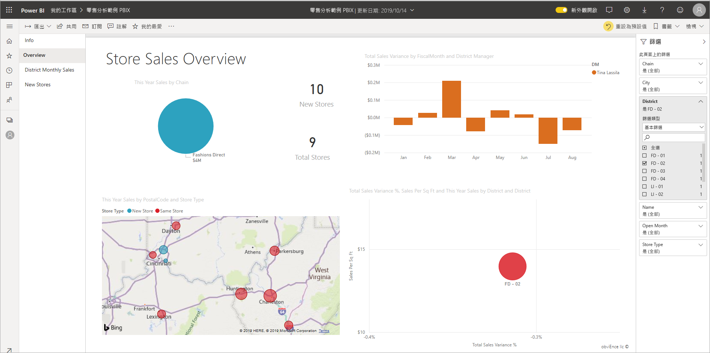
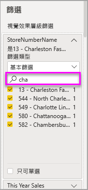

# 在 Power BI 報表中進行篩選和醒目提示

 本文介紹如何在 Power BI 服務中進行篩選和醒目提示。 其體驗幾乎與 Power BI Desktop 完全相同。 *篩選* 會保留您最關切的資料，而將其他所有資料移除。 一般情況下，反白 *顯示* 不會進行篩選。 在大部分的視覺效果中，反白顯示不會移除不相關的資料。 相反地，它會反白顯示相關的資料。 其餘的資料會保持可見但呈現暗灰色。 如需詳細資訊，請參閱本文稍後的 [交叉篩選和交叉醒目](#cross-filter-and-cross-highlight-visuals) 提示。

有許多不同的方式可篩選和反白顯示 Power BI 中的報表。 將所有資訊放在一篇文章中會很大，因此我們將它分成下列各節：

* 篩選及醒目提示簡介，亦即您現正閱讀的文章。
* 篩選和反白顯示在 Power BI 服務的 [ [閱讀檢視] 中的運作](../consumer/end-user-interactions.md) 方式。 您可以做的是，它比編輯檢視更受限制，但是您仍然有各式各樣的篩選和反白顯示選項。  
* 如何在 Power BI Desktop 和 Power BI 服務 [的 [篩選] 窗格中建立篩選準則](power-bi-report-add-filter.md) 。 若您具有報表編輯權限，即可建立、修改及刪除報表中的篩選。
* 加入篩選之後，您可以將 [篩選器格式化](power-bi-report-filter.md) ，以您想要的方式運作，並看起來像是報表的其餘部分。
* 您已瞭解預設的篩選和醒目提示的運作方式。 現在瞭解如何 [變更頁面篩選的視覺效果，並醒目提示視覺效果](service-reports-visual-interactions.md)。
* 閱讀 [Power BI 報表中其他類型篩選的](power-bi-report-filter-types.md)相關資訊。

## [篩選] 窗格簡介

您可以在 [ **篩選** ] 窗格中套用篩選，或是直接在報表頁面上的交叉分析篩選器 [中進行選取](../visuals/power-bi-visualization-slicers.md) 。 [篩選] 窗格會顯示個別視覺效果中的欄位，以及報表設計師加入的任何其他篩選。 

![[篩選] 窗格](media/power-bi-reports-filters-and-highlighting/power-bi-add-filter-reading-view.png)

您在 [篩選] 窗格中建立的篩選準則有四種標準類型。

- **視覺效果篩選** 會套用至報表頁面上的單一視覺效果。 當您在報表畫布上選取視覺效果時，您會看到視覺效果層級篩選。 即使您無法編輯報表，您也可以選取視覺效果並進行篩選。
- **頁面篩選** 會套用至報表頁面上的所有視覺效果。
- **報表篩選準則** 會套用到報表中的所有頁面。
- **深入剖析篩選** 在 Power BI 服務和 Power BI Desktop 的 [深入探討] 中，您可以建立著重于特定實體的 *目的地* 報表頁面，例如供應商。 在其他報表頁面中，使用者可以用滑鼠右鍵按一下該實體的資料點，然後向下切入至焦點頁面。

若要建立前三個、視覺效果、頁面和報表篩選，請參閱 [在 Power BI 中加入報表的篩選](power-bi-report-add-filter.md)。 

若要建立切入篩選準則，請參閱 [Power BI 報表中的設定](desktop-drillthrough.md)演練。

### 基本和高級篩選

根據預設，報表讀取器可以從 **基本** 切換為 **Advanced** 篩選。 

**基本篩選器** 會顯示欄位中所有值的清單。 您可以在 [閱讀檢視] 或 [編輯檢視] 中的頁面、視覺效果和報表篩選中搜尋，以尋找和選取所需的值。 

**所有** 旁邊有一個單字的篩選都未篩選，顯示欄位中的所有值。  例如， **連鎖是 (所有)** 表示報表頁面包含所有商店鏈的相關資料。 相反地，報表層級篩選 **FiscalYear 是2013或 2014** ，表示報表只會顯示會計年度2013和2014的資料。

**Advanced 篩選器** 可讓您使用更複雜的篩選準則。 例如，您可以搜尋包含或不包含的值，其開頭或開頭不是特定的值。 

:::image type="content" source="media/power-bi-reports-filters-and-highlighting/power-bi-advanced-filter.png" alt-text="Advanced 濾波器提供更差別細微的篩選選項。":::

當您建立報表時，可以關閉切換，而 [不允許報表讀取器變更篩選類型](power-bi-report-filter.md#restrict-changes-to-filter-type)。 您也可以在 [篩選] 窗格中關閉 [搜尋]。

## [閱讀檢視] 或 [編輯檢視] 中的篩選

在 [Power BI 服務：閱讀檢視和編輯檢視] 中，有兩種模式可與報表互動。 系統會依據您使用的模式提供篩選功能。

* 在 [ [閱讀檢視](#filters-in-reading-view)] 中，您可以與報表中已存在的任何篩選互動，並儲存您所做的選擇。 您無法新增新的篩選。
* 在 [ [編輯檢視](#filters-in-editing-view)] 中，您可以加入所有類型的篩選。 當您儲存報表時，篩選會與報表一起儲存，即使報表讀取器在行動應用程式中開啟該篩選也一樣。 在 [閱讀檢視] 中查看報表的人員會與您加入的篩選互動，但無法加入新的篩選。

### [閱讀檢視] 中的篩選

在 Power BI 服務中，如果您在 [閱讀檢視] 中選取視覺效果，[篩選] 窗格看起來會像這樣：

![[閱讀檢視] 中的篩選](media/power-bi-reports-filters-and-highlighting/power-bi-filter-reading-view.png)

每個視覺效果都會篩選視覺效果中的所有欄位。 當您建立報表時，您可以新增更多。 在此 [篩選] 窗格中，視覺效果有三個篩選準則。

在 [閱讀檢視] 中，您可以藉由修改現有的篩選來流覽資料。 您只會篩選報表的觀點。 當您結束報表時，即使您在行動應用程式中開啟報表，您所做的變更也會與報表的觀點一起儲存。 若要復原您的篩選並返回報表作者所設定的預設值，請從頂端功能表列選取 [ **重設為預設值** ]。

:::image type="content" source="../consumer/media/end-user-report-filter/power-bi-reset-icon.png" alt-text="重設為預設圖示。":::

深入瞭解閱讀檢視： [導覽 [報表篩選] 窗格](../consumer/end-user-report-filter.md)。

### [編輯檢視] 中的篩選
當您在 Power BI Desktop 中開啟報表時，您會看到 **篩選器** 只是數個編輯窗格中的其中一個可用。 如果您在 Power BI 服務的 [編輯檢視] 中開啟報表，您會看到相同的窗格。

![[編輯檢視] 中的 [篩選] 窗格](media/power-bi-reports-filters-and-highlighting/power-bi-add-filter-editing-view.png)

我們會看到報表的這個頁面有三個頁面層級篩選和一個報表層級篩選。 藉由選取直條圖，我們會看到它也有三個視覺效果層級的篩選。

#### 在編輯檢視中使用篩選

- 瞭解如何在 Power BI Desktop 的報表中，以及在 Power BI 服務的編輯檢視中 [加入篩選](power-bi-report-add-filter.md) 。

- 新增篩選器之後，您會有許多格式化選項。 例如，您可以隱藏、鎖定或重新排序篩選，或將它們格式化以符合報表的其餘部分。 瞭解如何 [格式化報表中的篩選](power-bi-report-filter.md)。 

- 您也可以變更視覺效果的互動方式。 若要微調交叉反白顯示和交叉篩選，請參閱 [變更報表中的視覺效果互動方式](service-reports-visual-interactions.md)。

## 交叉篩選和交叉醒目提示視覺效果

您可以流覽報表中視覺效果之間的關聯性，而不需要使用篩選或交叉分析篩選器。 選取一個視覺效果中的值或軸標籤，以 *交叉篩選* 或 *交叉醒目* 提示頁面上其他視覺效果中的相關值。 它們的行為並不相同。 

- **交叉反白顯示** 在一個視覺效果中選取一個值，會反白顯示視覺效果中的相關資料，例如資料行和橫條圖。 交叉醒目提示並不會從這些視覺效果中移除不相關的資料。 不相關的資料仍然可見但呈現暗灰色。 
- **交叉篩選** 在一個視覺效果中選取一個值，會比其他視覺效果（例如折線圖和散佈圖）中的篩選更為類似。 在這些視覺效果中，只有相關的資料會保持可見。 不相關的資料會顯示出來，就像您在篩選器中所看到的一樣。 

若要移除醒目提示，請再次選取值，或選取相同視覺效果中的任何空白空間。 如需更多範例，請參閱「視覺效果如何在 Power BI 報表中相互交叉篩選」的 [交叉篩選和交叉](../consumer/end-user-interactions.md#cross-filtering-and-cross-highlighting) 醒目提示區段。

## 下一步

- [在編輯檢視中將篩選新增至報表](power-bi-report-add-filter.md)
- [Power BI 報表中的格式篩選](power-bi-report-filter.md)
- [報表篩選概觀](../consumer/end-user-report-filter.md)
- [報表視覺效果如何在報表中交叉篩選和交叉醒目提示](../consumer/end-user-interactions.md)

有其他問題嗎？ [試試 Power BI 社群](https://community.powerbi.com/)
