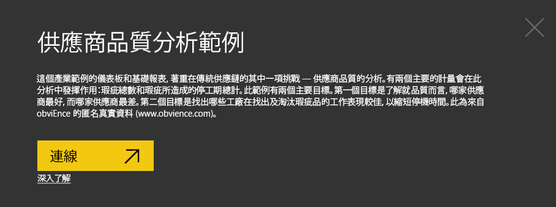
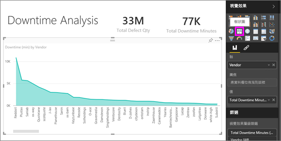
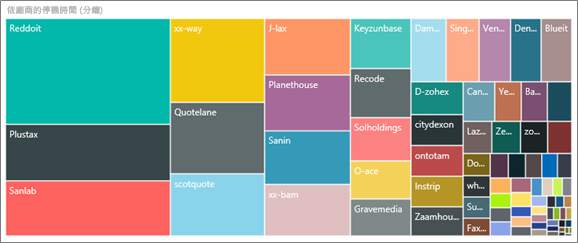
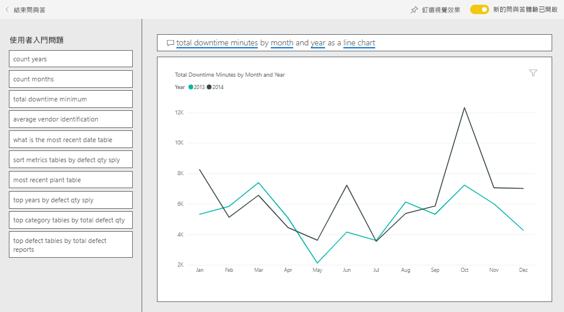

# Power BI 的供應商品質分析範例：觀看導覽

這個產業範例儀表板和基礎報表著重在傳統供應鏈的其中一項挑戰：供應商品質分析。 有兩個主要的計量會在此分析中發揮作用：瑕疵總數和瑕疵所造成的停工期總計。 

此範例有兩個主要目標：

* 了解就品質而言，哪家供應商最好，而哪家供應商最差。
* 指出哪些工廠在找出及淘汰瑕疵品的工作表現較佳，以縮短停工時間。

![[供應商品質分析範例] 儀表板](media/sample-supplier-quality/supplier1.png)

此範例是系列中的一部分，說明您可如何使用 Power BI 的商業導向資料、報表與儀表板。 它是由 [obviEnce](http://www.obvience.com/) 使用真實資料 (已匿名化) 所建立。 資料會以數種格式提供：內容套件、.pbix Power BI Desktop 檔案，或 Excel 活頁簿。 請參閱 [Power BI 範例](sample-datasets.md)。 

此教學課程探索 Power BI 服務中的供應商品質分析範例內容套件。 因為 Power BI Desktop 和服務中報表的使用體驗皆非常類似，因此您也可以在 Power BI Desktop 中使用範例 .pbix 檔案來進行教學課程。 

您不需要 Power BI 授權，即可在 Power BI Desktop 中瀏覽範例。 如果您沒有 Power BI Pro 授權，則可以將範例儲存到 Power BI 服務中的 [我的工作區]。 

## 取得範例

您必須先將範例下載為[內容套件](#get-the-content-pack-for-this-sample)、[.pbix 檔案](#get-the-pbix-file-for-this-sample)或 [Excel 活頁簿](#get-the-excel-workbook-for-this-sample)，才能使用範例。

### 取得此範例的內容套件

1. 開啟 Power BI 服務 (app.powerbi.com) 並登入，然後開啟您要儲存範例的工作區。

   如果您沒有 Power BI Pro 授權，則可以將範例儲存到 [我的工作區]。

2. 在左下角選取 [取得資料]  。
   
   ![選取 [取得資料]](media/sample-datasets/power-bi-get-data.png)
3. 在顯示的 [取得資料]  頁面上，選取 [範例]  。
   
4. 選取 [供應商品質分析範例]  ，然後選擇 [連線]  。  
   
   

5. Power BI 會匯入內容套件，然後將新儀表板、報表和資料集新增至您目前的工作區。
   
   
  
### 取得此範例的 .pbix 檔案

或者，您可以將供應商品質分析範例下載為 [.pbix 檔案](https://download.microsoft.com/download/8/C/6/8C661638-C102-4C04-992E-9EA56A5D319B/Supplier-Quality-Analysis-Sample-PBIX.pbix)，其設計目的是要用於 Power BI Desktop。

### 取得此範例的 Excel 活頁簿

如果您想要檢視此範例的資料來源，其也有可用的 [Excel 活頁簿](https://go.microsoft.com/fwlink/?LinkId=529779) 格式。 活頁簿包含的 Power View 工作表可供您檢視及修改。 若要查看未經處理資料，請啟用「資料分析」增益集，然後選取 [Power Pivot] > [管理]  。 若要啟用 Power View 和 Power Pivot 增益集，請參閱[在 Excel 中探索 Excel 範例](sample-datasets.md#explore-excel-samples-inside-excel)以了解詳情。

## 用料瑕疵所造成的停工時間
讓我們來分析用料瑕疵所造成的停工時間並查看應由哪些廠商負責。  

1. 在儀表板中，選取 [瑕疵品總數]  或 [停工時間總分鐘數]  磚。

     

   供應商品質分析範例報表即會開啟 [停工時間分析]  頁面。

   請注意，我們有 3,300 萬個瑕疵品，總共造成 77,000 分鐘的停工時間。 雖然有些物料的瑕疵品較少，但因為它們會造成延誤而導致更長的停工時間。 讓我們在報表頁面上瀏覽這些項目。  
2. 如果查看 [依物料類型的瑕疵品和停工時間 (分鐘)]  組合圖中的 [停工時間總分鐘數]  一行，我們會發現瓦楞紙物料會導致最長的停工時間。  
3. 選取 [瓦楞紙]  資料行，以查看哪些工廠受此瑕疵品的影響最大，以及哪些廠商應負責。  

   ![選取 [瓦楞紙] 資料行](media/sample-supplier-quality/supplier3.png)  
4. 在 [依工廠的停工時間 (分鐘)]  地圖中，依序選取個別工廠，以查看哪家廠商或物料該為這家工廠的停工時間負責。

### 哪家是最差的供應商？
 我們想要找出最差的八家供應商，並決定他們的停工時間百分比責任歸屬。 我們可以將 [依廠商的停工時間 (分鐘)]  區域圖變更為矩形式樹狀結構圖，以進行這項作業。  

1. 在報表的 [停工時間分析]  頁面中，選取左上角的 [編輯報表]  。  
2. 選取 [依廠商的停工時間 (分鐘)]  區域圖，並在 [視覺效果]  窗格中選取**矩形式樹狀結構圖**圖示。  

     

    矩形式樹狀結構圖會自動將 [廠商]  欄位設定為 [群組]  。  

      

   從此矩形式樹狀結構圖中，我們可以看到前八個廠商是矩形式樹狀結構圖左側的八個區塊。 我們也可以發現它們應為約 50% 的停工時間總分鐘數承擔責任。  
3. 選取頂端導覽窗格的 [供應商品質分析範例]  ，以返回儀表板。

### 比較工廠
現在讓我們來探索哪些工廠有妥善管理瑕疵用料，以確保較短的停工時間。  

1. 在儀表板中，選取 [依工廠、瑕疵品類型的總瑕疵報表]  地圖磚。      

   ![[依工廠、瑕疵類型的總瑕疵報表] 磚](media/sample-supplier-quality/supplier6.png)  

   報表會隨即開啟 [供應商品質分析]  頁面。  

2. 在 [依工廠和瑕疵品類型的總瑕疵報表]  的圖例中，選取 [影響]  圓形。  

    ![選取 [影響]](media/sample-supplier-quality/supplier7.png)  

    請注意，泡泡圖中的 [物流]  是最糟糕的類別。 其在瑕疵品總數、瑕疵報表和停工時間分鐘數都位居最高位置。 讓我們來進一步瀏覽此類別目錄。  
3. 在泡泡圖中選取 [物流]  泡泡，並觀察伊利諾州春田市和內珀維爾市的工廠。 內珀維爾市似乎在管理瑕疵供貨方面做得更好，因為其退貨量較高，影響量也較小，而春田市的影響量就較大。  

   ![選取 [物流]](media/sample-supplier-quality/supplier8.png)  
4. 選取頂端導覽窗格的 [供應商品質分析範例]  ，以返回儀表板。

## 哪種類型的用料管理最佳？
管理最佳的用料類型是指不論瑕疵品數量為何，皆具有最低的停工時間或不造成任何影響的類型。

1. 在儀表板上，查看 [依物料類型的瑕疵品總數、瑕疵類型]  磚。

   ![[依物料類型、瑕疵品類型的瑕疵品總數] 磚](media/sample-supplier-quality/supplier9.png)

   請注意，雖然 [原料]  物料類型的瑕疵品總數很多，但大多數的瑕疵品都會被退回或不具影響。

   讓我們確認儘管瑕疵品數量高，此物料類型仍不會造成大量的停工時間。

2. 在儀表板上，查看 [依物料類型的瑕疵品總數、停工時間總分鐘數]  圖格。

   ![[依物料類型的瑕疵品總數、停工時間總分鐘數] 磚](media/sample-supplier-quality/supplier10.png)

   原料似乎經妥善管理；雖然它們有更多的瑕疵品，但停工時間總分鐘數卻較低。

### 依年度比較瑕疵品與停工時間的關係
1. 選取 [依工廠、瑕疵品類型的總瑕疵報表]  地圖磚，報表會隨即開啟 [供應商品質分析]  頁面。
2. 在 [依月份和年度的瑕疵品總數]  圖表中，注意 2014 年的瑕疵品數量比 2013 年高。  

    ![[依月份和年度的瑕疵品總數] 圖表](media/sample-supplier-quality/supplier11.png)  
3. 瑕疵品多代表停工時間一定也更多嗎？ 在問與答方塊提問以找出答案。  
4. 選取頂端導覽窗格的 [供應商品質分析範例]  ，以返回儀表板。  
5. 由於我們知道原料具有最高數量的瑕疵品，可在問題方塊中鍵入：*show material types, year, and total defect qty* (顯示物料類型、年度和瑕疵品總數)。  

    2014 年的原料瑕疵品數量比 2013 年高很多。  

      
6. 接下來，將問題變更為：「顯示物料類型、年度和**停工時間總分鐘數」**  。  

   

   請注意，雖然 2014 年的原料瑕疵品更多，但 2013 年和 2014 年的原料停工時間差不多。 2014 年原料瑕疵品較多，似乎不會導致 2014 年的原料停工時間更長。

### 依月份比較瑕疵品與停工時間的關係
讓我們看看另一個與瑕疵品總數相關的儀表板圖格。  

1. 選取左上角的 [結束問與答]  並返回儀表板。  

    仔細查看 [依月份、年度的瑕疵品總數]  磚。 其中顯示 2014 年上半年的瑕疵品數量與 2013 年非常接近，但 2014 年下半年的瑕疵品數量則大幅增加。  

    ![[依月份、年度的瑕疵品總數] 磚](media/sample-supplier-quality/supplier14.png)  

    我們來看看瑕疵品數的增加是否會導致停工時間分鐘數也跟著增加。  
2. 在問題方塊中，鍵入「依月份和年度的停工時間總分鐘數折線圖」  。  

   

   除了停工時間分鐘數在 6 月和 10 月大幅增加之外，瑕疵品數量並未明顯導致更長的停工時間。 此結果意謂著我們將瑕疵品管理的很好。  
3. 若要將此圖表釘選至儀表板，請選取問題方塊上方的釘選圖示  。  
4. 若要探索極端值月份，可提出「10 月工廠的停工時間總分鐘數」  等問題，以依物料類型、工廠地點、類別等查看 10 月的停工時間分鐘數。 
5. 選取左上角的 [結束問與答]  並返回儀表板。

## 後續步驟：連線到您的資料
您可以在此環境盡情嘗試，因為您可以選擇不儲存您的變更。 但如果儲存了變更，您也可以隨時選取 [取得資料]  以取得此範例的新複本。

希望此教學已讓您了解 Power BI 儀表板、問與答和報表能夠如何提供範例資料的見解。 現在輪到您了，請連接到您自己的資料。 您可以透過 Power BI 連接到各式各樣的資料來源。 若要深入了解，請參閱[開始使用 Power BI 服務](../fundamentals/service-get-started.md)。
