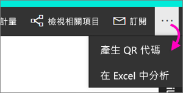
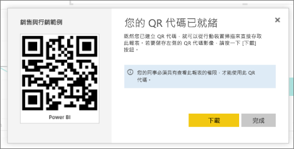

# 為 Power BI 的報表建立 QR 代碼以用於行動裝置應用程式
Power BI 中的 QR 代碼可將真實世界中的所有項目，不需要瀏覽或搜尋即可直接連接到相關的 BI 資訊。

您可以為任何報表 (甚至是無法編輯的報表)，在 Power BI 服務中建立 QR 代碼。 然後將 QR 代碼放在索引鍵位置。 例如，您可將其貼在電子郵件中，或列印出後將它貼在特定位置。 

已與其共用報表的同事，可以直接從[他們的行動裝置](../consumer/mobile/mobile-apps-qr-code.md)掃描該 QR 代碼以存取報表。 他們可以使用位於 Power BI 應用程式中的 QR 代碼掃描器或其行動裝置所安裝的任何其他 QR 掃描器。 他們也可以[使用 Power BI for Mixed Reality 應用程式掃描報表 QR 代碼](../consumer/mobile/mobile-mixed-reality-app.md#scan-a-report-qr-code-in-holographic-view)。

## 建立報表的 QR 代碼
1. 開啟 Power BI 服務中的報表。
2. 選取右上角的 [更多選項]  (...)，然後選取 [產生 QR 代碼]  。 
   
    
3. 具有 QR 代碼的對話方塊隨即出現。 
   
    
4. 您可於此處掃描 QR 代碼，或下載並加以儲存，以： 
   
   * 將其加入電子郵件或其他文件，或 
   * 列印出來，並將其置於特定位置。 

## 列印 QR 代碼
Power BI 會將 QR 代碼產生為 JPG 檔案，可供列印。 

1. 選取 [下載]  ，然後在連接到印表機的電腦上開啟該 JPG 檔案。  
   
   JPG 檔案的名稱與磚相同。 例如，"Sales and Marketing Sample.jpg"。
   
1. 以 100% 或「實際大小」列印檔案。  
2. 沿著邊緣剪下 QR 代碼，並將其黏到與報表相關之處。 

## 後續步驟
* 透過行動裝置應用程式[實際連接 Power BI 資料](../consumer/mobile/mobile-apps-data-in-real-world-context.md)
* [從行動裝置掃描 Power BI QR 代碼](../consumer/mobile/mobile-apps-qr-code.md)
* [為磚建立 QR 代碼](service-create-qr-code-for-tile.md)
* 有任何問題嗎？ [嘗試在 Power BI 社群提問](https://community.powerbi.com/)
