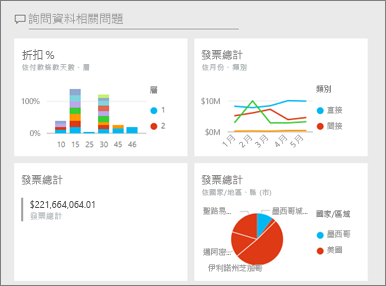
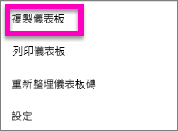

# 在 Power BI 服務中建立儀表板的複本

 有許多不同的原因會建立儀表板複本。 您可能想要進行變更，並測試其與原始版本的效能；或建立要依同事、地區或小組散發的略為不同的版本。 同事可能欣賞您的儀表板設計，且想要使用它向他們的經理報告。 另一個原因是您的新資料庫具有相同的資料結構和資料類型，而且想要重複使用您已建立的儀表板，這也一樣可以完成，但在 Power BI Desktop 中需要執行一些工作。 

儀表板是使用 Power BI 服務來建立 (和複製)，並且可以在 Power BI 行動版和 Power BI Embedded 中檢視。  在 Power BI Desktop 中無法使用儀表板。 

若要建立儀表板的複本，您必須是儀表板「建立者」  。 已與您共用為應用程式的儀表板不能重複。

1. 開啟儀表板。
2. 在右上角選取 [更多選項]  (...)，然後選擇 [複製儀表板]  。
   
   
3. 提供儀表板的名稱，並選取 [複製]  。 
   
   ![[複製儀表板] 對話方塊](media/service-dashboard-copy/power-bi-name.png)
4. 新的儀表板會儲存在與原始儀表板相同的工作區中。 
   
   ![[儀表板] 索引標籤](media/service-dashboard-copy/power-bi-copied.png)

5.    開啟新的儀表板，並視需要加以編輯。 以下是接下來您可能想要進行的一些事：    
    a. [移動、重新命名、調整大小或甚至刪除磚](service-dashboard-edit-tile.md)。  
    b. 選取磚 [更多選項]  (...)，然後選擇 [編輯詳細資料]  ，以編輯磚詳細資料和超連結。  
    c. [從儀表板功能表列新增磚](service-dashboard-add-widget.md) (**新增磚**)  
    d. [從問與答](service-dashboard-pin-tile-from-q-and-a.md)或[從報表](service-dashboard-pin-tile-from-report.md)釘選新的磚。  
    e. 重新命名儀表板、開啟或關閉問與答，並從儀表板的 [設定] 窗格設定磚流程。  (選取儀表板 [更多選項]  (...) 下拉式清單，並選擇 [設定]  )  
    f. 直接與同事共用儀表板，或作為 Power BI 應用程式的一部分。 

## 後續步驟
* [設計絕佳 Power BI 儀表板的秘訣](service-dashboards-design-tips.md) 

有其他問題嗎？ [試試 Power BI 社群](https://community.powerbi.com/)

