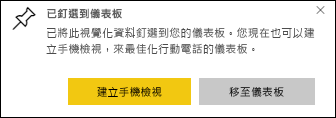

# 從報表將圖格釘選至 Power BI 儀表板

新增[儀表板磚](../consumer/end-user-tiles.md)的一種方法，是從 [Power BI 報表](../consumer/end-user-reports.md)新增。 當您選取其中一個磚時，即會在報表中開啟。

整個報表頁面可以釘選到儀表板，稱為釘選「動態」磚。 稱為動態磚是因為您可以與儀表板上的磚互動。 不同於個別的視覺效果磚，在報表中進行的變更會與儀表板自動同步。 如需詳細資訊，請參閱[釘選整份報表頁面](#pin-an-entire-report-page)。

您無法釘選與您共用之報表或 Power BI Desktop 中的圖格。 

> [!TIP]
> 由於有些視覺效果使用背景影像，因此如果背景影像太大，可能無法正常執行釘選。 請嘗試縮小影像，或使用影像壓縮。  
> 
> 

## 釘選報表的圖格
觀賞 Amanda 如何從 Power BI 報表釘選視覺效果和影像來建立儀表板。
    

<iframe width="560" height="315" src="https://www.youtube.com/embed/lJKgWnvl6bQ" frameborder="0" allowfullscreen></iframe>

現在使用其中一個 Power BI 範例報表來建立您自己的儀表板。

1. 在報表中，將滑鼠停留在要釘選的視覺效果上，並選取釘選圖示。 。 Power BI 會開啟 [釘選至儀表板]  畫面。
   
     ![[釘選到儀表板] 視窗](media/service-dashboard-pin-tile-from-report/pbi_themes2.png)
2. 選取要釘選到現有儀表板或新儀表板。
   
   * **現有儀表板**：從下拉式清單中選取儀表板的名稱。 已與您共用的儀表板，不會出現在下拉式清單中。
   * **新儀表板**：輸入新儀表板的名稱。
3. 在某些情況下，您要釘選的項目可能已套用「佈景主題」。 例如，從 Excel 活頁簿釘選的視覺效果。 如果是這種情況，請選取要套用至磚的佈景主題。
4. 選取 [釘選] 。
   
   靠近右上角的成功訊息，可讓您知道視覺效果已作為儀表板上的磚新增至儀表板。
   
   
5. 從導覽窗格中，選取具有新磚的儀表板。 [編輯磚顯示和行為](service-dashboard-edit-tile.md)或選取磚以返回報表。

## 釘選整份報表頁面
另一個選項，是將整個報表頁面釘選到儀表板，這是一次釘選多個視覺效果的簡單方式。 當您釘選整個頁面時，磚會成為「動態」。 也就是說，您可以在儀表板上與其互動。 您對報表編輯器中任何視覺效果所做的變更 (如新增篩選或變更圖表中所使用的欄位) 也會反映在儀表板磚中。  

如需詳細資訊，請參閱[釘選整份報表頁面](service-dashboard-pin-live-tile-from-report.md)。

> [!NOTE]
> 當視覺效果釘選到儀表板時，某些格式設定選項不會套用至視覺效果。 釘選的圖格中將會忽略框線、陰影和背景設定。 對於卡片視覺效果，用於值的文字一律會使用 'DIN' 字型家族，顯示在儀表板中。 
> 
>

## 後續步驟
- [Power BI 服務取用者的儀表板](../consumer/end-user-dashboards.md)
- [Power BI 的儀表板磚](../consumer/end-user-tiles.md)
- [Power BI 中的報表](../consumer/end-user-reports.md)
- [Power BI 的資料重新整理](../connect-data/refresh-data.md)
- [Power BI 服務中的設計工具基本概念](../fundamentals/service-basic-concepts.md)

有其他問題嗎？ [試試 Power BI 社群](https://community.powerbi.com/)
