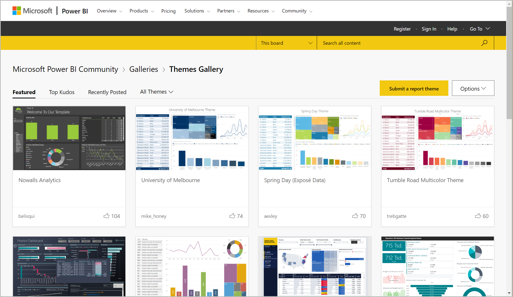

# <a name="use-dashboard-themes-in-the-power-bi-service"></a>在 Power BI 服務中使用儀表板佈景主題
透過 **儀表板佈景主題**，即可將某個色彩佈景主題套用到整個儀表板，例如公司色彩、季節性色彩，或您可能想要套用的任何其他色彩佈景主題。 當套用儀表板佈景主題時，儀表板上的所有視覺效果都會使用您所選佈景主題中的色彩。 但有一些例外，如本文的[＜考量與限制＞](#considerations-and-limitations)一節中所述。


變更儀表板上的報表視覺效果色彩，並不會影響相關聯報表中的視覺效果。 此外，當從[已套用報表佈景主題](desktop-report-themes.md)的報表釘選磚時，也可以選擇要保留目前的佈景主題，還是要使用儀表板佈景主題。


## <a name="prerequisites"></a>必要條件
* 如果要跟著做，[請開啟 [銷售與行銷範例] 儀表板](sample-datasets.md)。


## <a name="how-dashboard-themes-work"></a>儀表板佈景主題的運作方式
若要開始使用，請開啟已建立或可編輯的儀表板。 選取 [編輯] > [儀表板佈景主題]。 


在顯示的儀表板窗格中，選取其中一個預先建立的佈景主題。  在下方範例中，我們選取了 [深色]。

![選取了 [淺色] 選項](media/service-dashboard-themes/power-bi-theme-menu.png)

![套用了 [深色] 選項](media/service-dashboard-themes/power-bi-theme-dark.png)

## <a name="create-a-custom-theme"></a>建立自訂佈景主題

Power BI 儀表板的預設佈景主題是 [淺色]。 如果您想要自訂色彩或建立自己的佈景主題，請在下拉式清單中選取 [自訂]。 

![從下拉式清單中選取 [自訂]](media/service-dashboard-themes/power-bi-theme-custom.png)

使用自訂選項建立自己的儀表板佈景主題。 若要新增背景影像，建議您使用解析度至少有 1920x1080 的影像。 若要使用影像做為背景，請將影像上傳到公開網站並複製 URL，然後將它貼到 [影像 URL] 欄位中。 

## <a name="use-a-json-theme"></a>使用 JSON 佈景主題
另一個建立自訂佈景主題的方法是上傳 JSON 檔案，其中有您要用於儀表板的所有色彩設定。 在 Power BI Desktop 中，報表建立者會使用 JSON 檔案來[建立報表佈景主題](desktop-report-themes.md)。 您可為儀表板上傳同一批的 JSON 檔案，或從 Power BI 社群的[佈景主題資源庫頁面](https://community.powerbi.com/t5/Themes-Gallery/bd-p/ThemesGallery)找到並上傳 JSON 檔案。 



您也可以將自己的自訂佈景主題儲存為 JSON 檔案，然後與其他儀表板建立者共用。 

### <a name="use-a-theme-from-the-theme-gallery"></a>使用佈景主題資源庫中的佈景主題

如同內建和自訂選項，當上傳佈景主題時，系統會將色彩自動套用到儀表板上的所有磚。 

1. 暫留在一個佈景主題上，然後選擇 [檢視報表]。

    

2. 向下捲動，尋找 JSON 檔案的連結。  選取下載圖示並儲存檔案。

    

3. 返回 Power BI 服務，在 [自訂儀表板佈景主題] 視窗中選取 [上傳 JSON 佈景主題]。

    

4. 瀏覽到您儲存 JSON 佈景主題檔案的位置，然後選取 [開始]。

5. 在 [儀表板佈景主題] 頁面上選取 [儲存]。 新的佈景主題隨即套用到您的儀表板。

    

## <a name="reports-and-dashboards-with-different-themes"></a>具有不同佈景主題的報表和儀表板

如果報表使用的佈景主題與儀表板佈景主題不同，在大部分的情況下，您可控制視覺效果要保留目前的佈景主題，還是要使用儀表板佈景主題。 不過，儀表板中的卡片視覺效果會使用 'DIN' 字型家族和黑色文字。 您可建立自訂儀表板佈景主題來變更儀表板上所有磚 (包括卡片) 的文字色彩。

- 將磚釘選到儀表板時，若要保留報表佈景主題，請選取 [保留目前的佈景主題]。 儀表板上的視覺效果會保留報表佈景主題，包括透明度設定。

    您唯一會看見 [磚佈景主題] 選項的機會為在您於 Power BI Desktop 中建立報表、[新增報表佈景主題](desktop-report-themes.md)，然後將報表發佈到 Power BI 服務時。

    ![選取了 [保留目前的佈景主題]](media/service-dashboard-themes/power-bi-keep-current.png)

- 請嘗試重新釘選磚，並選取 [使用儀表板佈景主題]。

    

## <a name="dashboard-theme-json-file-format"></a>儀表板佈景主題的 JSON 檔案格式

在其最基本的層級中，主題 JSON 檔案只有一個必要的行：**name**。

```json
{
    "name": "Custom Theme"
}
```

除了 **name** 之外，所有其他項目都是選擇性的。 您可只將特別想要格式化的屬性新增至佈景主題檔案，然後針對其他項目繼續使用 Power BI 預設值。

儀表板主題的 JSON 檔案包括：

- name：佈景主題名稱 (唯一必要的欄位)。
- foreground 和 background：儀表板的色彩。
- dataColors：要用於圖表中資料的十六進位碼清單。 您可視需要包含幾個或多個色彩。
- tiles：儀表板的背景和色彩設定。
- visualStyles：視覺效果的細微格式。

以下是預設淺色佈景主題的範例佈景主題 JSON：

```json
{

"name":"Light",

"foreground":"#000000",

"background":"#EAEAEA",

"dataColors":["#01B8AA","#374649","#FD625E","#F2C80F","#5F6B6D","#8AD4EB","#FE9666","#A66999"],

"tiles":{"background":"#FFFFFF","color":"#000000"},

"visualStyles":{"*":{"*":{"*":[{"color":{"solid":{"color":"#000000"}}}]}}}

}
```

## <a name="considerations-and-limitations"></a>考量與限制

* 您無法將儀表板佈景主題套用到釘選的動態報表頁面、iframe 磚、SSRS 磚、活頁簿磚或影像。
* 您會在行動裝置上看到儀表板佈景主題，但只能在 Power BI 服務中建立儀表板佈景主題。
* 儀表板自訂佈景主題只能搭配從報表釘選的磚使用。

## <a name="next-steps"></a>後續步驟

- [將佈景主題套用至報表](desktop-report-themes.md)
