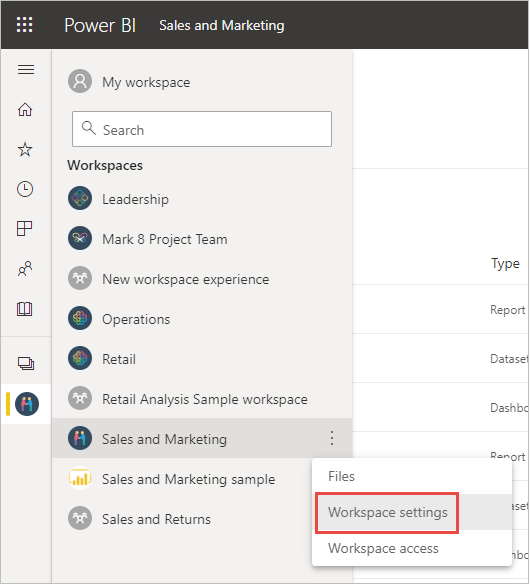

# 刪除 Power BI 服務中的絶大部分項目
本文會示範如何刪除 Power BI 服務中的儀表板、報表、活頁簿、資料集、應用程式、視覺效果或工作區。 除一些例外狀況外，您可刪除 Power BI 服務中的絕大部分項目。 

## 刪除儀表板、報表、資料集或活頁簿

1. 在工作區中，選取 [全部] 索引標籤。
1. 選取所要刪除資產旁的 [其他選項 (...)]，然後選取 [刪除]。

    ![依序選取 [更多選項] 和 [刪除] 的螢幕擷取畫面。](media/service-delete/power-bi-delete-dashboard.png)

1. 選取 [刪除] 確認刪除。

## 從應用程式清單頁面中移除應用程式

您可從應用程式清單頁面中輕鬆移除應用程式。 移除應用程式並不會刪除其他成員的應用程式。 只有系統管理員或成員或工作區可永久刪除該工作區的應用程式。

1. 在導覽窗格中，選取 [應用程式] 以開啟應用程式清單頁面。
2. 將滑鼠游標移至要刪除的應用程式上方，然後選取刪除 :::image type="icon" source="media/service-delete/power-bi-delete-report2.png" border="false"::: 圖示。

   

   如果您不小心移除應用程式，則有數個選項可以進行復原。  您可要求應用程式建立者重新傳送該應用程式、找到包含應用程式連結的原始電子郵件、檢查[通知中心](../consumer/end-user-notification-center.md)以查看是否仍列出該應用程式的通知，或檢查[組織的 AppSource](../consumer/end-user-apps.md)。

## 移除或刪除工作區

Power BI 有兩種不同的工作區：原始或「傳統」工作區，以及新的工作區。 移除或刪除這兩種工作區的程序不同。 請參閱[新工作區和傳統工作區](../collaborate-share/service-new-workspaces.md)。

### 從新工作區中移除成員

只有工作區系統管理員可從新的工作區中移除人員。 如果您是系統管理員，則可移除自己或其他人。 但您如果是工作區的唯一系統管理員，則 Power BI 不會讓您移除您自己。

1. 在工作區清單檢視中，選取右上角的 [存取]。

    :::image type="content" source="media/service-delete/power-bi-select-access.png" alt-text="選取 [存取] 的螢幕擷取畫面。":::

1. 在 [存取] 窗格中，選取所要移除人員名稱旁邊的 [其他選項 (...)]，然後選取 [移除]。

    :::image type="content" source="media/service-delete/power-bi-access-remove.png" alt-text="在 [存取] 窗格中選取 [移除] 的螢幕擷取畫面。":::

### 刪除新工作區

當建立其中一個「新工作區」時，您不會建立相關聯的 Microsoft 365 群組。 如果您是工作區系統管理員，則可刪除新的工作區，但不影響任何 Microsoft 365 群組。 請參閱[新工作區和傳統工作區](../collaborate-share/service-new-workspaces.md)。

身為工作區的系統管理員，您可刪除工作區，或移除其中的成員。 刪除工作區時也會刪除所有群組成員的相關聯應用程式，並從 AppSource 中移除該應用程式。 

1. 從導覽窗格中選取 [工作區]

2. 選取所要刪除工作區右側的 [其他選項 (...)]，然後選擇 [工作區設定]。

    ![選取 [其他選項 (...)] > [工作區設定] 的螢幕擷取畫面。](media/service-delete/power-bi-delete-workspace.png)

3. 在 [工作區設定] 窗格中，選取 [刪除工作區] > [刪除]。

### 從清單中移除傳統工作區

如果不想繼續保持某個傳統工作區的成員身分，您可「離開」工作區，並從清單中移除此工作區。 保留工作區，會針對所有其他工作區成員將它保留在原地。  

> [!NOTE]
> 如果您是此工作區的唯一系統管理員，則 Power BI 不會允許您離開。
>

1. 從您要移除的工作區開始。

2. 選取右上角的 [其他選項 (…)]，然後選擇 [離開工作區] > [離開]。

      :::image type="content" source="media/service-delete/power-bi-leave-workspace.png" alt-text="[其他選項 (…)] > [離開工作區] 的螢幕擷取畫面。":::

   > [!NOTE]
   > 您在下拉式清單中所看到選項取決於您是該工作區的系統管理員或成員。
   >

### 刪除傳統工作區

> [!WARNING]
> 建立「傳統」工作區時會建立 Microsoft 365 群組。 所以，刪除傳統工作區時也會刪除該 Microsoft 365 群組。 而此群組也會從 SharePoint 和 Microsoft Teams 等其他 Microsoft 365 產品中刪除。
> 

刪除工作區與離開工作區不同。 您必須是工作區系統管理員才能刪除工作區。 刪除工作區時也會刪除所有群組成員的相關聯應用程式，並從 AppSource 中移除該應用程式。 但您如果是工作區的唯一系統管理員，則 Power BI 不會讓您離開。

1. 從導覽窗格中選取 [工作區]。

2. 選取所要刪除工作區旁邊的 [其他選項 (…)] > [工作區設定]。

    

3. 在 [設定] 窗格中，選取 [刪除工作區]，然後確認 [刪除]。

    ![[刪除工作區] 的螢幕擷取畫面。](media/service-delete/power-bi-delete-classic-workspace.png)

## 考量與限制

- 移除「儀表板」並不會刪除其下資料集或與此儀表板建立關聯的任何報表。
- 如果您是「儀表板或報表的擁有者」，您即可移除儀表板或報表。 如已與同事共用，則移除您 Power BI 工作區中的儀表板或報表，也會移除同事 Power BI 工作區中的相同項目。
- 如果是「別人與您共用的儀表板或報表」，您就無法將其移除。
- 刪除報表不會刪除報表所依據的資料集。  從報表釘選至儀表板的所有視覺效果也皆為安全。 其會保留在儀表板上，直到您一一加以刪除。
- 您可刪除「資料集」。 不過，刪除資料集也會刪除包含該資料集資料的所有報告和儀表板圖格。
- 您可移除「活頁簿」。 不過，移除活頁簿也會移除包含這個活頁簿資料的所有報表和儀表板磚。 如果活頁簿儲存在商務用 OneDrive 上，則將其從 Power BI 中刪除並不會同時從 OneDrive 中刪除。
- 如果「儀表板或報表」屬於[組織內容套件](../collaborate-share/service-organizational-content-pack-disconnect.md)，您即無法使用這個方法來刪除儀表板或報表。  請參閱[移除與組織內容套件的連接](../collaborate-share/service-organizational-content-pack-disconnect.md)。
- 如果「資料集」屬於一或多個組織內容套件，則刪除此資料集的唯一方式是：先從正在使用此資料集的內容套件中移除它，等待處理後，再次嘗試刪除。

## 後續步驟

本文涵蓋如何刪除 Power BI 服務的主要建置組塊。 您也可以刪除以下的這些其他項目。  

- [移除精選儀表板](../consumer/end-user-featured.md)
- [移除儀表板 (將儀表板移除最愛)](../consumer/end-user-favorite.md)
- [刪除儀表板磚](service-dashboard-edit-tile.md)

有其他問題嗎？ [試試 Power BI 社群](https://community.powerbi.com/)