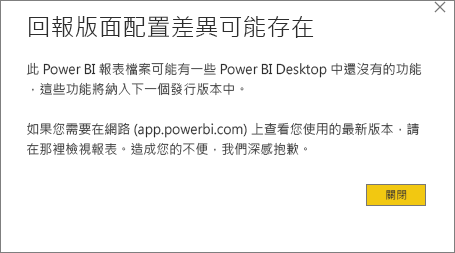
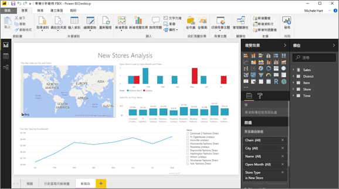

# 從 Power BI 服務將報表下載到 Power BI Desktop (預覽)
      
在 Power BI Desktop 中，您可以將報表 *.pbix* 檔案) 從本機電腦發佈至 Power BI 服務。 Power BI 報表也可以移至另一個方向：您可以從 Power BI 服務將報表下載到 Power BI Desktop。 在任一情況下，Power BI 報表的副檔名都是 .pbix。

有幾項需要注意的限制，將在本文的[考量和疑難排解](#considerations-and-troubleshooting)一節中討論。

![[檔案] 下拉式清單](media/service-export-to-pbix/power-bi-file-export.png)

## 將報表下載為 .pbix 檔案

您只能下載 2016 年 11 月 23 日後[使用 Power BI Desktop 建立](/learn/modules/publish-share-power-bi/2-publish-reports)的報表，以及在這之後更新的報表。 如果報表在這之前建立，則 Power BI 服務中的 [下載報表] 功能表選項會是灰色。

若要下載 .pbix 檔案，請遵循下列步驟：

1. 在 Power BI 服務中，以[編輯檢視](https://docs.microsoft.com/power-bi/service-interact-with-a-report-in-editing-view)開啟您想要下載的報表。

2. 從上方導窗格中，選取 [檔案] > [下載報表]。
   
3. 報表下載時，狀態橫幅會顯示進度。 當檔案已準備就緒時，系統會詢問您要在何處儲存 .pbix 檔案。 檔案的預設名稱與報表標題相符。
   
4. 如果您還沒有這麼做，請[安裝 Power BI Desktop](../fundamentals/desktop-get-the-desktop.md)，然後在 Power BI Desktop 中開啟 .pbix 檔案。
   
    當您在 Power BI Desktop 中開啟報表時，您可能會看到警告訊息，指出 Power BI 服務報表中可用的某些功能不適用於 Power BI Desktop。
   
    

5. Power BI Desktop 中報表編輯器類似於 Power BI 服務中的報表編輯器。  
   
    

## 考量與疑難排解

從 Power BI 服務下載 .pbix 檔案有幾項重要的相關考量和限制。

* 若要下載檔案，您必須要有報表的編輯存取權。
* 報表必須是使用 Power BI Desktop 建立，並已「發佈」到 Power BI 服務，或必須已將 .pbix 檔案「上傳」到 Power BI 服務。
* 報表必須在 2016 年 11 月 23 日之後發佈或更新。 在這之前發佈的報表無法下載。
* 此功能不適用於原本在 Power BI 服務中建立的報表和內容套件。
* 開啟下載的檔案時，請一律使用最新版本的 Power BI Desktop。 下載的 .pbix 檔案可能無法在舊版 Power BI Desktop 中開啟。
* 如果系統管理員已關閉下載資料的功能，在 Power BI 服務中就不會看到此功能。
* 使用累加式重新整理的資料集不能下載為 .pbix 檔案。
* 針對[大型模型](../admin/service-premium-large-models.md)啟用的資料集無法下載為 .pbix 檔案。
* 使用 [XMLA 端點](../admin/service-premium-connect-tools.md)修改的資料集無法下載為 .pbix 檔案。
* 如果根據某個工作區的資料集建立 Power BI 報表，且將其發佈至不同工作區，您與使用者即無法進行下載。 此案例目前不支援下載功能。

## 後續步驟

檢視 **Guy in a Cube** 關於此功能的一分鐘影片：

<iframe width="560" height="315" src="https://www.youtube.com/embed/ymWqU5jiUl0" frameborder="0" allowfullscreen></iframe>

以下其他文章可以協助您了解如何使用 Power BI 服務：

* [Power BI 中的報表](../consumer/end-user-reports.md)
* [Power BI 服務中的設計工具基本概念](../fundamentals/service-basic-concepts.md)

安裝 Power BI Desktop 之後，參閱下列文章能幫助您快速啟動並執行：

* [開始使用 Power BI Desktop](../fundamentals/desktop-getting-started.md)

有其他問題嗎？ [試試 Power BI 社群](https://community.powerbi.com/)。
