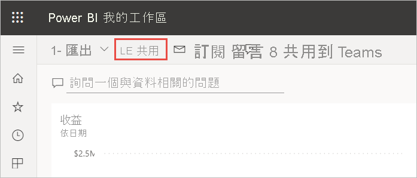

# 教學課程：從 Excel 活頁簿到 Power BI 服務，再到 Microsoft Teams
管理員想要在一天結束時，查看最新銷售與收益圖表的報表。 但最新的資料會在您膝上型電腦的檔案中。 在過去，需要好幾個小時的時間才能建立報表，所以您覺得有點焦慮。

但別擔心。 有了 Power BI，您就可以建立出色的報表，並在 Microsoft Teams 中隨時共用！

:::image type="content" source="media/service-from-excel-to-stunning-report/power-bi-financial-report-service.png" alt-text="完成的財務範例報表的螢幕擷取畫面":::

在此教學課程中，我們將上傳 Excel 檔案、建立新的報表，並在 Microsoft Teams 與同事共用，這全部可從 Power BI 內進行。 您將學習如何：

> [!div class="checklist"]
> * 在 Excel 中準備資料。
> * 下載範例資料。
> * 在 Power BI 服務中建置報表。
> * 將報表視覺效果釘選到儀表板。
> * 在儀表板上共用連結。
> * 在 Microsoft Teams 中共用儀表板

## 必要條件
- [註冊 Power BI 服務](../fundamentals/service-self-service-signup-for-power-bi.md)。 
- 下載[財務範例活頁簿](https://go.microsoft.com/fwlink/?LinkID=521962)，並將其儲存到您的電腦或商務用 OneDrive。

## 在 Excel 中準備資料
以一個簡單的 Excel 檔做為範例。 

1. 將 Excel 檔載入 Power BI 之前，必須先將資料整理放在二維資料表中。 在二維資料表中，每個資料行包含相同的資料類型；例如，文字、日期、數字或貨幣。 您的資料表應該要有標題列，但不應該是任何顯示總計的資料行或資料列。

   

2. 接下來，將資料格式化為資料表。 在 Excel 中，於 [首頁] 索引標籤的 [樣式] 群組中，選取 [格式化為表格]。 

3. 選取要套用至您工作表的表格樣式。 

   現在 Excel 即已備妥可載入 Power BI 中。

   

## 將 Excel 檔案上傳至 Power BI 服務
Power BI 服務可連接至許多資料來源，包括您電腦上的 Excel 檔案。

1. 若要開始使用，請登入 Power BI 服務。 若尚未註冊，[可以免費註冊](https://powerbi.com)。
1. 在 [我的工作區] 中，選取 [新增] > [上傳檔案]。

    :::image type="content" source="media/service-from-excel-to-stunning-report/power-bi-new-upload.png" alt-text="上傳檔案選項的螢幕擷取畫面。":::

1. 選取 [本機檔案]，瀏覽至儲存財務範例 Excel 檔案的位置，然後選取 [開啟]。
7. 在 [本機檔案] 頁面上，選取 [匯入]。

    現在您有財務範例資料集了。 Power BI 也會自動建立空白儀表板。 若沒有看到儀表板，請重新整理瀏覽器。

    :::image type="content" source="media/service-from-excel-to-stunning-report/power-bi-financial-dataset.png" alt-text="具有財務範例資料集的 [我的工作區] 其螢幕擷取畫面。":::

2. 您想要建立報表。 仍然在 [我的工作區] 中，選取 [新增] > [報表]。

   ![[新報表] 選項的螢幕擷取畫面。](media/service-from-excel-to-stunning-report/power-bi-new-report.png)

3. 在 [選取資料集來建立報表] 對話方塊中，選取 [財務範例] 資料集 > [建立]。

   ![[選擇資料集] 對話方塊的螢幕擷取畫面。](media/service-from-excel-to-stunning-report/power-bi-select-dataset.png)

## 建立報表
 
報表會以 [編輯] 檢視開啟，並顯示空白報表畫布。 右側為 [視覺效果]、[篩選] 與 [欄位] 窗格。 Excel 活頁簿資料表資料會出現在 [欄位] 窗格中。 最上方是 **財務** 資料表的名稱。 Power BI 會在底下列出資料行標題，作為個別的欄位。

您有在 [欄位] 清單中看到 Σ 符號嗎？ Power BI 已偵測到這些欄位為數值。 其也表示具有地球符號的地理欄位。

![Excel 資料在 [欄位] 窗格中外觀的螢幕擷取畫面。](media/service-from-excel-to-stunning-report/power-bi-fields-list-financial.png)

1. 若要讓報表畫布擁有更多空間，請選取 [隱藏功能窗格]，然後將 [篩選] 窗格最小化。

    :::image type="content" source="media/service-from-excel-to-stunning-report/power-bi-hide-nav-pane.png" alt-text="最小化功能窗格的螢幕擷取畫面。"::: 

1. 現在即可開始建立視覺效果。 假設您經理想要查看一段時間的收益。 在 [欄位] 窗格中，將 [收益] 拖曳至報表畫布。 

   根據預設，Power BI 會顯示包含一個資料行的直條圖。 

    :::image type="content" source="media/service-from-excel-to-stunning-report/power-bi-profit-column.png" alt-text="包含一個資料行的直條圖其螢幕擷取畫面。":::

3. 將 [日期] 拖曳至報表畫布。 

   Power BI 會更新直條圖，以依據日期來顯示收益。

   

    2014 年 12 月是獲利最多的月份。
   
    > [!TIP]
    > 若圖表值看起來未如預期，請檢查彙總。 例如，在 [值] 中選取剛新增的 [收益] 欄位，並確認資料以想要的方式彙總。 在本例中，我們使用 [加總]。
    > 

### 建立地圖

您的經理想要知道利潤最高的國家/地區。 用地圖視覺效果來讓管理員覺得印象深刻吧。 

1. 選取報表畫布中的空白區域。 

2. 從 [欄位] 窗格，將 [國家/地區] 欄位拖曳至報表畫布，然後將 [收益] 欄位拖曳至地圖。

   Power BI 會建立地圖視覺與泡泡，代表每個地點相對的收益。

   

    歐洲國家/地區看起來更勝於北美洲國家/地區。

### 建立顯示銷售的視覺效果

想要以圖形依產品及市場區段顯示銷售額嗎? 簡單。 

1. 選取空白畫布。

1. 在 [欄位] 窗格中，選取 [銷售]、[產品] 及 [市場區隔] 欄位。 
   
   Power BI 會建立群組直條圖。 

2. 選擇 [視覺效果] 功能表中的任一圖示來變更圖表的類型。 例如，將其變更為 [堆疊直條圖]。 

   

3. 若要排序圖表，請選取 [更多選項] (...) > [排序依據]。

### 裝飾視覺效果

在 [視覺效果] 窗格的 [格式] 索引標籤上進行下列變更。

:::image type="content" source="media/desktop-excel-stunning-report/power-bi-format-tab-visualizations.png" alt-text="[視覺效果] 窗格中 [格式] 索引標籤的螢幕擷取畫面。":::

1. 選取 [依據日期的收益] 直條圖。 在 [標題] 區段中，將 [文字大小] 變更為 [16 pt]。 將 [陰影] 切換為 [開啟]。 

1. 選取 [依產品與區段] 堆疊直條圖。 在 [標題] 區段中，將標題 [文字大小] 變更為 [16 pt]。 將 [陰影] 切換為 [開啟]。

1. 選取 [依據國家/地區的收益] 地圖。 在 [地圖樣式] 區段中，將 [主題] 變更為 [灰階]。 在 [標題] 區段中，將標題的 [文字大小] 變更為 [16 pt]。 將 [陰影] 切換為 [開啟]。

## 釘選到儀表板

現在您可將所有視覺效果釘選到 Power BI 依據預設建立的空白儀表板。 

1. 將滑鼠暫留在視覺效果上，並選取 [釘選視覺效果]。

   

1. 您必須先儲存報表，才能將視覺效果釘選到儀表板。 為報表命名並選取 [儲存]。
1. 將每個視覺效果釘選到 Power BI 建立的儀表板，**Financial Sample.xlsx**。
1. 當釘選上一個視覺效果時，請選取 [前往儀表板]。
1. Power BI 會自動將暫存區 Financial Sample.xlsx 磚新增至儀表板。 選取 [更多選項 (...)] > [刪除磚]。

    :::image type="content" source="media/service-from-excel-to-stunning-report/power-bi-tile-more-options.png" alt-text="磚的 [更多選項] 其螢幕擷取畫面。":::

1. 以想要的任何方式來重新排列及調整磚大小。

儀表板與報表已就緒。

## 在儀表板上共用連結

現在是與管理員共用儀表板的時候了。 您可以與具有 Power BI 帳戶的任何同事，共用您的儀表板與基礎報表。 他們可以與您的報表互動，但無法儲存變更。 若您允許，則其可與其他人再次共用，或根據基礎資料集來建置新的報表。

1. 若要共用您的報表，請在儀表板頂端選取 [共用] 。

   

2. 在 [共用儀表板] 頁面的 [輸入電子郵件地址] 中，輸入收件者的電子郵件地址，並在其下方塊中新增訊息。 

3. 決定想要的其中一個選項 (如果有的話)：

    - **允許收件者共用儀表板**。 
    - **允許收件者使用基礎資料集建置新的內容**。
    - **傳送電子郵件通知給收件者。**

   ![[共用儀表板] 窗格的螢幕擷取畫面](media/service-from-excel-to-stunning-report/power-bi-share-dashboard-pane.png)

1. 選取 [共用] 。

## 共用至 Microsoft Teams

您也可以直接與 Microsoft Teams 的同事共用報表與儀表板。

1. 若要在 Teams 中共用，請在儀表板頂端選取 [在 Teams 中聊天]。

   ![[在 Teams 中聊天] 選項的螢幕擷取畫面。](media/service-from-excel-to-stunning-report/power-bi-share-teams.png)

2. Power BI 會隨即顯示 [共用到 Teams] 對話方塊。 請輸入人員、群組或頻道的名稱，然後選取 [共用]。 
   
    :::image type="content" source="media/service-from-excel-to-stunning-report/power-bi-share-teams-dialog.png" alt-text="[共用到 Teams] 對話方塊的螢幕擷取畫面":::

3. 此連結會出現在該人員、群組或頻道的 [貼文] 中。

   

## 後續步驟

* 現在您已在 Power BI 服務中建立基本報表，接著如何在 Power BI Desktop 中建立報表？ 請嘗試使用下列教學課程：[將 Excel 活頁簿轉變為令人驚豔的 Power BI Desktop 報表](desktop-excel-stunning-report.md)。

有其他問題嗎？ [試試 Power BI 社群](https://community.powerbi.com/)。
