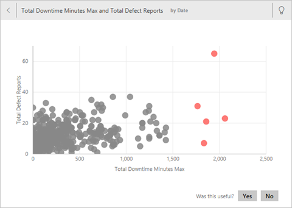
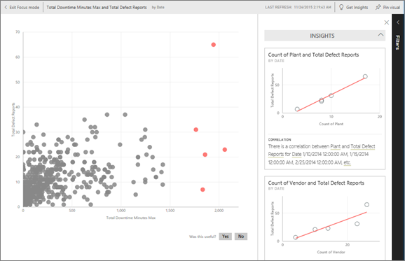

# 使用 Power BI 針對資料集自動產生資料見解
您有新的資料集，但不確定要從何處著手？  需要快速建置儀表板嗎？  想要尋找您可能錯失的深入解析嗎？

請執行快速見解，根據資料產生有趣的視覺效果。 此文章說明如何針對整個資料集執行快速見解 (快速見解)。 您也可以[在特定儀表板磚上執行快速見解](../consumer/end-user-insights.md) (限域見解)。 您甚至可以針對深入資訊執行深入解析！

> [!NOTE]
> 見解不適用於 DirectQuery；它僅適用於上傳至 Power BI 的資料。
> 

我們針對利用 Microsoft Research 所開發且不斷增長之[一組進階分析演算法](../consumer/end-user-insight-types.md)建置了見解功能。 我們會繼續使用這些演算法，協助更多人以全新且直覺的方式來尋找其資料中的見解。 您可能也有興趣了解如何[將資料最佳化以取得快速見解](service-insights-optimize.md)。

## 對資料集執行快速深入剖析
觀看 Amanda 如何針對資料集執行快速見解，並在焦點模式中開啟見解。 Amanda 會將見解釘選為儀表板上的磚，然後取得儀表板磚的見解。

<iframe width="560" height="315" src="https://www.youtube.com/embed/et_MLSL2sA8" frameborder="0" allowfullscreen></iframe>

現在換您試試看。 使用[供應商品質分析範例](sample-supplier-quality.md)探索見解。

1. 從 [資料集] 索引標籤，選取 [更多選項] (...)，然後選擇 [取得快速見解]。
   
    ![[資料集] 索引標籤](media/service-insights/power-bi-ellipses.png)
   
    
2. Power BI 使用[各種演算法](../consumer/end-user-insight-types.md)來搜尋資料集中的趨勢。
   
    ![[正在搜尋深入資訊] 對話方塊](media/service-insights/pbi_autoinsightssearching.png)
3. 您的深入剖析資訊會在幾秒內準備就緒。  選取 [檢視深入資訊] 以顯示視覺效果。
   
    
   
    > [!NOTE]
    > 某些資料集會因為資料不具顯著性差異，而無法產生見解。  若要深入了解，請參閱[將資料最佳化以進行深入解析](service-insights-optimize.md)。
    > 
    
4. 視覺效果會在特殊的 **深入資訊摘要** 畫布中顯示，最多可包含 32 個不同的深入剖析卡片。 每張卡片會有一個圖表或圖形，並附上簡短的描述。
   
    

## 與深入解析卡片互動

1. 將滑鼠暫留在卡片上，然後選取釘選圖示，已將視覺效果新增至儀表板。

2. 將游標暫留在卡片上方，選取 [更多選項] (...)，然後選擇 [檢視見解]。 

    隨即在焦點模式中開啟見解畫面。
   
    
3. 在焦點模式中，您可以︰
   
   * 篩選視覺效果。 如果尚未開啟 [篩選] 窗格，請選取視窗右側的箭號加以展開。

       ![展開見解的 [篩選] 功能表](media/service-insights/power-bi-insights-filter-new.png)
   * 透過選取 [釘選視覺效果]，將見解卡釘選到儀表板。
   * 在卡片本身執行見解，這通常稱為「定義範圍的見解」。 在右上角，選取燈泡圖示  或 [取得見解]。
     
       
     
     見解會顯示於左側。 只以該單一見解中的資料為基礎的新卡片則會沿著右側顯示。
     
       
4. 若要返回原始的深入解析畫布，請選取左上角的 [結束焦點模式]。

## 後續步驟
- 如果您擁有資料集，請[針對快速見解將它最佳化](service-insights-optimize.md)。
- 了解[可用的快速見解類型](../consumer/end-user-insight-types.md)。

有其他問題嗎？ [試試 Power BI 社群](https://community.powerbi.com/)。
