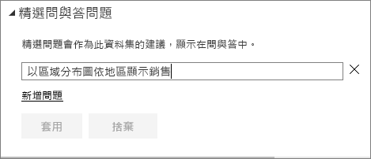
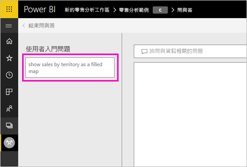
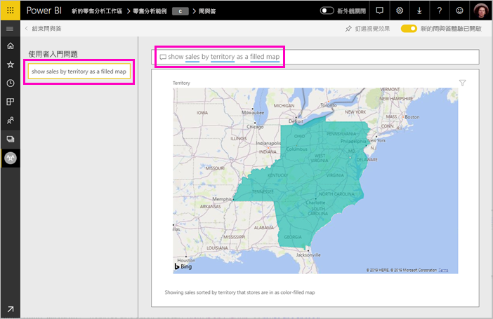

# 建立 Power BI 問與答的精選問題
如果您有資料集的編輯權限，即可將自己的精選問題新增至該資料集。 Power BI Q&A 會向根據該資料集取用儀表板的同事顯示這些問題。  精選問題可讓您的同事有些概念，知道要針對資料集詢問哪類問題。 您可自行決定要新增什麼精選問題 -- 新增熱門問題、會顯示有趣結果的問題，或難以簡短說明的問題。

> [!NOTE]
> Q&A 精選問題適用於 [iPad、iPhone 及 iPod Touch 裝置上的 Microsoft Power BI 應用程式](../consumer/mobile/mobile-apps-ios-qna.md)以及 Power BI 服務 (app.powerbi.com)。 只有 Power BI 服務才能建立問題。
> 

## 建立精選問題

本文使用[零售分析銷售範例](sample-datasets.md)。 請遵循逐步指示，親自嘗試探索資料集。

1. 在儀表板上，選取 [問與答] 問題方塊。   您會發現問與答顯示出資料集中出現的詞彙清單，這非常有幫助。
2. 若要新增至此清單，請選取 Power BI 右上角的齒輪圖示。  
   
3. 選取 [設定] &gt; [資料集] &gt; [零售分析範例] &gt; [精選問與答問題]。  
4. 選取 [新增問題] 。
   
   ![[設定] 功能表](media/service-q-and-a-create-featured-questions/power-bi-settings.png)
5. 在文字方塊中鍵入問題。 例如，鍵入「依國家/地區顯示去年銷售額的區域分佈圖」，然後選取 [套用]。   如果要新增其他問題，您也可以重複選取 [新增問題]。  
   
6. 瀏覽回零售分析範例的 Power BI 儀表板，並將您的游標放在 [問與答] 問題方塊中。   
   
7. 清單中的第一個新精選問題為 **依國家/地區顯示去年銷售額的區域分佈圖**。 請加以選取。  
8. Power BI 會建立答案，並將其顯示為區域分布圖視覺效果。  
   

## 後續步驟

- [取用者問與答](../consumer/end-user-q-and-a.md)  
- [在儀表板和報表中使用問與答](power-bi-tutorial-q-and-a.md)  
- [Power BI 服務中的設計工具基本概念](../fundamentals/service-basic-concepts.md)  

有其他問題嗎？ [試試 Power BI 社群](https://community.powerbi.com/)
