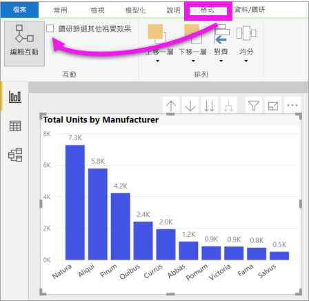

# 變更 Power BI 報表中的視覺效果互動方式
如果您有報表的編輯權限，可以使用 [視覺效果互動]  變更報表頁面上視覺效果相互影響的方式。 

## 視覺效果互動簡介
報表頁面上的視覺效果預設可用於交叉篩選和交叉醒目提示頁面上的其他視覺效果。
例如，選取地圖視覺效果的狀態，會醒目提示直條圖，並將折線圖篩選為只顯示適用於該狀態的資料。
請參閱[關於篩選及醒目提示](power-bi-reports-filters-and-highlighting.md)。 而如果您有支援[切入](../consumer/end-user-drill.md)的視覺效果，根據預設，切入某個視覺效果不會影響報表頁面上的其他視覺效果。 但您可依每個視覺效果覆寫這兩種預設行為，及設定其互動。

本文會示範如何在 Power BI Desktop 中使用**視覺效果互動**。 此程序在 Power BI 服務[編輯檢視](service-interact-with-a-report-in-editing-view.md)中是相同的。 如果您僅具有 [閱讀] 檢視存取權，或者已與您共用報表，您就不能變更視覺效果互動設定。

「交叉篩選」  與「交叉醒目提示」  這兩個詞彙用於區分本文所述，當您使用 [篩選]  窗格來篩選  視覺效果及將其醒目提示  時的這兩項行為。  

> [!NOTE]
> 這部影片使用舊版的 Power BI Desktop 和 Power BI 服務。 
>
>

<iframe width="560" height="315" src="https://www.youtube.com/embed/N_xYsCbyHPw?list=PL1N57mwBHtN0JFoKSR0n-tBkUJHeMP2cP" frameborder="0" allowfullscreen></iframe>

## 啟用視覺效果互動控制項
如果您有報表的編輯權限，您可以開啟視覺效果互動控制項，然後自訂報表頁面上的視覺效果如何篩選和醒目提示。 

1. 選取要啟用的視覺效果。  
2. 顯示 [視覺效果互動]  選項。
    

    - 在 Desktop 中，選取 [格式] > [互動]  。

        ![依序選取 [格式] 和 [互動]](media/service-reports-visual-interactions/power-bi-interaction.png)

    - 在 Power BI 服務中，於 [編輯] 檢視中開啟報表，然後從報表功能表列選取下拉式清單。

        ![[視覺互動] 下拉式清單](media/service-reports-visual-interactions/power-bi-service.png)

3. 若要顯示視覺效果互動控制項，請選取 [編輯互動]  。 Power BI 會將篩選及醒目提示圖示新增至報表頁面上所有其他視覺效果。 我們可以看到樹狀圖會交叉篩選折線圖和地圖，並會交叉醒目提示直條圖。 您現在可以變更選取的視覺效果與報表頁面上其他視覺效果的互動方式。
   
    ![開啟 [視覺互動] 的報表](media/service-reports-visual-interactions/power-bi-turn-on.png)

## 變更互動行為
藉由在報表頁面上一次選取一個視覺效果，熟悉視覺效果的互動方式。  選取資料點或橫條圖或圖形，並監看對其他視覺效果的影響。 如果您所看到的行為不是您想要的，您可以變更互動。 這些變更會與報表一起儲存，因此您和您的報表取用者將會有相同的視覺效果互動體驗。

一開始請選取視覺效果來加以啟用。  請注意，頁面上所有其他視覺效果現在都會顯示互動圖示。 粗體圖示是要套用的項目。 接下來，請決定**所選視覺效果**會對其他視覺效果產生什麼影響。  並也對報表頁面上所有其他視覺效果重複執行動作 (選用)。

如果選取的視覺效果應該要：
   
   * 交叉篩選頁面上的其中一個其他視覺效果，請選取該視覺效果右上角的**篩選**圖示 。
   * 交叉醒目提示頁面上的其中一個其他視覺效果，請選取**醒目提示**圖示 。
   * 不影響頁面上的其中一個其他視覺效果，請選取**沒有影響**圖示 。

## 變更可切入視覺效果的互動
[某些 Power BI 視覺效果可以切入](../consumer/end-user-drill.md)。 根據預設，當您切入視覺效果時，不會影響報表頁面上的其他視覺效果。 但是，您可以變更該行為。 

> [!TIP]
> 請使用 [人力資源範例 PBIX 檔案](https://download.microsoft.com/download/6/9/5/69503155-05A5-483E-829A-F7B5F3DD5D27/Human%20Resources%20Sample%20PBIX.pbix)自行嘗試。 有一個直條圖，其中包含 [新進員工]  索引標籤上的向下切入。
>

1. 選取可切入的視覺效果，使其成為作用中狀態。 

2. 選取向下切入圖示來開啟向下切入。

    

2. 從功能表列中，選取 [格式]   > [切入篩選其他視覺效果]  。  現在當您向下 (和向上) 切入視覺效果時，報表頁面上的其他視覺效果會變更，以反映目前的切入選取項目。 

    

3. 如果您所看到的行為不是您想要的，您可以[以上述方式](#change-the-interaction-behavior)變更互動。

## 考量與疑難排解
如果您使用來自不同資料表的欄位建置矩陣，當您嘗試在階層中的不同層級選取多個項目來交叉醒目提示時，系統將會在其他視覺效果上顯示錯誤。 

    
## 後續步驟
[在 Power BI 報表中進行篩選和醒目提示](power-bi-reports-filters-and-highlighting.md)