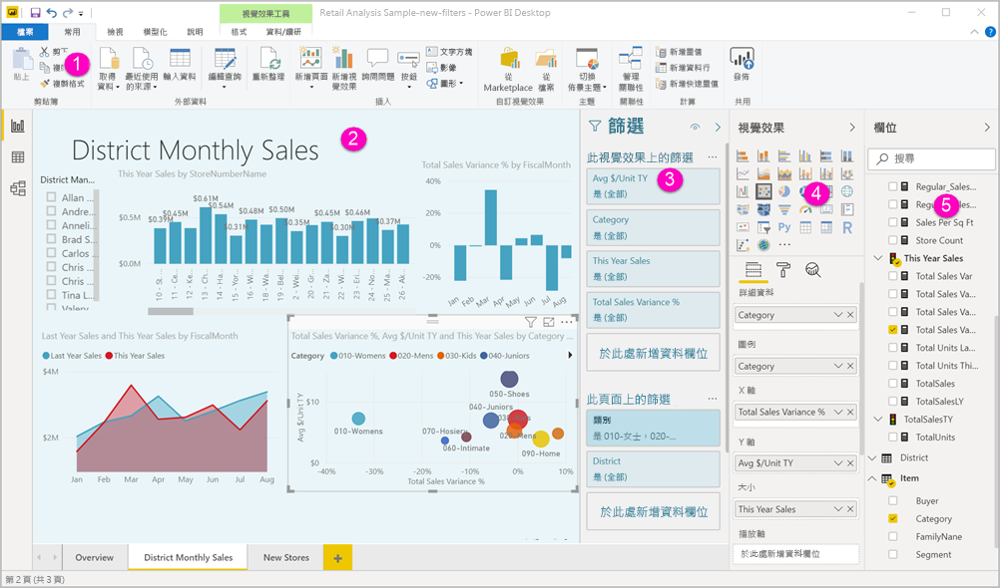
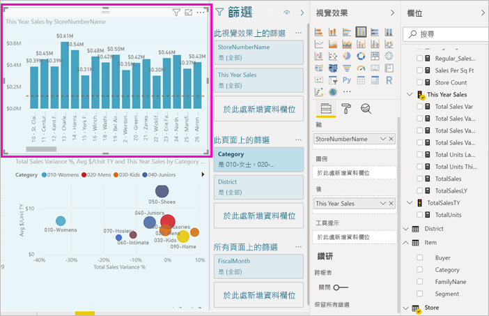
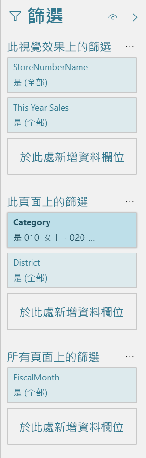

# Power BI 中的報表編輯器導覽

在 Power BI Desktop 和 Power BI 服務中，您可以在「報表編輯器」  內設計取用者所看到的報表，其中包含圖表、資料表、地圖和其他視覺效果。 這兩個環境中的報表編輯器很類似。 通常您一開始會先在 Power BI Desktop 中建立報表。 然後將其發佈至 Power BI 服務，您可以在該服務中繼續進行修改。 Power BI 服務也是您依據報表建立儀表板的位置。

建立儀表板和報表之後，就可以將它們散發給您的報表取用者。 根據您共用儀表板和報表的方式，終端使用者可以在 Power BI 服務的 [閱讀] 檢視中與它們互動，但無法加以編輯。 深入了解 [Power BI 服務為報表取用者提供了哪些功能](../consumer/end-user-reading-view.md)。 

這段影片中顯示 Power BI Desktop 中的報表編輯器。 本文也會顯示 Power BI Desktop 中的報表編輯器。 

<iframe width="560" height="315" src="https://www.youtube.com/embed/IkJda4O7oGs" frameborder="0" allowfullscreen></iframe>

在 Power BI 服務中，報表編輯器只能在 [編輯] 檢視中使用。 若要在 [編輯] 檢視開啟報表，您必須是報表擁有者或建立者，或裝載報表的工作區參與者。

Power BI 報表編輯器分成數個主要區段：  

1. 功能區
1. 報表畫布
1. [篩選] 窗格
1. [視覺效果] 窗格
1. 欄位窗格

## 1.功能區
功能區提供許多動作，且不斷新增新的動作。 如需特定動作的資訊，請使用 Power BI 文件目錄或搜尋方塊。

## 2.報表畫布
報表畫布就是顯示您工作的位置。 當您使用 [欄位]、[篩選] 和 [視覺效果] 窗格來建立視覺效果時，它們就會建置並顯示在報表畫布上。 畫布底部的每個索引標籤在報表中各代表一個頁面。 選取索引標籤，以開啟該頁面。 

## 報表編輯器窗格

當您第一次開啟報表時，會看到三個窗格：[篩選]、[視覺效果] 和 [欄位]。 左側前兩個窗格 ([視覺效果] 和 [篩選]) 可控制視覺效果成像：類型、色彩、篩選和格式化。 右側最後一個窗格 ([欄位]) 可管理視覺效果中所使用的基礎資料。 報表編輯器中顯示的內容會隨著報表畫布的選項而變化。 

例如，當您選取個別的視覺效果時 (例如這個直條圖)：

**[篩選] 窗格** 會顯示視覺效果、頁面或所有頁面上的任何篩選。 在此情況下，有頁面層級的篩選，但沒有視覺效果層級的篩選。

**[視覺效果] 窗格上方** 會指出使用中的視覺效果類型。 在此範例中，是群組直條圖。 

**[視覺效果] 窗格底部** 有三個索引標籤：

 [欄位]  會顯示視覺效果中的欄位。 您可能必須向下捲動才能查看所有詳細資料。 此圖表使用 [StoreNumberName] 和 [今年銷售額]。

[格式]  若要顯示所選視覺效果的 [格式] 窗格，請選取油漆滾筒圖示。

 [分析]  若要顯示 [分析] 窗格，請選取放大鏡圖示。

**[欄位] 窗格** 會列出資料模型中所有可用的資料表。 當您展開資料表時，您會看到該資料表中的欄位。 黃色核取記號可讓您了解該資料表至少有一個欄位位於視覺效果中。

請繼續閱讀以取得每個窗格的詳細資料。

## 3.[篩選] 窗格
使用 [篩選] 窗格在頁面、報表、鑽研和視覺效果層級來檢視、設定和修改報表的持續篩選。 是的，您可以選取視覺效果項目或使用如交叉分析篩選器之類的工具，在報表頁面和視覺效果上執行隨選篩選。 但 [篩選] 窗格中的篩選有一個優點，就是將篩選的狀態與報表一起儲存。 

[篩選] 窗格還有另一項強大的功能：您可以使用欄位進行篩選，而該欄位並未位於報表的任一視覺效果中  。 讓我詳細說明。 當您建立視覺效果時，Power BI 會自動將視覺效果中所有欄位新增到 [篩選] 窗格的視覺效果層級篩選區域。 如果您要使用目前並未用於視覺效果中的欄位來設定視覺效果、頁面、鑽研或報表篩選，只需將該欄位拖曳至其中一個篩選貯體即可。

新的篩選體驗提供更大彈性。 例如，您可以設定篩選的格式，讓它們看起來就像報表一樣。 也可以鎖定篩選或向報表取用者隱藏篩選。 

[在新的篩選體驗中深入瞭解如何格式化 [篩選] 窗格](power-bi-report-filter.md)。

## 4.[視覺效果] 窗格

[視覺效果] 窗格本身有四個區段。 我們會從窗格的頂端開始。

![[視覺效果] 窗格頂端](media/service-the-report-editor-take-a-tour/power-bi-visual-pane-icons.png)

以下是您選取視覺效果類型的位置。 小圖示會顯示您可以建立的不同類型視覺效果。 在上圖中，已選取泡泡圖。 如果您未先選取視覺效果類型，而是選取欄位來開始建置視覺效果，Power BI 將會為您選擇視覺效果類型。 您可以保留 Power BI 的選取項目，或選取不同的圖示來變更類型。

您可以將自訂視覺效果下載到 Power BI Desktop 中。 其圖示也會顯示在此窗格中。 

### 管理視覺效果中的欄位

![[視覺效果] 窗格底端](media/service-the-report-editor-take-a-tour/power-bi-visualization-field-manager.png)

這個窗格中的貯體 (有時稱為「井」  )，會隨選取的視覺效果類型而異。  例如，如果您選取的是橫條圖，您會看到 [軸]、[圖例] 和 [值]。 當您選取欄位或將其拖曳至畫布時，Power BI 就會將該欄位新增至其中一個貯體。  您也可以將 [欄位] 清單中的欄位直接拖曳至貯體。  某些貯體限於特定的資料類型。  例如，[值]  不接受非數值欄位。 因此，如果將 [類別目錄]  欄位拖曳到 [值]  貯體，Power BI 會將其變更為 [類別目錄計數]  。

如需詳細資訊，請參閱[在 Power BI 報表中新增視覺效果](../visuals/power-bi-report-add-visualizations-i.md)。

窗格的這個部分也有控制[鑽取](desktop-drillthrough.md)和篩選行為的選項。

### 格式化視覺效果
選取油漆滾筒圖示來顯示 [格式] 窗格。 可用的選項取決於選取的視覺效果類型。

![報表編輯器中的 [格式化] 窗格](media/service-the-report-editor-take-a-tour/power-bi-visual-pane-format.png)

格式化的可能性幾乎無限。  若要深入了解，請自行探索，或瀏覽這些文章︰

* [自訂視覺效果標題、背景和圖例](../visuals/power-bi-visualization-customize-title-background-and-legend.md)
* [彩色格式](../visuals/service-getting-started-with-color-formatting-and-axis-properties.md)
* [自訂 X 軸和 Y 軸屬性](../visuals/power-bi-visualization-customize-x-axis-and-y-axis.md)

### 將分析新增至視覺效果
選取放大鏡圖示，以顯示 [分析] 窗格。 可用的選項取決於選取的視覺效果類型。

![報表編輯器中的 [分析] 窗格](media/service-the-report-editor-take-a-tour/power-bi-visual-pane-analytics.png)

使用 Power BI 服務中的 [分析] 窗格，您可以將動態參考線新增至視覺效果，為重要的趨勢或深入資訊提供焦點。 若要深入了解，請參閱 [Power BI Desktop 中的 [分析] 窗格](../transform-model/desktop-analytics-pane.md)。

## 5.[欄位] 窗格
[欄位] 窗格會顯示資料中的資料表、資料夾和欄位，這些可供您用來建立視覺效果。

:::row:::
    :::column:::
        ![[欄位] 窗格](media/service-the-report-editor-take-a-tour/power-bi-fields-list.png)
    :::column-end:::
    :::column:::
        <ul><li>將欄位拖曳到頁面以開始新的視覺效果。  您也可以將欄位拖曳至現有視覺效果，以將欄位新增至該視覺效果。  </li> <li>當您在欄位旁邊新增核取記號時，Power BI 會將該欄位新增至使用中 (或新的) 視覺效果。 它也會決定要放入該欄位的貯體。  例如，欄位應該作為圖例、軸還是值？ Power BI 可進行最佳猜測，而且您可以視需要將欄位從該貯體移至另一個貯體。   </li><li>無論何種方式，每個選取的欄位都會加入報表編輯器的 [視覺效果] 窗格中。</li></ul>
    :::column-end:::
:::row-end:::

在 Power BI Desktop 中，您也可以選擇顯示/隱藏欄位、新增計算等。

## 欄位圖示

Power BI 會使用一些不同圖示來表示報表中的欄位類型。 當您可以辨識它們時，就能更進一步了解它們在不同視覺效果中的作用。 如需完整清單，請參閱[在 Power BI Desktop 中使用 [欄位] 清單的 [欄位] 清單圖示一節](../transform-model/desktop-field-list.md#field-list-changes)。

## 後續步驟
[建立報表](service-report-create-new.md)

[Power BI 服務](service-report-create-new.md)、[Power BI Desktop](desktop-report-view.md) 和 [Power BI 行動應用程式](../consumer/mobile/mobile-apps-view-phone-report.md)中的報表詳細資訊。

[Power BI 設計工具的基本概念](../fundamentals/service-basic-concepts.md)

有其他問題嗎？ [試試 Power BI 社群](https://community.powerbi.com/)
