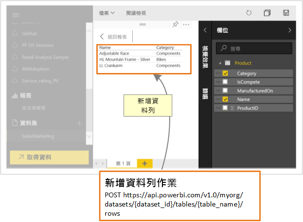

# 開發人員可如何利用 Power BI API？

使用 Power BI REST API，您就可以建立與 Power BI 報表、儀表板和圖格整合的應用程式。

使用 Power BI REST API，就可以在 Power BI 物件 (例如報表、資料集和工作區) 上執行管理工作。

以下是一些您可以使用 Power BI API 進行的操作。

| **深入了解** | **參考這項資訊** |
|----------------------------------------------------------------------------------|------------------------------------------------------------------------------------|
| 內嵌適用於 Power BI 使用者和非 Power BI 使用者的報表、儀表板和圖格。 | [如何內嵌 Power BI 儀表板、報表和磚](../embedded/embed-sample-for-customers.md) |
| 在 Power BI 物件上執行管理工作。 | [Power BI REST API 參考](/rest/api/power-bi/) |
| 擴充現有商務工作流程，將關鍵資料推送至 Power BI 儀表板。 | [將資料推入儀表板中](walkthrough-push-data.md) |
| 向 Power BI 驗證。 | [向 Power BI 驗證](../embedded/get-azuread-access-token.md) |

> [!NOTE]
> Power BI API 仍然將工作區稱為群組。 任何對群組的引述都表示您正在使用工作區。

## API 開發人員工具

| 工具 | 描述 |
|---------|-------------|
| [遊樂場工具](https://microsoft.github.io/PowerBI-JavaScript/demo) | 體驗使用 Power BI embedded analytics 用戶端 Api 的完整範例。 此工具也是一個可測試不同類型 Power BI Embedded 範例的快速方式。 |
| [Power BI embedded analytics 用戶端 Api](/javascript/api/overview/powerbi/) | 取得 Power BI 用戶端 Api 的詳細資訊。 |
| [Postman](https://www.getpostman.com/) | 執行要求、測試、偵錯、監視、執行自動化測試等。 |

## 將資料推送至 Power BI

您可以使用 Power BI API 以[將資料推送至資料集](walkthrough-push-data.md)。 此功能可讓您將資料列新增至資料集內的資料表。 新資料接著會反映在儀表板的圖格中，以及報表的視覺效果內。

## GitHub 存放庫

* [Power BI 開發人員範例](https://github.com/Microsoft/PowerBI-Developer-Samples)
* [.NET SDK](https://github.com/Microsoft/PowerBI-CSharp)
* [Power BI embedded analytics 用戶端 Api](/javascript/api/overview/powerbi/)

## 後續步驟

* [將資料推送至資料集](walkthrough-push-data.md)
* [開發 Power BI 圓形卡片視覺效果](../visuals/develop-circle-card.md)
* [Power BI REST API 參考](rest-api-reference.md)
* [Power BI REST API](/rest/api/power-bi/)

有其他問題嗎？ [嘗試在 Power BI 社群提問](https://community.powerbi.com/)