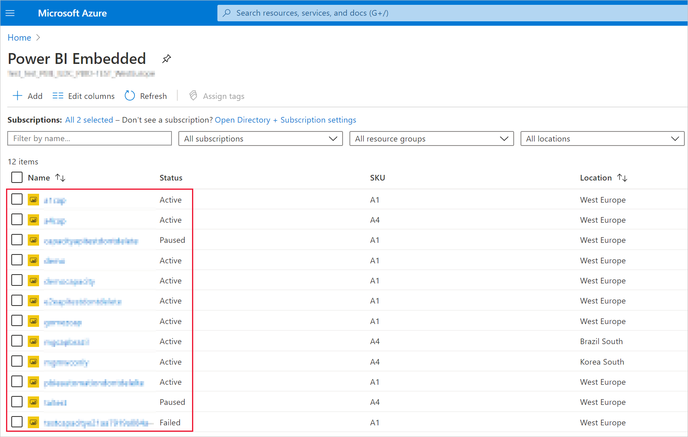
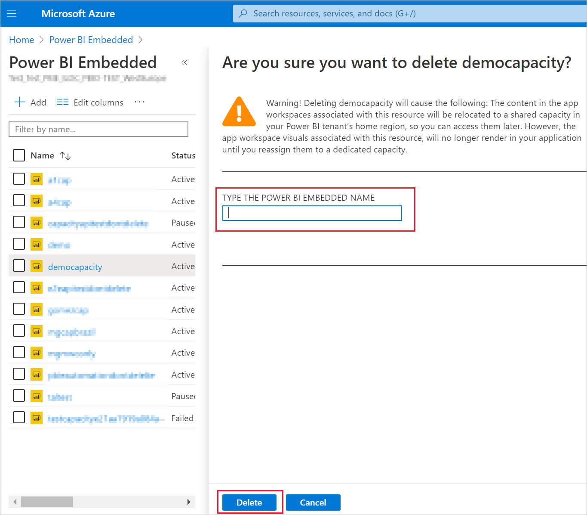

# <a name="create-power-bi-embedded-capacity-in-the-azure-portal"></a>在 Azure 入口網站中建立 Power BI Embedded 容量

本文逐步解說如何在 Microsoft Azure 中建立 [Power BI Embedded](azure-pbie-what-is-power-bi-embedded.md) 容量。 Power BI Embedded 可協助您快速將令人讚嘆的視覺效果、報表和儀表板新增至您的應用程式，藉以簡化 Power BI 功能。

## <a name="before-you-begin"></a>開始之前

若要完成本快速入門，您需要：

* **Azure 訂用帳戶：** 請瀏覽 [Azure 免費試用版](https://azure.microsoft.com/free/)以建立帳戶。

* **Azure Active Directory：** 訂用帳戶必須與 Azure Active Directory (Azure AD) 租用戶建立關聯。 此外，**_您必須使用該租用戶中的帳戶登入 Azure_* _。 不支援 Microsoft 帳戶。 若要深入了解，請參閱[驗證和使用者權限](/azure/analysis-services/analysis-services-manage-users)。

_ **Power BI 租用戶：** Azure AD 租用戶中至少有一個帳戶必須已註冊 Power BI。

* **資源群組：** 使用您已擁有的資源群組或 [建立新的資源群組](/azure/azure-resource-manager/resource-group-overview)。

## <a name="create-a-capacity"></a>建立容量

建立 Power BI Embedded 容量之前，請先確定已登入 Power BI 至少一次。

# <a name="portal"></a>[入口網站](#tab/portal)

1. 登入 [Azure 入口網站](https://portal.azure.com/)。

2. 在搜尋方塊中，搜尋 *Power BI Embedded*。

3. 在 Power BI Embedded 中，選取 [新增]。

4. 填入必要資訊，然後按一下 [檢閱 + 建立]。

    >[!div class="mx-imgBorder"]
    >![顯示 [Power B I Embedded] 頁面的 [基本] 索引標籤，以在 Azure 入口網站中建立新容量的螢幕擷取畫面。](media/azure-pbie-create-capacity/azure-create-capacity-old.png)

    * **訂用帳戶** - 要用來建立容量的訂用帳戶。

    * **資源群組** - 包含此新容量的資源群組。 從現有的資源群組中挑選，或建立另一個。 如需詳細資訊，請參閱 [Azure Resource Manager 概觀](/azure/azure-resource-manager/resource-group-overview)。

    * **資源名稱** - 容量的資源名稱。

    * **位置** - 為租用戶裝載 Power BI 的位置。 您的預設位置是您的主區域，但您可以使用 [多地理位置選項](embedded-multi-geo.md)來變更該位置。

    * **大小** - 所需的 [SKU](../../admin/service-admin-premium-purchase.md#purchase-a-skus-for-testing-and-other-scenarios)。 如需詳細資訊，請參閱 [SKU 記憶體和運算能力](./embedded-capacity.md)。

    * **Power BI 容量管理員** - 容量的系統管理員。
        >[!NOTE]
        >* 根據預設，容量管理員是建立容量的使用者。
        >* 您可選取不同的使用者或服務主體，以作為容量管理員。
        >* 容量管理員必須屬於佈建容量的租用戶。 企業對企業 (B2B) 使用者不能是容量管理員。

# <a name="azure-cli"></a>[Azure CLI](#tab/CLI)

### <a name="use-azure-cloud-shell"></a>使用 Azure Cloud Shell

Azure Cloud Shell 是裝載於 Azure 中的互動式殼層環境，可在瀏覽器中使用。 您可以使用 Bash 或 PowerShell 搭配 Cloud Shell，與 Azure 服務共同使用。 Azure Cloud Shell 已預先安裝一些命令，可讓您執行本文提到的程式碼，而不必在本機環境上安裝任何工具。

要啟動 Azure Cloud Shell：

| 選項 | 範例/連結 |
|-----------------------------------------------|---|
| 選取程式碼區塊右上角的 [試試看]。 選取 [試用] 並不會自動將程式碼複製到 Cloud Shell 中。 |  |
| 請前往 [https://shell.azure.com](https://shell.azure.com) 或選取 [啟動 Cloud Shell] 按鈕，在瀏覽器中開啟 Cloud Shell。 | [](https://shell.azure.com) |
| 選取 [Azure 入口網站](https://portal.azure.com)右上方功能表列上的 [Cloud Shell] 按鈕。 | ![Azure 入口網站中的 [Cloud Shell] 按鈕](./media/azure-pbie-create-capacity/cloud-shell-menu.png) |

若要在 Azure Cloud Shell 中執行本文中的程式碼：

1. 啟動 Cloud Shell。

2. 選取程式碼區塊上的 [複製] 按鈕，複製程式碼。

3. 在 Windows 和 Linux 上選取 **Ctrl**+**Shift**+**V**；或在 macOS 上選取 **Cmd**+**Shift**+**V**，將程式碼貼到 Cloud Shell 工作階段中。

4. 選取 **Enter** 鍵執行程式碼。

## <a name="prepare-your-environment"></a>準備您的環境

Power BI Embedded 容量命令需要 Azure CLI 2.3.1 版或更新版本。 執行 `az --version` 以尋找已安裝的版本和相依程式庫。 若要安裝或升級，請參閱[安裝 Azure CLI](/cli/azure/install-azure-cli)。

1. 登入。

   如果您使用的是 CLI 的本機安裝，請使用 [az login](/cli/azure/reference-index#az-login) 命令登入。

    ```azurecli
    az login
    ```

    請遵循您終端機上顯示的步驟，來完成驗證程序。

2. 安裝 Azure CLI 擴充功能。

    當搭配 Azure CLI 的延伸模組參考一起使用時，您必須先安裝延伸模組。  Azure CLI 延伸模組可讓您存取核心 CLI 尚未隨附的實驗性與發行前版本命令。  若要深入了解延伸模組 (包括更新及解除安裝)，請參閱[使用 Azure CLI 延伸模組](/cli/azure/azure-cli-extensions-overview) (英文)。

    執行下列命令，以安裝 Power BI Embedded 容量的延伸模組：

    ```azurecli
    az extension add --name powerbidedicated
    ```

### <a name="create-a-capacity-with-azure-cli"></a>使用 Azure CLI 建立容量

使用 [az Power BI embedded-capacity create](/cli/azure/ext/powerbidedicated/powerbi/embedded-capacity#ext-powerbidedicated-az-powerbi-embedded-capacity-create) 命令來建立容量。

```azurecli
az powerbi embedded-capacity create --location westeurope
                                    --name
                                    --resource-group
                                    --sku-name "A1"
                                    --sku-tier "PBIE_Azure"
```

### <a name="delete-a-capacity-with-azure-cli"></a>使用 Azure CLI 刪除容量

若要使用 Azure CLI 來刪除容量，請使用 [az powerbi embedded-capacity delete](/cli/azure/ext/powerbidedicated/powerbi/embedded-capacity#ext-powerbidedicated-az-powerbi-embedded-capacity-delete) 命令。

```azurecli
az powerbi embedded-capacity delete --name
                                    --resource-group
```

### <a name="manage-your-capacity-with-azure-cli"></a>使用 Azure CLI 管理容量

您可使用 [az powerbi](/cli/azure/ext/powerbidedicated/powerbi) 來檢視所有 Power BI Embedded 的 Azure CLI 命令。

# <a name="arm-template"></a>[ARM 範本](#tab/ARM-template)

### <a name="use-resource-manager-template"></a>使用 Resource Manager 範本

[Resource Manager 範本](/azure/azure-resource-manager/templates/overview)是一個 JavaScript 物件標記法 (JSON) 檔案，定義了專案的基礎結構和組態。 範本會使用宣告式語法，可讓您陳述您要部署的項目，而不需要撰寫一連串程式設計命令來加以建立。 如果您要深入了解如何開發 Resource Manager 範本，請參閱 [Resource Manager 文件](/azure/azure-resource-manager/)和[範本參考](/azure/templates/)。

如果您沒有 Azure 訂用帳戶，請在開始前建立[免費帳戶](https://azure.microsoft.com/free/)。

### <a name="review-the-template"></a>檢閱範本

本快速入門中使用的範本是來自 [Azure 快速入門範本](https://azure.microsoft.com/resources/templates/101-power-bi-embedded)。

```json
{
    "$schema": "https://schema.management.azure.com/schemas/2019-04-01/deploymentTemplate.json#",
    "contentVersion": "1.0.0.0",
    "parameters": {
        "name": {
            "type": "string",
            "metadata": {
              "description": "The capacity name, which is displayed in the Azure portal and the Power BI admin portal"
            }
        },
        "location": {
            "type": "string",
            "defaultValue": "[resourceGroup().location]",
            "metadata": {
              "description": "The location where Power BI is hosted for your tenant"
            }
        },
        "sku": {
            "type": "string",
            "allowedValues": [
                "A1",
                "A2",
                "A3",
                "A4",
                "A5",
                "A6"
            ],
            "metadata": {
              "description": "The pricing tier, which determines the v-core count and memory size for the capacity"
            }
        },
        "admin": {
            "type": "string",
            "metadata": {
              "description": "A user within your Power BI tenant, who will serve as an admin for this capacity"
            }
        }
    },
    "resources": [
        {
            "type": "Microsoft.PowerBIDedicated/capacities",
            "apiVersion": "2017-10-01",
            "name": "[parameters('name')]",
            "location": "[parameters('location')]",
            "sku": {
                "name": "[parameters('sku')]"
            },
            "properties": {
                "administration": {
                    "members": [
                        "[parameters('admin')]"
                    ]
                }
            }
        }
    ]
}
```

範本中定義了一個 Azure 資源：[Microsoft.PowerBIDedicated/capacities Az](/azure/templates/microsoft.powerbidedicated/allversions) - 建立 Power BI Embedded 的容量。

### <a name="deploy-the-template"></a>部署範本

1. 選取以下連結來登入 Azure 並開啟範本。 此範本會建立 Power BI Embedded 容量。

    [](https://portal.azure.com/#create/Microsoft.Template/uri/https%3a%2f%2fraw.githubusercontent.com%2fAzure%2fazure-quickstart-templates%2fmaster%2f101-power-bi-embedded%2fazuredeploy.json)

2. 填入必要資訊，然後按一下 [檢閱 + 建立]。

    ![顯示 [建立 Power B I Embedded 容量] 頁面的 [基本] 索引標籤，以在 Azure 入口網站中建立新容量的螢幕擷取畫面。](media/azure-pbie-create-capacity/arm-template.png)

    * **訂用帳戶** - 要用來建立容量的訂用帳戶。

    * **資源群組** - 包含此新容量的資源群組。 從現有的資源群組中挑選，或建立另一個。 如需詳細資訊，請參閱 [Azure Resource Manager 概觀](/azure/azure-resource-manager/resource-group-overview)。

    * **區域** - 容量將隸屬的區域。

    * **名稱** - 容量名稱。

    * **位置** - 為租用戶裝載 Power BI 的位置。 您的預設位置是您的主區域，但您可以使用 [多地理位置選項](./embedded-multi-geo.md
)來變更該位置。

    * **SKU** - 所需的 [SKU](../../admin/service-admin-premium-purchase.md#purchase-a-skus-for-testing-and-other-scenarios)。 如需詳細資訊，請參閱 [SKU 記憶體和運算能力](./embedded-capacity.md)。

    * **系統管理員** - 容量的系統管理員。
        >[!NOTE]
        >* 根據預設，容量管理員是建立容量的使用者。
        >* 您可選取不同的使用者或服務主體，以作為容量管理員。
        >* 容量管理員必須屬於佈建容量的租用戶。 企業對企業 (B2B) 使用者不能是容量管理員。

### <a name="validate-the-deployment"></a>驗證部署

若要驗證部署，請執行下列作業：

1. 登入[Azure 入口網站](https://portal.azure.com/)。

2. 在搜尋方塊中，搜尋 *Power BI Embedded*。

3. 檢閱 Power BI Embedded 容量的清單，並確認所建立的新容量已列出。

    

### <a name="clean-up-resources"></a>清除資源

若要刪除所建立的容量，請遵循下列步驟：

1. 登入[Azure 入口網站](https://portal.azure.com/)。

2. 在搜尋方塊中，搜尋 *Power BI Embedded*。

3. 開啟所建立容量的操作功能表，然後按一下 [刪除]。

    

4. 在確認頁面中，輸入容量的名稱，然後按一下 [刪除]。

    

---

## <a name="next-steps"></a>後續步驟

>[!div class="nextstepaction"]
>[管理容量](../../admin/service-admin-premium-manage.md)

>[!div class="nextstepaction"]
>[在 Azure 入口網站中暫停和啟動 Power BI Embedded 容量](azure-pbie-pause-start.md)

>[!div class="nextstepaction"]
>[將客戶的 Power BI 內容內嵌至應用程式](embed-sample-for-customers.md)

>[!div class="nextstepaction"]
>[有其他問題嗎？請嘗試在 Power BI 社群提問](https://community.powerbi.com/)
