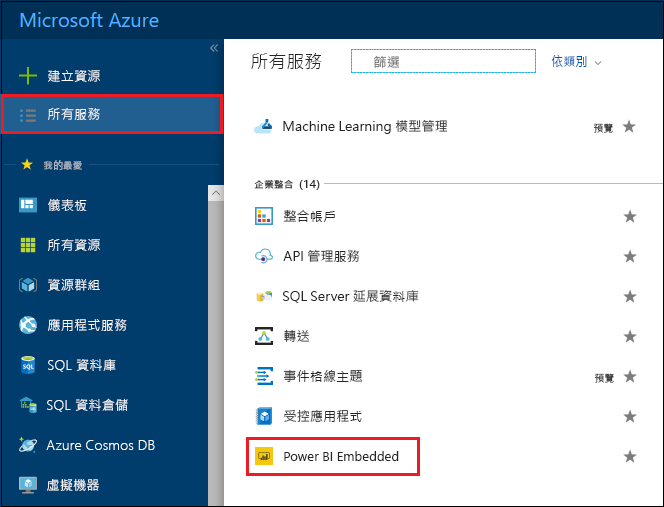
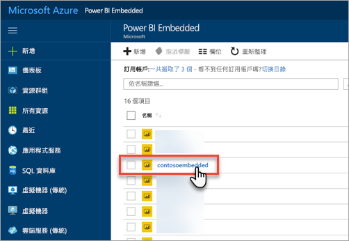
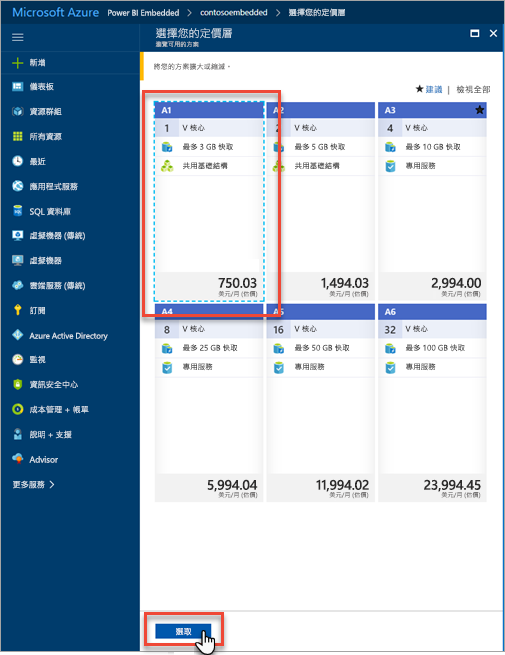
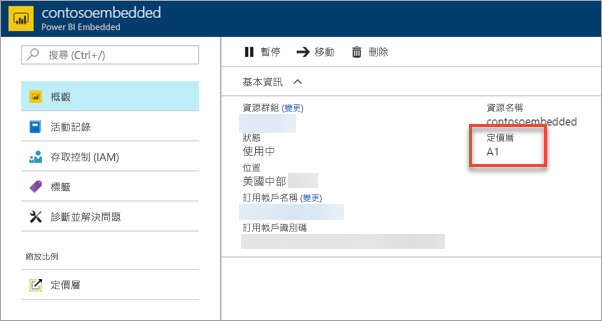

# 在 Azure 入口網站中調整您的 Power BI Embedded 容量規模

本文逐步解說如何在 Microsoft Azure 中調整 Power BI Embedded 容量規模。 調整規模可讓您增加或減少您容量的大小。

假設您已建立 Power BI Embedded 容量。 如果您尚未建立，請參閱[在 Azure 入口網站中建立 Power BI Embedded 容量](azure-pbie-create-capacity.md)以開始進行。

> [!NOTE]
> 調整規模作業可能需要約一分鐘的時間。 在這段期間，容量將無法使用。 Embedded 內容可能無法載入。

## 調整容量規模

1. 登入[Azure 入口網站](https://portal.azure.com/)。

2. 選取 [所有服務]   > [Power BI Embedded]  查看您的容量。

    

3. 選取您要調整規模的容量。

    

4. 在您容量中的 [調整規模]  下，選取 [定價層]  。

    ![[調整規模] 下的 [定價層]](media/azure-pbie-scale-capacity/azure-portal-scale-pricing-tier.png)

    您目前的定價層會以藍色顯示。

    

5. 若要相應增加或減少，請選取要移至的新定價層。 選取新的定價層會在選取四周加上藍色虛線外框。 選取 [選取]  調整為新的定價層。

    

    調整您的容量規模可能需要一到兩分鐘的時間才能完成。

6. 檢視 [概觀] 索引標籤來確認您的定價層。目前的定價層隨即列出。

    

## 後續步驟

若要暫停或啟動您的容量，請參閱[在 Azure 入口網站中暫停和啟動您的 Power BI Embedded 容量](azure-pbie-pause-start.md)。

若要在您的應用程式中開始內嵌 Power BI 內容，請參閱[如何內嵌您的 Power BI 儀表板、報表及磚](https://powerbi.microsoft.com/documentation/powerbi-developer-embedding-content/)。

有其他問題嗎？ [嘗試在 Power BI 社群提問](https://community.powerbi.com/)
