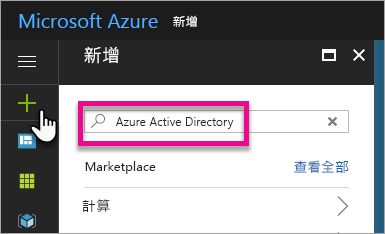
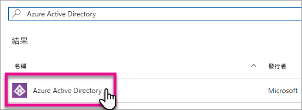
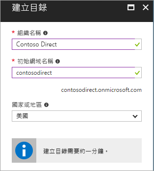
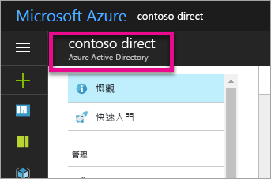
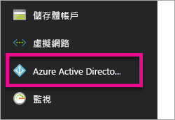
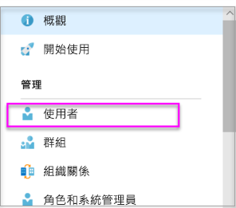
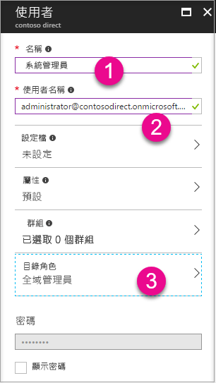
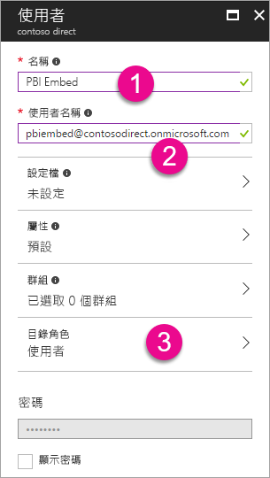
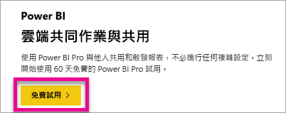

# 建立要搭配 Power BI 使用的 Azure Active Directory 租用戶

了解如何為呼叫 [Power BI REST API](../automation/rest-api-reference.md) 的自訂應用程式，建立新的 Azure Active Directory (Azure AD) 租用戶。

租用戶代表 Azure Active Directory 中的一個組織。 它是組織在註冊 Azure、Microsoft Intune 或 Office 365 等 Microsoft 雲端服務時，所收到並擁有的專用 Azure AD 服務執行個體。 每個 Azure AD 租用戶彼此有別，各自獨立。

取得 Azure AD 租用戶之後，您就可以定義應用程式並指派權限給它，讓它可以呼叫 [Power BI REST API](../automation/rest-api-reference.md)。

您的組織可能已經有 Azure AD 租用戶，可供您用於應用程式。 您也可以特別為您的應用程式建立新的租用戶。 本文說明如何建立新的租用戶。

## 建立 Azure Active Directory 租用戶

若要將 Power BI 整合至自訂應用程式，您需要在 Azure AD 內定義應用程式，這需要 Azure AD 目錄。 此目錄會是您的「租用戶」  。 如果貴組織因未使用 Power BI 或 Office 365 而尚無租用戶，則[您必須設定開發環境](https://docs.microsoft.com/azure/active-directory/develop/active-directory-howto-tenant)。 如果不希望您的應用程式和組織租用戶混在一起，您可能也需要建立租用戶，以便保持隔離。 或者，您可能只是為了測試而建立租用戶。

若要建立新的 Azure AD 租用戶：

1. 瀏覽至 [Azure 入口網站](https://portal.azure.com)，並使用具有 Azure 訂用帳戶的帳戶登入。

2. 選取**加號圖示 (+)** ，並搜尋 **Azure Active Directory**。

    

3. 在搜尋結果中選取 [Azure Active Directory]  。

    

4. 選取 [建立]  。

5. 提供 [組織名稱]  及 [初始網域名稱]  。 然後選取 [建立]  。 您的目錄會隨即建立。

    

   > [!NOTE]
   > 您的初始網域是 onmicrosoft.com 的一部分。 稍後，您可以新增其他網域名稱。 一個租用戶目錄可以指派多個網域。

6. 目錄建立完成後，選取資訊方塊來管理您的新目錄。

接下來，您要新增租用戶使用者。

## 建立 Azure Active Directory 租用戶使用者

現在您有一個目錄，接下來請建立至少兩個使用者。 其中一個是租用戶全域管理員，另一個是用於內嵌的主要使用者。 您可以將後者視為服務帳戶。

1. 在 Azure 入口網站中，確定您在 Azure Active Directory 飛出窗格上。

    

    如果不是，請從左側服務導覽選取 Azure Active Directory 圖示。

    

2. 在 [管理]  下，選取 [使用者]  。

    

3. 選取 [所有使用者]  ，然後選取 [+ 新增使用者]  。

4. 提供租用戶全域管理員的 [名稱]  和 [使用者名稱]  。將 [目錄角色]  變更為 [全域管理員]  。 您也可以顯示暫時密碼。 當您完成時，請選取 [建立]  。

    

5. 對一般租用戶使用者重複相同的步驟。 您可以使用此帳戶作為主要內嵌帳戶。 這一次，讓 [目錄角色]  維持為 [使用者]  。 記下密碼，然後選取 [建立]  。

    

6. 使用您在步驟 5 中建立的使用者帳戶來註冊 Power BI。 前往 [powerbi.com](https://powerbi.microsoft.com/get-started/)，然後在 [Power BI - 雲端共同作業與共用]  下選取 [免費試用]  。

    

    註冊時，系統會提示您免費試用 Power BI Pro 60 天。 您可以加入成為 Pro 使用者，這可讓您選擇[開始開發內嵌解決方案](embed-sample-for-customers.md)。

   > [!NOTE]
   > 請確定以您使用者帳戶的電子郵件地址來註冊。

## 後續步驟

現在您有 Azure AD 租用戶，您可以在 Power BI 內使用此租用戶來測試項目。 您也可以將 Power BI 儀表板和報表內嵌到應用程式。 如需詳細資訊，請參閱[如何內嵌 Power BI 儀表板、報表和磚](embed-sample-for-customers.md)。

[什麼是 Azure Active Directory？](https://docs.microsoft.com/azure/active-directory/active-directory-whatis) 
 
[快速入門：設定開發環境](https://docs.microsoft.com/azure/active-directory/develop/active-directory-howto-tenant)  

有其他問題嗎？ [嘗試在 Power BI 社群提問](https://community.powerbi.com/)
