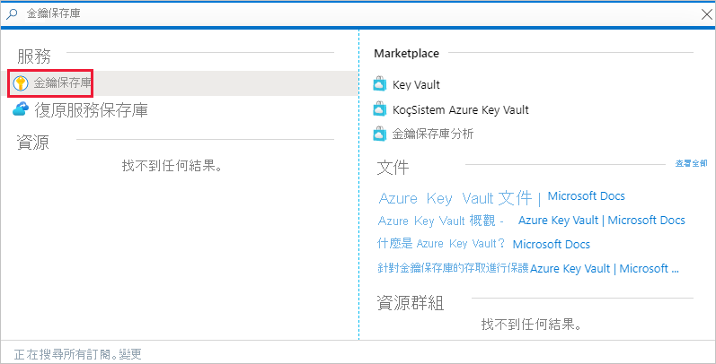

# <a name="embed-power-bi-content-with-service-principal-and-a-certificate"></a>搭配服務主體和憑證內嵌 Power BI 內容

憑證式驗證可讓您透過 Windows、Android 或 iOS 裝置上或保留在 [Azure Key Vaule](https://docs.microsoft.com/azure/key-vault/basic-concepts) 中的用戶端憑證，獲得 Azure Active Directory (Azure AD) 的驗證。

使用這種驗證方法，您就可從集中位置使用 CA 來管理憑證，以進行輪替或撤銷。

您可以在 [Client credential flows](https://github.com/AzureAD/microsoft-authentication-library-for-dotnet/wiki/Client-credential-flows) (用戶端認證流程) GitHub 頁面中深入了解 Azure AD 中的憑證。

## <a name="method"></a>方法

1. [使用服務主體內嵌您的內容](embed-service-principal.md)。

2. [建立憑證](embed-service-principal-certificate.md#step-2---create-a-certificate)。

3. [設定憑證驗證](embed-service-principal-certificate.md#step-3---set-up-certificate-authentication)。

4. [從 Azure Key Vault 取得憑證](embed-service-principal-certificate.md#step-4---get-the-certificate-from-azure-key-vault)。

5. [使用服務主體與憑證進行驗證](embed-service-principal-certificate.md#step-5---authenticate-using-service-principal-and-a-certificate)。

## <a name="step-1---embed-your-content-with-service-principal"></a>步驟 1 - 使用服務主體內嵌您的內容

若要使用服務主體內嵌您的內容，請遵循[使用服務主體與應用程式祕密內嵌 Power BI 內容](embed-service-principal.md)中的指示。

>[!NOTE]
>若您已經有使用服務主體內嵌的內容，請跳過此步驟，並繼續執行[步驟 2](embed-service-principal-certificate.md#step-2---create-a-certificate)。

## <a name="step-2---create-a-certificate"></a>步驟 2 - 建立憑證

您可以向受信任的「憑證授權單位」購買憑證，或自行產生憑證。

本節說明如何使用 [Azure Key Vault](/azure/key-vault/create-certificate) 來建立憑證，及如何下載包含公開金鑰的 *.cer* 檔案。

1. 登入 [Microsoft Azure](https://ms.portal.azure.com/#allservices)。

2. 搜尋 **Key Vault** 然後按一下 [Key Vault] 連結。

    

3. 按一下您要新增憑證的金鑰保存庫。

    

4. 按一下 [憑證]。

    ![顯示 [金鑰保存庫] 頁面的螢幕擷取畫面，其中已標註憑證。](media/embed-service-principal-certificate/certificates.png)

5. 按一下 [產生/匯入]。

    ![顯示 [憑證] 窗格的螢幕擷取畫面，其中已標註 [產生/匯入]。](media/embed-service-principal-certificate/generate.png)

6. 設定 **建立憑證** 欄位，如下所示：

    * **憑證建立方法** - 一般

    * **憑證名稱** - 輸入您的憑證名稱

    * **憑證授權單位 (CA) 的類型** - 自我簽署憑證

    * **主體** - [X.500](https://wikipedia.org/wiki/X.500) 辨別名稱

    * **DNS 名稱** - 0 DNS 名稱

    * **有效期間 (月)** - 輸入憑證的有效期間

    * **內容類型** - PKCS #12

    * **存留期動作類型** - 在指定的存留期百分比自動更新

    * **存留期百分比** - 80

    * **進階原則設定** - 未設定

7. 按一下 [建立]。 根據預設，剛建立的憑證會在停用狀態， 最多可能需要五分鐘才會啟用。

8. 選取您建立的憑證。

9. 按一下 [以 CER 格式下載]。 下載的檔案含有公開金鑰。

    ![顯示 [以 CER 格式下載] 按鈕的螢幕擷取畫面。](media/embed-service-principal-certificate/download-cer.png)

## <a name="step-3---set-up-certificate-authentication"></a>步驟 3 - 設定憑證驗證

1. 在 Azure AD 應用程式中，按一下 [憑證和祕密] 索引標籤。

     ![顯示 Azure 入口網站中某個應用程式之 [憑證及祕密] 窗格的螢幕擷取畫面。](media/embed-service-principal/certificates-and-secrets.png)

2. 按一下 [上傳憑證]，然後上傳您在此教學課程 [步驟 2](#step-2---create-a-certificate) 中建立及下載的 *.cer* 檔案。 該 *.cer* 檔案包含公開金鑰。

## <a name="step-4---get-the-certificate-from-azure-key-vault"></a>步驟 4 - 從 Azure Key Vault 取得憑證

使用受控服務識別 (MSI) 從 Azure Key Vault 取得憑證。 這個流程會需要取得包含公開及私密金鑰的 *.pfx* 憑證。

請參閱程式碼範例以從 Azure Key Vault 讀取憑證。 如果您希望使用 Visual Studio，請參閱[設定 Visual Studio 以使用 MSI](#configure-visual-studio-to-use-msi) (英文)。

```csharp
private X509Certificate2 ReadCertificateFromVault(string certName)
{
    var serviceTokenProvider = new AzureServiceTokenProvider();
    var keyVaultClient = new KeyVaultClient(new KeyVaultClient.AuthenticationCallback(serviceTokenProvider.KeyVaultTokenCallback));
    CertificateBundle certificate = null;
    SecretBundle secret = null;
    try
    {
        certificate = keyVaultClient.GetCertificateAsync($"https://{KeyVaultName}.vault.azure.net/", certName).Result;
        secret = keyVaultClient.GetSecretAsync(certificate.SecretIdentifier.Identifier).Result;
    }
    catch (Exception)
    {
        return null;
    }

    return new X509Certificate2(Convert.FromBase64String(secret.Value));
}
```

## <a name="step-5---authenticate-using-service-principal-and-a-certificate"></a>步驟 5 - 使用服務主體和憑證進行驗證

您可以連線至 Azure Key Vault，以使用服務主體和儲存在 Azure Key Vault 的憑證驗證您的應用程式。

若要連線並從 Azure Key Vault 讀取憑證，請參閱下列程式碼。

>[!NOTE]
>如果您已經有由組織建立的憑證，請將 *.pfx* 檔案上傳至 Azure Key Vault。

```csharp
// Preparing needed variables
var Scope = "https://analysis.windows.net/powerbi/api/.default"
var ApplicationId = "{YourApplicationId}"
var tenantSpecificURL = "https://login.microsoftonline.com/{YourTenantId}/"
X509Certificate2 certificate = ReadCertificateFromVault(CertificateName);

// Authenticating with a SP and a certificate
public async Task<AuthenticationResult> DoAuthentication(){
    IConfidentialClientApplication clientApp = null;
    clientApp = ConfidentialClientApplicationBuilder.Create(ApplicationId)
                                                    .WithCertificate(certificate)
                                                    .WithAuthority(tenantSpecificURL)
                                                    .Build();
    try
    {
        authenticationResult = await clientApp.AcquireTokenForClient(Scope).ExecuteAsync();
    }
    catch (MsalException)
    {
        throw;
    }
    return authenticationResult
}
```

## <a name="configure-visual-studio-to-use-msi"></a>設定 Visual Studio 以使用 MSI

在您建立內嵌解決方案時，將 Visual Studio 設為使用受控服務識別 (MSI) 可能會很實用。 [MSI](/azure/active-directory/managed-identities-azure-resources/overview) 是一項可讓您管理 Azure AD 身分識別的功能。 設定後，就會讓 Visual Studio 對您的 Azure Key Vault 進行驗證。

1. 在 Visual Studio 中，開啟您的專案。

2. 按一下 [工具] > [選項]。

     ![顯示 Visual Studio 中 [工具] 功能表之 [選項] 按鈕的螢幕擷取畫面。](media/embed-service-principal-certificate/visual-studio-options.png)

3. 搜尋 **帳戶選取**，然後按一下 [帳戶選取]。

    ![顯示 Visual Studio [選項] 視窗中 [帳戶選取] 選項的螢幕擷取畫面。](media/embed-service-principal-certificate/account-selection.png)

4. 新增可存取您 Azure Key Vault 的帳戶。

## <a name="next-steps"></a>後續步驟

>[!div class="nextstepaction"]
>[註冊應用程式](register-app.md)

> [!div class="nextstepaction"]
>[適用於您客戶的 Power BI Embedded](embed-sample-for-customers.md)

>[!div class="nextstepaction"]
>[Azure Active Directory 中的應用程式和服務主體物件](/azure/active-directory/develop/app-objects-and-service-principals)

>[!div class="nextstepaction"]
>[搭配服務主體使用內部部署資料閘道的資料列層級安全性](embedded-row-level-security.md#on-premises-data-gateway-with-service-principal)