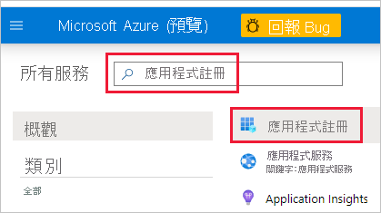

# <a name="embed-power-bi-content-with-service-principal-and-an-application-secret"></a>使用服務主體和應用程式祕密內嵌 Power BI 內容

服務主體是一種驗證方法，可用來讓 Azure AD 應用程式存取 Power BI 服務內容和 API。

當您建立 Azure Active Directory (Azure AD) 應用程式時，會建立[服務主體物件](/azure/active-directory/develop/app-objects-and-service-principals#service-principal-object)。 服務主體物件 (也稱為「服務主體」) 可讓 Azure AD 驗證您的應用程式。 經過驗證之後，應用程式就可以存取 Azure AD 租用戶資源。

若要進行驗證，服務主體會使用 Azure AD 應用程式的「應用程式識別碼」，以及下列其中一項：

* 憑證
* 應用程式祕密

本文說明使用「應用程式識別碼」和「應用程式祕密」來進行服務主體驗證。

>[!NOTE]
>Azure AD 建議使用憑證來保護後端服務，而不是使用祕密金鑰。
>* [深入了解如何使用祕密金鑰或憑證從 Azure AD 取得存取權杖](/azure/architecture/multitenant-identity/client-assertion)。
>* 若要使用憑證來保護解決方案，請完成本文中的指示，並遵循[搭配服務主體和憑證內嵌 Power BI 內容](embed-service-principal-certificate.md)中所述的步驟。

## <a name="method"></a>方法

若要使用服務主體與應用程式識別碼內嵌式分析，請遵循下列步驟：

1. 建立 [Azure AD 應用程式](/azure/active-directory/manage-apps/what-is-application-management)。

    1. 建立 Azure AD 應用程式的祕密。
    
    2. 取得應用程式的「應用程式識別碼」和「應用程式祕密」。

    >[!NOTE]
    >**步驟 1** 中描述這些步驟。 如需建立 Azure AD 應用程式的詳細資訊，請參閱[建立 Azure AD 應用程式](/azure/active-directory/develop/howto-create-service-principal-portal) (部分機器翻譯) 一文。

2. 建立 Azure AD 安全性群組。

3. 啟用 Power BI 服務系統管理員設定。

4. 將服務主體新增至您的工作區。

5. 內嵌內容。

> [!IMPORTANT]
> 一旦您啟用要與 Power BI 搭配使用的服務主體，應用程式的 AD 使用權限就不再生效。 然後，應用程式的使用權限會透過 Power BI 系統管理入口網站管理。

## <a name="step-1---create-an-azure-ad-app"></a>步驟 1 - 建立 Azure AD 應用程式

使用下列其中一種方法來建立 Azure AD 應用程式：

* [在 Microsoft Azure 入口網站中建立應用程式](embed-service-principal.md#creating-an-azure-ad-app-in-the-microsoft-azure-portal)

* [使用 PowerShell 建立應用程式](embed-service-principal.md#creating-an-azure-ad-app-using-powershell)

### <a name="creating-an-azure-ad-app-in-the-microsoft-azure-portal"></a>在 Microsoft Azure 入口網站中建立 Azure AD 應用程式

1. 登入 [Microsoft Azure](https://ms.portal.azure.com/#allservices)。

2. 搜尋 [應用程式註冊]，然後按一下 [應用程式註冊] 連結。

    

3. 按一下 [新增註冊]。

    

4. 填寫必要資訊：
    * **名稱** - 輸入應用程式的名稱
    * **支援的帳戶類型** - 選取支援的帳戶類型
    * (選擇性) **重新導向 URI** - 必要時輸入 URI

5. 按一下 [註冊] 。

6. 註冊之後，您可以從 [概觀] 索引標籤取得「應用程式識別碼」。複製並儲存「應用程式識別碼」以供稍後使用。

    ![螢幕擷取畫面顯示在 [概觀] 索引標籤中取得應用程式識別碼的位置。](media/embed-service-principal/application-id.png)

7. 按一下 [憑證與祕密] 索引標籤。

     ![顯示 Azure 入口網站中某個應用程式的 [憑證及祕密] 窗格的螢幕擷取畫面。](media/embed-service-principal/certificates-and-secrets.png)

8. 按一下 [新增用戶端密碼]

    ![顯示 [憑證及祕密] 窗格中 [新增用戶端密碼] 按鈕的螢幕擷取畫面。](media/embed-service-principal/new-client-secret.png)

9. 在 [新增用戶端密碼] 視窗中，輸入描述，指定您要讓用戶端密碼到期的時間，然後按一下 [新增]。

10. 複製並儲存 [用戶端密碼] 值。

    ![顯示 [憑證及祕密] 窗格中已模糊處理之祕密值的螢幕擷取畫面。](media/embed-service-principal/client-secret-value.png)

    >[!NOTE]
    >在您離開此視窗之後，用戶端密碼值將會隱藏，而且您將無法再次檢視或複製。

### <a name="creating-an-azure-ad-app-using-powershell"></a>使用 PowerShell 建立 Azure AD 應用程式

本節包含使用 [PowerShell](/powershell/azure/create-azure-service-principal-azureps) 建立新 Azure AD 應用程式的範例指令碼。

```powershell
# The app ID - $app.appid
# The service principal object ID - $sp.objectId
# The app key - $key.value

# Sign in as a user that's allowed to create an app
Connect-AzureAD

# Create a new Azure AD web application
$app = New-AzureADApplication -DisplayName "testApp1" -Homepage "https://localhost:44322" -ReplyUrls "https://localhost:44322"

# Creates a service principal
$sp = New-AzureADServicePrincipal -AppId $app.AppId

# Get the service principal key
$key = New-AzureADServicePrincipalPasswordCredential -ObjectId $sp.ObjectId
```

## <a name="step-2---create-an-azure-ad-security-group"></a>步驟 2 - 建立 Azure AD 安全性群組

您的服務主體沒有任何 Power BI 內容和 API 的存取權。 若要給予服務主體存取權，請在 Azure AD 中建立安全性群組，並將您建立的服務主體新增至該安全性群組。

有兩種方法可建立 Azure AD 安全性群組：
* [手動 (在 Azure 中)](embed-service-principal.md#create-a-security-group-manually)
* [使用 PowerShell](embed-service-principal.md#create-a-security-group-using-powershell)

### <a name="create-a-security-group-manually"></a>手動建立安全性群組

若要手動建立 Azure 安全性群組，請依照[使用 Azure Active Directory 建立基本群組並新增成員](/azure/active-directory/fundamentals/active-directory-groups-create-azure-portal)一文中的指示進行。 

### <a name="create-a-security-group-using-powershell"></a>使用 PowerShell 建立安全性群組

以下範例指令碼可建立新的安全性群組，並將應用程式新增至該安全性群組。

>[!NOTE]
>如果您想要為整個組織啟用服務主體存取，請略過此步驟。

```powershell
# Required to sign in as admin
Connect-AzureAD

# Create an Azure AD security group
$group = New-AzureADGroup -DisplayName <Group display name> -SecurityEnabled $true -MailEnabled $false -MailNickName notSet

# Add the service principal to the group
Add-AzureADGroupMember -ObjectId $($group.ObjectId) -RefObjectId $($sp.ObjectId)
```

## <a name="step-3---enable-the-power-bi-service-admin-settings"></a>步驟 3 - 啟用 Power BI 服務系統管理員設定

若要讓 Azure AD 應用程式能夠存取 Power BI 內容和 API，Power BI 系統管理員必須在 Power BI 系統管理員入口網站中啟用服務主體存取權。

將您在 Azure AD 中建立的安全性群組新增至 [開發人員設定] 中的特定安全性群組區段。

>[!IMPORTANT]
>服務主體可以存取針對其啟用的任何租用戶設定。 根據您的系統管理員設定而定，這包括特定安全性群組或整個組織。
>
>若要將服務主體存取限制為特定的租用戶設定，僅允許存取特定安全性群組。 或者，您可以為服務主體建立專用的安全性群組，並將其從所需的租用戶設定中排除。

>[!div class="mx-imgBorder"]
>:::image type="content" source="media/embed-service-principal/admin-portal.png" alt-text="螢幕擷取畫面，其中顯示 Power BI 服務管理選項中的 [開發人員設定]。":::

## <a name="step-4---add-the-service-principal-to-your-workspace"></a>步驟 4 - 將服務主體新增至您的工作區

若要啟用 Azure AD 應用程式存取成品 (例如 Power BI 服務中的報表、儀表板和資料集)，請將服務主體實體或包含服務主體的安全性群組新增為工作區成員或管理員。

>[!NOTE]
>本節提供 UI 指示。 您也可以使用[群組：新增群組使用者 API](/rest/api/power-bi/groups/addgroupuser)，以將服務主體或安全性群組新增至工作區。

1. 捲動至您想要啟用存取權的工作區，然後從 [更多] 功能表中，選取 [工作區存取權]。

    :::image type="content" source="media/embed-service-principal/workspace-access.png" alt-text="螢幕擷取畫面顯示 Power BI 工作區之更多功能表中的 [工作區存取] 按鈕。":::

2. 在 [存取] 窗格的文字方塊中，新增下列其中一項：

    * **服務主體**。 服務主體名稱即為 Azure AD 應用程式的「顯示名稱」，其會出現在 Azure AD 應用程式的 [概觀] 索引標籤中。

    * 包含服務主體的 **安全性群組**。

3. 從下拉式功能表中，選取 成員 或 管理員。

4. 選取 [新增]  。

## <a name="step-5---embed-your-content"></a>步驟 5 - 內嵌內容

您可[將內容內嵌至範例應用程式](embed-sample-for-customers.md)或您自己的應用程式。

您的內容內嵌之後，您就可以[移至生產環境](move-to-production.md)。

>[!NOTE]
>若要使用憑證來保護內容，請遵循[搭配服務主體和憑證內嵌 Power BI 內容](embed-service-principal-certificate.md)中所述的步驟。

## <a name="considerations-and-limitations"></a>考量與限制

* 服務主體只會使用[新的工作區](../../collaborate-share/service-create-the-new-workspaces.md)。
* 使用服務主體時，不支援 [我的工作區]。
* 需要容量才能移至實際執行環境。
* 您無法使用服務主體登入 Power BI 入口網站。
* 需有 Power BI 管理員權限，才能在 Power BI 管理入口網站的開發人員設定中啟用服務主體。
* [為組織內嵌](embed-sample-for-your-organization.md)應用程式無法使用服務主體。
* 不支援[資料流程](../../transform-model/dataflows/dataflows-introduction-self-service.md)管理。
* 服務主體目前不支援任何管理員 API。
* 搭配 [Azure Analysis Services](/azure/analysis-services/analysis-services-overview) 資料來源使用服務主體時，服務主體本身必須具有 Azure Analysis Services 執行個體權限。 基於此目的使用包含服務主體的安全性群組將無法正常運作。

## <a name="next-steps"></a>後續步驟

>[!div class="nextstepaction"]
>[註冊應用程式](register-app.md)

> [!div class="nextstepaction"]
>[適用於您客戶的 Power BI Embedded](embed-sample-for-customers.md)

>[!div class="nextstepaction"]
>[使用服務主體和憑證進行內嵌](embed-service-principal-certificate.md)

>[!div class="nextstepaction"]
>[Azure Active Directory 中的應用程式和服務主體物件](/azure/active-directory/develop/app-objects-and-service-principals)

>[!div class="nextstepaction"]
>[搭配服務主體使用內部部署資料閘道的資料列層級安全性](embedded-row-level-security.md#on-premises-data-gateway-with-service-principal)