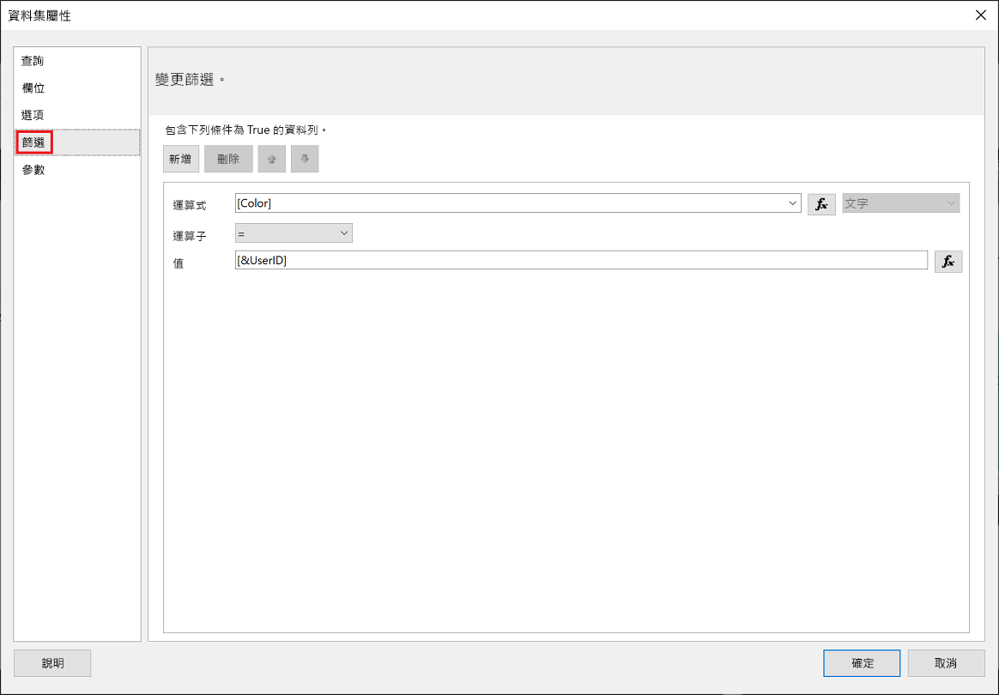
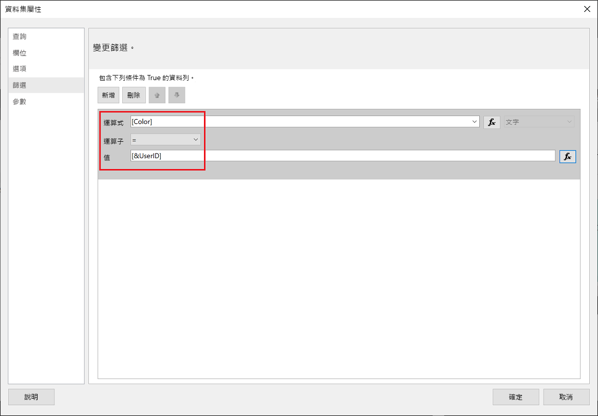
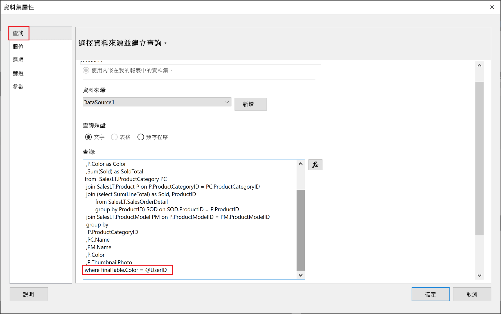

# <a name="implementing-row-level-security-in-embedded-paginated-reports"></a>在內嵌的編頁報表中實作資料列層級安全性

內嵌編頁報表時，您可以控制要顯示的資料。 這可讓您量身打造為每位使用者所顯示的資訊。 例如，如果您有一個包含全球銷售結果的 Power BI 編頁報表 ，您可以內嵌報表，而且只提供來自特定地區的銷售結果。

這項功能是一個安全的做法，只顯示資料的子集，不會危害其餘的資料。 它類似[資料列層級安全性 (RLS)](embedded-row-level-security.md) 功能，RLS 提供了一種在 Power BI 報表 (未編頁)、儀表板、圖格、資料集內顯示資料的安全方式。  

> [!NOTE]
> 這項功能適用於為客戶內嵌的編頁報表。

## <a name="configuring-a-parameter-to-filter-the-dataset"></a>設定參數以篩選資料集

將資料列層級安全性套用至 Power BI 分頁報表時，您需要指派 [參數](../../paginated-reports/report-builder-parameters.md)給 **UserID** 屬性。 在報表內嵌之前，這個參數將限制從資料集提取出來的資料。

將參數指派給 **UserID** 之後，請使用 [Reports GenerateTokenInGroup](/rest/api/power-bi/embedtoken/reports_generatetokeningroup) API 來取得內嵌權杖。

## <a name="use-userid-as-a-filter-at-report-or-query-level"></a>在報表或查詢層級使用 UserID 作為篩選

您可以使用 **UserId** 作為「篩選」，或是用在對 [Power BI Report Builder](../../paginated-reports/report-builder-power-bi.md) 中資料來源的「查詢」中。

### <a name="using-the-filter"></a>使用篩選條件

1. 在 [資料集屬性] 視窗的左窗格中選取 [篩選]。

    

2. 從 [運算式] 下拉式功能表中，選取您要用來篩選資料的參數。

     ![螢幕擷取畫面顯示已從 [運算式] 功能表選取 Color 值。](media/paginated-reports-row-level-security/expression.png)

3. 按一下 [值] 功能按鈕。 

    ![Power BI 報表產生器中的 [值]](media/paginated-reports-row-level-security/function.png)

4. 在 [運算式] 視窗中，從 [類別] 清單中選取 [內建欄位]。

    ![螢幕擷取畫面顯示 [運算式] 視窗，其中已針對 [類別] 選取 [內建欄位]，並針對 [項目] 選取 [ExecutionTime]。](media/paginated-reports-row-level-security/built-in-fields.png)

5. 從 [項目] 清單中選取 [UserID]，然後按一下 [確定]。

    ![Power BI 報表產生器中的 [UserID]](media/paginated-reports-row-level-security/userid.png)

6. 在 [資料集屬性] 視窗中，確認運算式是「您選取的參數 = UserID」，然後按一下 [確定]。

    

### <a name="using-a-query"></a>使用查詢

1. 在 [資料集屬性] 視窗的左窗格中選取 [參數]，按一下 [新增]。

    ![Power BI 報表產生器中的 [參數]](media/paginated-reports-row-level-security/parameters.png)

2. 在 [參數名稱] 中輸入 **\@UserID**，然後在 [參數值] 中新增 **[&UserID]** 。

    ![Power BI 報表產生器中的 [參數名稱]](media/paginated-reports-row-level-security/parameter-name.png) 

3. 從左窗格中選取 [查詢]，在 [查詢] 中新增 **UserID** 參數作為查詢的一部分，然後按一下 [確定]。
    > [!NOTE]
    > 在下方的螢幕擷取畫面中，以 color 參數作為範例 (whereFinalTable.Color = @UserID)。 如有需要，可以建立更複雜的查詢。

    

## <a name="passing-the-configured-parameter-using-the-embed-token"></a>使用內嵌權杖傳遞設定的參數

當您為客戶內嵌編頁報表時，可使用 [Reports GenerateTokenInGroup](/rest/api/power-bi/embedtoken/reports_generatetokeningroup) API 取得內嵌權杖。 此權杖也可以用來篩選從編頁報表提取出來的部分資料。

若只要公開部分資料，請在 `username` 欄位指派您想要顯示的資訊。 例如，在具有 color 參數的編頁報表中，如果您在 `username` 欄位輸入 *green*，內嵌權杖將會限制內嵌資料僅顯示色彩資料行中有 *green* 值的資料。

```JSON
{
    "accessLevel": "View",
    "reportId": "cfafbeb1-8037-4d0c-896e-a46fb27ff229",
    "identities": [
            {
                    // Replace the 'username' with a paginated report parameter
                    "username":     "...",
                    "reports: [
                        "cfafbeb1-8037-4d0c-896e-a46fb27ff229"
                    ]
            }
    ]
}
```