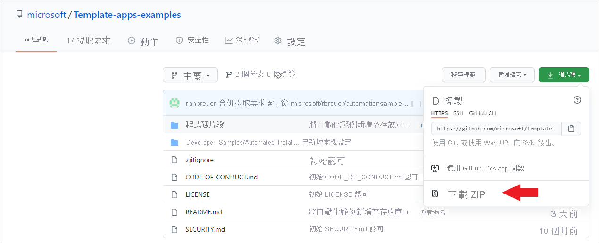
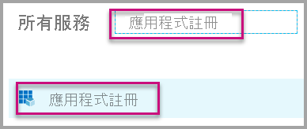
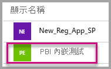
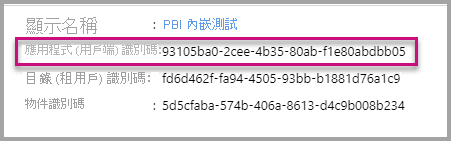
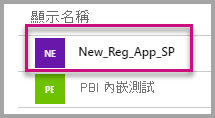
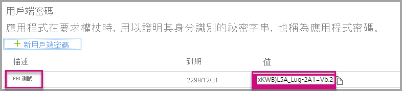

# <a name="tutorial-automate-configuration-of-template-app-installation-using-an-azure-function"></a>教學課程：使用 Azure 函數自動設定範本應用程式安裝

範本應用程式是一種讓客戶能夠從其資料取得見解的絕佳方式。 範本應用程式會將客戶連線到其資料，以快速啟動及執行，並提供預先建置的報表，讓客戶可視需要進行自訂。

客戶不一定熟悉與其資料連線的詳細資訊，且在安裝範本應用程式時，由於必須提供這些詳細資料，因此對客戶而言可能會產生困難。

如果您是資料服務提供者，並已建立範本應用程式來協助客戶開始在服務上使用其資料，則您可將範本應用程式參數的設定自動化，讓客戶更輕鬆地安裝範本應用程式。 當客戶登入入口網站時，可以按一下您已備妥的特殊連結。 該連結會啟動自動化，這會收集其所需的資訊、預先設定範本應用程式參數，然後將客戶重新導向至其 Power BI 帳戶，以便在其中安裝應用程式。 客戶只需要按一下 [安裝]、驗證其資料來源，就大功告成了！ 

客戶體驗圖解如下。


在本教學課程中，您將使用我們所建立自動安裝 Azure 函數範例來預先設定並安裝範本應用程式。 此範例刻意保持簡單以供示範之用。 此範例將 Azure 函數的設定封裝在其中，以利用 Power BI API 來為使用者自動安裝及設定範本應用程式。

如需一般自動化流程和其所使用 API 的詳細資訊，請參閱[範本應用程式安裝設定自動化](template-apps-auto-install.md)

我們的簡單應用程式會使用 Azure 函數。 如需 Azure Functions 的詳細資訊，請參閱 [Azure Functions 文件](https://docs.microsoft.com/azure/azure-functions/)。

## <a name="basic-flow"></a>基本流程

以下是當客戶透過按一下入口網站上的連結來啟動應用程式時，該應用程式的基本作業流程。

1. 使用者登入 ISV 的入口網站，然後按一下所提供的連結。 流程會隨即開始。 ISV 的入口網站會在此階段準備使用者特定設定。

2. ISV 會根據在 ISV 租用戶中所註冊的 [服務主體 (僅適用於應用程式權杖)](../embedded/embed-service-principal.md)，取得 **僅適用於應用程式** 權杖。

3. ISV 會透過 [Power BI REST API](https://docs.microsoft.com/rest/api/power-bi/) 建立 **安裝票證**，其中包含 ISV 所準備的使用者特定參數設定。

4. ISV 會使用包含安裝票證的 ```POST``` 重新導向方法，將使用者重新導向至 Power BI。

5. 使用者會藉由安裝票證而重新導向至其 Power BI 帳戶，並收到安裝範本應用程式的提示。 當使用者按一下 [安裝] 後，即會開始安裝範本應用程式。

>[!Note]
>儘管參數值是由 ISV 在建立安裝票證期間所設定，但資料來源的相關認證只能由使用者在安裝的最後階段提供。 這可避免認證暴露給協力廠商，因而確保使用者與範本應用程式資料來源之間的連線處於安全狀態。

## <a name="prerequisites"></a>Prerequisites

在開始之前，您必須具備：

* 您自己的 Azure Active Directory 租用戶設定。 如需該項設定的指示，請參閱[建立 Azure Active Directory 租用戶](https://docs.microsoft.com/power-bi/developer/embedded/create-an-azure-active-directory-tenant)。

* 在上述租用戶中註冊的[服務主體 (僅適用於應用程式權杖)](https://docs.microsoft.com/power-bi/developer/embedded/embed-service-principal)。

* 已備妥安裝的已參數化[範本應用程式](https://docs.microsoft.com/power-bi/connect-data/service-template-apps-overview)。 建立範本應用程式的租用戶，必須是您在 Azure Active Directory (Azure AD) 中註冊應用程式的相同租用戶。 如需詳細資訊，請參閱[範本應用程式祕訣](https://docs.microsoft.com/power-bi/connect-data/service-template-apps-tips.md)或[在 Power BI 中建立範本應用程式](https://docs.microsoft.com/power-bi/connect-data/service-template-apps-create)。

* **Power BI Pro 授權**。 如果您沒有註冊 Power BI Pro，請先[註冊免費試用](https://powerbi.microsoft.com/pricing/)再開始進行操作。

## <a name="set-up-your-template-apps-automation-development-environment"></a>設定範本應用程式自動開發環境

在繼續設定應用程式之前，請先遵循[快速入門：使用 Azure 應用程式設定建立 Azure Functions 應用程式](https://docs.microsoft.com/azure/azure-app-configuration/quickstart-azure-functions-csharp)一文中的指示來開發 Azure 函數以及 Azure 應用程式設定。 遵循該文章所述，建立應用程式設定。

### <a name="register-an-application-in-azure-active-directory-azure-ad"></a>在 Azure Active Directory (Azure AD) 中註冊應用程式

遵循[使用服務主體和應用程式祕密內嵌 Power BI 內容](https://docs.microsoft.com/power-bi/developer/embedded/embed-service-principal)一文中所述，建立服務主體。

請務必將應用程式註冊為 **伺服器端 Web 應用程式**。 您註冊伺服器端 Web 應用程式，以建立應用程式祕密。

儲存「應用程式識別碼」(用戶端識別碼) 與「應用程式祕密」(用戶端祕密)，以供稍後的步驟使用。

您可瀏覽[內嵌安裝工具](https://aka.ms/embedsetup/AppOwnsData)，立刻開始下載應用程式註冊。 如果您正在使用 [Power BI 應用程式註冊工具](https://app.powerbi.com/embedsetup) ，請選取 [Embed for your customers] \(為客戶內嵌\) 選項。

## <a name="template-app-preparation"></a>範本應用程式準備工作

當完成建立範本應用程式並準備好進行安裝後，請儲存下列資訊，以在後續步驟中使用：

* 在建立應用程式後，於[定義範本應用程式屬性](../../connect-data/service-template-apps-create.md#define-the-properties-of-the-template-app)流程結尾安裝 URL 中顯示的「應用程式識別碼」、「套件金鑰」、「擁有者識別碼」。

    您也可以按一下範本應用程式[版本管理](../../connect-data/service-template-apps-create.md#manage-the-template-app-release)中的 [取得連結]，以取得相同的連結。

* 在範本應用程式資料集中定義的「參數名稱」。 參數名稱是區分大小寫的字串，且可在[定義範本應用程式的屬性](../../connect-data/service-template-apps-create.md#define-the-properties-of-the-template-app)時，從 [參數設定] 索引標籤中取得，或從 Power BI 中的資料集設定取得。

>[!NOTE]
>如果範本應用程式已準備好進行安裝，則即使該範本應用程式尚未在 AppSource 上開放使用，您也可以在其中測試預先設定的安裝應用程式。 不過，若要讓租用戶以外的使用者能夠使用自動安裝應用程式來安裝範本應用程式，則必須在 [Power BI Apps 市集](https://app.powerbi.com/getdata/services)中開放使用該範本應用程式。 因此，在使用您正在建立的自動安裝應用程式來發佈範本應用程式之前，請務必先將其發佈到[合作夥伴中心](https://docs.microsoft.com/azure/marketplace/partner-center-portal/create-power-bi-app-offer)。


## <a name="install-and-configure-your-template-app-using-our-azure-function-sample"></a>使用 Azure 函數範例來安裝及設定範本應用程式

在本節中，您將使用我們所建立的自動安裝 Azure 函數範例來預先設定並安裝範本應用程式。 此範例刻意保持簡單以供示範之用。 您可利用 [Azure Functions](https://docs.microsoft.com/azure/azure-functions/functions-overview) 與 [Azure 應用程式設定](https://docs.microsoft.com/azure/azure-app-configuration/overview)，輕鬆地為範本應用程式部署及使用自動化的安裝 API。

### <a name="download-visual-studio-version-2017-or-later"></a>下載 [Visual Studio](https://www.visualstudio.com/) (2017 版或更新版本)

下載 [Visual Studio](https://www.visualstudio.com/) (2017 版或更新版本)。 務必下載最新 [NuGet 套件](https://www.nuget.org/profiles/powerbi)。

### <a name="download-the-automated-install-azure-function-sample"></a>下載自動安裝 Azure Functions 範例

從 GitHub 下載[自動安裝 Azure Functions 範例](https://github.com/microsoft/Template-apps-examples/tree/master/Developer%20Samples/Automated%20Install%20Azure%20Function) (英文) 以開始作業。



### <a name="setup-your-azure-app-configuration"></a>設定 Azure 應用程式設定

您必須使用下方的索引鍵值組來設定 Azure 應用程式設定，才能執行這個範例。 這些索引鍵為 **應用程式識別碼**、**應用程式祕密**，以及範本應用程式的 **AppId**、**PackageKey** 和 **OwnerId**。 如需取得這些值的資訊，請參閱下列各節。 

**Constants.cs** 檔案中也定義這些索引鍵。

| 設定機碼 | 意義           |
|---------------    |-------------------|
| TemplateAppInstall:Application:AppId | 來自 [安裝 URL](#getting-the-template-app-properties) 的 *AppId* |
| TemplateAppInstall:Application:PackageKey | 來自 [安裝 URL](#getting-the-template-app-properties) 的 *PackageKey* |
| TemplateAppInstall:Application:OwnerId | 來自 [安裝 URL](#getting-the-template-app-properties) 的 *OwnerId* |
| TemplateAppInstall:ServicePrincipal:ClientId | 服務主體[應用程式識別碼](#getting-the-application-id) |
| TemplateAppInstall:ServicePrincipal:ClientSecret | 服務主體[應用程式祕密](#getting-the-application-secret) |
|||


**Constants.cs** 檔案：


#### <a name="getting-the-template-app-properties"></a>取得範本應用程式屬性
填入建立應用程式時所定義的所有相關範本應用程式屬性。 這些屬性即為範本應用程式的 **AppId**、**PakcageKey** & **OwnerId**。

請遵循下列步驟來取得上述這些值：

1. 登入 [Power BI](https://app.powerbi.com)。

2. 前往應用程式的原始工作區。

3. 開啟 [版本管理] 窗格。

    ![[版本管理] 窗格](media/template-apps-auto-install/release-management-001.png)

4. 選取應用程式版本，並取得其安裝連結。

    

5. 將連結複製到剪貼簿。

    ![[取得連結] 按鈕的螢幕擷取畫面。](media/template-apps-auto-install/release-management-003.png)

6. 此安裝 URL 會保留 3 個 URL 參數，其中包含所需要的值。 使用應用程式的 **appId**、**packageKey** & **ownerId** 值。 範例 URL 會看似如下。

    ```html
    https://app.powerbi.com/Redirect?action=InstallApp&appId=3c386...16bf71c67&packageKey=b2df4b...dLpHIUnum2pr6k&ownerId=72f9...1db47&buildVersion=5
    ```

#### <a name="getting-the-application-id"></a>取得應用程式識別碼

使用從 **Azure** 取得的 **應用程式識別碼** 填入 **applicationId** 資訊。 應用程式會使用 **applicationId** 來向您要求權限的使用者表明其身分。

若要取得 **applicationId**，請遵循下列步驟：

1. 登入[Azure 入口網站](https://portal.azure.com)。

2. 在左側的瀏覽窗格中，選取 [所有服務]，然後選取 [應用程式註冊]。

    

3. 選取需要 **applicationId** 的應用程式。

    

4. 有一個以 GUID 形式列出的「應用程式識別碼」。 請使用此 **應用程式識別碼** 作為應用程式的 **applicationId**。

    

#### <a name="getting-the-application-secret"></a>取得應用程式祕密

在 **Azure** 之 [應用程式註冊] 區段的 [金鑰] 區段中，填入 **ApplicationSecret** 資訊。  使用[服務主體](../embedded/embed-service-principal.md)時，此屬性即會運作。

若要取得 **ApplicationSecret**，請遵循下列步驟：

 1. 登入 [Azure 入口網站](https://portal.azure.com)。

 2. 在左側瀏覽窗格中，選取 [所有服務]，然後選取 [應用程式註冊]。

    

3. 選取需要使用 **ApplicationSecret** 的應用程式。

    

4. 選取 [管理] 底下的 [憑證及祕密]。

5. 選取 [新增用戶端祕密]。

6. 在 [描述] 方塊中輸入名稱，並選取期間。 然後選取 [儲存] 來取得您應用程式的 **值**。 當您在儲存金鑰值後關閉 [金鑰] 窗格時，[值] 欄位只會以隱藏方式顯示。 此時，您即無法擷取金鑰值。 如果您遺失金鑰值，就必須在 Azure 入口網站中建立一個新的。

    

## <a name="test-your-function-locally"></a>在本機測試函式

請遵循[在本機執行函式](https://docs.microsoft.com/azure/azure-functions/functions-create-your-first-function-visual-studio#run-the-function-locally)一節中所述的步驟來執行函式。

設定入口網站，以對函式的 URL (例如 ```POST http://localhost:7071/api/install```) 發出 ```POST``` 要求。 要求本文應該是描述索引鍵/值組的 JSON 物件，其中索引鍵為「參數名稱」(於 Power BI Desktop 中定義)，而值則是要為範本應用程式中每個參數所設定的需求值。

>[!Note]
> 在生產中，會依照您入口網站的預期邏輯，為每個使用者推算參數值。

理想的流程應為：

1. 入口網站為每個使用者\工作階段準備要求。
2. ```POST /api/install``` 要求會發出至 Azure 函數。 要求主體包含索引鍵/值組，其中索引鍵是參數名稱，而值則是所需設定的值。 
3. 如果設定正確，瀏覽器應該會自動重新導向至客戶的 Power BI 帳戶，並顯示自動安裝流程。
4. 安裝時，參數值會依照步驟 1 & 2 中的設定進行設定。
 
## <a name="next-steps"></a>後續步驟

### <a name="publish-your-project-to-azure"></a>將專案發佈至 Azure

如需了解如何將專案發佈至 Azure，請遵循 [Azure 函數文件](https://docs.microsoft.com/azure/azure-functions/functions-create-your-first-function-visual-studio#publish-the-project-to-azure)的指示，讓您可將範本應用程式自動安裝 API 整合到產品，並開始在生產環境中測試。
