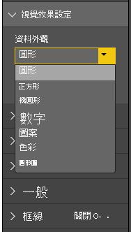

# <a name="tutorial-create-an-r-powered-power-bi-visual"></a>教學課程：建立 R 支援的 Power BI 視覺效果

本教學課程描述如何為 Power BI 建立 R 支援的視覺效果。

在本教學課程中，您會了解如何：

> [!div class="checklist"]
>
> * 建立 R 支援的視覺效果
> * 在 Power BI Desktop 中編輯 R 指令碼
> * 將程式庫新增至視覺效果
> * 新增靜態屬性

## <a name="prerequisites"></a>必要條件

* **Power BI Pro** 帳戶。 開始之前，請先[註冊免費試用](https://powerbi.microsoft.com/pricing/)。
* R 引擎。 您可從許多位置免費下載，包括 [Revolution Open 下載頁面](https://mran.revolutionanalytics.com/download/) (英文) 以及 [CRAN 存放庫](https://cran.r-project.org/bin/windows/base/) (英文)。 如需詳細資訊，請參閱[使用 R 建立 Power BI 視覺效果](../../desktop-r-visuals.md)。
* [Power BI Desktop](../../fundamentals/desktop-get-the-desktop.md)。
* 適用於 Windows 使用者的 [Windows PowerShell](https://docs.microsoft.com/powershell/scripting/install/installing-windows-powershell?view=powershell-6) 第 4 版或更新版本，或適用於 OSX 使用者的[終端機](https://macpaw.com/how-to/use-terminal-on-mac)。

## <a name="getting-started"></a>開始使用

1. 準備視覺效果的範例資料。 您可將這些值儲存至 Excel 資料庫或 *.csv* 檔案，然後將其匯入至 Power BI Desktop。

    | MonthNo | 總單位數 |
    |-----|-----|
    | 1 | 2303 |
    | 2 | 2319 |
    | 3 | 1732 |
    | 4 | 1615 |
    | 5 | 1427 |
    | 6 | 2253 |
    | 7 | 1147 |
    | 8 | 1515 |
    | 9 | 2516 |
    | 10 | 3131 |
    | 11 | 3170 |
    | 12 | 2762 |

1. 若要建立視覺效果，請開啟 PowerShell 或終端機，然後執行下列命令：

   ```cmd
   pbiviz new rVisualSample -t rvisual
   ```

   此命令會根據 `rvisual` 範本來建立新的資料夾結構。 此範本包含基本的準備執行 R 支援視覺效果，其執行下列 R 指令碼：

   ```r
   plot(Values)
   ```

   `Values` 資料框架將包含 `Values` 資料角色中的資料行。

1. 藉由將 [MonthNo] \(月份\) 和 [Total units] \(總單位數\) 新增至視覺效果 [值]，將資料指派給開發人員視覺效果。

   

## <a name="editing-the-r-script"></a>編輯 R 指令碼

當使用 `pbiviz` 根據 `rvisual` 範本來建立 R 支援的視覺效果時，其會在視覺效果的根資料夾中建立檔案，該檔案稱為 *script.r*。 這個檔案會保存可執行來產生使用者映像的 R 指令碼。 您可在 Power BI Desktop 中建立 R 指令碼。

1. 在 Power BI Desktop 中，選取 [R 指令碼視覺效果]：

   ![[視覺效果] 窗格中的 R 視覺效果](./media/create-r-based-power-bi-desktop/r-script-icon.png)

1. 將此 R 程式碼貼入 **R 指令碼編輯器**：

    ```r
    x <- dataset[,1] # get the first column from dataset
    y <- dataset[,2] # get the second column from dataset

    columnNames = colnames(dataset) # get column names

    plot(x, y, type="n", xlab=columnNames[1], ylab=columnNames[2]) # draw empty plot with axis and labels only
    lines(x, y, col="green") # draw line plot
    ```

1. 選取**執行指令碼**圖示以查看結果。

    ![[視覺效果] 窗格中的 R 視覺效果](./media/create-r-based-power-bi-desktop/run-r-script.png)

1. 當 R 指令碼準備就緒時，請將其複製到 `script.r` 檔案，該檔案位於在先前其中一個步驟中建立的視覺效果專案。

1. 將 *capabilities.json* 中 `dataRoles` 的 `name` 變更為 `dataRoles`。 Power BI 會傳遞資料作為 R 指令碼視覺效果的 `dataset` 資料框架物件，但 R 視覺效果會根據 `dataRoles` 名稱取得資料框架名稱。

    ```json
    {
      "dataRoles": [
        {
          "displayName": "Values",
          "kind": "GroupingOrMeasure",
          "name": "dataRoles"
        }
      ],
      "dataViewMappings": [
        {
          "scriptResult": {
            "dataInput": {
              "table": {
                "rows": {
                  "select": [
                    {
                      "for": {
                        "in": "dataset"
                      }
                    }
                  ],
                  "dataReductionAlgorithm": {
                    "top": {}
                  }
                }
              }
            },
            ...
          }
        }
      ],
    }
    ```

1. 新增下列程式碼，以支援在 *src/visual.ts* 檔案中調整影像大小。

    ```typescript
      public onResizing(finalViewport: IViewport): void {
          this.imageDiv.style.height = finalViewport.height + "px";
          this.imageDiv.style.width = finalViewport.width + "px";
          this.imageElement.style.height = finalViewport.height + "px";
          this.imageElement.style.width = finalViewport.width + "px";
      }
    ```

## <a name="add-libraries-to-visual-package"></a>將程式庫新增至視覺效果套件

此程序可供視覺效果使用 `corrplot` 套件。

1. 將視覺效果的程式庫相依性新增至 `dependencies.json`。 以下是檔案內容的範例：

    ```json
    {
      "cranPackages": [
        {
          "name": "corrplot",
          "displayName": "corrplot",
          "url": "https://cran.r-project.org/web/packages/corrplot/"
        }
      ]
    }
    ```

    `corrplot` 套件是相互關聯矩陣的圖形化顯示。 如需 `corrplot` 的詳細資訊，請參閱 [An Introduction to corrplot Package](https://cran.r-project.org/web/packages/corrplot/vignettes/corrplot-intro.html) (corrplot 套件簡介)。

1. 在進行這些變更之後，請開始在 `script.r` 檔案中使用此套件。

    ```r
    library(corrplot)
    corr <- cor(dataset)
    corrplot(corr, method="circle", order = "hclust")
    ```

使用 `corrplot` 套件的結果如下列範例所示：

![[視覺效果] 窗格中的 R 視覺效果](./media/create-r-based-power-bi-desktop/r-corrplot-result.png)

## <a name="adding-a-static-property-to-the-property-pane"></a>將靜態屬性新增至屬性窗格

讓使用者能夠變更 UI 設定。 若要這麼做，請將屬性新增至屬性窗格，以變更 R 指令碼的使用者輸入行為。

您可使用 `corrplot` 函式的 `method` 引數來設定 `corrplot`。 預設指令碼會使用圓形。 請修改視覺效果，讓使用者在數個選項之間進行選擇。

1. 在 *capabilities.json* 檔案中定義物件和屬性。 接著在列舉方法中使用此物件名稱，從屬性窗格取得這些值。

    ```json
    {
      "settings": {
      "displayName": "Visual Settings",
      "description": "Settings to control the look and feel of the visual",
      "properties": {
        "method": {
          "displayName": "Data Look",
          "description": "Control the look and feel of the data points in the visual",
          "type": {
            "enumeration": [
              {
                "displayName": "Circle",
                "value": "circle"
              },
              {
                "displayName": "Square",
                "value": "square"
              },
              {
                "displayName": "Ellipse",
                "value": "ellipse"
              },
              {
                "displayName": "Number",
                "value": "number"
              },
              {
                "displayName": "Shade",
                "value": "shade"
              },
              {
                "displayName": "Color",
                "value": "color"
              },
              {
                "displayName": "Pie",
                "value": "pie"
              }
            ]
          }
        }
      }
    }
    ```

1. 開啟 *src/settings.ts* 檔案。 建立具有公用屬性 `method` 的 `CorrPlotSettings` 類別。 此類型為 `string`，且預設值為 `circle`。 使用預設值，將 `settings` 屬性新增至 `VisualSettings` 類別：

    ```typescript
    "use strict";

    import { dataViewObjectsParser } from "powerbi-visuals-utils-dataviewutils";
    import DataViewObjectsParser = dataViewObjectsParser.DataViewObjectsParser;

    export class VisualSettings extends DataViewObjectsParser {
      public rcv_script: rcv_scriptSettings = new rcv_scriptSettings();
      public settings: CorrPlotSettings = new CorrPlotSettings();
    }

    export class CorrPlotSettings {
      public method: string = "circle";
    }

    export class rcv_scriptSettings {
      public provider;
      public source;
    }
    ```

    在這些步驟之後，您可變更視覺效果的屬性。

   

    最後，R 指令碼必須以屬性開頭。 如果使用者未變更屬性，則視覺效果不會取得此屬性的任何值。

    針對屬性的 R 執行階段變數，命名慣例為 `<objectname>_<propertyname>`，在此案例中為 `settings_method`。

1. 變更視覺效果中的 R 指令碼，以符合下列程式碼：

    ```r
    library(corrplot)
    corr <- cor(dataset)

    if (!exists("settings_method"))
    {
        settings_method = "circle";
    }

    corrplot(corr, method=settings_method, order = "hclust")
    ```

最終的視覺效果看起來如下列範例所示：


## <a name="next-steps"></a>後續步驟

若要深入了解 R 支援的視覺效果，請參閱[在 Power BI 中使用 R 支援的 Power BI 視覺效果](../../desktop-r-powered-custom-visuals.md)。

如需 Power BI Desktop 中 R 支援視覺效果的詳細資訊，請參閱[使用 R 建立 Power BI 視覺效果](../../desktop-r-visuals.md)。
