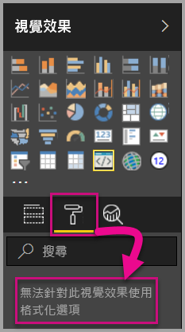
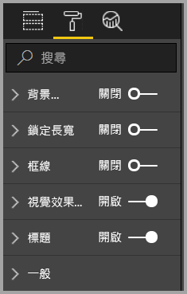
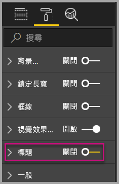
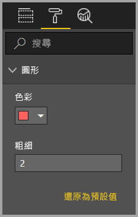
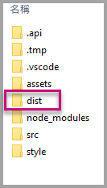
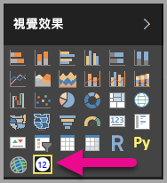

# <a name="tutorial-adding-formatting-options-to-a-power-bi-visual"></a>教學課程：將格式設定選項新增到 Power BI 視覺效果

在本教學課程中，我們將探討如何將通用屬性新增至視覺效果。

在本教學課程中，您會了解如何：
> [!div class="checklist"]
> * 新增視覺效果屬性。
> * 封裝視覺效果。
> * 將自訂視覺效果匯入至 Power BI Desktop 報表。

## <a name="adding-formatting-options"></a>其他格式設定選項

1. 在 **Power BI** 中，選取 [設定頁面格式]  。

    您應該會看到訊息顯示：「無法針對此視覺效果使用格式化選項」  。

    

2. 在 **Visual Studio Code** 中，開啟 *capabilities.json* 檔案。

3. 在 **dataViewMappings** 陣列之前，加入 **objects** (第 8 行之後)。

    ```json
    "objects": {},
    ```

    

4. 儲存 **capabilities.json** 檔案。

5. 在 **Power BI** 中，再次檢閱格式設定選項。

    > [!Note]
    > 如果您沒有看到格式設定選項變更，請選取 [重新載入自訂視覺效果]  。

    

6. 將 [標題]  選項設定為 [關閉]  。 請注意，視覺效果不會再於左上角顯示量值名稱。

    

    

### <a name="adding-custom-formatting-options"></a>新增自訂格式選項

您可以新增自訂屬性以便設定圓形的色彩與框線寬度。

1. 在 PowerShell 中，停止自訂視覺效果。

2. 在 Visual Studio Code 中，於 **capabilities.json** 檔案內將下列 JSON 片段插入標記為 **objects** 的物件中。

    ```json
        {
            "circle": {
                "displayName": "Circle",
                "properties": {
                    "circleColor": {
                        "displayName": "Color",
                        "description": "The fill color of the circle.",
                        "type": {
                            "fill": {
                                "solid": {
                                    "color": true
                                }
                            }
                        }
                    },
                    "circleThickness": {
                        "displayName": "Thickness",
                        "description": "The circle thickness.",
                        "type": {
                            "numeric": true
                        }
                    }
                }
            }
        }
    ```

    此 JSON 片段描述一個名稱為 Circle 的群組，其由名為 circleColor 與 circleThickness 的兩個選項所組成。

   

3. 儲存 **capabilities.json** 檔案。

4. 在 [Explorer]  窗格中，從 **src** 資料夾內選取 **settings.ts**。 *此檔案代表起始視覺效果的設定*。

5. 在 **settings.ts** 檔案中，使用下列程式碼取代兩個類別。

    ```typescript
    export class CircleSettings {
        public circleColor: string = "white";
        public circleThickness: number = 2;
    }
    export class VisualSettings extends DataViewObjectsParser {
        public circle: CircleSettings = new CircleSettings();
    }
    ```

    

    此模組定義兩個類別。 **CircleSettings** 類別定義兩個屬性，其名稱與 **capabilities.json** 檔案中定義的物件名稱 (**circleColor** 與 **circleThickness**) 相符，另外還設定了預設值。 **VisualSettings** 類別繼承 **DataViewObjectParser** 類別，並新增名為 **circle** 的屬性，其與 *capabilities.json* 檔案中定義的物件相符，並且會傳回 **CircleSettings** 的執行個體。

6. 儲存 **settings.ts** 檔案。

7. 開啟 **visual.ts** 檔案。

8. 在 **visual.ts** 檔案中，

    匯入 `VisualSettings`、`VisualObjectInstanceEnumeration` 和 `EnumerateVisualObjectInstancesOptions`：

    ```typescript
    import { VisualSettings } from "./settings";
    import VisualObjectInstanceEnumeration = powerbi.VisualObjectInstanceEnumeration;
    import EnumerateVisualObjectInstancesOptions = powerbi.EnumerateVisualObjectInstancesOptions;
    ```

    並在 **Visual** 類別中，加入下列屬性：

    ```typescript
    private visualSettings: VisualSettings;
    ```

    此屬性會儲存 **VisualSettings** 物件的參考，其描述視覺效果設定。

    

9. 在 **Visual** 類別中，將下列方法加入到 **update** 方法之前。 此方法是用來填入格式設定選項。

    ```typescript
    public enumerateObjectInstances(options: EnumerateVisualObjectInstancesOptions): VisualObjectInstanceEnumeration {
        const settings: VisualSettings = this.visualSettings || <VisualSettings>VisualSettings.getDefault();
        return VisualSettings.enumerateObjectInstances(settings, options);
    }
    ```

    此方法是用來填入格式設定選項。

    

10. 在 **update** 方法中，將下列程式碼加入到 **radius** 變數的宣告後面。

    ```typescript
    this.visualSettings = VisualSettings.parse<VisualSettings>(dataView);

    this.visualSettings.circle.circleThickness = Math.max(0, this.visualSettings.circle.circleThickness);
    this.visualSettings.circle.circleThickness = Math.min(10, this.visualSettings.circle.circleThickness);
    ```

    此程式碼會擷取格式選項。 它會調整任何傳入 **circleThickness** 屬性的值，若為負數，它會將該值轉換為 0，若大於 10，則轉換為 10。

    

11. 針對 **circle 元素**，將傳遞到 **fill 樣式**的值修改為下列運算式。

    ```typescript
    this.visualSettings.circle.circleColor
    ```

    

12. 針對 **circle 元素**，將傳遞至 **stroke-width 樣式**的值修改為下列運算式。

    ```typescript
    this.visualSettings.circle.circleThickness
    ```

    

13. 儲存 visual.ts 檔案。

14. 在 PowerShell 中，啟動視覺效果。

    ```powershell
    pbiviz start
    ```

15. 在 **Power BI** 中，在視覺效果上方浮動的工具列中，選取 [切換自動重新載入]  。

16. 在 [視覺效果格式]  選項中，展開 [圓形]  。

    

    修改 [Color]  \(色彩\) 與 [Thickness]  \(粗細\) 選項。

    將 [Thickness]  \(粗細\) 選項的值修改為小於零，以及高於 10 的值。 然後，注意視覺效果將值更新為可容忍的最小值與最大值。

## <a name="packaging-the-custom-visual"></a>封裝自訂視覺效果

輸入自訂視覺效果專案的屬性值，更新圖示檔案，然後封裝自訂視覺效果。

1. 在 **PowerShell** 中，停止自訂視覺效果。

2. 在 **Visual Studio Code** 中，開啟 **pbiviz.json** 檔案。

3. 在 **visual** 物件中，將 **displayName** 屬性修改為 *Circle Card*。

    在 [視覺效果]  窗格中，將滑鼠游標暫留在圖示上以顯示顯示名稱。

    

4. 針對 **description** 屬性，輸入下列文字。

    「在圓形中顯示已格式化的量值」 

5. 針對視覺效果填入 **supportUrl** 和 **gitHubUrl**。

    範例：

    ```json
    {
        "supportUrl": "https://community.powerbi.com",
        "gitHubUrl": "https://github.com/microsoft/PowerBI-visuals-circlecard"
    }
    ```

6. 在 **author** 物件中輸入您的詳細資料。

7. 儲存 **pbiviz.json** 檔案。

8. 在 **assets** 物件中，注意文件會定義圖示的路徑。 此圖示是顯示在 [視覺效果]  窗格中的影像。 它必須是 **PNG** 檔案，20 x 20 像素  。

9. 在 Windows 檔案總管中，複製 icon.png 檔案，然後貼入到 assets 資料夾以取代其中的預設檔案。

10. 在 Visual Studio Code 的 [檔案總管] 窗格中，展開 assets 資料夾，然後選取 icon.png 檔案。

11. 檢閱圖示。

    

12. 在 Visual Studio Code 中，確定已儲存所有檔案。

13. 若要封裝自訂視覺效果，請在 PowerShell 中輸入下列命令。

    ```powershell
    pbiviz package
    ```

    

現在，封裝會輸出到專案的 **dist** 資料夾。 封裝包含了將自訂視覺效果匯入 Power BI 服務或 Power BI Desktop 報表中所需的所有項目。 您現在已封裝自訂視覺效果，而且現在已隨時可用。

## <a name="importing-the-custom-visual"></a>匯入自訂視覺效果

現在，您可以開啟 Power BI Desktop 報表，然後匯入 Circle Card 自訂視覺效果。

1. 開啟 **Power BI Desktop**，使用任何範例資料集  建立新的報表

2. 在 [視覺效果]  窗格中，選取省略符號  ，然後選取 [從檔案匯入]  。

    

3. 在 [匯入]  視窗中，選取 [匯入]  。

4. 在開啟的視窗中，瀏覽至您專案目錄中的 **dist** 資料夾。

5. 選取 **circleCard.pbiviz** 檔案，然後選取 [開啟]  。

6. 當視覺效果成功匯入之後，選取 [確定]  。

7. 確認視覺效果已新增到 [視覺效果]  窗格。

    

8. 將滑鼠游標暫留在 **Circle Card** 圖示上，然後注意顯示的工具提示。

## <a name="debugging"></a>偵錯

如需偵錯自訂視覺效果的祕訣，請參閱[偵錯指南](https://microsoft.github.io/PowerBI-visuals/docs/how-to-guide/how-to-debug/)。

## <a name="next-steps"></a>後續步驟

您可以透過將新開發的視覺效果提交至 **AppSource**，以將其列出供他人使用。 如需此程序的詳細資訊，請參閱[將自訂視覺效果發佈至 AppSource](../office-store.md)。
