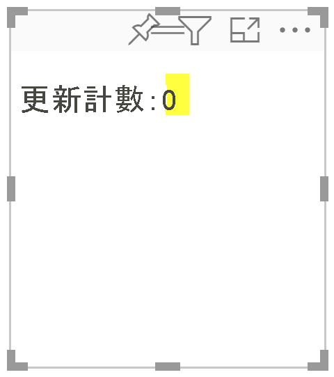
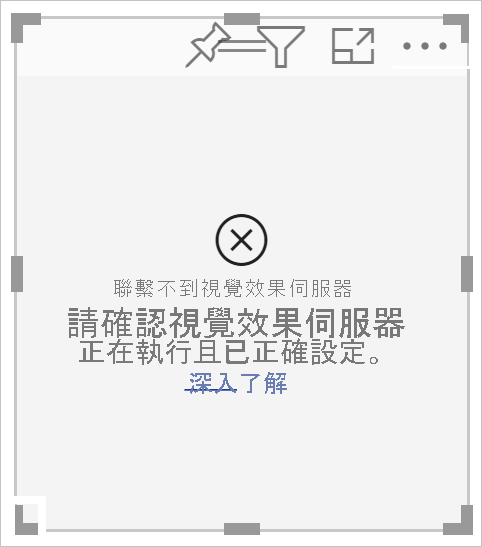
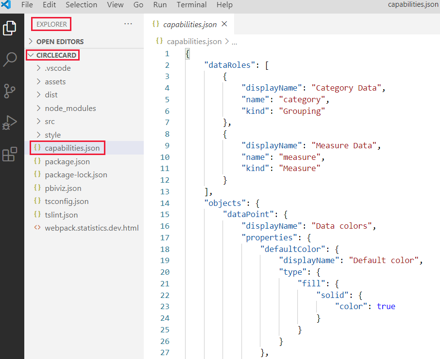

# <a name="tutorial-develop-a-power-bi-circle-card-visual"></a>教學課程：開發 Power BI 圓形卡片視覺效果

身為開發人員，您可以建立屬於自己的 Power BI 視覺效果。 這些視覺效果可以由您、您的組織，或是第三方使用。

在此教學課程中，您將開發名為 Circle Card (圓形卡片) 的 Power BI 視覺效果，以在圓形中顯示已設定格式的量值。 圓形卡片視覺效果支援自訂填滿色彩與外框粗細。

在本教學課程中，您會了解如何：
> [!div class="checklist"]
> * 為您的視覺效果建立開發專案。
> * 使用 D3 視覺效果元素開發視覺效果。
> * 設定視覺效果以處理資料。

## <a name="prerequisites"></a>先決條件

在您開始開發 Power BI 視覺效果之前，請確認您已具備此節所列的所有項目。

* 您需要 **Power BI Pro** 帳戶。 如果您沒有金鑰，請[註冊免費試用](https://powerbi.microsoft.com/pricing/)。

* [Visual Studio Code (VS Code)](https://www.visualstudio.com/)。 VS Code 是開發 JavaScript 和 TypeScript 應用程式的理想整合式開發環境 (IDE)。

* [Windows PowerShell](/powershell/scripting/install/installing-windows-powershell) 第 4 版或更新版本 (針對 Windows)。 或是[終端機](https://macpaw.com/how-to/use-terminal-on-mac) \(英文\) (針對 OSX)。

* 已可用於開發 Power BI 視覺效果的環境。 [設定環境以開發 Power BI 視覺效果](environment-setup.md)。

* 此教學課程會使用 **US Sales Analysis** (美國銷售分析) 報表。 您可以[下載](https://microsoft.github.io/PowerBI-visuals/docs/step-by-step-lab/images/US_Sales_Analysis.pbix) \(英文\) 此報表並將其上傳至 Power BI 服務，或是使用您自己的報表。 如果您需要 Power BI 服務及上傳檔案的詳細資訊，請參閱[開始在 Power BI 服務中建立](../../fundamentals/service-get-started.md)教學課程。

## <a name="create-a-development-project"></a>建立開發專案

在此節中，您將會建立圓形卡片視覺效果的專案。

1. 開啟 PowerShell 並瀏覽到您要在其中建立專案的資料夾。

2. 輸入下列命令：

    ```PowerShell
    pbiviz new CircleCard
    ```

3. 瀏覽至專案資料夾。

    ```powershell
    cd CircleCard
    ```

4. 啟動圓形卡片視覺效果。 您的視覺效果現在會在裝載於您電腦上的情況下執行。

    ```powershell
    pbiviz start
    ```
    >[!IMPORTANT]
    >請不要關閉 PowerSell 視窗，直到教學課程結束為止。 若要停止執行視覺效果，請輸入 Ctrl+C；如果系統提示是否要終止批次作業，請輸入 Y，然後按 *Enter*。

## <a name="view-the-circle-card-in-power-bi-service"></a>在 Power BI 服務中檢視圓形卡片

為了在 Power BI 服務中測試圓形卡片，我們將會使用 **US Sales Analysis** (美國銷售分析) 報表。 您可以[下載](https://microsoft.github.io/PowerBI-visuals/docs/step-by-step-lab/images/US_Sales_Analysis.pbix) \(英文\) 此報表並將其上傳至 Power BI 服務。

您也可以使用自己的報表來測試圓形卡片視覺效果。

>[!NOTE]
>在您繼續之前，請確認您[已啟用視覺效果開發人員設定](environment-setup.md#set-up-power-bi-service-for-developing-a-visual)。

1. 登入 [PowerBI.com](https://powerbi.microsoft.com/)，然後開啟 [US Sales Analysis] \(美國銷售分析\) 報表。

2. 選取 [更多選項] > [編輯]。

    >[!div class="mx-imgBorder"]
    >![Power BI 服務中 [編輯] 選項的螢幕擷取畫面。](media/develop-circle-card/edit-report.png)

3. 建立新頁面以供測試使用，然後按一下 Power BI 服務介面底部的 [新增頁面] 按鈕。

    >[!div class="mx-imgBorder"]
    >![Power BI 服務中 [新增頁面] 按鈕的螢幕擷取畫面。](media/develop-circle-card/new-page.png)

4. 從 [視覺效果] 窗格，選取 [開發人員視覺效果]。

    >[!div class="mx-imgBorder"]
    >![[視覺效果] 窗格中 [開發人員視覺效果] 的螢幕擷取畫面。](media/develop-circle-card/developer-visual.png)

    此視覺效果代表您在電腦上執行的自訂視覺效果。 其只有在已啟用[自訂視覺效果偵錯](environment-setup.md#set-up-power-bi-service-for-developing-a-visual)設定的情況下才可供使用。

5. 確認視覺效果已新增至報表畫布。

    >[!div class="mx-imgBorder"]
    >

    這是非常簡單的視覺效果，其會顯示已呼叫其更新方法的次數。 在這個階段中，視覺效果尚未擷取任何資料。

    >[!NOTE]
    >如果視覺效果顯示連線錯誤訊息，請在瀏覽器中開啟新索引標籤，瀏覽至 `https://localhost:8080/assets/status`，並為您的瀏覽器授權以使用此位址。
    >
    >

6. 在已選取新視覺效果的情況下，移至 [欄位] 窗格，展開 [Sales] \(銷售\)，然後選取 [Quantity] \(數量\)。

    >[!div class="mx-imgBorder"]
    >![Power BI 服務 [US Sales Analysis] \(美國銷售分析\) 報表的 [Sales] \(銷售\) 資料表中 [Quantity] \(數量\) 欄位的螢幕擷取畫面。](media/develop-circle-card/fields-sales-quantity.png)

7. 若要測試視覺效果的回應方式，請調整其大小；請注意，[Update count] \(更新計數\) 的值會隨著您調整視覺效果的大小而遞增。

    >[!div class="mx-imgBorder"]
    >![在調整大小後顯示不同 [Update count] \(更新計數\) 數目之新視覺效果的螢幕擷取畫面。](media/develop-circle-card/resized-visual.png)

## <a name="add-visual-elements-and-text"></a>新增視覺元素和文字

在此節中，您將了解如何將視覺效果轉換成圓形，並使其顯示文字。

>[!NOTE]
>在此教學課程中，會使用 [Visual Studio Code](https://code.visualstudio.com/) \(英文\) (VS Code) 來開發 Power BI 視覺效果。

### <a name="modify-the-visuals-file"></a>修改視覺效果檔案

透過刪除並新增幾行程式碼來設定 **visual.ts** 檔案。

1. 在 VS Code 中開啟您的專案 ([檔案] > [開啟資料夾])。

2. 在 [檔案總管] 窗格中，展開 [src] 資料夾，然後選取 **visual.ts** 檔案。

    >[!div class="mx-imgBorder"]
    >

    > [!IMPORTANT]
    > 請注意在 **visual.ts** 檔案頂端的註解。 使用 Power BI 視覺效果套件的權限是根據 Massachusetts Institute of Technology (MIT) 授權的規定免費授與的。 根據該合約所規定，您必須將註解保留在檔案頂端。

3. 從 *visual.ts* 檔案中移除下列程式碼。

    * *VisualSettings* 匯入：
        ```typescript
        import { VisualSettings } from "./settings";
        ```

    * 四個類別層級的私用變數宣告。

    * *constructor* 內的所有程式碼。

    * *update* 方法內的所有程式碼。

    * *update* 方法底下的其餘程式碼，包括 *parseSettings* 與 *enumerateObjectInstances* 方法。

4. 於 import 區段結尾新增下列程式碼：

    * *IVisualHost* - 用於與視覺效果主機 (Power BI) 互動的屬性和服務集合。

         ```typescript
        import IVisualHost = powerbi.extensibility.IVisualHost;
        ```

    * D3 程式庫

        ```typescript
        import * as d3 from "d3";
        type Selection<T extends d3.BaseType> = d3.Selection<T, any,any, any>;
        ```
    
        >[!NOTE]
        >如果您未在安裝過程中安裝此程式庫，請[安裝 D3 JavaScript 程式庫](environment-setup.md#d3-javascript-library)。

5. 在 *Visual* 類別宣告下方，插入下列類別層級屬性。 您只需要新增以 `private` 為開頭的程式碼。

    ```typescript
    export class Visual implements IVisual {
        // ...
        private host: IVisualHost;
        private svg: Selection<SVGElement>;
        private container: Selection<SVGElement>;
        private circle: Selection<SVGElement>;
        private textValue: Selection<SVGElement>;
        private textLabel: Selection<SVGElement>;
        // ...
    }
    ```

6. 儲存 **visual.ts** 檔案。

### <a name="add-a-circle-and-text-elements"></a>新增圓形和文字元素

新增 D3 可縮放向量圖形 (SVG)。 這可讓您建立三種圖形：圓形，以及兩個文字元素。

1. 在 VS Code 中開啟 **visual.ts**。

2. 將下列程式碼新增到 *constructor*。

    ```typescript
    this.svg = d3.select(options.element)
        .append('svg')
        .classed('circleCard', true);
    this.container = this.svg.append("g")
        .classed('container', true);
    this.circle = this.container.append("circle")
        .classed('circle', true);
    this.textValue = this.container.append("text")
        .classed("textValue", true);
    this.textLabel = this.container.append("text")
        .classed("textLabel", true);
    ```

    >[!TIP]
    >若要改善可讀性，建議您每次將程式碼片段複製到專案之後，都對文件進行格式設定。 在 VS Code 中的任何位置以滑鼠右鍵按一下，然後選取 [格式化文件] (Alt+Shift+F)。

3. 儲存 **visual.ts** 檔案。

### <a name="set-the-width-and-height"></a>設定寬度和高度

設定視覺效果的寬度和高度，然後將視覺效果元素的屬性與樣式初始化。

1. 在 VS Code 中開啟 **visual.ts**。

2. 將下列程式碼新增到 *update* 方法。

    ```typescript
    let width: number = options.viewport.width;
    let height: number = options.viewport.height;
    this.svg.attr("width", width);
    this.svg.attr("height", height);
    let radius: number = Math.min(width, height) / 2.2;
    this.circle
        .style("fill", "white")
        .style("fill-opacity", 0.5)
        .style("stroke", "black")
        .style("stroke-width", 2)
        .attr("r", radius)
        .attr("cx", width / 2)
        .attr("cy", height / 2);
    let fontSizeValue: number = Math.min(width, height) / 5;
    this.textValue
        .text("Value")
        .attr("x", "50%")
        .attr("y", "50%")
        .attr("dy", "0.35em")
        .attr("text-anchor", "middle")
        .style("font-size", fontSizeValue + "px");
    let fontSizeLabel: number = fontSizeValue / 4;
    this.textLabel
        .text("Label")
        .attr("x", "50%")
        .attr("y", height / 2)
        .attr("dy", fontSizeValue / 1.2)
        .attr("text-anchor", "middle")
        .style("font-size", fontSizeLabel + "px");
    ```

3. 儲存 **visual.ts** 檔案。

### <a name="optional-review-the-code-in-the-visuals-file"></a>(選擇性) 檢閱視覺效果檔案中的程式碼

確認 *visuals.ts* 檔案中的程式碼看起來像這樣：

```typescript
/*
*  Power BI Visual CLI
*
*  Copyright (c) Microsoft Corporation
*  All rights reserved.
*  MIT License
*
*  Permission is hereby granted, free of charge, to any person obtaining a copy
*  of this software and associated documentation files (the ""Software""), to deal
*  in the Software without restriction, including without limitation the rights
*  to use, copy, modify, merge, publish, distribute, sublicense, and/or sell
*  copies of the Software, and to permit persons to whom the Software is
*  furnished to do so, subject to the following conditions:
*
*  The above copyright notice and this permission notice shall be included in
*  all copies or substantial portions of the Software.
*
*  THE SOFTWARE IS PROVIDED *AS IS*, WITHOUT WARRANTY OF ANY KIND, EXPRESS OR
*  IMPLIED, INCLUDING BUT NOT LIMITED TO THE WARRANTIES OF MERCHANTABILITY,
*  FITNESS FOR A PARTICULAR PURPOSE AND NONINFRINGEMENT. IN NO EVENT SHALL THE
*  AUTHORS OR COPYRIGHT HOLDERS BE LIABLE FOR ANY CLAIM, DAMAGES OR OTHER
*  LIABILITY, WHETHER IN AN ACTION OF CONTRACT, TORT OR OTHERWISE, ARISING FROM,
*  OUT OF OR IN CONNECTION WITH THE SOFTWARE OR THE USE OR OTHER DEALINGS IN
*  THE SOFTWARE.
*/
"use strict";

import "core-js/stable";
import "./../style/visual.less";
import powerbi from "powerbi-visuals-api";
import VisualConstructorOptions = powerbi.extensibility.visual.VisualConstructorOptions;
import VisualUpdateOptions = powerbi.extensibility.visual.VisualUpdateOptions;
import IVisual = powerbi.extensibility.visual.IVisual;
import EnumerateVisualObjectInstancesOptions = powerbi.EnumerateVisualObjectInstancesOptions;
import VisualObjectInstance = powerbi.VisualObjectInstance;
import DataView = powerbi.DataView;
import VisualObjectInstanceEnumerationObject = powerbi.VisualObjectInstanceEnumerationObject;
import IVisualHost = powerbi.extensibility.IVisualHost;
import * as d3 from "d3";
type Selection<T extends d3.BaseType> = d3.Selection<T, any, any, any>;

export class Visual implements IVisual {
    private host: IVisualHost;
    private svg: Selection<SVGElement>;
    private container: Selection<SVGElement>;
    private circle: Selection<SVGElement>;
    private textValue: Selection<SVGElement>;
    private textLabel: Selection<SVGElement>;

    constructor(options: VisualConstructorOptions) {
        this.svg = d3.select(options.element)
            .append('svg')
            .classed('circleCard', true);
        this.container = this.svg.append("g")
            .classed('container', true);
        this.circle = this.container.append("circle")
            .classed('circle', true);
        this.textValue = this.container.append("text")
            .classed("textValue", true);
        this.textLabel = this.container.append("text")
            .classed("textLabel", true);
    }

    public update(options: VisualUpdateOptions) {
        let width: number = options.viewport.width;
        let height: number = options.viewport.height;
        this.svg.attr("width", width);
        this.svg.attr("height", height);
        let radius: number = Math.min(width, height) / 2.2;
        this.circle
            .style("fill", "white")
            .style("fill-opacity", 0.5)
            .style("stroke", "black")
            .style("stroke-width", 2)
            .attr("r", radius)
            .attr("cx", width / 2)
            .attr("cy", height / 2);
        let fontSizeValue: number = Math.min(width, height) / 5;
        this.textValue
            .text("Value")
            .attr("x", "50%")
            .attr("y", "50%")
            .attr("dy", "0.35em")
            .attr("text-anchor", "middle")
            .style("font-size", fontSizeValue + "px");
        let fontSizeLabel: number = fontSizeValue / 4;
        this.textLabel
            .text("Label")
            .attr("x", "50%")
            .attr("y", height / 2)
            .attr("dy", fontSizeValue / 1.2)
            .attr("text-anchor", "middle")
            .style("font-size", fontSizeLabel + "px");
    }
}
```

### <a name="modify-the-capabilities-file"></a>修改 capabilities 檔案

從 capabilities 檔案中刪除不需要的程式碼。

1. 在 VS Code 中開啟您的專案 ([檔案] > [開啟資料夾])。

2. 選取 [capabilities.json] 檔案。

    >[!div class="mx-imgBorder"]
    >

3. 移除所有物件元素 (第 14-60 行)。

4. 儲存 **capabilities.json** 檔案。

### <a name="restart-the-circle-card-visual"></a>重新啟動圓形卡片視覺效果

停止視覺效果執行並加以重新啟動。

1. 在執行視覺效果的 PowerShell 視窗中，輸入 Ctrl+C；如果系統提示是否要終止批次作業，請輸入 Y，然後按 *Enter*。

2. 在 PowerShell 中，啟動視覺效果。

    ```powershell
    pbiviz start
    ```

### <a name="test-the-visual-with-the-added-elements"></a>使用新增的元素測試視覺效果

確認視覺效果會顯示新增的元素。

1. 在 Power BI 服務中，開啟 *Power BI US Sales Analysis* (Power BI 美國銷售分析) 報表。 如果您是使用不同的報表來開發圓形卡片視覺效果，請瀏覽到該報表。

2. 確定視覺效果的形狀是圓形。

    >[!div class="mx-imgBorder"]
    >

    >[!NOTE]
    >如果視覺效果未顯示任何內容，請從 [欄位] 窗格中，將 [Quantity] \(數量\) 欄位拖曳到開發人員視覺效果中。

3. 調整視覺效果的大小。

    請注意圓形與文字會縮放，以符合視覺效果的尺寸。 系統會在您調整視覺效果的大小時呼叫 update 方法，導致視覺效果元素重新調整。

### <a name="enable-auto-reload"></a>啟用自動重新載入

使用此設定來確保您每次儲存專案變更時，視覺效果都會自動重新載入。

1. 瀏覽到 *Power BI US Sales Analysis* (Power BI 美國銷售分析) 報表 (或是具有您圓形卡片視覺效果的專案)。

2. 選取圓形卡片視覺效果。

3. 在浮動工具列中，選取 [切換自動重新載入]。

    >[!div class="mx-imgBorder"]
    >![在圓形卡片視覺效果浮動工具列中按一下 [切換自動重新載入] 選項的螢幕擷取畫面。](media/develop-circle-card/toggle-auto-reload.png)

## <a name="get-the-visual-to-process-data"></a>讓視覺效果處理資料

在此節中，您將會定義資料角色和資料檢視對應。 您也會修改視覺效果以顯示其正在顯示之值的名稱。

### <a name="configure-the-capabilities-file"></a>設定 capabilities 檔案

修改 **capabilities.json** 檔案，以定義資料角色與資料檢視對應。

* **定義資料角色**

    以 *measure* 類型的單一資料角色來定義 *dataRoles* 陣列。 此資料角色稱為 *measure*，且會顯示為 *Measure*。 其可讓您傳遞量值欄位，或是加總之後的欄位。

    1. 在 VS Code 中開啟 **capabilities.json** 檔案。

    2. 移除 **dataRoles** 陣列內的所有內容 (第 3-12 行)。

    3. 將下列程式碼插入 **dataRoles** 陣列中。

        ```json
        {
            "displayName": "Measure",
            "name": "measure",
            "kind": "Measure"
        }
        ```

    4. 儲存 **capabilities.json** 檔案。

* **定義資料檢視對應**

    在 *dataViewMappings* 陣列中定義名為 *measure* 的檔案。 此欄位可以傳遞至資料角色。

    1. 在 VS Code 中開啟 **capabilities.json** 檔案。

    2. 移除 **dataViewMappings** 陣列內的所有內容 (第 10-30 行)。

    3. 將下列程式碼插入 **dataViewMappings** 陣列。

        ```json
        {
            "conditions": [
                { "measure": { "max": 1 } }
            ],
            "single": {
                "role": "measure"
            }
        }
        ```

    4. 儲存 **capabilities.json** 檔案。

### <a name="optional-review-the-capabilities-file-code-changes"></a>(選擇性) 檢閱 capabilities 檔案程式碼變更

確認圓形卡片視覺效果會顯示 [measure] \(量值\) 欄位，並使用 [顯示資料檢視] 選項來檢閱您做出的變更。 

1. 在 Power BI 服務中，開啟 *Power BI US Sales Analysis* (Power BI 美國銷售分析) 報表。 如果您是使用不同的報表來開發圓形卡片視覺效果，請瀏覽到該報表。

2. 請注意，圓形卡片視覺效果現在可以使用標題為 [Measure] \(量值\) 的欄位加以設定。 您可以將 [欄位] 窗格中的元素拖放到 [Measure] \(量值\) 欄位。

    >[!div class="mx-imgBorder"]
    >![Power BI 服務 [視覺效果] 窗格中圓形卡片 [Measure] \(量值\) 欄位的螢幕擷取畫面。](media/develop-circle-card/measure.png)

    > [!Note]
    > 視覺效果尚未包含資料繫結邏輯。

3. 在浮動工具列中，選取 [顯示資料檢視]。 

    >[!div class="mx-imgBorder"]
    >![位於圓形卡片浮動工具列中之 [顯示資料檢視] 按鈕的螢幕擷取畫面。](media/develop-circle-card/show-dataview.png)

4. 選取三個點以展開顯示，然後選取 **single** 以檢視值。

    >[!div class="mx-imgBorder"]
    >![在圓形卡片 [顯示資料檢視] 選項中顯示之 value 數值的螢幕擷取畫面。](media/develop-circle-card/value.png)

5. 展開 **metadata**，然後展開 **columns** 陣列，並檢閱 **format** 和 **displayName** 值。

    >[!div class="mx-imgBorder"]
    >![在圓形卡片 [顯示資料檢視] 選項中顯示之 format 和 displayName 值的螢幕擷取畫面。](media/develop-circle-card/colunms.png)

6. 若要切換回到視覺效果，在視覺效果上方浮動的工具列中，選取 [顯示資料檢視]。

### <a name="configure-the-visual-to-consume-data"></a>設定視覺效果以取用資料

對 **visual.ts** 檔案做出變更，來讓圓形卡片視覺效果能夠取用資料。

1. 在 VS Code 中開啟 **visual.ts** 檔案。

2. 新增下列程式碼以匯入來自 `powerbi` 模組的 `DataView` 介面。

    ```typescript
    import DataView = powerbi.DataView;
    ```

3. 在 *update* 方法中，執行下列動作：

    * 將下列陳述式新增為第一個陳述式。 為了方便存取，陳述式會將 *dataView* 指派給變數，然後宣告該變數以參考 *dataView* 物件。

        ```typescript
        let dataView: DataView = options.dataViews[0];
        ```

    * 以這行程式碼取代 **.text("Value")** ：

        ```typescript
        .text(<string>dataView.single.value)
        ```

    * 以這行程式碼取代 **.text("Label")** ：

        ```typescript
        .text(dataView.metadata.columns[0].displayName)
        ```

4. 儲存 **visual.ts** 檔案。

5. 在 Power BI 服務中檢閱視覺效果。 視覺效果現在會顯示值與顯示名稱。

## <a name="next-steps"></a>後續步驟

> [!div class="nextstepaction"]
> [將格式設定選項新增到圓形卡片視覺效果](custom-visual-develop-tutorial-format-options.md)

> [!div class="nextstepaction"]
> [建立 Power BI 橫條圖視覺效果](create-bar-chart.md)

> [!div class="nextstepaction"]
> [了解如何對您所建立的 Power BI 視覺效果進行偵錯](visuals-how-to-debug.md)

> [!div class="nextstepaction"]
> [Power BI 視覺效果專案結構](visual-project-structure.md)
