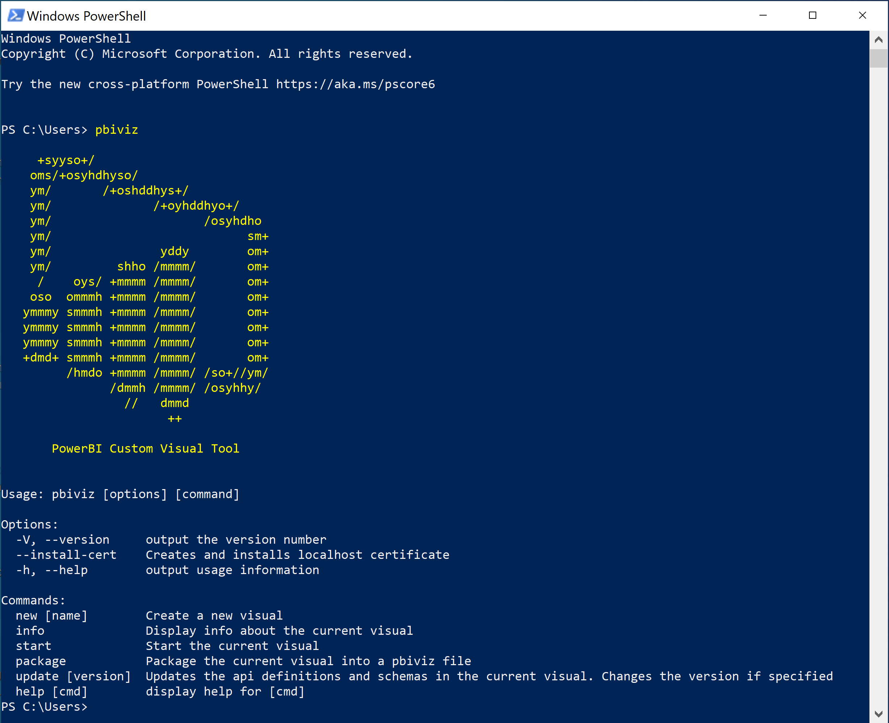

# <a name="set-up-your-environment-for-developing-a-power-bi-visual"></a>設定環境以開發 Power BI 視覺效果

在此文章中，您將了解如何設定環境以開發 Power BI 視覺效果。

開始開發之前，您將必須先安裝 **node.js** 與 **pbiviz** 套件。 您也必須建立並安裝憑證。 設定您的本機環境時，您將必須設定 Power BI 服務以開發 Power BI 視覺效果。

在本文中，您將學會如何：
> [!div class="checklist"]
> * 安裝 *node.js*。
> * 安裝 *pbiviz*。
> * 建立並安裝憑證。
> * 設定 Power BI 服務以開發視覺效果。
> * 安裝額外的程式庫 (開發視覺效果的必要項)。

## <a name="install-nodejs"></a>安裝 node.js

*Node.js* 是建置於 Chrome V8 JavaScript 引擎之上的 JavaScript 執行階段。 其讓開發人員能夠執行任何建立於 JavaScript 之上的應用程式。

1. 若要安裝 *node.js*，請在網頁瀏覽器中瀏覽至 [node.js](https://nodejs.org) \(英文\)。

2. 下載最新的 MSI 安裝程式。

3. 執行安裝程式，然後按照安裝步驟執行。 接受授權合約的條款與所有預設值。

4. 重新啟動您的電腦。

## <a name="install-pbiviz"></a>安裝 pbiviz

*pbiviz* 工具是使用 JavaScript 編寫的，其會編譯 *pbiviz* 套件的視覺效果原始程式碼。

*pbiviz* 套件是一個壓縮的 Power BI 視覺效果專案，其中包含所有必要的指令碼與資產。

1. 開啟 Windows PowerShell，然後輸入下列命令。

    ```powershell
    npm i -g powerbi-visuals-tools
    ```

## <a name="create-and-install-a-certificate"></a>建立並安裝憑證

若要讓用戶端 (您的電腦) 與伺服器 (Power BI 服務) 安全地互動，需要[安全通訊端層 (SSL) 憑證](create-ssl-certificate.md)。 如果沒有憑證來確保安全互動，其將會遭到瀏覽器封鎖。

# <a name="windows"></a>[Windows](#tab/windows)

此程序說明如何執行 PowerShell 命令來啟動 [憑證匯入精靈]。 請遵循下列步驟，以在精靈中設定憑證。

>[!IMPORTANT]
>請勿在此程序期間關閉 PowerSell 視窗。

1. 開啟 Windows PowerShell，然後輸入下列命令。

    ```powershell
    pbiviz --install-cert
    ```

    此命令會執行兩個動作：
    * 其會傳回「複雜密碼」。 在此案例中，「複雜密碼」是 9765328806094。
    * 它也會啟動 [憑證匯入精靈]。
    
    >[!div class="mx-imgBorder"]
    >

2. 在 [憑證匯入精靈] 中，確認已將存放區位置設定為 [目前使用者]，然後選取 [下一步]。

    >[!div class="mx-imgBorder"]
    >![[憑證匯入精靈] 中第一個視窗的螢幕擷取畫面，其中已將 [存放區位置] 選項設為 [目前使用者]。](media/environment-setup/certificate-wizard-store-location.png)

3. 在 [要匯入的檔案] 視窗中，選取 [下一步]。

4. 在 [私密金鑰保護] 視窗的 [密碼] 文字方塊中，貼上您在執行 PowerShell 命令時所收到的複雜密碼 (步驟 1)，然後選取 [下一步]。 在此範例中，複雜密碼是 9765328806094。

    >[!div class="mx-imgBorder"]
    >![[憑證匯入精靈] 中 [私密金鑰保護] 視窗的螢幕擷取畫面，其中已醒目提示 [密碼] 方塊。](media/environment-setup/certificate-wizard-password.png)

5. 在 [憑證存放區] 視窗中，選取 [將所有憑證放入以下的存放區] 選項，然後選取 [瀏覽]。

    >[!div class="mx-imgBorder"]
    >![[憑證匯入精靈] 中 [憑證存放區] 視窗的螢幕擷取畫面，其中已選取 [將所有憑證放入以下的存放區]。](media/environment-setup/certificate-wizard-certificate-store.png)

6. 在 [選取憑證存放區]  視窗中，選取 [受信任的根憑證授權單位]  ，然後選取 [確定]  。

    >[!div class="mx-imgBorder"]
    >![[選取憑證存放區] 視窗的螢幕擷取畫面，其中已選取 [受信任的根憑證授權單位] 資料夾。](media/environment-setup/trusted-root.png)

7. 在 [憑證存放區] 視窗中，選取 [下一步]。

    >[!div class="mx-imgBorder"]
    >![[憑證匯入精靈] 中 [憑證存放區] 視窗的螢幕擷取畫面，其中已選取 [受信任的根憑證授權單位] 資料夾，並醒目提示 [下一步] 按鈕。](media/environment-setup/certificate-wizard-store-next.png)

8. 在 [完成憑證匯入精靈] 視窗中，確認您的設定，然後選取 [完成]。

    >[!NOTE]
    >如果您收到安全性警告，請選取 [是]  。


# <a name="osx"></a>[OSX](#tab/sdk2osx)

1. 如果左上方的鎖為鎖定狀態，請選取該鎖以解除鎖定。 搜尋 *localhost* 並按兩下憑證。

    

2. 選取 [永遠信任]  ，然後關閉視窗。

    

3. 輸入您的使用者名稱與密碼，然後選取 [更新設定]。

    

4. 關閉任何已開啟的瀏覽器。

> [!NOTE]
> 如果系統無法辨識憑證，請重新啟動電腦。

---

## <a name="optional-verify-that-your-environment-is-set-up"></a>(選擇性) 確認您的環境已設定

確認已安裝 Power BI 視覺效果工具套件。 在 PowerShell 中，執行 `pbiviz` 命令，然後檢閱輸出，包括支援的命令清單。

>[!div class="mx-imgBorder"]
>

## <a name="set-up-power-bi-service-for-developing-a-visual"></a>設定 Power BI 服務以開發視覺效果

若要開發 Power BI 視覺效果，您將必須在 Power BI 服務中啟用自訂視覺效果偵錯。 遵循此節中的指示來啟用此選項。

1. 登入 [PowerBI.com](https://powerbi.microsoft.com/)。

2. 瀏覽至 [設定] > [設定] > [設定]。

    >[!div class="mx-imgBorder"]
    >![Power BI 服務中 [設定]、[設定]、[設定]、[功能表] 選項的螢幕擷取畫面。](media/environment-setup/powerbi-settings.png)

3. 在 [一般] 索引標籤上，選取 [開發人員]。 在 [開發人員設定] 中，選取 [使用開發人員視覺效果啟用自訂視覺效果偵錯] 核取方塊，然後選取 [套用]。

    >[!div class="mx-imgBorder"]
    >![Power BI 的 [設定]、[一般] 索引標籤中 [使用開發人員視覺效果啟用自訂視覺效果偵錯] 選項的螢幕擷取畫面。](media/environment-setup/developer-settings.png)

## <a name="install-development-libraries"></a>安裝開發程式庫

若要開發自己的 Power BI 視覺效果，您將必須安裝其他程式庫。 此節說明如何安裝這些程式庫，並確認安裝是否成功。

若要安裝此文章所列的程式庫，請開啟 PowerShell，然後針對每個元件輸入安裝命令。

>[!NOTE]
>將這些程式庫安裝在您的電腦之後，您就可以將其用於任何 Power BI 視覺效果專案。 這對每部機器而言均為一次性安裝程序。


### <a name="d3-javascript-library"></a>D3 JavaScript 程式庫

[D3](https://d3js.org/) \(英文\) 是一個 JavaScript 程式庫，可用來在網頁瀏覽器中產生動態的互動式資料視覺效果。 其依賴廣泛實作的可縮放向量圖形 (SVG)、HTML5 與 CSS 標準。

```powershell
npm i d3@^5.0.0 --save
```

### <a name="typescript-definitions"></a>TypeScript 定義

安裝 TypeScript 定義，讓您可以在 [TypeScript](https://www.typescriptlang.org/) \(英文\) (JavaScript 的超集) 中開發 Power BI 視覺效果。

```powershell
npm i @types/d3@^5.0.0 --save
```

### <a name="core-js"></a>core-js

[core js](https://www.npmjs.com/package/core-js) \(英文\) 是 JavaScript 的模組化標準程式庫，其中包含 ECMAScript 的外掛程式。

```powershell
npm i core-js@3.2.1 --save
```

### <a name="powerbi-visual-api"></a>powerbi-visual-api

安裝 Power BI 視覺效果 API 定義。

```powershell
npm i powerbi-visuals-api --save-dev
```

### <a name="optional-verify-that-the-d3-library-is-installed"></a>(選擇性) 確認已安裝 D3 程式庫

[Visual Studio Code](https://code.visualstudio.com/) \(英文\) (VS Code) 是用於開發 TypeScript 應用程式的理想整合式開發環境 (IDE)。 在此節中，我們將使用 VS Code，來確認已正確安裝您開發 Power BI 視覺效果所需的 D3 程式庫。

>[!NOTE]
>此節所述的驗證程序假設您目前具有 Power BI 視覺效果專案。 如果您沒有 Power BI 視覺效果專案，則可遵循[圓形卡片專案建立](develop-circle-card.md#create-a-development-project)指示來建立一個。

1. 開啟 VS Code。

    >[!TIP]
    >您可以執行下列命令，從 PowerShell 開啟 VS Code：
    >
    >```powershell
    >code .
    >```
2. 在 VS Code 中，開啟 [檔案] 功能表，然後選取 [開啟資料夾]。

    >[!div class="mx-imgBorder"]
    >![VS Studio [檔案] 功能表中 [開啟資料夾] 選項的螢幕擷取畫面。](media/environment-setup/open-folder.png)

3. 在 [開啟資料夾] 視窗中，選取包含您 Power BI 視覺效果專案的資料夾，然後選取 [選取資料夾]。

    >[!div class="mx-imgBorder"]
    >![在 VS Studio [開啟資料夾] 視窗中選取 Power BI 視覺效果專案資料夾的螢幕擷取畫面。](media/environment-setup/project-folder.png)

4. 在 [檔案總管] 窗格中，展開 [node_modules] 資料夾，並確認已安裝 **d3** 程式庫。

    >[!div class="mx-imgBorder"]
    >

5. 在 [檔案總管] 窗格中，展開 [node_modules] > @types > [d3] 資料夾，並確認已安裝 **index.t.ds** 檔案。

    >[!div class="mx-imgBorder"]
    >

## <a name="next-steps"></a>後續步驟

> [!div class="nextstepaction"]
> [建立 Power BI 圓形卡片視覺效果](develop-circle-card.md)

> [!div class="nextstepaction"]
> [建立 Power BI 橫條圖視覺效果](create-bar-chart.md)