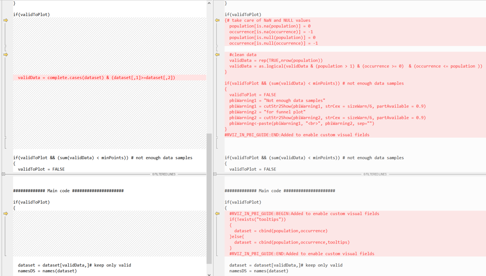

# <a name="tutorial-build-a-funnel-plot-from-r-script-to-r-visual"></a>教學課程：從 R 指令碼到 R 視覺效果 - 建置漏斗圖
本文逐步說明如何在 R 視覺效果中使用 R 指令碼來建置漏斗圖。

在本文中，您將學會如何建立：

> [!div class="checklist"]
>
> * RStudio 的 R 指令碼
> * Power BI 中的 R 視覺效果
> * Power BI 中 R 支援的「PNG 型」視覺效果
> * Power BI 中 R 支援的「HTML 型」視覺效果

漏斗圖可提供簡單方式來使用、解讀及顯示預期的變化量。 **漏斗圖** 以信賴界限構成，極端值則會顯示為漏斗外的點。

在此範例中，漏斗圖用於比較及分析不同組資料。  

> [!NOTE]
> 每一組步驟下方都有來源檔案可供下載。

## <a name="build-an-r-script-with-dataset"></a>使用資料集建置 R 指令碼

1. 下載[最基本的 R 指令碼](https://github.com/microsoft/PowerBI-visuals/raw/master/RVisualTutorial/TutorialFunnelPlot/chapter1_R/script_R_v1_00.r)及其資料表 [dataset.csv](https://github.com/microsoft/PowerBI-visuals/raw/master/RVisualTutorial/TutorialFunnelPlot/chapter1_R/dataset.csv)。

1. 接下來，請編輯指令碼以鏡像[此指令碼](https://github.com/microsoft/PowerBI-visuals/raw/master/RVisualTutorial/TutorialFunnelPlot/chapter1_R/script_R_v1_01.r)。 此動作會新增輸入錯誤處理和使用者參數，以控制繪圖的外觀。

## <a name="build-a-report"></a>建置報表

接下來，請編輯指令碼以鏡像[此指令碼](https://github.com/microsoft/PowerBI-visuals/raw/master/RVisualTutorial/TutorialFunnelPlot/chapter2_Rvisual/script_RV_v2_00.r)。 這會將 *dataset.csv* (而不是 *read.csv*) 載入 Power BI 桌面工作區，並建立 **Cancer Mortality** 資料表。 接著在 [PBIX 檔案](https://github.com/microsoft/PowerBI-visuals/raw/master/RVisualTutorial/TutorialFunnelPlot/chapter2_Rvisual/funnelPlot_Rvisual.pbix)中查看結果。

> [!NOTE]
> `dataset` 是任何 R 視覺效果輸入 `data.frame` 的硬式編碼名稱。 

## <a name="create-an-r-powered-visual-and-package-in-r-code"></a>建立 R 支援的視覺效果並封裝在 R 程式碼中

1. 開始前，務必先[安裝 PBIVIZ 工具](./environment-setup.md#install-pbiviz)。

1. 執行下列命令以建立 R 支援的新視覺效果：

   ```bash
   pbiviz new funnel-visual -t rvisual
   cd funnel-visual
   npm install 
   pbiviz package
   ```

   此命令會使用初始範本視覺效果 (`-t` 代表 **範本**) 來建立 *funnel-visual* 資料夾。 您可以在 *dist* 資料夾中找到 PBIVIZ，也就是 *script.r* 檔案中的 R 程式碼。 請嘗試將其匯入 Power BI，看看會發生什麼情形。

1. 編輯 *script.r* 檔案，並將內容取代為您先前的指令碼。

1. 編輯 *capabilities.json*，並以 `dataset` 取代 `Values` 字串。 這會取代範本中的「角色」名稱，成為像是 R 程式碼中的內容。

   

1. (選擇性) 編輯 *dependencies.json* 並為 R 指令碼所需的每個 R 套件新增區段。 這會要求 Power BI 在第一次載入視覺效果時自動匯入這些套件。

   

1. 使用 `pbiviz package` 命令重新封裝視覺效果，並嘗試將其匯入 Power BI。

> [!NOTE]
> 請參閱 [PBIX](https://github.com/microsoft/PowerBI-visuals/blob/master/RVisualTutorial/TutorialFunnelPlot/chapter3_RCustomVisual/funnelPlot_RCustomVisual.pbix) 和[原始程式碼](https://github.com/Microsoft/PowerBI-visuals/tree/master/RVisualTutorial/TutorialFunnelPlot/chapter3_RCustomVisual/funnelRvisual_v01/)以進行下載。

## <a name="make-r-based-visual-improvements"></a>進行以 R 為基礎的視覺效果改進

視覺效果對使用者而言仍不易使用，因為使用者必須知道輸入資料表中的資料行順序。

1. 將輸入欄位 `dataset` 分割為三個欄位 (角色)：`Population`、`Number` 和 `Tooltips`

   

1. 編輯 *capabilities.json* 並以三個新角色取代 `dataset` 角色，或下載 [capabilities.json](https://github.com/microsoft/PowerBI-visuals/raw/master/RVisualTutorial/TutorialFunnelPlot/chapter3_RCustomVisual/funnelRvisual_v02/capabilities.json)。

   您將需要更新區段：`dataRoles` 和 `dataViewMappings`，這兩個區段會定義每個輸入欄位的名稱、類型、工具提示和資料行上限。

   
   
   如需詳細資訊，請參閱[功能](./capabilities.md)。

1. 編輯 *script.r* 以支援 `Population`、`Number` 和 `Tooltips` 作為輸入資料框架 (而不是 `dataset`)，或下載 [script.r](https://github.com/microsoft/PowerBI-visuals/raw/master/RVisualTutorial/TutorialFunnelPlot/chapter3_RCustomVisual/funnelRvisual_v02/script.r)。

   

   > [!TIP]
   > 若要追蹤 R 指令碼中的變更，請搜尋註解區塊： 
   > 
   > ```r
   > #RVIZ_IN_PBI_GUIDE:BEGIN: Added to enable visual fields
   > ...
   > #RVIZ_IN_PBI_GUIDE:END: Added to enable visual fields
   > 
   > #RVIZ_IN_PBI_GUIDE:BEGIN: Removed to enable visual fields 
   > ...
   > #RVIZ_IN_PBI_GUIDE:BEGIN: Removed to enable visual fields
   > ```

1. 使用 `pbiviz package` 命令重新封裝視覺效果，並嘗試將其匯入 Power BI。

> [!NOTE]
> 請參閱 [PBIX](https://github.com/microsoft/PowerBI-visuals/raw/master/RVisualTutorial/TutorialFunnelPlot/chapter3_RCustomVisual/funnelPlot_RCustomVisual.pbix) 和[原始程式碼](https://github.com/Microsoft/PowerBI-visuals/tree/master/RVisualTutorial/TutorialFunnelPlot/chapter3_RCustomVisual/funnelRvisual_v02)以進行下載。

## <a name="add-user-parameters"></a>新增使用者參數

1. 為使用者新增功能以控制視覺效果元素的色彩和大小，包括 UI 的內部參數。

   

1. 編輯 *capabilities.json* 並更新 `objects` 區段。 我們會在此定義每個參數的名稱、工具提示和類型，也會決定如何將參數分割成群組 (在此案例中為三個群組)。

   下載 [capabilities.json](https://github.com/Microsoft/PowerBI-visuals/tree/master/RVisualTutorial/TutorialFunnelPlot/chapter3_RCustomVisual/funnelRvisual_v03/capabilities.json)，請參閱[物件屬性](./objects-properties.md)以取得詳細資訊

   

1. 編輯 *src/settings.ts* 以鏡像 [此 settings.ts](https://github.com/Microsoft/PowerBI-visuals/tree/master/RVisualTutorial/TutorialFunnelPlot/chapter3_RCustomVisual/funnelRvisual_v03/src/settings.ts)。 此檔案以 TypeScript 撰寫。  

   您會發現此處新增了兩個程式碼區塊，以：
   - 宣告新介面來保存屬性值
   - 定義成員屬性和預設值

   

1. 編輯 *script.r* 以鏡像 [此 script.r](https://github.com/Microsoft/PowerBI-visuals/tree/master/RVisualTutorial/TutorialFunnelPlot/chapter3_RCustomVisual/funnelRvisual_v03/script.r)。 這會藉由為每個使用者參數新增 `if.exists` 呼叫，在 UI 中新增參數的支援。

   > [!TIP]
   > 若要追蹤 R 指令碼中的變更，請搜尋註解：
   >
   > ```r
   > #RVIZ_IN_PBI_GUIDE:BEGIN:Added to enable user parameters
   >  ...
   > #RVIZ_IN_PBI_GUIDE:END:Added to enable user parameters
   >
   > #RVIZ_IN_PBI_GUIDE:BEGIN:Removed to enable user parameters 
   >  ...
   > #RVIZ_IN_PBI_GUIDE:END:Removed to enable user parameters
   > ```

   

   您可以決定像我們一樣不要對 UI 公開參數。  

1. 使用 `pbiviz package` 命令重新封裝視覺效果，並嘗試將其匯入 Power BI。

> [!NOTE]
> 請參閱 [PBIX](https://github.com/Microsoft/PowerBI-visuals/tree/master/RVisualTutorial/TutorialFunnelPlot/chapter3_RCustomVisual/funnelPlot_RCustomVisual.pbix) 和[原始程式碼](https://github.com/Microsoft/PowerBI-visuals/tree/master/RVisualTutorial/TutorialFunnelPlot/chapter3_RCustomVisual/funnelRvisual_v03/)以進行下載。

> [!TIP]
> 我們在這裡一次新增了數個類型的參數 (布林值、數值、字串和色彩)。 如需簡單的案例，請參閱[此範例](https://github.com/Microsoft/PowerBI-visuals/blob/master/RVisualTutorial/PropertiesPane.md)以了解如何新增單一參數。 

## <a name="convert-visual-to-rhtml-based-visual"></a>將視覺效果轉換成 RHTML 型視覺效果

由於產生的視覺效果為 PNG 型，有著不會回應滑鼠暫留、無法放大等限制，因此我們需要將其轉換成 HTML 型的視覺效果。 我們將建立 R 支援的 HTML 型視覺效果空白範本，然後從 PNG 型專案複製一些指令碼。

1. 執行命令：

   ```bash
   pbiviz new funnel-visual-HTML -t rhtml
   cd funnel-visual-HTML
   npm install 
   pbiviz package
   ```

1. 開啟 *capabilities.json* 並記下 `"scriptOutputType":"html"` 行。

1. 開啟 *dependencies.json* 並記下所列出的 R 套件名稱。

1. 開啟 *script.r* 並記下結構。 因為其不會使用外部輸入，所以您可以在 RStudio 中加以開啟並執行。 

   這會建立並儲存 *out.html*。 這個檔案是獨立的 (不具外部相依性)，並會定義 HTML Widget 內的圖形。 

   > [!IMPORTANT]
   > 針對 `htmlWidgets` 使用者，[r_files 資料夾](https://github.com/Microsoft/PowerBI-visuals/tree/master/RVisualTutorial/TutorialFunnelPlot/chapter4_RHTMLCustomVisual/funnelRHTMLvisual_v01/r_files)提供了 R 公用程式，可協助將 `plotly` 或 `widget` 物件轉換成獨立的 HTML。 
   > 
   > 此版本 R 支援的視覺效果也支援 `source` 命令 (與先前的視覺效果類型不同)，可讓您的程式碼更易讀。   
 
1. 以上一個步驟中的 *capabilities.json* 取代 *capabilities.json*，或下載 [capabilities.json](https://github.com/Microsoft/PowerBI-visuals/tree/master/RVisualTutorial/TutorialFunnelPlot/chapter4_RHTMLCustomVisual/funnelRHTMLvisual_v01/capabilities.json)。

   請務必保留：

   `"scriptOutputType": "html"`

1. 將最新版本 *script.r* 與範本中的 *script.r* 合併，或下載 [script.r](https://github.com/Microsoft/PowerBI-visuals/tree/master/RVisualTutorial/TutorialFunnelPlot/chapter4_RHTMLCustomVisual/funnelRHTMLvisual_v01/script.r)。

   新的指令碼會使用 `plotly` 套件將 **ggplot** 物件轉換成 **plotly** 物件，然後使用 `htmlWidgets` 套件將其儲存為 HTML 檔案。 

   大部分的公用程式函式都會移至 [_r_files/utils.r_](https://github.com/Microsoft/PowerBI-visuals/tree/master/RVisualTutorial/TutorialFunnelPlot/chapter4_RHTMLCustomVisual/funnelRHTMLvisual_v01/r_files/utils.r)，並新增 `generateNiceTooltips` 函式以顯示 **plotly** 物件。

   
   
   

   > [!TIP]
   > 若要追蹤 R 指令碼中的變更，請搜尋註解：
   > 
   > ```r
   > #RVIZ_IN_PBI_GUIDE:BEGIN:Added to create HTML-based 
   >  ...
   > #RVIZ_IN_PBI_GUIDE:BEGIN:Added to create HTML-based
   >
   > #RVIZ_IN_PBI_GUIDE:BEGIN:Removed to create HTML-based  
   > ...
   > #RVIZ_IN_PBI_GUIDE:BEGIN:Removed to create HTML-based
   > ```

1. 將最新版本 *dependencies.json* 與範本中的 *dependencies.json* 合併，以納入新的 R 套件相依性，或下載 [dependencies.json](https://github.com/Microsoft/PowerBI-visuals/tree/master/RVisualTutorial/TutorialFunnelPlot/chapter4_RHTMLCustomVisual/funnelRHTMLvisual_v01/dependencies.json)。

1. 以前述步驟的相同方式編輯 *src/settings.ts*。

1. 使用 `pbiviz package` 命令重新封裝視覺效果，並嘗試將其匯入 Power BI。

> [!NOTE]
> 請參閱 [PBIX 和原始程式碼](https://github.com/Microsoft/PowerBI-visuals/tree/master/RVisualTutorial/TutorialFunnelPlot/chapter4_RHTMLCustomVisual/funnelRHTMLvisual_v01)以進行下載。

## <a name="build-additional-examples"></a>建置其他範例

1. 執行下列命令來建立空白專案： 

   ```bash
   pbiviz new example -t rhtml
   cd example
   npm install 
   pbiviz package
   ```

1. 取用這個[展示](http://www.htmlwidgets.org/showcase_networkD3.html)中的程式碼，然後進行下列醒目提示的變更：

   

1. 取代您範本的 *script.r*，然後再次執行 `pbiviz package`。 現在視覺效果已包含在您的 Power BI 報表中！

## <a name="tips-and-tricks"></a>秘訣與技巧

* 建議開發人員編輯 *pbiviz.json* 以儲存正確的中繼資料，例如 **version**、**email**、**name**、**license type** 等。

   > [!IMPORTANT]
   > **guid** 欄位是視覺效果的唯一識別碼。 如果您為每個視覺效果各建立一個新專案，則 GUID 也會不同。 只有在使用複製到新視覺效果的舊專案時才會相同，但這是不建議的做法。

* 編輯 [*assets/icon.png*](https://github.com/Microsoft/PowerBI-visuals/tree/master/RVisualTutorial/TutorialFunnelPlot/chapter4_RHTMLCustomVisual/funnelRHTMLvisual_v01/assets/icon.png) 為視覺效果建立唯一圖示。 

* 若要使用與您 Power BI 報表中的相同資料在 RStudio 中對 R 程式碼進行偵錯，請將下列內容新增至 R 指令碼的開頭 (編輯 `fileRda` 變數)：

   ```r
   #DEBUG in RStudio
   fileRda = "C:/Users/yourUserName/Temp/tempData.Rda"
   if(file.exists(dirname(fileRda)))
   {
     if(Sys.getenv("RSTUDIO")!="")
       load(file= fileRda)
     else
       save(list = ls(all.names = TRUE), file=fileRda)
   }
   ```

   這會從 Power BI 報表儲存環境並將其載入 RStudio。 

* 您可以使用 [GitHub](https://github.com/Microsoft?utf8=%E2%9C%93&q=PowerBI&type=&language=R) 中提供的程式碼，而不必從頭開始開發 R 支援的視覺效果。 您可以選取要作為範本使用的視覺效果，並將程式碼複製到新專案。

   例如，您可以嘗試使用[曲線自訂視覺效果](https://github.com/Microsoft/PowerBI-visuals-spline)。

* 每個 R 視覺效果都會將 `unique` 運算子套用至其輸入資料表。 為了避免移除相同的資料列，請考慮使用唯一識別碼來新增額外的輸入欄位，並在 R 程式碼中予以忽略。   

* 如果您有 Power BI 帳戶，請使用 Power BI 服務來[即時](./develop-circle-card.md)開發視覺效果，而不使用 `pbiviz package` 命令將其重新封裝。

### <a name="html-widgets-gallery"></a>HTML Widget 資源庫
瀏覽 [HTML Widget 資源庫](http://gallery.htmlwidgets.org/)中的視覺效果，以用於您的下一個視覺效果。 為了方便起見，我們建立了[視覺效果專案存放庫](https://github.com/Microsoft/PowerBI-visuals/tree/master/RVisualTutorial/TutorialFunnelPlot/chapter4_RHTMLCustomVisual/multipleRHTML)，有超過 20 個互動式 HTML 視覺效果可供您選擇！

> [!TIP]
> 若要在 HTML Widget 之間切換，請使用 [格式] > [設定] > [類型]。 使用[此 PBIX 檔案](https://github.com/Microsoft/PowerBI-visuals/tree/master/RVisualTutorial/TutorialFunnelPlot/chapter4_RHTMLCustomVisual/multipleRHTML/assets/sample.pbix)來試試看。 

#### <a name="to-use-a-sample-for-your-visual"></a>將範例用於視覺效果

1. 下載整個資料夾。
1. 編輯 *script.r* 和 *dependencies.json* 以僅保留一個 Widget。
1. 編輯 *capabilities.json* 和 *settings.ts* 以移除 `Type` 選取器。
1. 將 *visual.ts* 中的 `const updateHTMLHead: boolean = true;` 變更為 `false`。 (以提高效能)
1. 變更 *pbiviz.json* 中的中繼資料，其中最重要的是 `guid` 欄位。
1. 視需要重新封裝並繼續自訂視覺效果。 


> [!NOTE]
> 這個專案中的 Widget 並非全部受服務支援。

## <a name="next-steps"></a>後續步驟

若要深入了解，請參閱其他 Power BI 教學課程：[開發 Power BI 圓形卡片視覺效果](./develop-circle-card.md)與 [R 視覺效果](../../visuals/service-r-visuals.md)。

了解如何[開發並提交視覺效果](https://powerbi.microsoft.com/documentation/powerbi-developer-office-store/)至 [Office 市集 (資源庫)](https://store.office.com/appshome.aspx?ui=en-US&rs=en-US&ad=US&clickedfilter=OfficeProductFilter%3aPowerBI&productgroup=PowerBI)。如需進一步的範例，請參閱 [R 指令碼展示](https://community.powerbi.com/t5/R-Script-Showcase/bd-p/RVisuals)