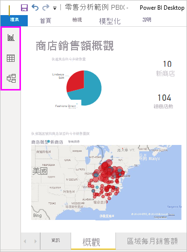

# Power BI Desktop 是什麼？

*Power BI Desktop* 是您安裝在本機電腦上的免費應用程式。此應用程式可讓您連線與轉換資料，以及將資料視覺化。 透過 Power BI Desktop，您可以連線至許多不同的資料來源，並將其合併 (通常稱為「模型化」) 成為一個資料模型。 此資料模型可讓您建置視覺效果和視覺效果集合，並以報表的形式與組織內的其他人員共用。 處理商業智慧專案的使用者大多會使用 Power BI Desktop 來建立報表，然後使用 *Power BI 服務*與其他人員共用其報表。

以下是最常見的 Power BI Desktop 使用方式：

* 連線至資料
* 轉換並清理資料，以建立資料模型
* 建立圖表或圖形之類的視覺效果，以便為資料提供視覺呈現
* 在一或多個報表頁面上，建立視覺效果集合的報表
* 使用 Power BI 服務與其他人共用報表

從事這類工作的人員通常稱為「資料分析師」(有時稱為「分析師」) 或商業智慧專業人員 (通常稱為「報表建立者」)。 不過，許多自認並非是分析師或報表建立者的人員也會使用 Power BI Desktop 來建立出色的報表，或從各種來源提取資料並建置可以和同事及組織共用的資料模型。

> [!IMPORTANT]
> Power BI Desktop 會每月更新及釋出，並納入客戶意見反應與新功能。 僅支援最新版本的 Power BI Desktop；系統會要求連絡 Power BI Desktop 支援人員的客戶升級至最新版本。 您可從 [Windows Store](https://aka.ms/pbidesktopstore) 取得最新版本的 Power BI Desktop，或作為單一可執行檔，其中包含所[下載](https://www.microsoft.com/download/details.aspx?id=58494)及安裝在電腦上的所有支援語言。

Power BI Desktop 中有三種可用的檢視，可從畫布左側選取。 這些檢視以其出現的順序顯示如下：
* **報表**：在此檢視中，您可以建立報表和視覺效果，您大部分的建立作業均在此處完成。
* **資料**：在此檢視中，您可以查看與報表相關聯的資料模型中所使用的資料表、量值和其他資料，以及轉換資料以便在報表的模型中充份利用。
* **模型**：在此檢視中，您可以查看和管理資料模型中資料表之間的關聯性。

下圖顯示沿著畫布左側顯示的三個檢視：

 

## 連線至資料
若要開始使用 Power BI Desktop，首要步驟是連線至資料。 您可以從 Power BI Desktop 連線至許多不同的資料來源。 

若要連線至資料：

1. 從 [常用] 功能區選取 [取得資料] > [更多]。 

   此時會出現 [取得資料] 視窗，其中顯示 Power BI Desktop 可連線的許多類別。

   ![Power BI Desktop 的螢幕擷取畫面，其中顯示 [取得資料] 對話方塊。](media/desktop-what-is-desktop/what-is-desktop_02.png)

2. 當您選取資料類型時，會出現提示以要求 URL 和認證等資訊，讓 Power BI Desktop 能代表您連線到資料來源。

   ![Power BI Desktop 的螢幕擷取畫面，其中顯示 [SQL Server 資料庫] 對話方塊。](media/desktop-what-is-desktop/what-is-desktop_03.png)

3. 連線至一或多個資料來源後，您可以將資料轉換為對您有用的形式。

## 轉換及清理資料，建立模型

在 Power BI Desktop 中，您可以使用內建的 [Power Query 編輯器](https://docs.microsoft.com/power-bi/desktop-query-overview)來清理及轉換資料。 您可以使用 Power Query 編輯器來變更資料，例如變更資料類型、移除資料行或結合來自多個來源的資料。 這就像雕塑一樣：您從一大塊黏土 (或資料) 開始著手，然後視需要刮除或加入某些部分，直到資料變成是您想要的模樣。 

若要啟動 Power Query 編輯器：

- 從 [常用] 功能區中，選取 [編輯查詢] > [編輯查詢]。

   [Power Query 編輯器] 視窗隨即出現。

   ![Power BI Desktop 的螢幕擷取畫面，其中顯示 [Power Query 編輯器] 視窗。](media/desktop-getting-started/designer_gsg_editquery.png)

您在轉換資料時所執行的每個步驟 (例如重新命名資料表、轉換資料類型，或刪除資料行)，都會記錄在 Power Query 編輯器中。 每當此查詢連線至資料來源時，都會執行這些步驟，使資料一律會以您指定的方式塑形。

下圖顯示查詢的 [Power Query 編輯器] 窗格，此查詢已塑形並成為模型。

 ![Power BI Desktop 的螢幕擷取畫面，其中顯示用於已成形查詢的 [Power Query 編輯器] 視窗。](media/desktop-getting-started/shapecombine_querysettingsfinished.png)

一旦資料符合所需，就可以建立視覺效果。 

## 建立視覺效果 

在您取得資料模型之後，就可以將「欄位」拖曳到報表畫布以建立「視覺效果」。 視覺效果是模型中所含資料的圖形表示法。 Power BI Desktop 中有許多不同類型的視覺效果可供選擇。 以下視覺效果示範一個簡單的資料行圖表。 

若要建立或變更視覺效果： 

- 從 [視覺效果] 窗格中，選取視覺效果圖示。 

   ![Power BI Desktop 的螢幕擷取畫面，其中顯示 [視覺效果] 窗格。](media/desktop-what-is-desktop/what-is-desktop_05.png)

   如果報表畫布上已有選取的視覺效果，選取的視覺效果將會變更為您選取的類型。 

   如果畫布上沒有已選取的視覺效果，則會根據您的選取建立新的視覺效果。

## 建立報表

針對在 Power BI Desktop 中用來建立模型的資料，通常您會想要建立視覺效果集合，以顯示資料的各種層面。 在單一 Power BI Desktop 檔案中的視覺效果集合稱為「報表」。 報表可以有一或多個頁面，就像 Excel 檔案可以有一或多個工作表。

Power BI Desktop 可讓您使用多個來源的資料，在單一報表中建立複雜且視覺效果豐富的報表，以便和組織中其他人共用。

在下圖中，您會看到 Power BI Desktop 報表中名為 [概觀] 的第一個頁面 (如影像底部的索引標籤所顯示)。 

![Power BI Desktop 的螢幕擷取畫面，其中顯示 [概觀] 索引標籤。](media/desktop-what-is-desktop/what-is-desktop_01.png)

## 共用報表

在報表可以與其他人共用後，您就可以將報表*發佈*到 Power BI 服務，以供組織中擁有 Power BI 授權的所有人使用。 

若要發佈 Power BI Desktop 報表： 

1. 從 [常用] 功能區中選取 [發佈]。

   ![Power BI Desktop 的螢幕擷取畫面，其中顯示 [發佈] 按钮。](media/desktop-what-is-desktop/what-is-desktop_06.png)

   Power BI Desktop 會使用您的 Power BI 帳戶將您連線至 Power BI 服務。 

2. Power BI 會提示您選取要在 Power BI 服務中共用報表的位置，例如您的工作區、小組工作區，或是 Power BI 服務中的其他位置。 

   您必須擁有 Power BI 授權，才能將報表共用至 Power BI 服務。

## 後續步驟

若要開始使用 Power BI Desktop，首要工作是下載並安裝該應用程式。 有兩種方式可以取得 Power BI Desktop：

* [從 Windows 市集取得 Power BI Desktop](https://aka.ms/pbidesktopstore)
* [從 Web 下載 Power BI Desktop](https://www.microsoft.com/download/details.aspx?id=58494)

